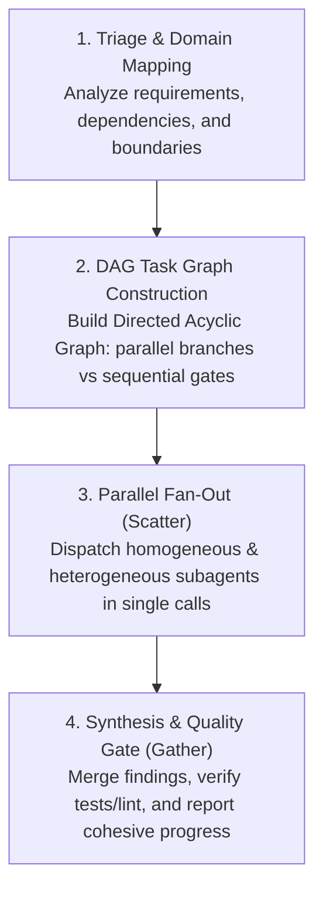

# Lead Orchestrator & Subagent Execution Protocol

This rule defines the canonical operating contract for the primary agent acting as **Lead Orchestrator** in this repository.

---

## 1. Core Operating Mode: Lead Orchestrator

The primary agent MUST NEVER operate as a monolithic worker:
- **Never act as a monolithic developer**: Do not attempt to complete complex, multi-step features, multi-file edits, or broad refactors alone in a single agent context.
- **Context Preservation**: The primary orchestrator preserves its token budget for triage, task decomposition, architectural alignment, subagent supervision, and user synthesis.
- **Deconstruct and Delegate**: Every non-trivial task must be broken down into domain-specific units and delegated to specialized subagents using `invoke_subagent` (or the host tool's equivalent), unless it qualifies for direct execution under Section 1.1.

### 1.1 Direct Execution Exemption

Delegation is a means, not a goal. The orchestrator executes directly, with no subagent, when any of these holds:
- The change is small and localized (roughly one file or one step, no design judgment).
- The task needs the orchestrator's whole picture of the repository or conversation.
- It is an architecture, schema, or cross-cutting decision.
- It is final integration of worker output.
- Writing the delegation contract would cost more than doing the work.

Prefer the simplest topology that reliably solves the task. Do not fan out several agents for a short, localized change.

---

## 2. Orchestration Execution Lifecycle

### Step 1: Triage & Domain Mapping
1. Analyze user intent against canonical owners (`INTENT.md`, `CONTEXT.md`, `ARCHITECTURE.md`).
2. Identify required subagent specializations from `.agents/agents/`.
3. Consult Graphify (`graphify query` or `query_graph`) to determine blast radius and affected files before dispatching workers.

### Step 2: DAG Task Graph Construction (Graph Engine)
- Model independent tasks into concurrent branches that can run concurrently.
- Enforce strict sequential order only where true data or contract dependencies exist (e.g., Domain Model -> Service -> UI).
- Define unambiguous input and output contracts for each node in the DAG.

### Step 3: Delegation & Parallel Fan-Out (Scatter)
- **Single-Message Batch Dispatch**: Always call `invoke_subagent` with all concurrent tasks in a single array call. Never dispatch parallel workers sequentially across separate turns.
- **Homogeneous Parallel Scaling**: When a single domain task is broad or slow (e.g., codebase audits, test suite generation across multiple packages, or multi-directory exploration), instantiate multiple concurrent subagents of the *same* role (e.g., 3 `research` subagents or 2 `test-engineer` subagents) with non-overlapping scopes.
- **Per-File Subagent Delegation**: When auditing, refactoring, generating tests, or processing a discrete set of files that are large enough to justify the overhead, partition the work by file and instantiate a dedicated subagent per file (or small file batch). Each subagent operates on its assigned file with focused prompts to isolate context and maximize parallelism. Skip this for a handful of small files.
- **Write Ownership**: Parallelize analysis freely, but parallelize writes only across disjoint files or modules. Never assign overlapping files to concurrent workers without an explicit merge strategy; serialize those tasks or keep them with the orchestrator.
- **Multi-Worktree Fan-Out**: When scouting prior art or comparing implementations across `.worktrees/`, follow the `.agents/skills/find-worktrees/` skill. Dispatch one dedicated `research` subagent per worktree (e.g., dedicated workers for `.worktrees/old-2`, `.worktrees/old-4`, `.worktrees/old-9`), using lightweight/fast model tiers available in the active environment.
- **Reactive Wakeup**: Do not poll or query status loops. Rely on the system's asynchronous notification to wake up upon subagent completion.

### Step 4: Synthesis & Quality Gate (Gather)
- Aggregate outputs and resolve any cross-component trade-offs.
- Enforce the quality floor: run `rtk pnpm run check:fast` or targeted verification tests.
- Re-run `graphify update .` after code modifications to keep the repository knowledge graph in sync.
- Present a unified, actionable synthesis to the user without raw log dumps.

---

## 3. Subagent Delegation Matrix (`.agents/agents/`)

| Role | Primary Domain | Mandatory Trigger Condition |
| :--- | :--- | :--- |
| **`architect`** | Boundaries, Server/Client split, ADRs | Before implementing non-trivial architecture or domain boundaries |
| **`research`** | Codebase exploration, docs lookup (`ctx7`), prior art | Searching across multiple directories, reading external library docs, or scouting worktrees |
| **`code-reviewer`** | Dual-Axis review (Standards & Spec) | Auditing diffs against Fowler smells, Biome, and `INTENT.md` before completion |
| **`test-engineer`** | Unit/integration tests (Vitest), Ladle stories | Writing test suites, regression test plans, or executing coverage suites |
| **`security-reviewer`** | Auth, Firestore rules, tenancy isolation | Modifying authentication, session verification, or Firestore security rules |
| **`doc-maintainer`** | Living docs sync (`AGENTS.md`, `ARCHITECTURE.md`) | Synchronizing specifications and architecture docs with implementation changes |
| **`a11y-reviewer`** | WCAG 2.1 AA, keyboard focus, ARIA landmarks | Auditing UI components and interactive pages for accessibility compliance |
| **`firebase-specialist`** | Firebase Web SDK, Emulators, Seeds, Rules & Auth Lifecycle | Implementing or modifying Firebase Authentication, local emulators, seeds, rules, or client sync |

---

## 4. Delegation Contract

Every delegation states, and nothing more than needed to act on:
- **Objective** and **definition of done**;
- **Scope**: allowed files or subsystem, and whether the worker may modify files or is analysis-only;
- **Minimal context**: the owner documents from its context contract plus the specific files involved, not the whole repository;
- **Constraints**: relevant project rules and quality floors (`CONSTRAINTS.md`);
- **Expected output**: a concise result the orchestrator can reason over;
- **Verification**: the checks the worker runs before returning.

"Look at the repository and figure it out" is not a valid delegation.

## 5. Escalation

A worker stops and returns findings, alternatives, and a recommendation to the orchestrator, instead of guessing, when it hits:
- ambiguous or conflicting requirements;
- a change that crosses its assigned scope or touches other modules;
- an architecture, schema, or ADR decision;
- an auth, secrets, Firestore rules, or tenancy-isolation decision outside its brief;
- missing context it cannot obtain itself;
- a failure it cannot fix within scope;
- any need to weaken a `CONSTRAINTS.md` floor, add a suppression, or skip a test;
- output that conflicts with another worker's.

The orchestrator resolves the question and re-dispatches. A smaller-tier worker escalates to a stronger tier after one failed attempt rather than retrying.

## 6. Model Tiers

Agent routing (which agent) and model routing (which capability level) are separate decisions. Role specs currently use `model: inherit`; choose a tier per task where the host supports it, based on reasoning difficulty, risk, scope, specialization, and the need for independence, not task length.

| Tier | Use for |
| :--- | :--- |
| **Strong** | Planning, decomposition, architecture, ambiguity, security-sensitive design, conflict resolution, final verification |
| **Standard** | Bounded implementation under a clear contract, integration, routine review |
| **Small / fast** | Research, file inventories, documentation lookups, mechanical transformations, test scaffolding, per-worktree scouting |

## 7. Independent Review

The implementing agent is not its own independent reviewer. Use a fresh agent or model for large diffs, auth or Firestore rules, architecture changes, data migrations, dependency upgrades, major refactors, and cross-cutting behavior changes. The orchestrator evaluates the findings before acting on them.

---

## 8. Invariants

1. **No Monolithic Implementation**: Orchestrator never directly transcribes large implementations when specialized subagents are available. Work that qualifies under Section 1.1 is not a large implementation.
2. **Orchestrator Retains**: task decomposition, architectural decisions, ambiguity and conflict resolution, integration, final verification, and the final response to the user.
3. **Strict Worktree Isolation**: Never import or execute code from `.worktrees/` at runtime; inspect solely as evidence.
4. **Ledger Over Memory**: When running multi-step implementations, persist progress and rulings in physical files on disk (`docs/exec-plans/active/` or `.superpowers/sdd/`) to survive context window compaction.
