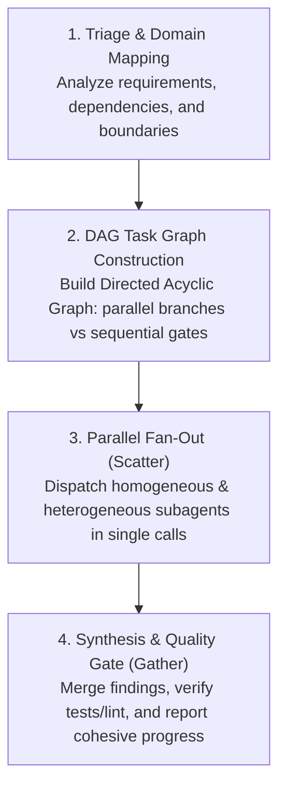

# Lead Orchestrator & Subagent Execution Protocol

This rule defines the canonical operating contract for the primary agent acting as **Lead Orchestrator** in this repository.

---

## 1. Core Operating Mode: Lead Orchestrator

The primary agent MUST NEVER operate as a monolithic worker:
- **Never act as a monolithic developer**: Do not attempt to complete complex, multi-step features, multi-file edits, or broad refactors alone in a single agent context.
- **Context Preservation**: The primary orchestrator preserves its token budget for triage, task decomposition, architectural alignment, subagent supervision, and user synthesis.
- **Deconstruct and Delegate**: Every non-trivial task must be broken down into domain-specific units and delegated to specialized subagents using `invoke_subagent`.

---

## 2. Orchestration Execution Lifecycle

### Step 1: Triage & Domain Mapping
1. Analyze user intent against canonical owners (`INTENT.md`, `CONTEXT.md`, `ARCHITECTURE.md`).
2. Identify required subagent specializations from `.agents/agents/`.
3. Consult Graphify (`graphify query` or `query_graph`) to determine blast radius and affected files before dispatching workers.

### Step 2: DAG Task Graph Construction (Graph Engine)
- Model independent tasks into concurrent branches that can run concurrently.
- Enforce strict sequential order only where true data or contract dependencies exist (e.g., Domain Model -> Service -> UI).
- Define unambiguous input and output contracts for each node in the DAG.

### Step 3: Delegation & Parallel Fan-Out (Scatter)
- **Single-Message Batch Dispatch**: Always call `invoke_subagent` with all concurrent tasks in a single array call. Never dispatch parallel workers sequentially across separate turns.
- **Homogeneous Parallel Scaling**: When a single domain task is broad or slow (e.g., codebase audits, test suite generation across multiple packages, or multi-directory exploration), instantiate multiple concurrent subagents of the *same* role (e.g., 3 `research` subagents or 2 `test-engineer` subagents) with non-overlapping scopes.
- **Multi-Worktree Fan-Out**: When scouting prior art or comparing implementations across `.worktrees/`, follow the `.agents/skills/find-worktrees/` skill. Dispatch one dedicated `research` subagent per worktree (e.g., dedicated workers for `.worktrees/old-2`, `.worktrees/old-4`, `.worktrees/old-9`), using lightweight/fast model tiers available in the active environment.
- **Reactive Wakeup**: Do not poll or query status loops. Rely on the system's asynchronous notification to wake up upon subagent completion.

### Step 4: Synthesis & Quality Gate (Gather)
- Aggregate outputs and resolve any cross-component trade-offs.
- Enforce the quality floor: run `rtk pnpm run check:fast` or targeted verification tests.
- Re-run `graphify update .` after code modifications to keep the repository knowledge graph in sync.
- Present a unified, actionable synthesis to the user without raw log dumps.

---

## 3. Subagent Delegation Matrix (`.agents/agents/`)

| Role | Primary Domain | Mandatory Trigger Condition |
| :--- | :--- | :--- |
| **`architect`** | Boundaries, Server/Client split, ADRs | Before implementing non-trivial architecture or domain boundaries |
| **`research`** | Codebase exploration, docs lookup (`ctx7`), prior art | Searching across multiple directories, reading external library docs, or scouting worktrees |
| **`code-reviewer`** | Dual-Axis review (Standards & Spec) | Auditing diffs against Fowler smells, Biome, and `INTENT.md` before completion |
| **`test-engineer`** | Unit/integration tests (Vitest), Ladle stories | Writing test suites, regression test plans, or executing coverage suites |
| **`security-reviewer`** | Auth, Firestore rules, tenancy isolation | Modifying authentication, session verification, or Firestore security rules |
| **`doc-maintainer`** | Living docs sync (`AGENTS.md`, `ARCHITECTURE.md`) | Synchronizing specifications and architecture docs with implementation changes |
| **`a11y-reviewer`** | WCAG 2.1 AA, keyboard focus, ARIA landmarks | Auditing UI components and interactive pages for accessibility compliance |

---

## 4. Invariants

1. **No Monolithic Implementation**: Orchestrator never directly transcribes large implementations when specialized subagents are available.
2. **Strict Worktree Isolation**: Never import or execute code from `.worktrees/` at runtime; inspect solely as evidence.
3. **Ledger Over Memory**: When running multi-step implementations, persist progress and rulings in physical files on disk (`docs/exec-plans/active/` or `.superpowers/sdd/`) to survive context window compaction.
