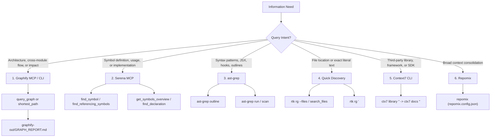

# Search & Discovery Workflow

This document defines the canonical hierarchy and decision matrix for searching, navigating, and inspecting code, architecture, and documentation in the project.

---

## 1. Decision Hierarchy

When searching for information, agents and developers MUST use the most specialized and token-efficient tool that matches the intent:

---

## 2. Invariants & Tool Routing

| Intent | Primary Canonical Route | Fallback / Complementary |
| :--- | :--- | :--- |
| **Locate file path by name** | `search_files` (Filesystem MCP) / `find_file` (Serena) | `rtk rg --files` |
| **Search exact text or string pattern** | `search_for_pattern` (Serena MCP) | `rtk rg "<pattern>"` |
| **Inspect symbols, callers, and definitions** | `find_symbol` / `find_referencing_symbols` (Serena) | `get_symbols_overview` |
| **Analyze module relationships & call chains** | `query_graph` / `shortest_path` (Graphify MCP) | `graphify-out/GRAPH_REPORT.md` |
| **Outline file structure before reading** | `get_symbols_overview` (Serena) / `ast-grep outline` | `view_file` |
| **Search structural code/AST patterns** | `ast-grep scan` / `ast-grep run` | Serena MCP |
| **Third-party library & API docs** | Context7 (`ctx7 library` → `ctx7 docs`) | `search_web` (only if not on ctx7) |
| **Analyze commit history & diffs** | `git_log` / `git_diff` / `git_status` (Git MCP) | `rtk git log` |
| **Full repository context dump** | Repomix (`repomix.config.json` / `repomix`) | — |

---

## 3. Best Practices & Token Economy

- **Do Not Dump Whole Large Files**: Run `ast-grep outline` or `get_symbols_overview` first before reading entire multi-hundred line source files.
- **Graphify First for Architecture**: Query `graphify-out/` before manually tracing imports across multiple directories.
- **Context7 Over Web Search for Libraries**: Always query official docs via `ctx7` before performing generic web searches.
- **Relative Paths Only**: Keep all documentation references relative to the repository root.
