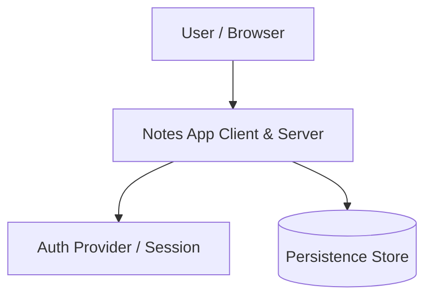

# ARCHITECTURE.md Template (C4 Model & Arc42 Aligned)

## Document Purpose
`ARCHITECTURE.md` documents the system topology, component boundaries, runtime data flow, state management, technology stack choices, and architectural trade-offs. It aligns with the **C4 Model** (Context, Containers, Components, Code) and **Arc42** lightweight documentation-as-code principles.

---

## Canonical Structure

```markdown
# System Architecture

## 1. System Context & Overview (C4 Level 1)
- High-level system purpose and external actor boundaries.
- External dependencies (APIs, auth providers, persistence stores, analytics).
- System Context Diagram (Mermaid preferred):



## 2. Container & Module Boundaries (C4 Level 2 & Arc42 Building Blocks)
- Application layers and structural organization:
  - `src/app/`: Application routing, pages, layouts, and server endpoints (Next.js App Router).
  - `src/components/`: Domain components and layouts.
  - `src/components/ui/`: Isolated UI primitives (shadcn / Base UI).
  - `src/hooks/`: Reusable state hooks and client-side logic.
  - `src/lib/`: Pure utility functions and shared helpers.
- **Dependency Inversion & Direction Rules**:
  - Components may consume primitives and hooks.
  - Hooks may consume utilities and models.
  - Pure utilities in `lib/` must have zero external side effects and no cyclic dependencies.

## 3. Technology Stack & Key Dependencies
| Category | Technology | Rationale / ADR Link |
|---|---|---|
| **Framework** | Next.js (App Router, RSC) | Native SSR, streaming, file-based routing |
| **Language** | TypeScript (Strict) | Compile-time type safety |
| **Design System** | shadcn/ui (`base-nova`, Base UI) | Unstyled accessible primitives |
| **Styling** | Tailwind CSS v4 | High performance, CSS variable token binding |
| **Tooling** | Biome | High-speed unified linting and formatting |

## 4. Runtime Data Flow & State Lifecycle (C4 Level 3 / Arc42 Runtime View)
- Server-Side Rendering (SSR) vs. Client Hydration boundaries.
- Mutation flows and cache invalidation strategies.
- Client state management approach (Local hooks, context providers, or store).

## 5. Non-Functional Requirements & Cross-Cutting Concerns
- **Performance**: Bundle budget, Core Web Vitals, sub-100ms response targets.
- **Security & Privacy**: Zero plaintext credentials, strict CSRF/CORS, input sanitization.
- **Observability & Logging**: Structured error logging, tracing, telemetry.

## 6. Architectural Decision Records (ADRs)
Link to timestamped Architectural Decision Records (Michael Nygard format):
- [`docs/adr/0001-ui-primitive-foundation.md`](./docs/adr/)
- [`docs/adr/0002-styling-engine-migration.md`](./docs/adr/)
```
