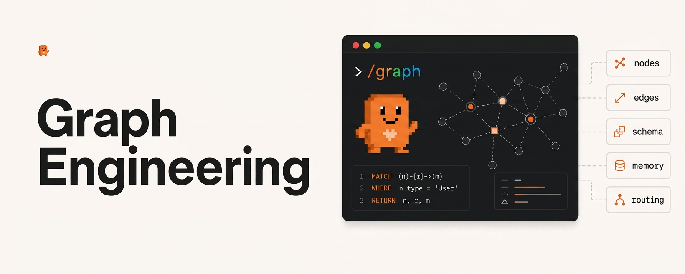

<p align="center">
  
</p>

**A skill that plans multi-step work as a dependency graph instead of a linear chain.**

No framework. No runner. No dependencies. Just instructions that change how the model plans: which work fans out to parallel subagents, which must wait, where results consolidate before they overflow, and which single node stops for a human.

[](LICENSE)

---

## The problem

Give an agent a big task ("audit these 60 files", "research these 30 companies") and it narrates a chain: first this, then this, then this. Two things go wrong.

1. **Context burns linearly.** By item 40, the context window is full of items 1 through 39. The first fifteen items get careful treatment, the last twenty get a sentence each. You won't notice, because the output still *looks* complete.
2. **Independent work runs sequentially.** Most "and then"s in a plan are narration, not dependency. The steps could have fanned out. Instead they queue.

The fix isn't a bigger context window. It's structure: a dependency graph, executed in phases, with consolidation layers that don't lose detail and gates that catch problems before they ship.

## What a run looks like

Ask for something like *"audit all 60 endpoint handlers in src/api for auth issues and email me the critical findings"* and the skill produces a phase plan before doing any work:

```
Phase 0  Recon + rubric            inline        what "correct auth" looks like here
Phase 1  60 file audits            6 subagents   standard tier, 10 files each, fresh context
Phase 2  Layered consolidation     3 subagents   fast tier: 60 → 3 summaries → 1 merge
                                                 plus a completeness check: 60 in, 60 out
Phase 3  Prioritized remediation   inline        judgment the orchestrator owns
Phase 4  Verify critical claims    1 subagent    strongest tier, fresh context,
                                                 re-derives from source; fail → targeted redo
Phase 5  Draft email               inline
Phase 6  HUMAN APPROVAL GATE       hard stop     exact action, scope, and cost shown
```

Every piece of that is the skill working. The dependency audit found the fan-out, the fan-in is layered so detail survives, verification can't ratify its own synthesis, and the irreversible send waits for a human.

## What it does

- **Dependency audit.** For each pair of steps, one question: *does B literally read A's output?* If not, they're independent. Most "and then"s turn out to be narration.
- **Hidden edge check.** Shared file writes, rate limits, schema changes, and destructive operations create real ordering constraints even when no data flows.
- **Subagent fan-out.** Where the environment has a subagent tool (Claude Code's Agent tool), independent phases dispatch as parallel subagents with fresh contexts. Where it doesn't, they degrade gracefully to batched tool calls.
- **Model tiering.** Cheap tier for mechanical checks, standard tier for per-item work, strongest tier for the final verification pass.
- **Layered fan-in.** Consolidates in batches of 20 to 30 rather than one synthesis pass over everything, with a completeness check at each layer. A synthesis that silently drops items is worse than one that reports a hole.
- **Verification with a retry loop.** Re-derives high-stakes claims from source in a fresh context. Failures feed back into a targeted redo of the affected nodes, capped, then escalate.
- **Human approval gate.** Irreversible or outward-facing actions (sends, deploys, deletes) hard-stop for explicit human sign-off with concrete scope and cost. Verification is a quality check, not an authorization.

## Install

With the [skills](https://github.com/vercel-labs/skills) CLI:

```bash
npx skills add https://github.com/VineeTagarwaL-code/graph-engineering
```

Or copy it in manually. Note the repo is named `graph-engineering-skill` but the skill directory must be named `graph-orchestrator` to match the skill's `name`:

```bash
git clone https://github.com/VineeTagarwaL-code/graph-engineering
mkdir -p ~/.claude/skills/
cp -r graph-engineering ~/.claude/skills/graph-orchestrator
```

For a single project instead of globally, use `.claude/skills/` inside the repo.

Verify it loaded:

```bash
head ~/.claude/skills/graph-orchestrator/SKILL.md
```

## When it triggers

- Many similar subtasks: auditing every file in a repo, researching a list of companies, migrating a set of endpoints, reviewing a batch of documents
- A plan about to be written as "first X, then Y, then Z" across more than ~4 steps
- Work spanning 10+ files or sources
- A previous attempt that ran out of context or produced a summary that thinned out toward the end
- A plan that ends in an irreversible action (mass send, deploy, delete) that needs gating

It deliberately does **not** trigger on everything. A five-step task where each step genuinely feeds the next is a chain, and drawing it as a graph adds nothing. The skill says so and gets on with it.

## What it doesn't do

There's no scheduler underneath a skill. It's instructions the model reads. Parallelism comes from the host environment's subagent tool when one exists; the skill decides *what* fans out, the environment runs it. If you have your own runner instead, [`references/plan-schema.md`](references/plan-schema.md) defines a JSON plan format you can feed it.

## Repo structure

```
graph-orchestrator/
├── SKILL.md                     # the skill, start here
├── references/
│   ├── best-practices.md        # worked example, failure modes, sizing guidance
│   └── plan-schema.md           # JSON plan format for external runners
├── README.md
└── LICENSE
```

`SKILL.md` is intentionally short. It gets loaded into the model's context, so every line has to earn its place. The references load only when needed.

## Design notes

A few opinions baked in, learned from watching long runs degrade:

- **Fan-in is where quality is lost**, not fan-out. One synthesis pass over 100 outputs produces something thin after the first twenty items, and it looks fine. Layer at 20 to 30 and force specifics (paths, quantities, names) upward.
- **Count before you consolidate.** If 38 of 40 came back, name the missing two rather than synthesizing over the gap.
- **The verifier can't be the author.** A critique pass over your own summary mostly agrees with the summary. Verification runs in a fresh context, from source, given the claims but not the synthesis.
- **Omit rather than fabricate.** The plan schema has no `retry` or `timeout` fields unless something actually enforces them. A spec that describes infrastructure you don't have invites everyone downstream to assume guarantees that aren't there.

## License

[MIT](LICENSE)
