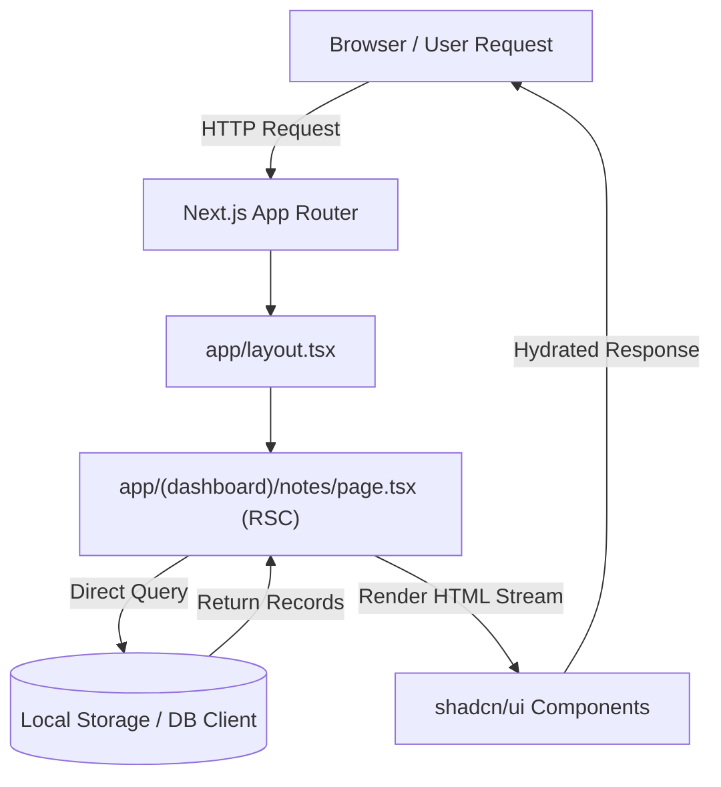
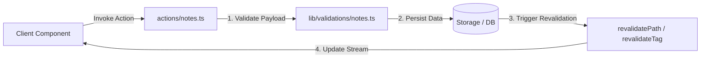

# Architecture Overview (Matklad Pattern)

This document provides a high-level overview of the **Notes App** architecture, directory layout, core abstractions, and engineering invariants. It is written following the **Matklad ARCHITECTURE.md** pattern to help new contributors and automated agents quickly orient themselves within the codebase.

---

## 1. Bird's Eye View

The **Notes App** is a local-first, zero-operating-cost unified study and knowledge management web application. It unifies three core domains:
1. **Object Architecture (Capacities-style)**: Interconnected notes, flexible object types, and bidirectional linking.
2. **Document Ingestion (Readwise-style)**: Highlighting, document parsing, and external reading imports.
3. **Spaced Repetition System (Anki/FSRS-style)**: Flashcards, review queue management, and memory retention algorithms.

The application is built on **Next.js (App Router)**, **React 19**, **TypeScript**, and **shadcn/ui** (styled with Tailwind CSS), optimized for speed, local storage, and server component performance.

---

## 2. Code Map & Official Folder Structure

The project strictly follows the **official Next.js App Router conventions** combined with the standard **shadcn/ui** component directory structure.

```text
.
├── app/                      # Next.js App Router (Routes, Layouts, Pages, Server Actions)
│   ├── (auth)/               # Route Group for authentication (login, register)
│   │   ├── login/
│   │   └── layout.tsx
│   ├── (dashboard)/          # Route Group for the main application UI
│   │   ├── notes/            # /notes page and dynamic detail routes
│   │   │   ├── [id]/
│   │   │   └── page.tsx
│   │   ├── srs/              # /srs spaced repetition study interface
│   │   ├── layout.tsx        # Dashboard shell (Sidebar + Header layout)
│   │   └── page.tsx          # Main dashboard landing page
│   ├── api/                  # Route Handlers for external REST endpoints / webhooks
│   │   └── route.ts
│   ├── globals.css           # Global Tailwind CSS & shadcn/ui CSS variable definitions
│   ├── layout.tsx            # Root Layout (Theme providers, font configuration, metadata)
│   ├── loading.tsx           # Global fallback loading UI (React Suspense boundary)
│   ├── error.tsx             # Global Error Boundary for unhandled route errors
│   └── not-found.tsx         # Custom 404 page
│
├── components/               # React UI Components (Server & Client)
│   ├── ui/                   # Primitive, unstyled shadcn/ui components (Generated via CLI)
│   │   ├── button.tsx
│   │   ├── dialog.tsx
│   │   └── input.tsx
│   ├── common/               # Shared layout & composite components (Navbar, Sidebar, Footer)
│   │   ├── navbar.tsx
│   │   └── sidebar.tsx
│   └── features/             # Feature-based domain components (Encapsulated by domain)
│       ├── notes/            # Note editor, note cards, tag lists
│       ├── srs/              # Flashcard viewer, rating buttons, SRS progress charts
│       └── ingestion/        # Document importer, highlight parser
│
├── lib/                      # Pure utilities, database clients, and domain logic engines
│   ├── utils.ts              # `cn()` class merging utility (clsx + tailwind-merge)
│   ├── db/                   # Database client (SQLite/IndexedDB/ORM instance)
│   ├── srs/                  # Pure FSRS algorithm math & card scheduling engine
│   └── validations/          # Zod validation schemas for forms and server actions
│
├── actions/                  # Next.js Server Actions (Backend mutations & data writes)
│   ├── notes.ts              # CRUD Server Actions for notes and objects
│   └── srs.ts                # Server Actions for submitting SRS card reviews
│
├── hooks/                    # Reusable Client-side React Hooks
│   ├── use-debounce.ts
│   └── use-local-storage.ts
│
├── types/                    # Global TypeScript interfaces and type definitions
│   ├── note.ts               # Note & Object DTOs and database models
│   └── srs.ts                # Flashcard and FSRS state types
│
├── public/                   # Public static assets (images, icons, SVGs)
├── .agents/                  # AI agent configuration, rules, and skills
├── graphify-out/             # Knowledge graph & dependency topology generated by Graphify
└── .worktrees/               # Historical reference implementations for feature parity
```

---

## 3. Architectural Invariants

Every contributor (and AI assistant) must strictly maintain the following engineering rules:

1. **React Server Components (RSC) by Default**:
   - All components inside `app/` and `components/` are Server Components by default.
   - Add `"use client"` **only at the leaf nodes** of the component tree where browser interactivity (React state, event handlers, client APIs) is required.

2. **Primitive Isolation in `components/ui/` (shadcn primitives)**:
   - Files within `components/ui/` belong exclusively to **shadcn/ui**.
   - **Invariant**: Never embed domain logic, API calls, or app-specific state in `components/ui/`. They must remain pure, presentational UI primitives.

3. **Domain Encapsulation in `components/features/`**:
   - Domain-specific UI logic must be organized under `components/features/<feature-name>/`.
   - Never leak domain components into global `components/common/` or `components/ui/`.

4. **Strict Boundary Validation (Zod)**:
   - Every input payload arriving via Server Actions or Route Handlers must be validated using Zod schemas located in `lib/validations/`.

5. **Decoupled Business Logic in `lib/`**:
   - Core computational logic (e.g., FSRS spaced repetition algorithms) must be implemented as pure, framework-agnostic TypeScript functions in `lib/`. This enables zero-overhead unit testing and local-first execution.

---

## 4. Key Data Flows

### A. Data Fetching (RSC Direct Access)


### B. Data Mutation (Server Actions Flow)


---

## 5. Cross-Cutting Concerns

### Styling & Theming
- Styled using **Tailwind CSS** with **CSS Variables** defined in `app/globals.css`.
- Colors and design tokens map directly to shadcn CSS variables (`--background`, `--foreground`, `--primary`, etc.).
- Use the `cn(...)` utility from `lib/utils.ts` for conditional class joining.

### Error Handling & Loading States
- **`loading.tsx`**: Uses shadcn `Skeleton` primitives for instant loading fallbacks via React Suspense.
- **`error.tsx`**: Catches unhandled runtime exceptions at the route segment level without crashing the app.

### State Management
- **Server State**: Managed natively by Next.js RSC, Server Actions, and cache revalidation.
- **Client State**: Kept local to interactive UI components (`useState`, `useReducer`) or minimal React Context for UI flags.

---

## 6. Reference Worktrees & Codebase Topology

- **Historical Codebases**: Inspect `.worktrees/` (`old`, `old-2`, `old-3`, `old-4`, `old-5`) for baseline reference implementations when porting algorithms or Capacities feature parity.
- **Dependency Topology**: Refer to `graphify-out/GRAPH_REPORT.md` and `graphify-out/graph.json` for architectural relationship queries.

---

## 7. Project Governance & Decision Framework Matrix

To maintain codebase integrity, developer ergonomics, and agent alignment, governance artifacts are partitioned into four distinct layers:

| Governance Layer | Primary File / Location | Core Purpose | When to Use / Update |
| --- | --- | --- | --- |
| **Agent Directives** | [`AGENTS.md`](AGENTS.md) | Entry point for AI coding assistants | Overview of repository rules, sitemap, worktree references, and command triggers. |
| **Operational Rules** | [`.agents/rules/*.md`](.agents/rules/) | Single-responsibility, strict coding policies | Granular constraints (*"How to write code/configs"*), e.g. `portable-paths.md`, `language.md`. |
| **Architectural Decisions** | [`DECISIONS.md`](DECISIONS.md) | Historical MADR Decision Log (ADRs) | Documenting **WHY** a technical choice was made, trade-offs, and rejected options. |
| **Security Policies** | [`SECURITY.md`](SECURITY.md) | Threat model, trust boundaries, and security rules | Documenting **HOW** credentials, user data, server routes, and cloud permissions are isolated. |

