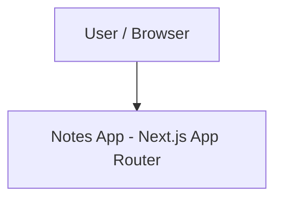

# System Architecture

## 1. System Context & Overview (C4 Level 1)
`notes-app` is currently a Next.js (App Router) client application with no backend, database, or auth provider wired in — it is a design-system/component foundation, not yet a working notes product (see `INTENT.md`).

There are no external dependencies today: no auth provider, no persistence store, no analytics/API integrations exist in the codebase.

## 2. Container & Module Boundaries (C4 Level 2 & Arc42 Building Blocks)
- `src/app/`: Next.js App Router entrypoint — `layout.tsx` (root layout, font loading, theme class wiring), `page.tsx` (currently the unedited create-next-app starter page), `globals.css` (design tokens, Tailwind v4 theme).
- `src/components/`: `theme-provider.tsx` (wraps `next-themes`), plus `src/components/ui/` for isolated UI primitives.
- `src/components/ui/`: 61 shadcn/Base UI primitive component files, plus one Ladle story file (see `DESIGN.md` §5 for the full catalog). No domain (notes-specific) components exist yet — everything here is generic UI.
- `src/hooks/`: `use-mobile.ts` — the only hook in the repo (responsive breakpoint detection).
- `src/lib/`: `utils.ts` — re-exports `cn` from the `cn` package. No other utilities exist yet.

**Dependency direction (as currently followed):**
- `src/app/` composes `src/components/` and `src/components/ui/`.
- `src/components/ui/*` primitives may import each other (e.g. `dialog.tsx` imports `button.tsx`) and `@/lib/utils`.
- `src/lib/utils.ts` has no dependencies on components or hooks.

## 3. Technology Stack & Key Dependencies
| Category | Technology | Rationale / ADR Link |
|---|---|---|
| **Framework** | Next.js 16.3.5 (App Router) | [`docs/adr/`](./docs/adr/) — see AGENTS.md: this Next.js build has custom docs under `node_modules/next/dist/docs/` and may diverge from public Next.js behavior; consult that directory before relying on standard Next.js knowledge |
| **Language** | TypeScript 5, `strict: true` | Compile-time type safety (`tsconfig.json`) |
| **UI Primitives** | `@base-ui/react` 1.8.0 + shadcn `base-nova` style | [`docs/adr/0002-adopt-base-ui-with-shadcn-base-nova.md`](./docs/adr/0002-adopt-base-ui-with-shadcn-base-nova.md) |
| **Styling** | Tailwind CSS v4, OKLCH CSS variable tokens | See `DESIGN.md` |
| **Linting/Formatting** | Biome 2.4.2 | [`docs/adr/0001-use-biome-for-linting-and-formatting.md`](./docs/adr/0001-use-biome-for-linting-and-formatting.md) |
| **Static Analysis** | dependency-cruiser 18.4.0 + Knip 6.37.0 | Dependency-cycle and unused-code checks (`.dependency-cruiser.cjs`, `knip.json`) |
| **Component Workbench** | Ladle 5.1.1 | [`docs/adr/0003-use-ladle-for-component-development.md`](./docs/adr/0003-use-ladle-for-component-development.md) |
| **Render Optimization** | React Compiler (`babel-plugin-react-compiler`) | [`docs/adr/0004-enable-react-compiler.md`](./docs/adr/0004-enable-react-compiler.md) |
| **Package Manager** | pnpm 11.20.0 (pinned via `packageManager` in `package.json`) | — |

## 4. Runtime Data Flow & State Lifecycle (C4 Level 3 / Arc42 Runtime View)
- No Server-Side data fetching, mutations, Server Actions, or client-side data stores exist yet.
- Theming is the only cross-cutting runtime state: `ThemeProvider` (`src/components/theme-provider.tsx`, wrapping `next-themes`) drives the `.dark` class toggled at the `<html>`/root level, which switches the OKLCH CSS variables defined in `src/app/globals.css`.
- There is no client-side state management library (no Redux/Zustand/Jotai) in `package.json`; any future state should default to local component state or React context until a real need for a store is demonstrated.

## 5. Non-Functional Requirements & Cross-Cutting Concerns
- **Performance**: No bundle budget or Core Web Vitals targets are defined or measured yet.
- **Component architecture**: Prefer explicit composition and compound components over boolean-prop matrices. Providers own state implementation; composed children consume stable interfaces. Use the React Compiler already enabled in `next.config.ts` before adding manual memoization.
- **Security & Privacy**: No auth, no data persistence, so no attack surface beyond a static client app today. See `SECURITY.md` for what applies now vs. what must be added before any backend/auth is introduced.
- **Observability & Logging**: No logging, tracing, or telemetry is wired in.

## 6. Architectural Decision Records (ADRs)
- [`docs/adr/0001-use-biome-for-linting-and-formatting.md`](./docs/adr/0001-use-biome-for-linting-and-formatting.md)
- [`docs/adr/0002-adopt-base-ui-with-shadcn-base-nova.md`](./docs/adr/0002-adopt-base-ui-with-shadcn-base-nova.md)
- [`docs/adr/0003-use-ladle-for-component-development.md`](./docs/adr/0003-use-ladle-for-component-development.md)
- [`docs/adr/0004-enable-react-compiler.md`](./docs/adr/0004-enable-react-compiler.md)
