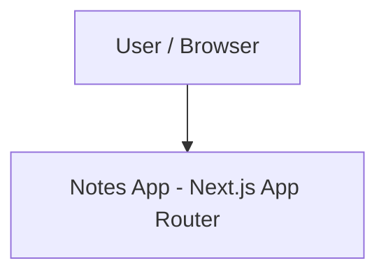

# System Architecture

## 1. System Context & Overview

`notes-app` is currently a Next.js App Router application with no product backend,
database, authentication provider, or external application integration. Product scope
is intentionally unresolved; see `INTENT.md`.

The current runtime boundary is the web application itself.

## 2. Module Boundaries

- `src/app/`: routing, root layout, application entry surfaces, and global styles.
- `src/components/`: reusable application-level components and providers.
- `src/components/ui/`: generic shadcn/Base UI primitives; no notes-domain behavior.
- `src/hooks/`: reusable React hooks.
- `src/lib/`: shared utilities that do not depend on UI components.

Current dependency direction:

- application surfaces may compose application components and UI primitives;
- UI primitives may compose other UI primitives and shared utilities;
- shared utilities must not depend on UI or application layers.

Dependency-cruiser is the executable source of truth for machine-enforced dependency
rules. This document owns the architectural intent behind those rules.

## 3. Technology Decisions

Exact dependency versions are owned by `package.json`; this document records
architectural choices rather than duplicating version pins.

| Area | Decision | Rationale |
| --- | --- | --- |
| Application framework | Next.js App Router | File-based application structure and React server/client model |
| Language | TypeScript in strict mode | Static type safety |
| UI primitives | shadcn `base-nova` on Base UI | Accessible composable primitive layer |
| Styling | Tailwind CSS v4 + CSS-variable design tokens | Token-driven styling |
| Formatting/linting | Biome | Unified formatting and linting |
| Architecture analysis | dependency-cruiser | Executable dependency-boundary checks |
| Unused-code analysis | Knip | Detect unused files, exports, and dependencies |
| Component workbench | Ladle | Isolated component development |
| Render optimization | React Compiler | Compiler-assisted React optimization |

## 4. Runtime State & Data Flow

Theming is currently the only application-wide runtime state:
`ThemeProvider` wraps `next-themes`, which controls the root theme class consumed
by CSS variables in `src/app/globals.css`.

There is currently no product data layer, server mutation flow, cache strategy, or
client state store. Those choices must be documented here when they become real
architecture rather than being selected preemptively.

## 5. Cross-Cutting Architecture

- **Security:** architecture-level security boundaries defer to `SECURITY.md`.
- **Quality floors:** measurable non-regression requirements defer to
  `CONSTRAINTS.md`.
- **Observability:** no logging, tracing, telemetry, or error-reporting system is
  currently part of the architecture.
- **Performance:** no architecture-level bundle or Core Web Vitals budget has been
  adopted; implementation guidance belongs to `CONVENTIONS.md`.

## 6. Architectural Decision Records

- [`docs/adr/0001-use-biome-for-linting-and-formatting.md`](./docs/adr/0001-use-biome-for-linting-and-formatting.md)
- [`docs/adr/0002-adopt-base-ui-with-shadcn-base-nova.md`](./docs/adr/0002-adopt-base-ui-with-shadcn-base-nova.md)
- [`docs/adr/0003-use-ladle-for-component-development.md`](./docs/adr/0003-use-ladle-for-component-development.md)
- [`docs/adr/0004-enable-react-compiler.md`](./docs/adr/0004-enable-react-compiler.md)
- [`docs/adr/0005-adopt-tailwind-css-v4.md`](./docs/adr/0005-adopt-tailwind-css-v4.md)
- [`docs/adr/0006-enforce-module-boundaries-with-dependency-cruiser.md`](./docs/adr/0006-enforce-module-boundaries-with-dependency-cruiser.md)
- [`docs/adr/0007-eliminate-dead-code-with-knip.md`](./docs/adr/0007-eliminate-dead-code-with-knip.md)
