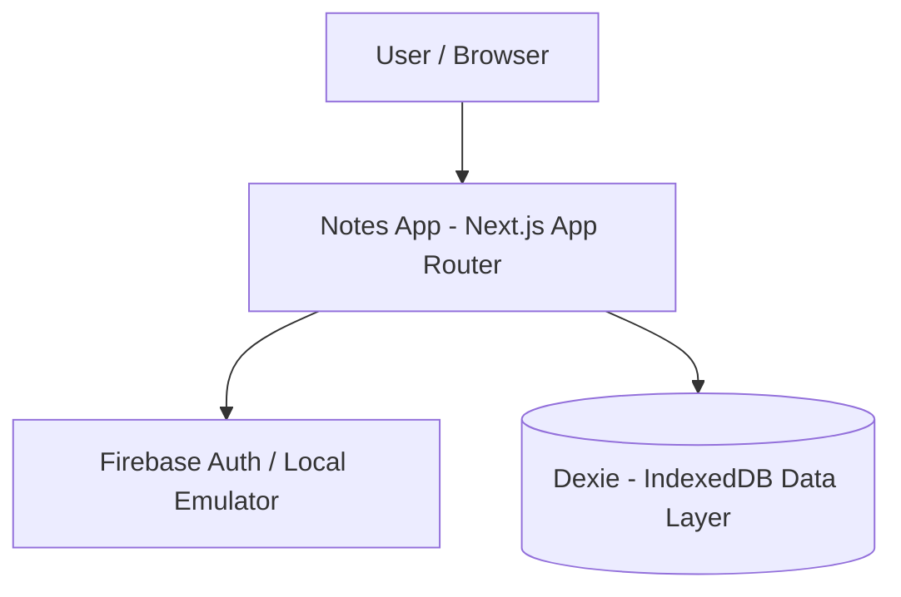

# System Architecture

## 1. System Context & Overview

`notes-app` is a Next.js App Router application with Firebase Authentication, Dexie IndexedDB local-first data storage, and cookie-based internationalization (`next-intl`). Product scope details defer to `INTENT.md`.

```mermaid
flowchart TD
  User[User / Browser] --> App[Notes App - Next.js App Router]
  App --> Auth[Firebase Auth / Local Emulator]
  App --> IndexedDB[(Dexie - IndexedDB Data Layer)]
```

The current runtime boundary is the client web application and local emulator environment.

## 2. Module Boundaries

- `src/app/`: routing, root layout, application entry surfaces, and global styles.
- `src/components/`: reusable application-level components and providers.
- `src/components/ui/`: generic shadcn/Base UI primitives; no notes-domain behavior.
- `src/hooks/`: reusable React hooks.
- `src/lib/`: shared utilities that do not depend on UI components.

Current dependency direction:

- application surfaces may compose application components and UI primitives;
- UI primitives may compose other UI primitives and shared utilities;
- shared utilities must not depend on UI or application layers.

Dependency-cruiser is the executable source of truth for machine-enforced dependency
rules. This document owns the architectural intent behind those rules.

## 3. Technology Decisions

Exact dependency versions are owned by `package.json`; this document records
architectural choices rather than duplicating version pins.

| Area | Decision | Rationale |
| --- | --- | --- |
| Application framework | Next.js App Router | File-based application structure and React server/client model |
| Language | TypeScript in strict mode | Static type safety |
| UI primitives | shadcn `base-nova` on Base UI | Accessible composable primitive layer |
| Styling | Tailwind CSS v4 + CSS-variable design tokens | Token-driven styling |
| Formatting/linting | Biome | Unified formatting and linting |
| Architecture analysis | dependency-cruiser | Executable dependency-boundary checks |
| Unused-code analysis | Knip | Detect unused files, exports, and dependencies |
| Component workbench | Ladle | Isolated component development |
| Render optimization | React Compiler | Compiler-assisted React optimization |
| Authentication UI | Firebase Auth UI | Accessible auth screens integrated with `@firebase-oss/ui-react` ([ADR 0008](./docs/adr/0008-adopt-firebase-ui-components.md), [ADR 0010](./docs/adr/0010-adopt-firebase-ui-v7-and-auth-resilience.md)) |
| Authentication provider | Firebase Auth + Emulator | User identity with local auth emulator support ([ADR 0009](./docs/adr/0009-adopt-firebase-auth-with-local-emulator.md)) |
| Internationalization | next-intl | Cookie-driven App Router internationalization with Firebase locale sync ([ADR 0011](./docs/adr/0011-adopt-cookie-based-next-intl-with-firebase-sync.md)) |
| End-to-end testing | Playwright | Cross-browser E2E testing with Next.js webServer integration and local emulator support ([ADR 0012](./docs/adr/0012-adopt-playwright-for-e2e-testing.md)) |
| Local data persistence | Dexie (IndexedDB) | Local-first browser database and schema indexing |

## 4. Runtime State & Data Flow

- **Theme:** `ThemeProvider` wraps `next-themes`, controlling root theme class consumed by CSS variables.
- **Authentication & State Sync:** `AuthProvider` wraps Firebase Authentication observer (`onAuthStateChanged`) and `@firebase-oss/ui-react` store, providing authenticated `User` context and local Firebase Auth Emulator support. Client handlers synchronize active user locale preferences with the `NEXT_LOCALE` cookie and local storage ([ADR 0011](./docs/adr/0011-adopt-cookie-based-next-intl-with-firebase-sync.md)).
- **Local Storage & Data Layer:** Dexie IndexedDB provides local-first client storage for local caching, schema indexing, and offline-capable data management.
- **Internationalization:** `next-intl` resolves locale via the `NEXT_LOCALE` cookie in e.g. `src/i18n/request.ts` without URL path prefixes, keeping routes clean while maintaining canonical English identifiers for persisted database entities.

## 5. Cross-Cutting Architecture

- **Security:** architecture-level security boundaries defer to `SECURITY.md`.
- **Quality floors:** measurable non-regression requirements defer to
  `CONSTRAINTS.md`.
- **Observability:** no logging, tracing, telemetry, or error-reporting system is
  currently part of the architecture.
- **Performance:** no architecture-level bundle or Core Web Vitals budget has been
  adopted; implementation guidance belongs to `CONVENTIONS.md`.

## 6. Architectural Decision Records

- [`docs/adr/0001-use-biome-for-linting-and-formatting.md`](./docs/adr/0001-use-biome-for-linting-and-formatting.md)
- [`docs/adr/0002-adopt-base-ui-with-shadcn-base-nova.md`](./docs/adr/0002-adopt-base-ui-with-shadcn-base-nova.md)
- [`docs/adr/0003-use-ladle-for-component-development.md`](./docs/adr/0003-use-ladle-for-component-development.md)
- [`docs/adr/0004-enable-react-compiler.md`](./docs/adr/0004-enable-react-compiler.md)
- [`docs/adr/0005-adopt-tailwind-css-v4.md`](./docs/adr/0005-adopt-tailwind-css-v4.md)
- [`docs/adr/0006-enforce-module-boundaries-with-dependency-cruiser.md`](./docs/adr/0006-enforce-module-boundaries-with-dependency-cruiser.md)
- [`docs/adr/0007-eliminate-dead-code-with-knip.md`](./docs/adr/0007-eliminate-dead-code-with-knip.md)
- [`docs/adr/0008-adopt-firebase-ui-components.md`](./docs/adr/0008-adopt-firebase-ui-components.md)
- [`docs/adr/0009-adopt-firebase-auth-with-local-emulator.md`](./docs/adr/0009-adopt-firebase-auth-with-local-emulator.md)
- [`docs/adr/0010-adopt-firebase-ui-v7-and-auth-resilience.md`](./docs/adr/0010-adopt-firebase-ui-v7-and-auth-resilience.md)
- [`docs/adr/0011-adopt-cookie-based-next-intl-with-firebase-sync.md`](./docs/adr/0011-adopt-cookie-based-next-intl-with-firebase-sync.md)
- [`docs/adr/0012-adopt-playwright-for-e2e-testing.md`](./docs/adr/0012-adopt-playwright-for-e2e-testing.md)
