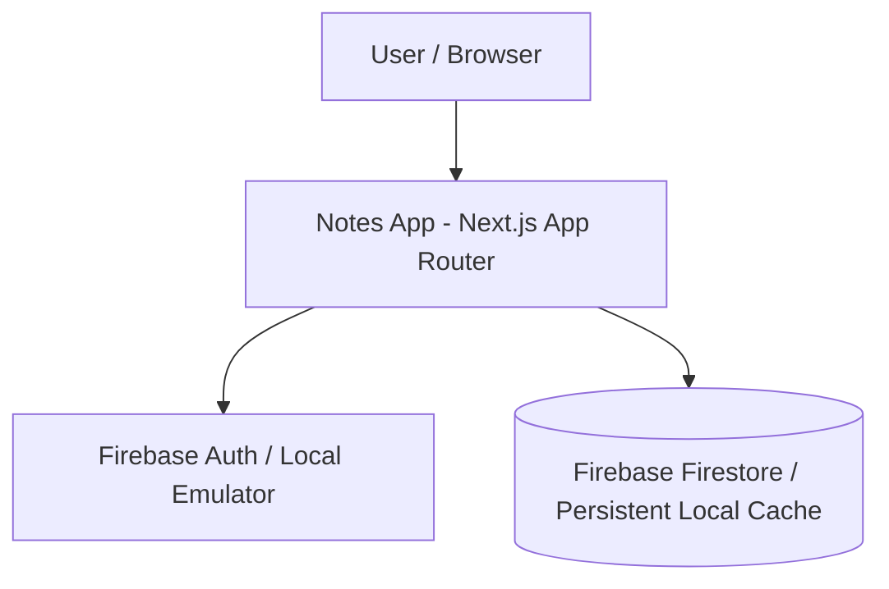

# System Architecture

## 1. System Context & Overview

`notes-app` is a Next.js App Router application with Firebase Authentication, native Firebase Firestore with persistent local cache (IndexedDB), and cookie-based internationalization (`next-intl`). Product scope details defer to `INTENT.md`.

```mermaid
flowchart TD
  User[User / Browser] --> App[Notes App - Next.js App Router]
  App --> Auth[Firebase Auth / Local Emulator]
  App --> Firestore[(Firebase Firestore / Persistent Local Cache)]
```

The current runtime boundary is the client web application and local emulator
environment. The implemented product-domain schema is intentionally narrow: user-owned
`Space` documents only. The broader Objects/Relations/Study schema remains deferred.

## 2. Module Boundaries & Routing Topology

- `src/app/`: routing, root layout, application entry surfaces, and global styles.
- `src/components/`: reusable application-level components and providers.
- `src/components/ui/`: generic shadcn/Base UI primitives; no notes-domain behavior. Must only import `@/lib/utils` (or `cn`) from `src/lib/`.
- `src/hooks/`: reusable, cross-cutting React hooks (device sensors, browser APIs, shared auth state). Must not depend on application routes (`src/app/`). Component-specific hooks coupled to compound context providers (e.g. `useSidebar`, `useToastManager`) remain co-located within their component files.
- `src/lib/`: shared utilities that do not depend on UI components.
- Firebase integration is concentrated in `src/lib/firebase/`; the first product
  data slice uses `src/hooks/use-spaces.ts`, `src/types/space.ts`, and
  `src/lib/validators/space.ts`. A server-side product DAL is not implemented yet.

Current dependency direction:

- application surfaces may compose application components, UI primitives, and hooks;
- UI primitives may compose other UI primitives and shared utilities (`@/lib/utils`);
- atomic UI primitives must not depend on composite UI components;
- shared utilities and DAL modules must not depend on UI or application layers;
- client UI components and hooks must not import server-side data modules when a
  product-specific DAL is introduced.

### 2.5 Current Firebase data boundary

- `src/lib/firebase/client.ts` owns Firebase App and Auth initialization.
- `src/components/notes-app/auth-provider.tsx` owns the React authentication state
  exposed to client components.
- `src/lib/firebase/firestore.ts` owns the shared Firestore `db`, emulator
  connection, and browser persistence configuration.
- `src/lib/error-capture/capture.ts` owns the single `captureError` funnel (normalize,
  dedupe, log). Channels feeding it: `src/instrumentation-client.ts` (window `error` and
  `unhandledrejection`), `src/instrumentation.ts` (server `onRequestError`),
  `src/app/error.tsx`, and `src/app/global-error.tsx`. Adopt an external reporting
  service by changing only `captureError`.
- Firestore rules enforce authenticated owner isolation for user data. Space documents
  additionally validate shape, immutable identity fields, schema version, and monotonic
  `stateVersion` updates.
- The current product collection is `/users/{uid}/spaces/{spaceId}`. Emulator
  integration fixtures live only below authenticated user-scoped Space paths; there is
  no publicly writable test collection in deployable rules.
- Objects, Relations, Cards, Attempts, Views, Inbox items, and other future domain
  collections are not implemented yet.

Dependency-cruiser is the executable source of truth for machine-enforced dependency
rules. This document owns the architectural intent behind those rules.

### 2.1 Next.js App Router Routing File Conventions (`src/app/`)

Next.js App Router relies on nested folder hierarchies to define routes and reserved file conventions to govern UI and server boundaries:

| Routing File | Role | Boundary & Behavior |
| --- | --- | --- |
| `page.tsx` | Route Leaf UI | Defines the publicly accessible UI for a route segment. |
| `layout.tsx` | Shared Layout | Wraps child pages and segments; preserves state across route transitions without re-mounting. |
| `template.tsx` | Re-mounted Layout | Similar to layout, but instantiates a fresh component instance and resets state on navigation. |
| `loading.tsx` | Suspense Loading | Instant streaming loading state; automatically wraps child pages in React `Suspense`. |
| `error.tsx` | Segment Error Boundary | Catches runtime errors in child segments; must be a Client Component (`'use client'`). |
| `global-error.tsx` | Root Error Boundary | Catches unhandled errors in the root layout; replaces root `<html>` and `<body>` on fatal crashes. |
| `not-found.tsx` | 404 UI Boundary | Rendered when `notFound()` is invoked or a route segment is not matched. |
| `unauthorized.tsx` | 401 UI Boundary | Rendered when `unauthorized()` is invoked for unauthenticated access. |
| `forbidden.tsx` | 403 UI Boundary | Rendered when `forbidden()` is invoked for unauthorized access to a resource. |
| `default.tsx` | Parallel Route Fallback | Unmatched slot fallback for Parallel Routes (`@slot`) during hard reloads. |
| `route.ts` | Server Route Handler | Dedicated server HTTP endpoint (`GET`, `POST`, etc.); cannot coexist with `page.tsx` at the same path. |
| `@slot` | Parallel Routes | Renders independent pages simultaneously within the same layout for split views or dashboards. |
| `(.)` / `(..)` / `(...)` | Intercepting Routes | Masks URL routing to display route content inside the current layout context (e.g. modals). |

### 2.2 Server vs Client Component Boundaries & Composition

- **React Server Components (RSC):** The default component model. Server Components run on the server, fetch data near the database, keep large dependencies out of client bundles, and emit streaming UI payloads.
- **Client Components (`'use client'`):** Explicit leaf boundaries that execute in the browser to handle interactivity, event listeners (`onClick`, `onChange`), React hooks (`useState`, `useEffect`), and browser APIs.
- **Composition Rule:** Never import Server Components into Client Components. Instead, pass Server Components as `children` or parallel route `@slots` to compose server-rendered trees inside client layout wrappers without converting the server subtrees to client bundles.

### 2.3 Cache Components & Rendering Execution Model

- **`'use cache'` Directive:** Placed at the file or function level to cache rendered components or expensive async computations across requests.
- **Cache Controls:**
  - `cacheLife()`: Sets profile-based or duration-based cache freshness, stale-while-revalidate, and expire thresholds.
  - `cacheTag()`: Associates semantic cache tags with cached data or components.
  - `revalidateTag()`: Invalidates tagged cache entries on-demand after mutations.
- **Partial Prerendering (PPR):** Combines ultra-fast static shell prerendering with dynamic streaming holes in a single unified HTTP response, eliminating latency for dynamic user-specific regions while preserving static delivery benefits.

### 2.4 Deployment Build Outputs

Next.js builds classify build artifacts into distinct deployment targets:

| Build Output Type | Meaning & Delivery Strategy |
| --- | --- |
| `APP_PAGE` | Dynamically rendered App Router page generated on-demand at request time. |
| `APP_ROUTE` | Dynamic server Route Handler (`route.ts`) executing HTTP endpoints. |
| `PRERENDER` | Statically prerendered HTML and RSC payload generated during build or cached via PPR. |
| `STATIC_FILE` | Immutable static assets (JavaScript, CSS, fonts, public media) served directly from edge/CDN storage. |

### 2.6 Rendering, Async Boundaries & Current Adoption

The rendering contract is progressive: render the stable route shell first, then
stream independent dynamic regions behind the smallest useful loading boundary.
The implementation rules live in `CONVENTIONS.md`; this section records the
architectural boundary and the current state.

- `loading.tsx` is the route-segment boundary for navigations and initial loads.
  Add it to a route when the segment has meaningful asynchronous work or needs an
  instant, prefetched loading UI.
- `<Suspense>` is the component-level boundary. Use it around a dynamic or async
  region rather than blocking an entire page on data that does not affect the
  surrounding shell. Fallbacks must preserve the region's approximate geometry
  to avoid avoidable layout shift.
- Independent Server Component work starts in parallel and resolves with
  `Promise.all()` when there is no dependency between operations. A parent must not
  await data that only one child consumes.
- Client-only Firebase Auth and Firestore observers remain behind explicit
  `"use client"` boundaries. Their loading/error states are local to the owning
  hook/component and are not represented as Server Component fetches.
- Current adoption: `src/app/(auth)/login/page.tsx` has a Suspense boundary because
  `useSearchParams()` requires a client-side boundary. The Space route already
  starts locale work in parallel, while `useSpaces()` uses a Firestore realtime
  subscription with its own loading and error UI. No route-level `loading.tsx` is
  present yet; new async route segments should add one when the UX benefits from
  streaming.
- `error.tsx`, `global-error.tsx`, and future `not-found.tsx`/`unauthorized.tsx`
  boundaries remain separate from loading boundaries: loading handles pending
  work, while error boundaries handle failures and expose retry/navigation actions.

## 3. Technology Decisions

Exact dependency versions are owned by `package.json`; this document records
architectural choices rather than duplicating version pins.

| Area | Decision | Rationale |
| --- | --- | --- |
| Application framework | Next.js App Router | File-based application structure and React server/client model |
| Language | TypeScript in strict mode | Static type safety |
| UI primitives | shadcn `base-nova` on Base UI | Accessible composable primitive layer |
| Styling | Tailwind CSS v4 + CSS-variable design tokens | Token-driven styling |
| Formatting/linting | Biome | Unified formatting and linting |
| Architecture analysis | dependency-cruiser | Executable dependency-boundary checks |
| Unused-code analysis | Knip | Detect unused files, exports, and dependencies |
| Component workbench | Ladle | Isolated component development |
| Render optimization | React Compiler | Compiler-assisted React optimization |
| Authentication UI | Firebase Auth UI | Accessible auth screens integrated with `@firebase-oss/ui-react` ([ADR 0008](./docs/adr/0008-adopt-firebase-ui-components.md), [ADR 0010](./docs/adr/0010-adopt-firebase-ui-v7-and-auth-resilience.md)) |
| Authentication provider | Firebase Auth + Emulator | User identity with local auth emulator support ([ADR 0009](./docs/adr/0009-adopt-firebase-auth-with-local-emulator.md)) |
| Internationalization | next-intl | Cookie-driven App Router internationalization with Firebase locale sync ([ADR 0011](./docs/adr/0011-adopt-cookie-based-next-intl-with-firebase-sync.md)) |
| End-to-end testing | Playwright | Cross-browser E2E testing with Next.js webServer integration and local emulator support ([ADR 0012](./docs/adr/0012-adopt-playwright-for-e2e-testing.md)) |
| Database & offline persistence | Firebase Firestore + Persistent Local Cache | Zero-latency local-first IndexedDB persistence, multi-tab sync, and cloud synchronization ([ADR 0013](./docs/adr/0013-adopt-native-firebase-firestore-with-persistent-local-cache.md)) |

## 4. Runtime State & Data Flow

- **Theme:** `ThemeProvider` wraps `next-themes`, controlling root theme class consumed by CSS variables.
- **Authentication & State Sync:** `AuthProvider` wraps Firebase Authentication observer (`onAuthStateChanged`) and `@firebase-oss/ui-react` store, providing authenticated `User` context and local Firebase Auth Emulator support. Client handlers synchronize active user locale preferences with the `NEXT_LOCALE` cookie and local storage ([ADR 0011](./docs/adr/0011-adopt-cookie-based-next-intl-with-firebase-sync.md)).
- **Database & Local Persistence:** Firebase Firestore configured with `persistentLocalCache` and `persistentMultipleTabManager` (`src/lib/firebase/firestore.ts`) provides offline-first IndexedDB persistence, zero-latency optimistic writes, multi-tab synchronization, and seamless emulator connectivity ([ADR 0013](./docs/adr/0013-adopt-native-firebase-firestore-with-persistent-local-cache.md)).
- **Internationalization:** `next-intl` resolves locale via the `NEXT_LOCALE` cookie in e.g. `src/i18n/request.ts` without URL path prefixes, keeping routes clean while maintaining canonical English identifiers for persisted database entities.

## 5. Cross-Cutting Architecture

- **Security:** architecture-level security boundaries defer to `SECURITY.md`.
- **Quality floors:** measurable non-regression requirements defer to
  `CONSTRAINTS.md`.
- **Observability:** no logging, tracing, telemetry, or error-reporting system is
  currently part of the architecture.
- **Performance:** no architecture-level bundle or Core Web Vitals budget has been
  adopted; implementation guidance belongs to `CONVENTIONS.md`.

## 6. Architectural Decision Records

- [`docs/adr/0001-use-biome-for-linting-and-formatting.md`](./docs/adr/0001-use-biome-for-linting-and-formatting.md)
- [`docs/adr/0002-adopt-base-ui-with-shadcn-base-nova.md`](./docs/adr/0002-adopt-base-ui-with-shadcn-base-nova.md)
- [`docs/adr/0003-use-ladle-for-component-development.md`](./docs/adr/0003-use-ladle-for-component-development.md)
- [`docs/adr/0004-enable-react-compiler.md`](./docs/adr/0004-enable-react-compiler.md)
- [`docs/adr/0005-adopt-tailwind-css-v4.md`](./docs/adr/0005-adopt-tailwind-css-v4.md)
- [`docs/adr/0006-enforce-module-boundaries-with-dependency-cruiser.md`](./docs/adr/0006-enforce-module-boundaries-with-dependency-cruiser.md)
- [`docs/adr/0007-eliminate-dead-code-with-knip.md`](./docs/adr/0007-eliminate-dead-code-with-knip.md)
- [`docs/adr/0008-adopt-firebase-ui-components.md`](./docs/adr/0008-adopt-firebase-ui-components.md)
- [`docs/adr/0009-adopt-firebase-auth-with-local-emulator.md`](./docs/adr/0009-adopt-firebase-auth-with-local-emulator.md)
- [`docs/adr/0010-adopt-firebase-ui-v7-and-auth-resilience.md`](./docs/adr/0010-adopt-firebase-ui-v7-and-auth-resilience.md)
- [`docs/adr/0011-adopt-cookie-based-next-intl-with-firebase-sync.md`](./docs/adr/0011-adopt-cookie-based-next-intl-with-firebase-sync.md)
- [`docs/adr/0012-adopt-playwright-for-e2e-testing.md`](./docs/adr/0012-adopt-playwright-for-e2e-testing.md)
- [`docs/adr/0013-adopt-native-firebase-firestore-with-persistent-local-cache.md`](./docs/adr/0013-adopt-native-firebase-firestore-with-persistent-local-cache.md)
- [`docs/adr/0014-certification-exam-and-study-simulator-domain-model.md`](./docs/adr/0014-certification-exam-and-study-simulator-domain-model.md)
- [`docs/adr/0015-adopt-sidebar-space-navigation.md`](./docs/adr/0015-adopt-sidebar-space-navigation.md)
