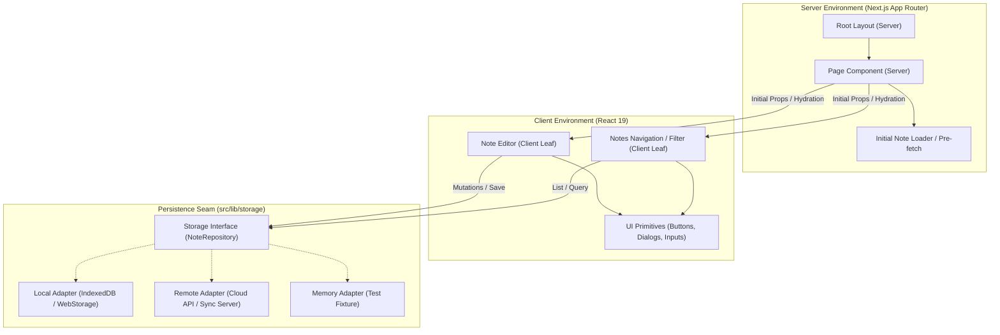

# Notes App Architecture

This document describes the foundational software architecture, directory organization, design principles, and quality contracts for the Notes App.

---

## 1. Architectural Vision & Technology Stack

The Notes App is engineered for instant client interactivity, high-fidelity note capture, and long-term maintainability. The system employs modern web platform capabilities to achieve low bundle sizes, automated rendering optimizations, and fast developer feedback loops.

```
┌─────────────────────────────────────────────────────────────┐
│                       Notes App                             │
│                                                             │
│   Next.js 16 (App Router)   │    React 19 + React Compiler │
│   Tailwind CSS v4 (Styling) │    TypeScript 5 (Strict)      │
│   Biome v2 (Lint & Format)  │    pnpm (Isolated Store)      │
└─────────────────────────────────────────────────────────────┘
```

### Core Technologies

- **Next.js 16 (App Router & Turbopack)**: Serves as the application framework, utilizing React Server Components (RSC), streaming server rendering, nested layouts, and route handlers. Turbopack provides near-instantaneous development feedback and production bundling.
- **React 19 & React Compiler**: User interfaces are composed with React 19. The React Compiler (`babel-plugin-react-compiler`) executes compile-time optimizations across components and hooks, eliminating manual `useMemo`, `useCallback`, and dependency array maintenance while preventing unnecessary re-renders.
- **Tailwind CSS v4**: Utility-first CSS engine using direct `@import "tailwindcss";` styling directives and PostCSS integration. Design tokens and styles compile directly without runtime overhead.
- **TypeScript 5 (Strict Mode)**: Enforces compile-time type safety across domain models, UI interfaces, and storage seams with path aliases (`@/*` mapping to `./src/*`).
- **Biome v2**: All-in-one linter, formatter, and import organizer configured via `biome.json`. Biome delivers sub-millisecond verification cycles, replacing ESLint and Prettier.
- **pnpm**: Package manager enforcing deterministic dependency resolution and isolated node modules, preventing phantom dependencies.

---

## 2. Deep Module Architecture

The codebase adheres strictly to the principles defined in the [Codebase Design Skill](./.agents/skills/codebase-design/SKILL.md). Modules are designed to be **deep**: providing substantial behavior behind a small, focused interface placed at clean seams.

```
┌──────────────────────────────────────────────┐
│           Small, Focused Interface           │  ← Minimal methods, explicit types, strict inputs
├──────────────────────────────────────────────┤
│                                              │
│             Deep Implementation              │  ← Complex state, parsing, synchronization,
│                                              │    caching, and validation hidden inside
│                                              │
└──────────────────────────────────────────────┘
```

### Core Architectural Principles

1. **Depth over Shallowness**:
   - A module is **deep** when it provides high leverage to callers while exposing a minimal interface surface.
   - Shallow modules (those whose interfaces are nearly as complex as their implementations, or mere passthrough wrappers) are deliberately avoided.
2. **Interface as Contract**:
   - An **interface** encompasses everything a caller must know: method signatures, invariants, error behaviors, and configuration expectations.
   - Interfaces expose what the caller needs to achieve, hiding internal mechanics.
3. **Clean Seams and Adapters**:
   - A **seam** is a place where behavior can be altered without editing the caller or the call site.
   - Concrete implementations that plug into seams are **adapters**.
   - Seams are introduced when variation is real (e.g., swapping local storage for remote cloud synchronization), not speculative.
4. **Leverage and Locality**:
   - **Leverage**: Callers achieve rich capability with low cognitive overhead. One robust implementation powers multiple routes and components.
   - **Locality**: Bug fixes, schema migrations, and performance optimizations occur in one isolated location without rippling across UI callers.
5. **The Deletion Test**:
   - If deleting a module causes complexity to vanish completely, the module was likely an unnecessary passthrough.
   - If deleting a module forces its complexity to replicate across multiple callers, the module was deep and earning its place.
6. **Interface as the Test Surface**:
   - Unit and integration tests exercise modules through their public interfaces at established seams, not by piercing internal state.
   - Modules accept dependencies and return deterministic results rather than creating hidden side effects.

---

## 3. Layered Directory & Seam Map

The repository maintains an explicit structural separation between project infrastructure, application code, and project documentation.

```
notes-app/
├── docs/                   # Architectural & Product Documentation
│   ├── adr/                # Architecture Decision Records
│   ├── agents/             # Agent guidelines & workflows
│   ├── exec-plans/         # Planning & execution roadmaps (active / completed)
│   ├── guides/             # Developer guides & setup runbooks
│   └── product-specs/      # PRDs and feature specifications
├── src/                    # Application Source Code
│   ├── app/                # Route controllers, layouts, server entrypoints
│   ├── components/         # UI hierarchies (primitives & domain views)
│   │   ├── domain/         # Domain-specific composite components (notes, editor)
│   │   └── ui/             # Reusable design primitives (buttons, dialogs, inputs)
│   └── lib/                # Pure domain models, storage adapters, utility modules
├── public/                 # Static assets
├── biome.json              # Biome linting and formatting configuration
├── next.config.ts          # Next.js & React Compiler configuration
├── package.json            # Manifest & dependencies
├── pnpm-lock.yaml          # Pinned dependency graph
├── postcss.config.mjs      # Tailwind CSS PostCSS plugin integration
└── tsconfig.json           # TypeScript configuration with `@/*` aliases
```

### Layer Responsibilities & Isolation Rules

| Layer | Path | Responsibility | Permitted Dependencies |
| :--- | :--- | :--- | :--- |
| **Root Configuration** | `./` (`biome.json`, `next.config.ts`, etc.) | Tooling configuration, engine flags, build lifecycle. | External dependencies only. |
| **Routing & Shell** | `src/app/` | URL routing, route segments, layouts, server-side data fetching, page shells. | `src/components/`, `src/lib/` |
| **UI Components** | `src/components/` | Visual presentations, design tokens, interactive client leaves. | `src/lib/` (types and client hooks) |
| **Primitives** | `src/components/ui/` | Generic, accessible UI elements (buttons, inputs, cards). | Zero domain dependencies. Purely stylistic and behavioral. |
| **Domain UI** | `src/components/domain/` | Note editor, sidebar navigation, note cards, tag filters. | `src/components/ui/`, `src/lib/` |
| **Core Domain & Seams** | `src/lib/` | Domain logic, data repositories, storage adapters, markdown/content parsers, sanitization, pure utilities. | No dependencies on `src/app/` or `src/components/`. Completely decoupled from UI rendering. |
| **Documentation** | `docs/` | Single source of truth for architectural records, execution roadmaps, and product requirements. | N/A |

---

## 4. Data Flow & State Architecture

The application balances server-side performance with client-side reactivity through a clear separation of rendering roles and storage seams.


```mermaid
flowchart TD
    subgraph ServerLayer ["Server Environment (Next.js App Router)"]
        Layout["Root Layout (Server)"]
        Page["Page Component (Server)"]
        FetchInitial["Initial Note Loader / Pre-fetch"]
        Layout --> Page
        Page --> FetchInitial
    end

    subgraph ClientLayer ["Client Environment (React 19)"]
        EditorView["Note Editor (Client Leaf)"]
        SidebarView["Notes Navigation / Filter (Client Leaf)"]
        UIPrimitives["UI Primitives (Buttons, Dialogs, Inputs)"]
        
        Page -->|"Initial Props / Hydration"| EditorView
        Page -->|"Initial Props / Hydration"| SidebarView
        EditorView --> UIPrimitives
        SidebarView --> UIPrimitives
    end

    subgraph StorageSeam ["Persistence Seam (src/lib/storage)"]
        StorageInterface["Storage Interface (NoteRepository)"]
        LocalAdapter["Local Adapter (IndexedDB / WebStorage)"]
        RemoteAdapter["Remote Adapter (Cloud API / Sync Server)"]
        InMemoryAdapter["Memory Adapter (Test Fixture)"]

        StorageInterface -.-> LocalAdapter
        StorageInterface -.-> RemoteAdapter
        StorageInterface -.-> InMemoryAdapter
    end

    EditorView -->|"Mutations / Save"| StorageInterface
    SidebarView -->|"List / Query"| StorageInterface
```

### Key Data Flow Characteristics

1. **Server Components as Skeletons**:
   - Next.js Server Components handle initial layout composition, document metadata, and critical initial data loads without sending unnecessary JavaScript to the client.
2. **Client Components as Interactive Leaves**:
   - Interactivity (rich-text typing, live character counting, keyboard shortcut handlers) is isolated to targeted client components marked with `'use client'`.
   - By pushing client boundaries down to the leaves, the majority of the component tree remains lightweight.
3. **Pluggable Storage Seam (`NoteRepository`)**:
   - All persistence logic is encapsulated behind a strict repository interface in `src/lib/storage`.
   - Callers (such as note editing components or server actions) only interact with the `NoteRepository` interface.
   - Multiple concrete adapters satisfy the seam:
     - `IndexedDbNoteAdapter`: Fast, offline-first client storage for browser sessions.
     - `RemoteSyncNoteAdapter`: Future cloud synchronization adapter.
     - `InMemoryNoteAdapter`: Deterministic, zero-side-effect test double for unit and integration testing.
4. **Unidirectional State Updates**:
   - Note modifications dispatch explicit update intents through the domain repository.
   - The UI updates optimistically, with state reconciliation handled internally by the repository layer rather than scattered across button click handlers.

---

## 5. Quality & Performance Contracts

The project enforces automated quality constraints to maintain speed and correctness as the codebase expands.

### 1. React Compiler Contract
- All client components must comply strictly with the [Rules of React](https://react.dev/reference/rules):
  - Component render functions must be pure.
  - State and props must not be mutated directly; transformations must produce new immutable objects.
  - Side effects belong exclusively inside event handlers or `useEffect`.
- The React Compiler automatically infers dependencies and memoizes JSX elements. Manual `useMemo` or `useCallback` calls should not be introduced unless explicitly profiling an edge case.

### 2. Linting and Formatting Gate
- Code quality is checked via Biome:
  - `pnpm lint`: Executes high-speed checks including TypeScript, React, and Next.js recommended rules.
  - `pnpm format`: Formats code according to standardized style guidelines (2-space indentation).
- Commits and pull requests must pass `pnpm lint` and `pnpm build` with zero errors.

### 3. Type Rigor
- TypeScript `strict` mode is enabled.
- Explicit domain types (e.g., `Note`, `NoteId`, `Tag`) reside in `src/lib/domain/` to guarantee invariant preservation across all application layers.
- Avoid loose `any` casts or unvalidated external inputs. Input validation at boundaries is required.

---

## 6. Canonical References

For historical context, execution logs, and detailed design guidance, refer to:

- [ADR 0001: Bootstrap Project with Next.js, TypeScript, Tailwind CSS, Biome, and React Compiler](./docs/adr/0001-bootstrap-next-app.md)
- [Execution Plan 0001: Bootstrap Notes Application Foundation](./docs/exec-plans/completed/0001-bootstrap-next-app.md)
- [Codebase Design Skill Guide](./.agents/skills/codebase-design/SKILL.md)
