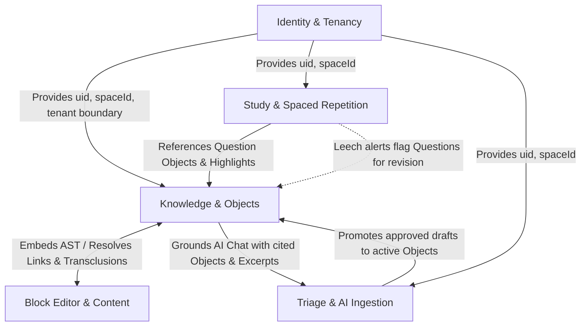

# Context Map

Canonical map of bounded contexts for `notes-app`, defining module boundaries, ubiquitous vocabularies, and system-wide relationships.

The detailed ubiquitous vocabulary is canonically defined in [`CONTEXT.md`](./CONTEXT.md). Architectural boundaries defer to [`ARCHITECTURE.md`](./ARCHITECTURE.md).

---

## Bounded Contexts

### 1. [Identity & Tenancy](./CONTEXT.md#user-and-spaces)
- **Boundary**: Identity & Access Subsystem
- **Domain Role**: Manages user authentication via Firebase Auth (`uid`), session validation (`requireActionUser`), tenant isolation across completely isolated Spaces (`SpaceId`), and user locale preferences (`NEXT_LOCALE`).
- **Core Entities**: `User`, `Space`, `Locale`, `SessionCookie`.
- **Invariants**:
  - No data is shared across Users.
  - Objects from one Space never link directly to Objects in another Space (Hard Space Isolation, `INV-1`).
  - Path root is strictly `/users/{uid}/spaces/{spaceId}/...`.

### 2. [Knowledge & Objects](./CONTEXT.md#objects-and-structure)
- **Boundary**: Core Knowledge & Graph Subsystem
- **Domain Role**: Core Personal Knowledge Management (PKM) graph. Manages first-class Objects, dynamic ObjectTypes, custom Properties, the SKOS Concept poly-hierarchy (`broader`, `narrower`, `related`, `altLabel`), curated Collections, and declarative Views.
- **Core Entities**: `ObjectRecord`, `ObjectTypeRecord`, `PropertyDefinition`, `ConceptExtension`, `RelationRecord`, `Collection`, `Query`, `View`.
- **Invariants**:
  - Views and Whiteboards are projection references, never data stores; editing an Object updates the canonical `Object` document (`INV-2`, `INV-3`).
  - Concept hierarchies must be strictly acyclic (`broader` transitive closure check).
  - All graph connections (mentions, relations, transclusions) are tracked as single `RelationRecord` documents (`INV-10`).

### 3. [Block Editor & Content](./CONTEXT.md#links)
- **Boundary**: Rich Text & AST Engine
- **Domain Role**: Framework-agnostic document content engine. Owns the portable Schema v4 AST (`BlockEditorDocumentV4`), deterministic block identifiers (`block:<uuid>`), recursive depth limiting ($\le 8$), trigger arbitration (`[[`, `((`, `/`, `@`, `#`), and lossless Markdown round-tripping.
- **Core Entities**: `BlockEditorDocumentV4`, `BlockEditorNodeV4`, `BlockEditorMark`, `BlockId`, `SuggestionTriggerDefinition`.
- **Invariants**:
  - Document nesting depth cannot exceed 8 levels.
  - Multi-character trigger tokens (`[[`, `((`) resolve ahead of single-character tokens (`@`, `/`).
  - Unrecognized AST blocks are preserved safely via `unsupportedBlock` rather than causing data corruption.

### 4. [Study & Spaced Repetition](./CONTEXT.md#study-and-practice)
- **Boundary**: Active Recall & FSRS Scheduler
- **Domain Role**: Active recall, spaced memorization, and exam simulations. Owns Questions (Q&A, cloze, multiple choice), FSRS v5 card scheduling (`ts-fsrs`), priority queue generation, immutable Attempt logs, Leech detection, and retention analytics.
- **Core Entities**: `QuestionExtension`, `AnswerChoice`, `CardRecord`, `AttemptRecord`, `FsrsSnapshot`, `ExamPlan`.
- **Invariants**:
  - Every answer option tracks provenance (`official`, `suggested`, `community`, `user`, `ai`) (`INV-9`).
  - Attempt logs are strictly append-only and immutable (`INV-11`).
  - Card transitions use Optimistic Concurrency Control (`stateVersion`) to prevent concurrent review overwrites.
  - Exam submissions past the deadline + grace period are rejected with `SESSION_EXPIRED`.

### 5. [Triage & AI Ingestion](./CONTEXT.md#triage-and-ai)
- **Boundary**: Triage & AI Pipeline
- **Domain Role**: Ingestion pipelines, space-scoped AI chat, Model Context Protocol (MCP) route handlers (`/api/mcp`), and triage workflows.
- **Core Entities**: `InboxRecord`, `PendingApprovalObject`, `AiChatMessage`, `GenerationMetadata`, `McpToolDefinition`.
- **Invariants**:
  - All agent-created objects require `lifecycleState: "pendingApproval"` and citation metadata (`INV-6`, `INV-12`).
  - AI responses proposing persistent or destructive actions require explicit user confirmation gates.
  - External MCP endpoints require SHA-256 hashed API key authentication and enforce space authorization.

---

## Inter-Context Relationships

### Relationship Contracts

1. **Identity & Tenancy $\rightarrow$ All Contexts**:
   - Upstream context supplying validated `UserId` and `SpaceId`.
   - All downstream collections and transactions anchor to `/users/{uid}/spaces/{spaceId}/`.

2. **Knowledge $\leftrightarrow$ Block Editor**:
   - **Knowledge $\rightarrow$ Editor**: Objects store rich text as `BlockEditorDocumentV4` AST payloads.
   - **Editor $\rightarrow$ Knowledge**: Writing inline links (`[[ ]]`, `@`), transclusions (`(( ))`), or tags (`#`) in the editor creates corresponding `RelationRecord` entries in the Knowledge context.

3. **Study $\rightarrow$ Knowledge**:
   - `Question` is a specialized ObjectType in Knowledge; `CardRecord` points to `questionId`.
   - Explanations reference `Highlight` objects as proof anchors (`INV-4`).
   - Card reviews increment `AttemptRecord` without mutating Question text.
   - Repeated failures flag the Question as a `Leech` on the Type Dashboard for user revision.

4. **Triage & AI $\rightarrow$ Knowledge**:
   - Browser extensions and AI agents insert objects with `lifecycleState: "pendingApproval"`.
   - Approving an object in the Inbox clears `pendingApproval`, publishing it to the Knowledge graph and enabling it for Study reviews.
