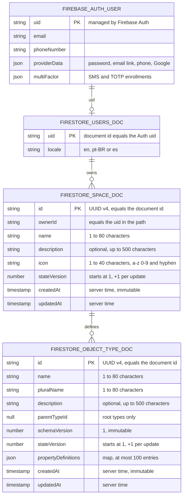

# Data Model

> **Status: the "Implemented data" section is current. Everything under
> "Proposed, not stored" is a planning artifact and is not implemented.**

The application defines no database tables of its own yet. All persisted data is
native to Firebase: the Firebase Auth user record, one Firestore profile
document per user, the user's Spaces, and a supported Object Type document
contract. Auth comes from
[ADR 0005](./docs/adr/0005-adopt-firebase-auth-with-local-emulator.md); the
Firestore client, persistent cache, emulator and deny-by-default rules come from
[ADR 0008](./docs/adr/0008-adopt-native-firebase-firestore-with-persistent-local-cache.md);
Spaces come from
[ADR 0010](./docs/adr/0010-adopt-owner-scoped-spaces-in-firestore.md).
Object Types come from
[ADR 0011](./docs/adr/0011-adopt-object-type-foundation-in-firestore.md).

## Implemented data (Firebase-native)

- `FIREBASE_AUTH_USER` is owned and stored by Firebase Auth. The application
  reads it through the Firebase SDKs and does not define its schema.
- `users/{uid}` is written by the server (Admin SDK) when a signed-in user picks
  a language explicitly (`src/data/locale-dal.ts`). The owner may
  read it; every client write is denied.
- `users/{uid}/spaces/{spaceId}` holds one Space per document. Only its owner
  (`request.auth.uid == uid`) may read, list, create, or update it; client
  deletion is denied. The browser implementation is
  `src/client/space-client.ts`; `src/data/space-dal.ts` verifies the session
  and stored ownership before recursively deleting a Space through the Admin
  SDK.
- `users/{uid}/spaces/{spaceId}/objectTypes/{objectTypeId}` holds an Object
  Type document. Its Space owner may read, list, create, or update a root type;
  the Rules require `parentTypeId` to be `null` and deny client deletion.
  `src/data/object-type-dal.ts` verifies the session and stored Space ownership,
  rejects deletion when a direct child exists, and recursively deletes a leaf
  type through the Admin SDK. No Object Type data is seeded or otherwise
  persisted by the application.
- `src/actions/space-actions.ts` validates deletion argument types and delegates
  to those server-only data modules. `src/domain/object-type.ts` and
  `src/domain/object-type-inheritance.ts` contain the SDK-free Object Type
  parsing and inheritance rules; no runtime path creates a non-root type.
- Every other Firestore path is denied by `firestore.rules`.

## Proposed, not stored

Nothing in this section is persisted. The earlier entity diagram remains
available in the git history of this file.

Assessment MVP candidates:

- Exam: title, provider, code, passing score percentage, time limit.
- Question: belongs to an Exam; type, prompt, answer definition, explanation,
  order index.
- Attempt: answers a Question; submitted answer, correctness, elapsed time,
  submission timestamp.
- Review: schedules a Question; due date and spaced-repetition state (stability,
  difficulty, reps, lapses).

The product may later include Objects, Collections, Tags,
Sources, Highlights, Links, Layouts, Templates, Inbox items, and grounded Chat
sessions. Those concepts remain proposals until approved by product specs and
active ADRs.

Before implementing persistence, reconcile this model with:

- [Domain Glossary](./GLOSSARY.md)
- [Architecture](./ARCHITECTURE.md)
- the active product specification;
- [ADR 0008](./docs/adr/0008-adopt-native-firebase-firestore-with-persistent-local-cache.md)
  and its current implementation state.

## Persistence decision boundary

Do not implement collection paths, indexes, Firebase rules, or a generalized
object graph solely because an older version of this document described them.

Exception: the Space collection (`/users/{uid}/spaces/{spaceId}`) is decided and
implemented; see
[ADR 0010](./docs/adr/0010-adopt-owner-scoped-spaces-in-firestore.md).

Exception: the Object Type path
(`/users/{uid}/spaces/{spaceId}/objectTypes/{objectTypeId}`), document contract,
Rules, server-side deletion, and pure domain code are documented in
[ADR 0011](./docs/adr/0011-adopt-object-type-foundation-in-firestore.md). No
Object Type data or runtime write path for non-null parents exists.

The persistence design for everything else should be chosen when the assessment MVP requirements
are concrete enough to justify it.
