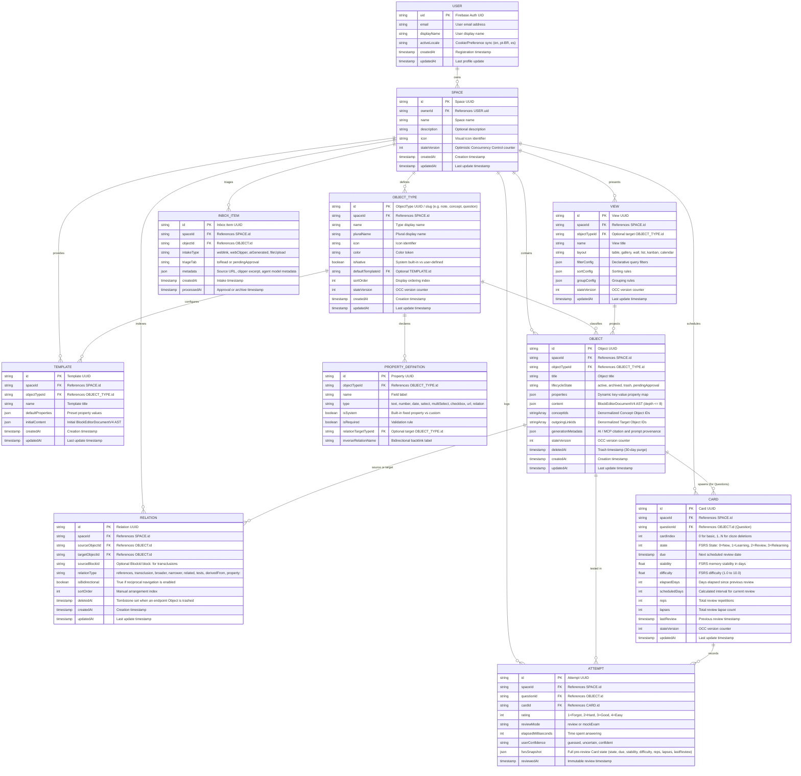

# Entity-Relationship Documentation (DER / ERD)

This document owns the target **Entity-Relationship Model (Diagrama Entidade-Relacionamento)** for `notes-app`, defining the intended Firestore hierarchy, entity attributes, primary/foreign keys, cardinality constraints, and indexing topologies.

> **Current implemented subset:** `USER → SPACE` only. Space documents live at
> `/users/{uid}/spaces/{spaceId}` with owner isolation and schema/state-version
> validation in `firestore.rules`. Every other entity in the diagrams below remains
> a target model until promoted by `INTENT.md` and `ARCHITECTURE.md`.

- Canonical domain vocabulary: [`CONTEXT.md`](./CONTEXT.md)
- Bounded context boundaries: [`CONTEXT-MAP.md`](./CONTEXT-MAP.md)
- System architecture: [`ARCHITECTURE.md`](./ARCHITECTURE.md)
- Database decision record: [`ADR 0013: Native Firebase Firestore with Persistent Local Cache`](./docs/adr/0013-adopt-native-firebase-firestore-with-persistent-local-cache.md)

---

## 1. Target Entity-Relationship Diagram



---

## 2. Firestore Storage Hierarchy & Collection Paths

In accordance with Hard Space Isolation (`INV-1`) and ADR 0013, all application data is stored in hierarchical subcollections isolated by tenant:

```text
/users/{uid}                                            <-- User document
  ├── /spaces/{spaceId}                                 <-- Space document (Tenancy Boundary)
  │     ├── /objectTypes/{objectTypeId}                 <-- Object Type schemas
  │     ├── /templates/{templateId}                     <-- Object Type templates
  │     ├── /objects/{objectId}                         <-- Canonical Objects (Notes, Concepts, Questions)
  │     ├── /relations/{relationId}                     <-- Unified Graph Relations (INV-10)
  │     ├── /cards/{cardId}                             <-- FSRS v5 Cards
  │     ├── /attempts/{attemptId}                       <-- Immutable Practice Logs (INV-11)
  │     ├── /views/{viewId}                             <-- Presentation Views & Queries
  │     └── /inbox/{inboxItemId}                        <-- Triage Queue
```

---

## 3. Entity Catalog & Detailed Specifications

### 3.1 `OBJECT`
The central polymorphic entity of the knowledge graph.

- **Collection Path**: `/users/{uid}/spaces/{spaceId}/objects/{objectId}`
- **Primary Key**: `objectId` (RFC 4122 UUID v4)
- **Attributes**:
  - `schemaVersion` (`int`, constant `4`): Schema migration version.
  - `spaceId` (`string`, required): Parent space ID.
  - `objectTypeId` (`string`, required): References `OBJECT_TYPE.id`.
  - `title` (`string`, required): Display title of the object.
  - `lifecycleState` (`string`, enum: `"active" | "archived" | "trash" | "pendingApproval"`): Operational state.
  - `properties` (`map<string, any>`): Dynamic property values conforming to the object type's property definitions.
  - `content` (`map<string, any>`, nullable): Serialized `BlockEditorDocumentV4` AST. Strictly bounded to a tree depth $\le 8$.
  - `conceptIds` (`array<string>`): Denormalized array of tagged Concept Object IDs for fast local filtering.
  - `outgoingLinkIds` (`array<string>`): Denormalized array of target Object IDs for graph traversals.
  - `generationMetadata` (`map`, optional): For AI/agent-generated items, contains `agentId`, `model`, `promptInstruction`, and `contextObjectIds` (`INV-6`, `INV-12`).
  - `stateVersion` (`int`, default `1`): Optimistic Concurrency Control integer incremented on every update.
  - `deletedAt` (`timestamp`, nullable): Populated when moved to Trash. Purged after 30 days.
  - `createdAt` (`timestamp`), `updatedAt` (`timestamp`).

#### Specialized Object Extensions
- **Exam** (`objectTypeId: "exam"`): Top-level certification assessment object. Stores `provider` (authority/vendor), `code` (e.g. `GCP-PCA`), `totalQuestionsCount`, `passingScorePercentage`, `timeLimitMinutes`, and an in-document `questionIds` array for deterministic sequential navigation ([ADR 0017](./docs/adr/0017-lean-exam-topics-domain-model-and-typedashboard.md)).
- **Question** (`objectTypeId: "question"`): Assessment item object. Stores `statement` (scenario Markdown), `options` (array of `QuestionOption` with `id` and `text`), `correctOptionIds` (`string[]`), `groundedExplanation` (optional, with `text`, `referenceUrls`, and `answerProvenance` per `INV-9`), `examId` (parent Exam object ID), `orderIndex`, and `format` (`single_choice` or `multiple_choice`). Free-form learner reflections and notes are stored in `content` AST ([ADR 0017](./docs/adr/0017-lean-exam-topics-domain-model-and-typedashboard.md)).
- **Concept**: Stores `prefLabel`, `altLabels` (synonyms), `broaderConceptIds` (parents), `narrowerConceptIds` (children), and `status` (`not_started`, `learning`, `mastered`).
- **Source**: Stores source media metadata (`pdfUrl`, `weblinkUrl`, `durationSeconds`, `localSnapshotUrl`).
- **Highlight**: Stores `sourceObjectId` (`Dependent` on Source), W3C selector locator, color tone, and excerpt text.

---

### 3.2 `RELATION` (Single-Record Relation Model, `INV-10`)
Unifies all connections across the knowledge graph (inline mentions, transclusions, concept taxonomy, and property links) into a single collection.

- **Collection Path**: `/users/{uid}/spaces/{spaceId}/relations/{relationId}`
- **Primary Key**: `relationId` (UUID v4)
- **Attributes**:
  - `schemaVersion` (`int`, constant `4`)
  - `spaceId` (`string`, required)
  - `sourceObjectId` (`string`, required): Origin Object ID.
  - `targetObjectId` (`string`, required): Target Object ID.
  - `sourceBlockId` (`string`, optional): Specific block ID (`block:<uuid>`) for transclusions (`(( ))`).
  - `relationType` (`string`, required): Semantic relationship type:
    - `"references"`: Standard `@` or `[[ ]]` inline link.
    - `"transclusion"`: Block reference embed.
    - `"broader"` / `"narrower"` / `"related"`: SKOS Concept taxonomy edges.
    - `"tests"`: Question-to-Concept or Question-to-Note link.
    - `"derivedFrom"`: Highlight or Question created from a Source.
    - `"property:<propId>"`: Structured relation property link.
  - `isBidirectional` (`boolean`, default `true`): Governs bidirectional navigation in UI.
  - `sortOrder` (`int`, optional): Manual arrangement index.
  - `deletedAt` (`timestamp`, nullable): Tombstone written when either endpoint Object is moved to Trash; cleared on restore, purged with the Object.
  - `createdAt` (`timestamp`), `updatedAt` (`timestamp`).

---

### 3.3 `CARD` (FSRS v5 Spaced Repetition)
Manages the memory state for Questions practicing active recall.

- **Collection Path**: `/users/{uid}/spaces/{spaceId}/cards/{cardId}`
- **Primary Key**: `cardId` (UUID v4)
- **Attributes**:
  - `schemaVersion` (`int`, constant `4`)
  - `spaceId` (`string`, required)
  - `questionId` (`string`, required): References `OBJECT.id`.
  - `cardIndex` (`int`, default `0`): Deletion index for cloze cards or prompt index.
  - `state` (`int`, enum `0..3`): Free Spaced Repetition Scheduler state:
    - `0 = New`
    - `1 = Learning`
    - `2 = Review`
    - `3 = Relearning`
  - `due` (`timestamp`, required): Scheduled date/time for the next review.
  - `stability` (`float`, required): Memory stability in days.
  - `difficulty` (`float`, required): Card difficulty rating (1.0 to 10.0).
  - `elapsedDays` (`int`, required): Days since previous review.
  - `scheduledDays` (`int`, required): Days until next scheduled review.
  - `reps` (`int`, default `0`): Total successful reviews completed.
  - `lapses` (`int`, default `0`): Number of times card was forgotten (`rating == 1`).
  - `lastReview` (`timestamp`, optional): Timestamp of the last review.
  - `stateVersion` (`int`, default `1`): OCC version counter to prevent concurrent review overwrites.
  - `updatedAt` (`timestamp`).

---

### 3.4 `ATTEMPT` (Immutable Practice Log, `INV-11`)
Provides an append-only audit trail of every practice event.

- **Collection Path**: `/users/{uid}/spaces/{spaceId}/attempts/{attemptId}`
- **Primary Key**: `attemptId` (UUID v4)
- **Attributes**:
  - `schemaVersion` (`int`, constant `4`)
  - `spaceId` (`string`, required)
  - `questionId` (`string`, required): References `OBJECT.id`.
  - `cardId` (`string`, required): References `CARD.id`.
  - `rating` (`int`, enum `1..4`):
    - `1 = Forgot / Again`
    - `2 = Hard / Earlier`
    - `3 = Good / Normal`
    - `4 = Easy / Later`
  - `reviewMode` (`string`, enum `"review" | "mockExam"`): Practice context.
  - `elapsedMilliseconds` (`int`, required): Active time spent answering.
  - `userConfidence` (`string`, optional, enum `"guessed" | "uncertain" | "confident"`).
  - `fsrsSnapshot` (`map`): Complete Card scheduling state before the transition (`{ state, due, stability, difficulty, reps, lapses, lastReview }`). Together with `rating` and `reviewedAt` this is enough to replay history and recompute schedules or switch algorithms (`INV-11`).
  - `reviewedAt` (`timestamp`, immutable): Exact submission time.

---

## 4. Firestore Indexing Specifications

To avoid unindexed full-collection scans and N+1 query amplification, the following composite indexes must be defined in `firestore.indexes.json`. That file does not exist yet and `firebase.json` does not reference it; create both together with the first query that needs them.

Firestore serves queries that combine only equality filters (no `orderBy`) from its automatic single-field indexes via index merging, so those queries need no composite entry.

### 4.1 Relations & Backlinks Query Index
Enables indexed backlink lookups (`targetObjectId ==`, optional `relationType ==`, newest first) for any opened Object:

```json
{
  "collectionGroup": "relations",
  "queryScope": "COLLECTION",
  "fields": [
    { "fieldPath": "targetObjectId", "order": "ASCENDING" },
    { "fieldPath": "relationType", "order": "ASCENDING" },
    { "fieldPath": "createdAt", "order": "DESCENDING" }
  ]
}
```

Outgoing-relation lookups (`sourceObjectId ==`, optional `relationType ==`) use equality filters only and are served by single-field index merging; no composite index is required unless an `orderBy` is added.

### 4.2 Study Queue Priority Index
Enables efficient retrieval of due cards ordered by due date without in-memory filtering:

```json
{
  "collectionGroup": "cards",
  "queryScope": "COLLECTION",
  "fields": [
    { "fieldPath": "state", "order": "ASCENDING" },
    { "fieldPath": "due", "order": "ASCENDING" }
  ]
}
```

### 4.3 Attempt Analytics Index
Enables fast calculation of retention rates and lapse counts per question:

```json
{
  "collectionGroup": "attempts",
  "queryScope": "COLLECTION",
  "fields": [
    { "fieldPath": "questionId", "order": "ASCENDING" },
    { "fieldPath": "reviewedAt", "order": "DESCENDING" }
  ]
}
```

---

## 5. Architectural Integrity & Security Rules

1. **Client Read/Write Policy**:
   - Clients interact with Firestore through the Firebase Web SDK (version owned by `package.json`) configured with `persistentLocalCache` and multi-tab synchronization ([ADR 0013](./docs/adr/0013-adopt-native-firebase-firestore-with-persistent-local-cache.md)).
   - `firestore.rules` enforces that users can only read and write documents where `/users/{uid}/...` matches their authenticated `request.auth.uid`.
   - Current `firestore.rules` grants the owner read and delete over `/users/{uid}/**`. Creates and updates are validated per collection: `spaces` (shape and `stateVersion`), and under a space `objects`, `relations`, `cards` and `attempts` (required fields, types, enums, `spaceId`, `schemaVersion == 4`, and a parent space that exists). `stateVersion` increments are enforced for `objects` and `cards`, and `attempts` have no update rule (`INV-11`). Collections without a documented schema (`objectTypes`, `templates`, `views`, `inbox`) are not writable until their rules are added. Rules do not yet check the Object extension fields (Concept, Question, Source, Highlight), the `content` AST depth, or that an Attempt's `cardId`/`questionId` reference existing documents.
2. **Concurrency & Atomicity Invariants**:
   - Firestore `runTransaction` requires a server round-trip and does not run while the client is offline, which conflicts with the offline-first goal of ADR 0013. Offline-capable mutations must use `updateDoc` / `writeBatch`, which apply to the local cache immediately and sync later.
   - Optimistic concurrency on `ObjectRecord` and `CardRecord` is therefore enforced by `firestore.rules` (`request.resource.data.stateVersion == resource.data.stateVersion + 1`), so a stale queued write is rejected on sync. Client code increments `stateVersion` on every update.
   - Multi-document changes (Object plus its Relations, Concept arrays, or Dependents) go in a single `writeBatch` (max 500 writes) so they commit atomically.
   - Deleting an Object cascades to its `Dependent` entities (Highlights, Attempts) and sets `deletedAt` on its Relations. Deleting a Question is the only permitted deletion of its Attempts (`INV-11`).
