# Entity-Relationship Documentation (DER / ERD)

This document defines the canonical **Entity-Relationship Model (Diagrama Entidade-Relacionamento)** for `notes-app`, strictly aligned with the ubiquitous language in [`GLOSSARY.md`](./GLOSSARY.md). It details the Firestore storage hierarchy, entity attributes, keys, cardinality constraints, and indexing topologies.

- Canonical domain vocabulary: [`GLOSSARY.md`](./GLOSSARY.md)
- System architecture: [`ARCHITECTURE.md`](./ARCHITECTURE.md)
- Database decision record: [`ADR 0008: Native Firebase Firestore with Persistent Local Cache`](./docs/adr/0008-adopt-native-firebase-firestore-with-persistent-local-cache.md)

---

## 1. Domain-Aligned Entity-Relationship Diagram

```mermaid
erDiagram
    USER ||--o{ SPACE : owns

    SPACE ||--o{ OBJECT_TYPE : defines
    SPACE ||--o{ TEMPLATE : provides
    SPACE ||--o{ OBJECT : contains
    SPACE ||--o{ COLLECTION : organizes
    SPACE ||--o{ TAG : classifies
    SPACE ||--o{ LINK : connects
    SPACE ||--o{ REVIEW : schedules
    SPACE ||--o{ ATTEMPT : logs
    SPACE ||--o{ LAYOUT : presents
    SPACE ||--o{ INBOX : triages
    SPACE ||--o{ CHAT : hosts

    OBJECT_TYPE ||--o{ PROPERTY : declares
    OBJECT_TYPE ||--o{ OBJECT : classifies
    OBJECT_TYPE ||--o{ COLLECTION : bounds
    OBJECT_TYPE ||--o{ TEMPLATE : configures

    COLLECTION ||--o{ OBJECT : curates
    OBJECT ||--o{ TAG : tagged_with
    OBJECT ||--o{ LINK : "source or target"
    OBJECT ||--o{ REVIEW : "schedules (for Questions)"
    OBJECT ||--o{ ATTEMPT : "tested in"

    REVIEW ||--o{ ATTEMPT : records
    LAYOUT ||--o{ OBJECT : projects
    CHAT ||--o{ OBJECT : grounds

    USER {
        string uid PK "Firebase Auth UID"
        string email "User email address"
        string displayName "User display name"
        string activeLocale "Cookie / Preference sync (en, pt-BR, es)"
        timestamp createdAt "Registration timestamp"
        timestamp updatedAt "Last profile update"
    }

    SPACE {
        string id PK "Space UUID"
        string ownerId FK "References USER.uid"
        string name "Space name"
        string description "Optional description"
        string icon "Visual icon identifier"
        int stateVersion "Optimistic Concurrency Control counter"
        timestamp createdAt "Creation timestamp"
        timestamp updatedAt "Last update timestamp"
    }

    OBJECT_TYPE {
        string id PK "ObjectType UUID / slug (e.g. page, source, exam, question)"
        string spaceId FK "References SPACE.id"
        string name "Type display name"
        string pluralName "Plural display name"
        string icon "Icon identifier"
        string color "Color token"
        boolean isNative "System built-in vs user-defined"
        string defaultTemplateId FK "Optional TEMPLATE.id"
        int sortOrder "Display ordering index"
        int stateVersion "OCC version counter"
        timestamp createdAt "Creation timestamp"
        timestamp updatedAt "Last update timestamp"
    }

    PROPERTY {
        string id PK "Property UUID"
        string objectTypeId FK "References OBJECT_TYPE.id"
        string name "Field label"
        string type "text, number, date, select, multiSelect, checkbox, url, link"
        boolean isSystem "Built-in fixed property vs custom"
        boolean isRequired "Validation rule"
        string targetObjectTypeId FK "Optional target OBJECT_TYPE.id for links"
        string inverseLinkLabel "Bidirectional Back Link label"
    }

    OBJECT {
        string id PK "Object UUID"
        string spaceId FK "References SPACE.id"
        string objectTypeId FK "References OBJECT_TYPE.id"
        string title "Object title"
        string lifecycleState "active, archived, trash, pendingApproval"
        json properties "Dynamic key-value property map"
        json content "Block editor AST composed of atomic Blocks (depth <= 8)"
        stringArray tagIds "Associated TAG IDs"
        stringArray outgoingLinkIds "Denormalized target Object IDs for graph traversal"
        json generationMetadata "AI / MCP citation and prompt provenance"
        int stateVersion "OCC version counter"
        timestamp deletedAt "Trash timestamp (30-day purge)"
        timestamp createdAt "Creation timestamp"
        timestamp updatedAt "Last update timestamp"
    }

    COLLECTION {
        string id PK "Collection UUID"
        string spaceId FK "References SPACE.id"
        string objectTypeId FK "References OBJECT_TYPE.id"
        string name "Curated collection name"
        string description "Curated purpose description"
        string icon "Visual icon identifier"
        stringArray objectIds "Ordered list of curated Object IDs"
        int stateVersion "OCC version counter"
        timestamp createdAt "Creation timestamp"
        timestamp updatedAt "Last update timestamp"
    }

    TAG {
        string id PK "Tag UUID"
        string spaceId FK "References SPACE.id"
        string name "Tag label"
        string color "Color token"
        timestamp createdAt "Creation timestamp"
        timestamp updatedAt "Last update timestamp"
    }

    LINK {
        string id PK "Link UUID"
        string spaceId FK "References SPACE.id"
        string sourceObjectId FK "References OBJECT.id"
        string targetObjectId FK "References OBJECT.id"
        string sourceBlockId "Optional Block ID block:<uuid> for transclusions"
        string linkType "inline, transclusion, tests, derivedFrom, property:<id>"
        boolean isBidirectional "True if reciprocal Back Link navigation is enabled"
        int sortOrder "Manual arrangement index"
        timestamp deletedAt "Tombstone set when an endpoint Object enters Trash"
        timestamp createdAt "Creation timestamp"
        timestamp updatedAt "Last update timestamp"
    }

    REVIEW {
        string id PK "Review UUID"
        string spaceId FK "References SPACE.id"
        string questionId FK "References OBJECT.id (Question)"
        int itemIndex "0 for basic, 1..N for cloze deletions"
        int state "FSRS State: 0=New, 1=Learning, 2=Review, 3=Relearning"
        timestamp due "Next scheduled review date"
        float stability "FSRS memory stability in days"
        float difficulty "FSRS difficulty (1.0 to 10.0)"
        int elapsedDays "Days elapsed since previous review"
        int scheduledDays "Calculated interval for current review"
        int reps "Total review repetitions"
        int lapses "Total review lapse count"
        boolean isLeech "Flagged for revision after repeated consecutive recall failures"
        timestamp lastReview "Previous review timestamp"
        int stateVersion "OCC version counter"
        timestamp updatedAt "Last update timestamp"
    }

    ATTEMPT {
        string id PK "Attempt UUID"
        string spaceId FK "References SPACE.id"
        string questionId FK "References OBJECT.id"
        string reviewId FK "References REVIEW.id"
        int rating "1=Forgot, 2=Hard, 3=Good, 4=Easy"
        string reviewMode "review or mockExam"
        int elapsedMilliseconds "Time spent answering"
        string userConfidence "guessed, uncertain, confident"
        json fsrsSnapshot "Full pre-review state snapshot"
        string questionType "Question type at submission time"
        json submittedAnswer "Answer payload submitted"
        boolean isCorrect "Whether response satisfied criteria"
        timestamp reviewedAt "Immutable review timestamp"
    }

    LAYOUT {
        string id PK "Layout UUID"
        string spaceId FK "References SPACE.id"
        string objectTypeId FK "Optional target OBJECT_TYPE.id"
        string collectionId FK "Optional target COLLECTION.id"
        string name "Layout title"
        string type "table, gallery, wall, list, kanban, calendar"
        json filterConfig "Declarative query filters"
        json sortConfig "Sorting rules"
        json groupConfig "Grouping rules"
        int stateVersion "OCC version counter"
        timestamp updatedAt "Last update timestamp"
    }

    TEMPLATE {
        string id PK "Template UUID"
        string spaceId FK "References SPACE.id"
        string objectTypeId FK "References OBJECT_TYPE.id"
        string name "Template title"
        json defaultProperties "Preset property values"
        json initialContent "Initial Block editor AST"
        timestamp createdAt "Creation timestamp"
        timestamp updatedAt "Last update timestamp"
    }

    INBOX {
        string id PK "Inbox Item UUID"
        string spaceId FK "References SPACE.id"
        string objectId FK "Optional references OBJECT.id"
        string intakeType "weblink, document, aiGenerated"
        string triageStatus "unprocessed, processed, discarded"
        json metadata "Source URL, document excerpt, AI provenance"
        timestamp createdAt "Intake timestamp"
        timestamp processedAt "Triage timestamp"
    }

    CHAT {
        string id PK "Chat Session UUID"
        string spaceId FK "References SPACE.id"
        string title "Conversational session topic"
        stringArray groundedObjectIds "Objects and Sources anchoring the session"
        int messageCount "Total message counter"
        int stateVersion "OCC version counter"
        timestamp createdAt "Session creation timestamp"
        timestamp updatedAt "Last interaction timestamp"
    }
```



---

## 2. Firestore Storage Hierarchy & Collection Paths

In accordance with Hard Space Isolation and ADR 0008, all data is organized into hierarchical subcollections within a user-owned Space:

```text
/users/{uid}                                            <-- User document
  ├── /spaces/{spaceId}                                 <-- Space document (Isolation Boundary)
  │     ├── /objectTypes/{objectTypeId}                 <-- Object Type schemas
  │     ├── /properties/{propertyId}                    <-- Structural Properties
  │     ├── /templates/{templateId}                     <-- Object Type templates
  │     ├── /collections/{collectionId}                 <-- Curated Collections
  │     ├── /tags/{tagId}                               <-- Cross-cutting Tags
  │     ├── /objects/{objectId}                         <-- Canonical Objects (Pages, Sources, Questions, Exams)
  │     ├── /links/{linkId}                             <-- Direct semantic Links & Back Links
  │     ├── /reviews/{reviewId}                         <-- Spaced Repetition Schedules & Leeches
  │     ├── /attempts/{attemptId}                       <-- Immutable Practice Logs
  │     ├── /layouts/{layoutId}                         <-- Structural presentation Layouts
  │     ├── /inbox/{inboxItemId}                        <-- Central triage Inbox
  │     └── /chats/{chatId}                             <-- Grounded Chat sessions
```

---

## 3. Entity Catalog & Detailed Specifications

### 3.1 `OBJECT`
The central polymorphic entity of the knowledge graph.

- **Collection Path**: `/users/{uid}/spaces/{spaceId}/objects/{objectId}`
- **Primary Key**: `objectId` (RFC 4122 UUID v4)
- **Attributes**:
  - `schemaVersion` (`int`, constant `4`): Schema migration version.
  - `spaceId` (`string`, required): Parent Space ID.
  - `objectTypeId` (`string`, required): References `OBJECT_TYPE.id`.
  - `title` (`string`, required): Display title of the object.
  - `lifecycleState` (`string`, enum: `"active" | "archived" | "trash" | "pendingApproval"`): Operational state.
  - `properties` (`map<string, any>`): Dynamic property values conforming to the object type's property definitions.
  - `content` (`map<string, any>`, nullable): Serialized Block editor AST composed of atomic Blocks (tree depth <= 8).
  - `tagIds` (`array<string>`): Associated Tag IDs.
  - `outgoingLinkIds` (`array<string>`): Denormalized array of target Object IDs for graph traversals.
  - `generationMetadata` (`map`, optional): For AI-generated items, contains provenance and context IDs.
  - `stateVersion` (`int`, default `1`): Optimistic Concurrency Control integer incremented on every update.
  - `deletedAt` (`timestamp`, nullable): Populated when moved to Trash. Purged after 30 days.
  - `createdAt` (`timestamp`), `updatedAt` (`timestamp`).

#### Canonical Object Types
- **Page** (`objectTypeId: "page"`): Fundamental free-form canvas object for long-form writing and media composition.
- **Daily Note** (`objectTypeId: "daily-note"`): Calendar-bound object for ephemeral logs and daily reflections.
- **Source** (`objectTypeId: "source"`): Raw external reference object supporting highlights. Subtypes include:
  - **Web Link**: External online reference preserved as a local source snapshot (`weblinkUrl`, `snapshotUrl`).
  - **Document**: Uploaded file source such as a PDF or text document (`pdfUrl`, `fileSize`, `mimeType`).
- **Highlight** (`objectTypeId: "highlight"`): First-class captured excerpt from a Source, linked to notes with selector locators and color tones.
- **Exam** (`objectTypeId: "exam"`): Structured assessment specification composed of an ordered sequence of questions (`provider`, `code`, `totalQuestionsCount`, `passingScorePercentage`, `timeLimitMinutes`, `questionIds`).
- **Question** (`objectTypeId: "question"`): Evaluated prompt containing candidate choices, correct criteria, and an explanation. Discriminated by `properties.type` (`single-choice`, `multiple-choice`, `true-false`, `fill-blank`, `dropdown`, `matching`, `ordering`, `drag-and-drop`, `hotspot`, `matrix`, `simulation`, `case-study`).

---

### 3.2 `COLLECTION`
Manually curated grouping of objects belonging to the same object type.

- **Collection Path**: `/users/{uid}/spaces/{spaceId}/collections/{collectionId}`
- **Primary Key**: `collectionId` (UUID v4)
- **Attributes**:
  - `spaceId` (`string`, required): Parent Space ID.
  - `objectTypeId` (`string`, required): Restricted to curating objects of this type.
  - `name` (`string`, required): Display name.
  - `description` (`string`, optional): Curated purpose.
  - `icon` (`string`, optional): Visual icon token.
  - `objectIds` (`array<string>`): Explicit ordered list of curated Object IDs.
  - `stateVersion` (`int`, default `1`): OCC counter.
  - `createdAt` (`timestamp`), `updatedAt` (`timestamp`).

---

### 3.3 `TAG`
Non-hierarchical cross-cutting label applied across objects of any type.

- **Collection Path**: `/users/{uid}/spaces/{spaceId}/tags/{tagId}`
- **Primary Key**: `tagId` (UUID v4)
- **Attributes**:
  - `spaceId` (`string`, required): Parent Space ID.
  - `name` (`string`, required): Normalized label.
  - `color` (`string`, optional): Color token.
  - `createdAt` (`timestamp`), `updatedAt` (`timestamp`).

---

### 3.4 `LINK` & `Back Link`
Direct semantic connections from one object to another created inline or via property.

- **Collection Path**: `/users/{uid}/spaces/{spaceId}/links/{linkId}`
- **Primary Key**: `linkId` (UUID v4)
- **Attributes**:
  - `schemaVersion` (`int`, constant `4`)
  - `spaceId` (`string`, required)
  - `sourceObjectId` (`string`, required): Origin Object ID.
  - `targetObjectId` (`string`, required): Target Object ID.
  - `sourceBlockId` (`string`, optional): Block ID (`block:<uuid>`) for transclusions.
  - `linkType` (`string`, required): Semantic connection type:
    - `"inline"`: Standard `@` or `[[ ]]` inline link.
    - `"transclusion"`: Block embed transclusion (`(( ))`).
    - `"tests"`: Question-to-Page link.
    - `"derivedFrom"`: Highlight or Question created from a Source.
    - `"property:<propId>"`: Structured property link.
  - `isBidirectional` (`boolean`, default `true`): Governs Back Link navigation in UI.
  - `sortOrder` (`int`, optional): Manual arrangement index.
  - `deletedAt` (`timestamp`, nullable): Tombstone written when either endpoint Object enters Trash.
  - `createdAt` (`timestamp`), `updatedAt` (`timestamp`).
- **Back Link Derivation**: An object's Back Links are aggregated dynamically by querying links where `targetObjectId == object.id`.

---

### 3.5 `REVIEW` (Spaced Repetition & Leech Management)
Manages memory retention intervals and practice schedules for Questions using FSRS.

- **Collection Path**: `/users/{uid}/spaces/{spaceId}/reviews/{reviewId}`
- **Primary Key**: `reviewId` (UUID v4)
- **Attributes**:
  - `schemaVersion` (`int`, constant `4`)
  - `spaceId` (`string`, required)
  - `questionId` (`string`, required): References `OBJECT.id` (Question).
  - `itemIndex` (`int`, default `0`): Deletion index for cloze prompts.
  - `state` (`int`, enum `0..3`): 0=New, 1=Learning, 2=Review, 3=Relearning.
  - `due` (`timestamp`, required): Scheduled date/time for the next review.
  - `stability` (`float`, required): Memory stability in days.
  - `difficulty` (`float`, required): Difficulty rating (1.0 to 10.0).
  - `elapsedDays` (`int`, required): Days since previous review.
  - `scheduledDays` (`int`, required): Calculated interval for current review.
  - `reps` (`int`, default `0`): Total successful reviews.
  - `lapses` (`int`, default `0`): Number of times recall failed (`rating == 1`).
  - `isLeech` (`boolean`, default `false`): Flagged for revision after repeated consecutive recall failures.
  - `lastReview` (`timestamp`, optional): Timestamp of last review.
  - `stateVersion` (`int`, default `1`): OCC counter.
  - `updatedAt` (`timestamp`).

---

### 3.6 `ATTEMPT` (Immutable Practice Log)
Immutable historical record of a submitted response to a Question during a Review or Mock Exam.

- **Collection Path**: `/users/{uid}/spaces/{spaceId}/attempts/{attemptId}`
- **Primary Key**: `attemptId` (UUID v4)
- **Attributes**:
  - `schemaVersion` (`int`, constant `4`)
  - `spaceId` (`string`, required)
  - `questionId` (`string`, required): References `OBJECT.id`.
  - `reviewId` (`string`, required): References `REVIEW.id`.
  - `rating` (`int`, enum `1..4`): 1=Forgot, 2=Hard, 3=Good, 4=Easy.
  - `reviewMode` (`string`, enum `"review" | "mockExam"`): Practice context.
  - `elapsedMilliseconds` (`int`, required): Time spent answering.
  - `userConfidence` (`string`, optional, enum `"guessed" | "uncertain" | "confident"`).
  - `fsrsSnapshot` (`map`): Pre-review state snapshot.
  - `questionType` (`string`, optional): Question type discriminator.
  - `submittedAnswer` (`map`, optional): Submitted answer structure.
  - `isCorrect` (`boolean`, optional): True if criteria satisfied.
  - `reviewedAt` (`timestamp`, immutable): Submission timestamp.

---

### 3.7 `LAYOUT`
Structural arrangement and presentation pattern for organizing content components.

- **Collection Path**: `/users/{uid}/spaces/{spaceId}/layouts/{layoutId}`
- **Primary Key**: `layoutId` (UUID v4)
- **Attributes**:
  - `spaceId` (`string`, required)
  - `objectTypeId` (`string`, optional): Target Object Type.
  - `collectionId` (`string`, optional): Target Collection.
  - `name` (`string`, required): Layout title.
  - `type` (`string`, enum: `"table" | "gallery" | "wall" | "list" | "kanban" | "calendar"`).
  - `filterConfig` (`map`): Declarative query filters.
  - `sortConfig` (`map`): Ordering criteria.
  - `groupConfig` (`map`): Grouping criteria.
  - `stateVersion` (`int`, default `1`).
  - `updatedAt` (`timestamp`).

---

### 3.8 `INBOX` & `CHAT`
- **Inbox** (`/users/{uid}/spaces/{spaceId}/inbox/{inboxItemId}`): Central triage repository for newly captured, unprocessed sources and items (`intakeType: "weblink" | "document" | "aiGenerated"`, `triageStatus: "unprocessed" | "processed" | "discarded"`).
- **Chat** (`/users/{uid}/spaces/{spaceId}/chats/{chatId}`): Conversational session grounded in space objects, sources, and knowledge (`groundedObjectIds`, message thread).

---

## 4. Firestore Indexing Specifications

### 4.1 Links & Back Links Query Index
Enables indexed Back Link retrieval (`targetObjectId ==`, optional `linkType ==`, newest first) for any opened Object:

```json
{
  "collectionGroup": "links",
  "queryScope": "COLLECTION",
  "fields": [
    { "fieldPath": "targetObjectId", "order": "ASCENDING" },
    { "fieldPath": "linkType", "order": "ASCENDING" },
    { "fieldPath": "createdAt", "order": "DESCENDING" }
  ]
}
```

### 4.2 Review Queue Priority Index
Enables immediate retrieval of due items ordered by due date:

```json
{
  "collectionGroup": "reviews",
  "queryScope": "COLLECTION",
  "fields": [
    { "fieldPath": "state", "order": "ASCENDING" },
    { "fieldPath": "due", "order": "ASCENDING" }
  ]
}
```

### 4.3 Attempt Analytics Index
Enables performance analytics and recall rates per Question:

```json
{
  "collectionGroup": "attempts",
  "queryScope": "COLLECTION",
  "fields": [
    { "fieldPath": "questionId", "order": "ASCENDING" },
    { "fieldPath": "reviewedAt", "order": "DESCENDING" }
  ]
}
```

### 4.4 Exam Question Feed Index
Enables ordered feed traversal (`objectTypeId == "question"`, `properties.examId ==`, ascending `properties.orderIndex`):

```json
{
  "collectionGroup": "objects",
  "queryScope": "COLLECTION",
  "fields": [
    { "fieldPath": "objectTypeId", "order": "ASCENDING" },
    { "fieldPath": "properties.examId", "order": "ASCENDING" },
    { "fieldPath": "properties.orderIndex", "order": "ASCENDING" }
  ]
}
```

---

## 5. Architectural Integrity & Security Rules

1. **Space Isolation (`Hard Space Isolation`)**:
   - Every operation is scoped to `/users/{uid}/spaces/{spaceId}/...`.
   - Security rules mandate `request.auth.uid == uid`.
2. **Concurrency & Atomicity**:
   - Optimistic concurrency control is enforced on mutable entities (`stateVersion`).
   - Cascade operations (e.g. moving an Object to Trash updates associated Links and Dependents) execute atomically via Firestore `writeBatch`.
3. **Glossary Terminology Enforcement**:
   - Field names, entity identifiers, and API signatures adhere strictly to [`GLOSSARY.md`](./GLOSSARY.md). Forbidden synonyms (`vault`, `workspace`, `tenant`, `note`, `notebook`, `relation`, `view`, `card`) are banned in code and schema declarations.
