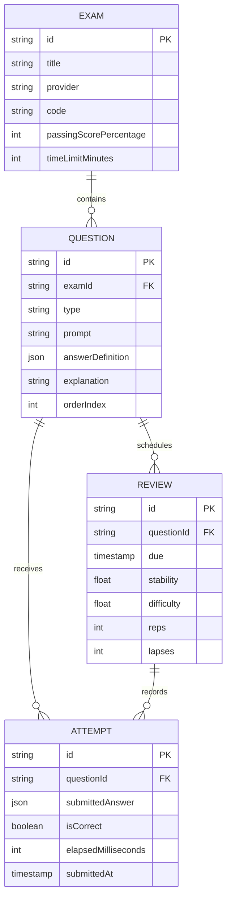

# Proposed Data Model

> **Status: planning artifact — not implemented on the current `dev` branch.**

This document preserves the proposed entity model for the future study
platform. It must not be interpreted as the current persistence architecture.

The current `dev` branch includes Firebase/Firebase UI dependencies and local
emulator groundwork, but it has no application Firestore data-access layer and
no implemented persistence schema. ADRs 0004–0008 are accepted decisions:
ADR 0004 is partially implemented, while ADRs 0005–0008 are accepted target
designs that are not yet implemented on `dev`.

Before implementing persistence, this model must be reconciled with:

- [Domain Glossary](./GLOSSARY.md)
- [Architecture](./ARCHITECTURE.md)
- the active product specification;
- [ADR 0008](./docs/adr/0008-adopt-native-firebase-firestore-with-persistent-local-cache.md)
  and its current implementation state.

## Proposed core assessment entities

## Broader planned model

The product may later include Spaces, Objects, Object Types, Collections, Tags,
Sources, Highlights, Links, Layouts, Templates, Inbox items, and grounded Chat
sessions. Those concepts remain proposals until approved by product specs and
active ADRs.

## Persistence decision boundary

Do not implement collection paths, indexes, Firebase rules, or a generalized
object graph solely because an older version of this document described them.

The persistence design should be chosen when the assessment MVP requirements
are concrete enough to justify it.
