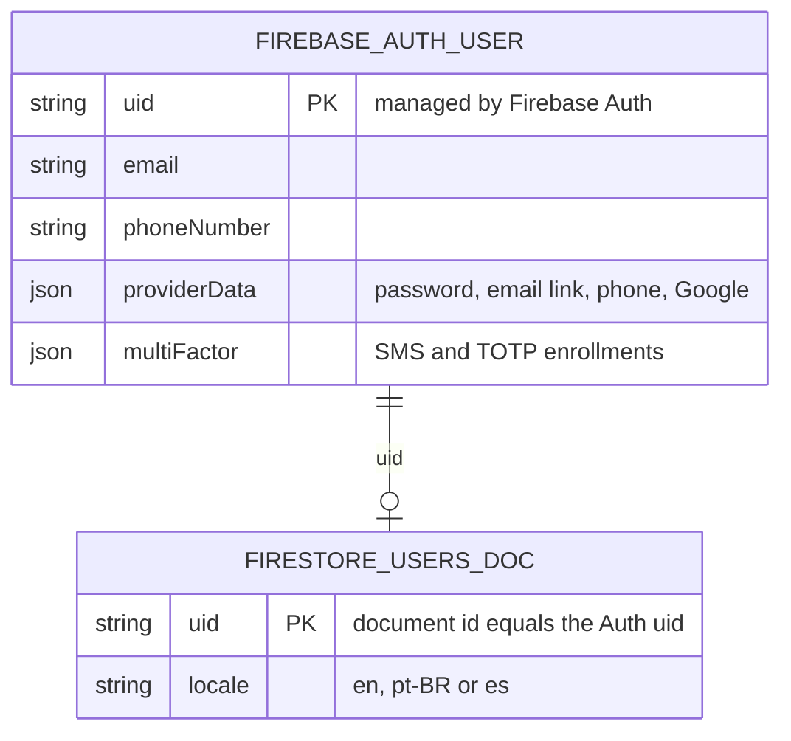

# Data Model

> **Status: the "Implemented data" section is current. Everything under
> "Proposed, not stored" is a planning artifact and is not implemented.**

The application defines no database tables of its own yet. All persisted data is
native to Firebase: the Firebase Auth user record and one Firestore profile
document per user. Auth comes from
[ADR 0005](./docs/adr/0005-adopt-firebase-auth-with-local-emulator.md); the
Firestore client, persistent cache, emulator and deny-by-default rules come from
[ADR 0008](./docs/adr/0008-adopt-native-firebase-firestore-with-persistent-local-cache.md).

## Implemented data (Firebase-native)

- `FIREBASE_AUTH_USER` is owned and stored by Firebase Auth. The application
  reads it through the Firebase SDKs and does not define its schema.
- `users/{uid}` is written by the server (Admin SDK) when a signed-in user picks
  a language explicitly (`src/lib/i18n/profile-preference.ts`). The owner may
  read it; every client write is denied.
- Every other Firestore path is denied by `firestore.rules`.

## Proposed, not stored

Nothing in this section is persisted. The earlier entity diagram remains
available in the git history of this file.

Assessment MVP candidates:

- Exam: title, provider, code, passing score percentage, time limit.
- Question: belongs to an Exam; type, prompt, answer definition, explanation,
  order index.
- Attempt: answers a Question; submitted answer, correctness, elapsed time,
  submission timestamp.
- Review: schedules a Question; due date and spaced-repetition state (stability,
  difficulty, reps, lapses).

The product may later include Spaces, Objects, Object Types, Collections, Tags,
Sources, Highlights, Links, Layouts, Templates, Inbox items, and grounded Chat
sessions. Those concepts remain proposals until approved by product specs and
active ADRs.

Before implementing persistence, reconcile this model with:

- [Domain Glossary](./GLOSSARY.md)
- [Architecture](./ARCHITECTURE.md)
- the active product specification;
- [ADR 0008](./docs/adr/0008-adopt-native-firebase-firestore-with-persistent-local-cache.md)
  and its current implementation state.

## Persistence decision boundary

Do not implement collection paths, indexes, Firebase rules, or a generalized
object graph solely because an older version of this document described them.

The persistence design should be chosen when the assessment MVP requirements
are concrete enough to justify it.
