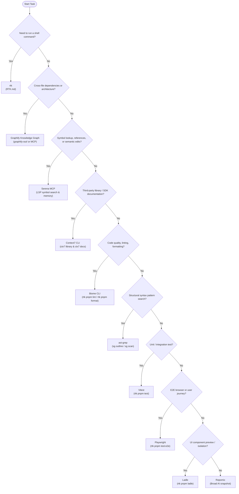

# Project Tooling Reference (`TOOLING.md`)

This document serves as the canonical reference manual and tabulated guide for all development, quality assurance, security, automation, and MCP tools configured within this repository.

---

## 1. Tool Selection Decision Flow

Use the smallest, most specialized tool fitting the task before resorting to generic alternatives.

---

## 2. Repository CLI & Engineering Tools

The following table lists the command-line and developer tooling configured for repository development, static analysis, testing, and documentation retrieval.

| Tool | Category | Purpose | When to Use | Invocation / Command Example | Governing Doc / Rule |
| :--- | :--- | :--- | :--- | :--- | :--- |
| **RTK** (*Rust Token Killer*) | Shell CLI Proxy | Compresses, deduplicates, and optimizes shell command output to conserve LLM context tokens. | **Mandatory** prefix for all shell command execution. Direct execution is strictly forbidden unless RTK is broken or running meta commands. | `rtk pnpm build` `rtk git status` `rtk gain` | [RTK.md](./RTK.md), [.agents/rules/command-invariants.md](./.agents/rules/command-invariants.md) |
| **Graphify** | Architecture & Knowledge Graph | AST-based static code graph generator that detects god nodes, community clusters, and dependency paths. | Querying cross-file architecture, module relationships, circular references, or call graphs when `graphify-out/` exists. | `rtk graphify query "auth flow"` `rtk graphify path "A" "B"` `rtk graphify explain "SyncEngine"` | [.agents/skills/graphify/skill.md](./.agents/skills/graphify/skill.md) |
| **Repomix** | Context Packing | Bundles an entire repository or sub-tree into a clean, structured, AI-friendly markdown/xml file using pre-configured ignore patterns. | Generating broad portable repository snapshots or exporting large context chunks without manual file concatenation. | `rtk repomix` `rtk pnpm dlx repomix` | [repomix.config.json](./repomix.config.json), [.agents/skills/repomix/SKILL.md](./.agents/skills/repomix/SKILL.md) |
| **Context7** (`ctx7`) | Documentation Fetcher | Retrieves up-to-date, versioned API documentation and code examples directly from library documentation repositories. | Before writing code against third-party libraries, SDKs, frameworks (React, Next.js, etc.) or checking API version breaking changes. | `rtk ctx7 library Next.js` `rtk ctx7 docs /vercel/next.js "server actions"` | [.agents/skills/context7-cli/SKILL.md](./.agents/skills/context7-cli/SKILL.md) |
| **Biome** | Linter & Formatter | Rust-based toolchain that provides instant linting, formatting, and import organization. | Enforcing code style, catching syntax errors, auto-sorting imports, and running pre-commit sanity checks. | `rtk pnpm lint` `rtk pnpm format` | [biome.json](./biome.json), [.agents/skills/biome/SKILL.md](./.agents/skills/biome/SKILL.md) |
| **ast-grep** (`sg`) | Structural Search & Rewrite | AST-aware code search and pattern matching engine for structural queries beyond regex text matching. | Searching syntax trees, finding structural patterns, outlining direct members before viewing full files, and multi-file refactors. | `sg outline src/components/NoteEditor.tsx` `sg scan -p '$$$HOOK($$$ARGS)'` | [.agents/skills/ast-grep/SKILL.md](./.agents/skills/ast-grep/SKILL.md) |
| **Semgrep** | Security & Bug Scanner | Static analysis engine utilizing lightweight rules to identify semantic bug patterns and security vulnerabilities. | Auditing security posture, finding credential leaks, checking common framework pitfalls, and enforcing architectural guards. | `semgrep scan --config auto` | [.agents/skills/semgrep/SKILL.md](./.agents/skills/semgrep/SKILL.md), [SECURITY.md](./SECURITY.md) |
| **dependency-cruiser** | Architecture Constraint | Validates module boundaries, detects illegal import paths, and flags circular dependencies in TypeScript files. | Verifying architectural layering (e.g. UI must not import DB drivers directly) and preventing circular modules. | `rtk pnpm run deps:check` | [.dependency-cruiser.cjs](./.dependency-cruiser.cjs), [.agents/skills/dependency-cruiser/SKILL.md](./.agents/skills/dependency-cruiser/SKILL.md) |
| **shadcn CLI** | UI Component Registry | Adds, updates, and configures accessible Base UI / Tailwind component primitives into `src/components/ui`. | Adding reusable UI primitives, theme tokens, and checking component dependencies. | `rtk pnpm dlx shadcn@latest add button` `rtk pnpm dlx shadcn@latest diff` | [components.json](./components.json), [.agents/skills/shadcn/SKILL.md](./.agents/skills/shadcn/SKILL.md) |
| **Vitest** | Unit Test Runner | Fast, Vite-native test runner providing Jest-compatible assertions, mocking, and coverage reports. | Authoring and running unit tests, integration tests, contract verifications, and regression tests. | `rtk pnpm test` `rtk pnpm test:coverage` | [TESTING.md](./TESTING.md), [vitest.config.ts](./vitest.config.ts), [.agents/skills/vitest/SKILL.md](./.agents/skills/vitest/SKILL.md) |
| **Playwright** | E2E Browser Testing | Cross-browser browser automation framework with Next.js webServer lifecycle management. | Testing full end-to-end user journeys, navigation, and Firebase Auth UI flows under `e2e/`. | `rtk pnpm test:e2e` | [TESTING.md](./TESTING.md), [docs/adr/0012-adopt-playwright-for-e2e-testing.md](./docs/adr/0012-adopt-playwright-for-e2e-testing.md) |
| **StrykerJS** | Mutation Testing | Tests test-suite quality by injecting mutations into source code to verify test failure detection. | Verifying that unit tests actually catch intentional bugs in core business and security logic. | `rtk pnpm test:mutation` | [TESTING.md](./TESTING.md), [stryker.config.mjs](./stryker.config.mjs) |
| **Ladle** | UI Sandbox & Stories | Vite-powered isolated component development environment alternative to Storybook. | Developing UI components in visual isolation, verifying responsiveness, dark/light theme tokens, and accessibility. | `rtk pnpm ladle` `rtk pnpm ladle:build` | [DESIGN.md](./DESIGN.md), [.agents/skills/ladle/SKILL.md](./.agents/skills/ladle/SKILL.md) |
| **Lighthouse CI** (`lhci`) | Performance & A11y Audit | Automated production browser auditing for Core Web Vitals, accessibility, SEO, and best practices. | Auditing UI changes for accessibility compliance ($\ge 0.90$) and performance regressions. | `rtk pnpm lighthouse` | [CONSTRAINTS.md](./CONSTRAINTS.md), [lighthouserc.cjs](./lighthouserc.cjs) |
| **TypeScript Compiler** (`tsc`) | Type Checker | Verifies static types across the whole codebase with zero emit. | Catching type discrepancies, invalid interfaces, and broken contract signatures. | `rtk pnpm run check:types` | [CONSTRAINTS.md](./CONSTRAINTS.md), [tsconfig.json](./tsconfig.json) |
| **jscpd** | Duplication Detector | Copy/paste detector analyzing syntax tokens across source files. | Enforcing DRY code constraints (max $10\%$ duplication threshold). | `rtk pnpm run check:duplication` | [CONSTRAINTS.md](./CONSTRAINTS.md), [.jscpd.json](./.jscpd.json) |
| **Knip** | Dead Code & Dependency Finder | Finds unused files, dependencies, exports, types, and duplicate packages. | Pruning dead code, cleaning up `package.json`, and keeping imports minimal. | `rtk pnpm knip` | [knip.json](./knip.json) |
| **OSV-Scanner** | Vulnerability Scanner | Open Source Vulnerability scanner checking dependencies against Google's OSV database. | Scanning lockfiles and project dependencies for published CVEs. | `rtk pnpm run check:osv` | [CONSTRAINTS.md](./CONSTRAINTS.md), [osv-scanner.toml](./osv-scanner.toml) |
| **actionlint** | Workflow Linter | Static checker for GitHub Actions workflow files. | Validating `.github/workflows/*.yml` syntax, expressions, and runner types. | `rtk pnpm run lint:actions` | [.github/actionlint.yaml](./.github/actionlint.yaml) |
| **Firebase CLI & Emulators** | Auth & Backend Emulation | Local offline emulator suite running Firebase Auth and state seeds. | Running local development or integration tests against reproducible auth state without cloud costs. | `rtk pnpm emulator` `rtk pnpm emulator:start` | [docs/adr/0009-adopt-firebase-auth-with-local-emulator.md](./docs/adr/0009-adopt-firebase-auth-with-local-emulator.md) |
| **agents CLI** (`@agents-dev/cli`) | Agent Multi-Config | Synchronizes and manages MCP servers, agent configurations, skills, and integrations across AI tools. | Configuring `.agents/agents.json`, linking new MCP plugins, or verifying multi-agent configuration consistency. | `rtk agents status` `rtk agents mcp list` | [.agents/agents.json](./.agents/agents.json), [.agents/skills/agents-dev-cli/SKILL.md](./.agents/skills/agents-dev-cli/SKILL.md) |

---

## 3. Repository Script Architecture

The stable interface is the command surface in `package.json`; implementation files are grouped by responsibility under `scripts/`:

| Directory | Responsibility | Entry points |
| :--- | :--- | :--- |
| `scripts/guards/` | Deterministic policy and architecture checks that fail on contract violations. | `scripts/guards/floor-guard.mjs`, `scripts/guards/guard-component-naming.mjs`, `scripts/guards/guard-component-props.mjs`, `scripts/guards/guard-rsc-boundaries.mjs` |
| `scripts/hooks/` | Agent/editor hook adapters and shared hook parsing/path logic. | `scripts/hooks/hook-biome-on-edit.mjs`, `scripts/hooks/hook-guard-paths.mjs` |
| `scripts/verify/` | Repository-wide verification and health orchestration. | `scripts/verify/verify-ai-tooling.mjs`, `scripts/verify/verify-control-docs.mjs`, `scripts/verify/verify-docs.mjs`, `scripts/verify/verify-health.mjs` |
| `scripts/tooling/` | Small adapters around external development CLIs. | `scripts/tooling/run-agents-cli.mjs` |

Tests and helper modules stay beside the entry point they validate. Scripts must remain deterministic, non-interactive in CI, repository-relative, and free of product-domain behavior. Add a new public command to `package.json` instead of asking contributors to memorize internal script paths.

The agent hook bridge under `.agents/scripts/` remains intentionally tiny and delegates to `scripts/hooks/`.

## 4. Tooling Automation Boundaries

### GitHub Actions setup

`.github/actions/setup-project/action.yml` is the repository-local composite action for the repeated Node.js/pnpm/dependency setup shared by CI workflows. It consumes `packageManager`, `.node-version`, and `pnpm-lock.yaml` rather than duplicating versions in every workflow.

Third-party actions remain pinned to full commit SHAs. Workflow-level permissions stay read-only by default and are elevated only by the job that needs them.

### agents CLI

`.agents/agents.json` is the canonical source. The repository uses `syncMode: "source-only"`, so tool-specific materializations are generated locally and are not canonical Git sources.

- `rtk pnpm run .agents:sync` materializes local outputs.
- `rtk pnpm run check:agents` materializes, then verifies that a second sync is clean.
- Generated files such as `.agents/generated/*`, `.mcp.json`, and `CLAUDE.md` remain gitignored.

### Graphify hooks

Graphify's Git hooks are installed **per clone** with `rtk graphify hook install`. The generated hook records the interpreter available on that machine, so `.husky/post-commit` and `.husky/post-checkout` are intentionally gitignored and must not be committed.

The repository stores Graphify policy and skill configuration, not machine-generated hook bodies.

## 5. Model Context Protocol (MCP) Specialized Servers

This workspace integrates several MCP servers providing specialized capabilities without terminal overhead:

### Serena MCP (`mcp-server-serena`)
Provides semantic language-server analysis, persistent project memories, and precise code intelligence:
- **`get_symbols_overview`**: Outlines top-level classes, functions, and interfaces in a file.
- **`find_symbol`**: Locates declarations of specific functions, classes, or types across the codebase.
- **`find_referencing_symbols`**: Traces all call sites and references to a symbol before refactoring.
- **`find_implementations`**: Finds concrete implementations of TypeScript interfaces.
- **`get_diagnostics_for_file`**: Reads LSP compiler errors and warnings directly.
- **`read_memory` / `write_memory`**: Stores and retrieves persistent project domain insights.

### Graphify MCP (`graphify`)
Provides real-time knowledge graph queries over the project's dependency graph:
- **`query_graph`**: Subgraph search answering architectural queries.
- **`shortest_path`**: Computes dependency path between two components or files.
- **`god_nodes`**: Identifies highly coupled modules requiring architectural isolation.
- **`get_neighbors`**: Surfaces direct dependencies and reverse dependencies for a module.

### Shoogle MCP (`shoogle`)
Discovers third-party shadcn community components and registry items:
- **`search_registry_items`**: Searches community registries for shadcn component names and descriptions.
- **`search_registry_items_scoped`**: Scoped queries targeting specific registry namespaces.

### Git MCP (`git`) & Filesystem MCP (`filesystem`)
Exposes safe, structured Git and filesystem capabilities:
- **Git operations**: `git_status`, `git_diff`, `git_commit`, `git_add`, `git_log`, `git_branch`, `git_checkout`.
- **Filesystem operations**: `read_file`, `write_file`, `edit_file`, `list_directory`, `search_files`, `get_file_info`.

### Fetch MCP (`fetch`)
Provides clean HTTP page content retrieval for external documentation and public specs:
- **`fetch`**: Retrieves web content and converts HTML structures to readable text for agent reasoning.

---

## 6. Tool Invariants & Anti-Bypass Policy

1. **No Bare Shell Commands**:
   Direct commands like `pnpm test` or `git status` MUST NOT be run without `rtk`.
2. **Path Portability**:
   No tool invocation, script, or documentation may persist absolute machine paths (e.g. `C:\Users\...` or `/home/...`). Only workspace-relative paths are permitted.
3. **No Blind Code Writing Against Libraries**:
   External API usage must be verified with Context7 (`ctx7 docs`) prior to writing code.
4. **No Quality Gate Suppression**:
   Tools must not be bypassed with `--no-verify`, disabling Biome rules, or suppressing tests merely to make a build pass.
