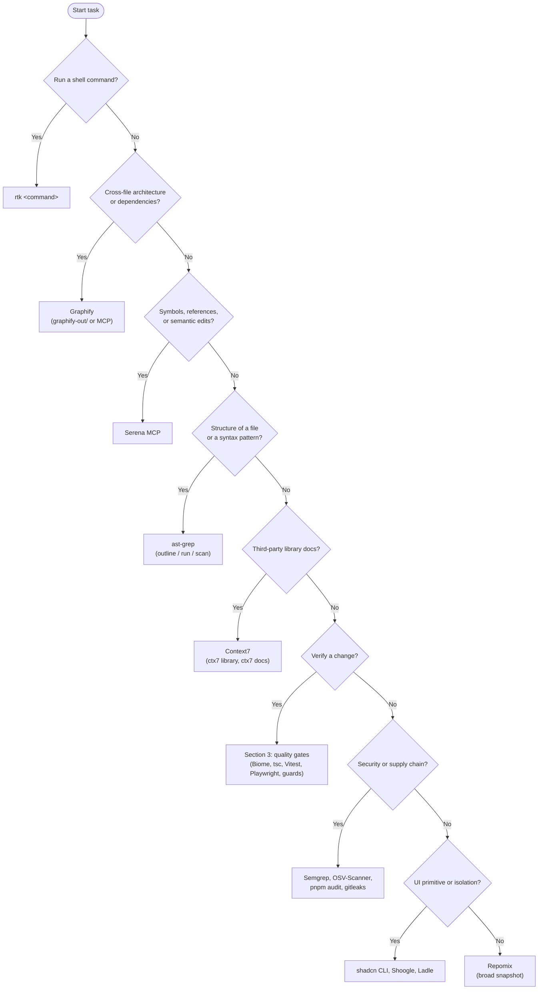

# Tooling Reference

This file owns **what tools exist and how to reach them**: the inventory of CLIs,
scripts, guards, hooks, workflows, and MCP servers. Thresholds belong to
`CONSTRAINTS.md`, test strategy to `TESTING.md`, security policy to `SECURITY.md`,
and agent routing and anti-bypass invariants to `AGENTS.md`.

> [!IMPORTANT]
> Every shell command in this file is shown with the mandatory `rtk` prefix. See
> [RTK.md](./RTK.md) and [.agents/rules/command-invariants.md](./.agents/rules/command-invariants.md)
> for the rule and its narrow exceptions.

**Contents**

1. [Tool selection flow](#1-tool-selection-flow)
2. [Tool catalog](#2-tool-catalog)
3. [Command surface and quality gates](#3-command-surface-and-quality-gates)
4. [Hooks and CI workflows](#4-hooks-and-ci-workflows)
5. [Script architecture](#5-script-architecture)
6. [Automation boundaries](#6-automation-boundaries)
7. [MCP servers](#7-mcp-servers)
8. [Invariants](#8-invariants)

---

## 1. Tool selection flow

Use the smallest specialized tool that fits the task before reaching for a generic one.

---

## 2. Tool catalog

Versions are owned by `package.json`. Tools without a package entry are run through
`pnpm dlx`, `uvx`, or a system binary.

### Agent and context tooling

| Tool | Use it to | Command | Config and owner |
| :--- | :--- | :--- | :--- |
| **RTK** | Compress shell output to save LLM context. Prefix for every command. | `rtk pnpm build` `rtk gain` | [RTK.md](./RTK.md) |
| **Graphify** | Query the code knowledge graph: god nodes, communities, dependency paths. | `rtk graphify query "auth flow"` `rtk graphify path "A" "B"` `rtk graphify explain "SyncEngine"` | [.agents/skills/graphify/skill.md](./.agents/skills/graphify/skill.md), [.agents/rules/graphify.md](./.agents/rules/graphify.md) |
| **Context7** (`ctx7`) | Fetch current, versioned library documentation before writing code against it. | `rtk ctx7 library Next.js` `rtk ctx7 docs /vercel/next.js "server actions"` | [.agents/skills/context7-cli/SKILL.md](./.agents/skills/context7-cli/SKILL.md) |
| **Repomix** | Pack the repository into one AI-friendly snapshot. Never concatenate files by hand. | `rtk pnpm dlx repomix` | [repomix.config.json](./repomix.config.json), [.agents/skills/repomix/SKILL.md](./.agents/skills/repomix/SKILL.md) |
| **ast-grep** | Outline a file's structure, search or rewrite by syntax tree. | `rtk ast-grep outline src/components` `rtk ast-grep run -p '$HOOK($$$ARGS)' src` | [.agents/skills/ast-grep/SKILL.md](./.agents/skills/ast-grep/SKILL.md), [.agents/skills/ast-grep-outline/SKILL.md](./.agents/skills/ast-grep-outline/SKILL.md) |
| **agents CLI** (`@agents-dev/cli`) | Sync MCP servers, skills, and integrations across AI tools from one source. | `rtk agents status` `rtk agents mcp list` | [.agents/agents.json](./.agents/agents.json), [.agents/README.md](./.agents/README.md) |
| **Subagents** | Delegate scoped work (research, review, tests, security, a11y, Firebase). | n/a (orchestrator-dispatched) | [.agents/agents/README.md](./.agents/agents/README.md), [.agents/rules/orchestration.md](./.agents/rules/orchestration.md) |
| **Agent evals** | Compare agent behavior across providers with deterministic scenarios. | `rtk pnpm eval:codex` `rtk pnpm eval:antigravity` `rtk pnpm eval:compare` | [.agents/evals/README.md](./.agents/evals/README.md), [.agents/skills/eval-harness/SKILL.md](./.agents/skills/eval-harness/SKILL.md) |

### Code quality and static analysis

| Tool | Use it to | Command | Config and owner |
| :--- | :--- | :--- | :--- |
| **Biome** | Lint, format, and organize imports. | `rtk pnpm lint` `rtk pnpm format` `rtk pnpm check:lint` | [biome.json](./biome.json), [.agents/skills/biome/SKILL.md](./.agents/skills/biome/SKILL.md) |
| **TypeScript** (`tsc`) | Type-check the whole codebase with zero emit. | `rtk pnpm check:types` | [tsconfig.json](./tsconfig.json) |
| **dependency-cruiser** | Enforce module boundaries and forbid circular imports. | `rtk pnpm deps:check` | [.dependency-cruiser.cjs](./.dependency-cruiser.cjs), [.agents/skills/dependency-cruiser/SKILL.md](./.agents/skills/dependency-cruiser/SKILL.md) |
| **jscpd** | Detect copy-pasted code. | `rtk pnpm check:duplication` | [.jscpd.json](./.jscpd.json) |
| **Knip** | Find unused files, exports, and dependencies. | `rtk pnpm knip` | [knip.json](./knip.json) |
| **Project guards** | Enforce repository-specific policy (see [section 5](#5-script-architecture)). | `rtk pnpm check:floor` `rtk pnpm check:rsc` `rtk pnpm check:props` `rtk pnpm check:naming` `rtk pnpm check:conventions` `rtk pnpm check:emojis` `rtk pnpm check:i18n` | [CONSTRAINTS.md](./CONSTRAINTS.md), [CONVENTIONS.md](./CONVENTIONS.md) |
| **Docs verifiers** | Check control docs, links, paths, and routing for drift. | `rtk pnpm verify:docs` `rtk pnpm check:docs` | [.agents/skills/verify-docs/SKILL.md](./.agents/skills/verify-docs/SKILL.md) |
| **Health check** | Run the consolidated quality, test, context, and RTK savings check. | `rtk pnpm verify:health` | [.agents/skills/verify-health/SKILL.md](./.agents/skills/verify-health/SKILL.md) |

### Testing and UI

| Tool | Use it to | Command | Config and owner |
| :--- | :--- | :--- | :--- |
| **Vitest** | Run unit, component, and contract tests with coverage. | `rtk pnpm test` `rtk pnpm test:watch` `rtk pnpm test:coverage` | [vitest.config.ts](./vitest.config.ts), [TESTING.md](./TESTING.md) |
| **Playwright** | Run browser end-to-end journeys under `e2e/`. | `rtk pnpm test:e2e` | [playwright.config.ts](./playwright.config.ts), [docs/adr/0012-adopt-playwright-for-e2e-testing.md](./docs/adr/0012-adopt-playwright-for-e2e-testing.md) |
| **StrykerJS** | Mutation-test core logic to prove tests catch bugs. | `rtk pnpm test:mutation` | [stryker.config.mjs](./stryker.config.mjs) |
| **Ladle** | Develop and preview components in isolation. | `rtk pnpm ladle` `rtk pnpm ladle:build` `rtk pnpm ladle:preview` | [.ladle/config.mjs](./.ladle/config.mjs), [.agents/skills/ladle/SKILL.md](./.agents/skills/ladle/SKILL.md) |
| **Lighthouse CI** (`lhci`) | Audit a production build for accessibility, performance, SEO. | `rtk pnpm lighthouse` | [lighthouserc.cjs](./lighthouserc.cjs), [CONSTRAINTS.md](./CONSTRAINTS.md) |
| **shadcn CLI** | Add and diff UI primitives in `src/components/ui`. | `rtk pnpm dlx shadcn@latest add button` `rtk pnpm dlx shadcn@latest diff` | [components.json](./components.json), [.agents/skills/shadcn/SKILL.md](./.agents/skills/shadcn/SKILL.md) |

### Security and supply chain

| Tool | Use it to | Command | Config and owner |
| :--- | :--- | :--- | :--- |
| **Semgrep** | Scan for bug and security patterns, or author custom rules. Run on demand; no package script or workflow wires it. | `rtk semgrep scan --config auto` | [.agents/skills/semgrep/SKILL.md](./.agents/skills/semgrep/SKILL.md), [SECURITY.md](./SECURITY.md) |
| **pnpm audit** | Check dependencies against package-manager advisories. | `rtk pnpm check:security` | [CONSTRAINTS.md](./CONSTRAINTS.md) |
| **OSV-Scanner** | Check lockfiles against the OSV database. | `rtk pnpm check:osv` | [osv-scanner.toml](./osv-scanner.toml) |
| **gitleaks** | Block committed secrets. Runs in CI and through `pre-commit`. | n/a | [.pre-commit-config.yaml](./.pre-commit-config.yaml), [.github/workflows/security.yml](./.github/workflows/security.yml) |
| **zizmor** | Audit GitHub Actions workflows for security issues. | n/a (CI only) | [.github/workflows/security.yml](./.github/workflows/security.yml) |
| **CodeQL** | Run semantic code scanning in CI. | n/a (CI only) | [.github/codeql/codeql-config.yml](./.github/codeql/codeql-config.yml) |
| **actionlint** | Validate workflow syntax and expressions. | `rtk pnpm lint:actions` | [.github/actionlint.yaml](./.github/actionlint.yaml) |

### Platform

| Tool | Use it to | Command | Config and owner |
| :--- | :--- | :--- | :--- |
| **Next.js and Turbopack** | Serve, build, and run the App Router app. | `rtk pnpm dev` `rtk pnpm build` `rtk pnpm start` | [next.config.ts](./next.config.ts), [ARCHITECTURE.md](./ARCHITECTURE.md) |
| **Firebase CLI and emulators** | Run Auth and Firestore locally with seeded state. | `rtk pnpm emulator` `rtk pnpm emulator:start` `rtk pnpm test:firebase-emulator` | [firebase.json](./firebase.json), [docs/adr/0009-adopt-firebase-auth-with-local-emulator.md](./docs/adr/0009-adopt-firebase-auth-with-local-emulator.md) |

---

## 3. Command surface and quality gates

`package.json` is the stable command surface. Contributors run `pnpm` scripts, never
internal script paths. Numeric thresholds and what blocks a change are owned by
[CONSTRAINTS.md](./CONSTRAINTS.md).

| Aggregate | Runs | Wired to |
| :--- | :--- | :--- |
| `check:push` | types, Biome on committed changes since `origin/main`, project guards, dependency-cruiser, floor guard, Vitest affected tests | `pre-push` hook |
| `check:fast` | full types, full Biome CI, RSC, naming, conventions, props, emojis, i18n, dependency-cruiser, floor guard, full Vitest, jscpd | task-end / handoff |
| `check:ci` | `check:fast`, docs verifier, harness tests, guard tests, Firebase emulator tests, coverage, agents sync check, production build | `Quality` workflow |
| `harness:health` | `check:ci`, Knip, mutation tests, dependency audit | `Harness Health` workflow |
| `verify:health` | consolidated health report | on demand |

> [!TIP]
> Biome remains the single formatter/linter. Use the smallest relevant subset while
> iterating, let `pre-commit` validate only staged files, use `check:push` before
> push, and reserve `check:fast` for task-end or handoff verification.

---

## 4. Hooks and CI workflows

### Git hooks (Husky)

| Hook | Runs | Purpose |
| :--- | :--- | :--- |
| `pre-commit` | `lint-staged`: Biome check/write, then conventions guard on the same staged files | Keep the commit path incremental and auto-fixable |
| `commit-msg` | `commitlint` | Enforce Conventional Commits |
| `pre-push` | `check:push` | Check committed changes plus affected tests before code leaves the machine |

`post-commit` and `post-checkout` hooks are generated per clone by Graphify (see
[section 6](#6-automation-boundaries)) and are gitignored.

### Agent and editor hooks

Canonical hook wiring lives in [.agents/hooks.json](./.agents/hooks.json). Tool-specific
Claude settings are materialized locally by the agents CLI and are not committed. Claude-only
delegation hooks still use the same repository adapters:

| Event | Adapter | Purpose |
| :--- | :--- | :--- |
| `PreToolUse` on file writes | `scripts/hooks/hook-guard-paths.mjs` | Block edits to generated or controlled paths |
| `PostToolUse` on file writes | `scripts/hooks/hook-biome-on-edit.mjs` | Auto-format and check the edited file with Biome and `guard-conventions` |
| `PreToolUse` on `Agent`/`Task` (Claude Code only) | `scripts/hooks/hook-guard-agent-delegation.mjs` | Block native subagents; only the `codex:codex-rescue` agent is allowed, so delegation goes through the Codex plugin |
| `PreToolUse` on `Bash` (Claude Code only; the script itself selects `git` and `rtk git` segments, so `rtk git ...` and chained commands are covered) | `scripts/hooks/hook-guard-bash.mjs` | Deny git commands that skip the gates: `--no-verify`, `--no-gpg-sign`, and `--force` without `--force-with-lease` |

PreToolUse adapters answer with exit 0 and the documented `hookSpecificOutput.permissionDecision`
JSON, and every hook sets a `timeout` so a hang cannot stall the agent. Deny/ask events are appended
to a gitignored JSONL hook log under the agent logs directory so rule frequency can be reviewed locally.

### GitHub Actions

| Workflow | Runs |
| :--- | :--- |
| [Quality](./.github/workflows/quality.yml) | `pnpm check:ci` |
| [Harness Health](./.github/workflows/harness-health.yml) | `pnpm harness:health` |
| [Security Guardrails](./.github/workflows/security.yml) | gitleaks and zizmor |
| [OSV-Scanner](./.github/workflows/osv-scanner.yml) | Full and PR-differential vulnerability scans |
| [CodeQL](./.github/workflows/codeql.yml) | Semantic code scanning |

[.github/actions/setup-project/action.yml](./.github/actions/setup-project/action.yml) is the
shared composite action for Node.js, pnpm, and dependency setup. It reads `packageManager`,
`.node-version`, and `pnpm-lock.yaml` instead of duplicating versions. Third-party actions are
pinned to full commit SHAs, and workflow permissions stay read-only unless a job needs more.

---

## 5. Script architecture

Implementation files under `scripts/` are grouped by responsibility. Each script is a thin
entry (`<name>.mjs`), pure logic in `<name>-lib.mjs`, and `node:test` tests in
`<name>.test.mjs`, all kept side by side. Name by function, never by the tool that consumes it.

| Directory | Responsibility | Entry points |
| :--- | :--- | :--- |
| `scripts/guards/` | Deterministic policy and architecture checks that fail on violations. | `scripts/guards/floor-guard.mjs`, `scripts/guards/guard-component-naming.mjs`, `scripts/guards/guard-component-props.mjs`, `scripts/guards/guard-conventions.mjs`, `scripts/guards/guard-i18n-strings.mjs`, `scripts/guards/guard-no-emojis.mjs`, `scripts/guards/guard-rsc-boundaries.mjs` |
| `scripts/hooks/` | Agent and editor hook adapters plus shared payload and path logic. | `scripts/hooks/hook-biome-on-edit.mjs`, `scripts/hooks/hook-guard-agent-delegation.mjs`, `scripts/hooks/hook-guard-bash.mjs`, `scripts/hooks/hook-guard-paths.mjs` |
| `scripts/verify/` | Repository-wide verification and health orchestration. | `scripts/verify/verify-ai-tooling.mjs`, `scripts/verify/verify-control-docs.mjs`, `scripts/verify/verify-docs.mjs`, `scripts/verify/verify-health.mjs` |
| `scripts/tooling/` | Adapters around external development CLIs. | `scripts/tooling/run-agents-cli.mjs` |

- Tests are wired into `test:guards` in `package.json`, which `check:ci` runs.
- Scripts stay deterministic, non-interactive in CI, repository-relative, and free of product-domain behavior.
- Root-level `scripts/floor-guard.mjs` and `scripts/verify-health.mjs` are compatibility wrappers for
  installed third-party skills. Do not add new ones ([scripts/README.md](./scripts/README.md)).
- `.agents/scripts/` holds tiny bridges for integrations that expect scripts inside `.agents/`. They delegate to `scripts/hooks/`.
- Add a new public command to `package.json` instead of asking contributors to memorize script paths.

---

## 6. Automation boundaries

### agents CLI

[.agents/agents.json](./.agents/agents.json) is the canonical source and uses `syncMode: "source-only"`,
so tool-specific materializations are generated locally and are not canonical Git sources.

- `rtk pnpm .agents:sync` materializes local outputs.
- `rtk pnpm check:agents` materializes, then verifies a second sync is clean.
- Generated files (`.agents/generated/*`, `.mcp.json`, `CLAUDE.md`) stay gitignored.

### Graphify hooks

Graphify's Git hooks are installed **per clone** with `rtk graphify hook install`. The generated
post-commit and post-checkout bodies under `.husky/` record the interpreter available on that
machine, so they are gitignored and must not be committed. The repository stores Graphify policy
and skill configuration, not machine-generated hook bodies.

---

## 7. MCP servers

Servers are declared once in [.agents/agents.json](./.agents/agents.json) and materialized per tool.
Prefer a configured MCP over a shell equivalent; bypassing requires stating the reason
([.agents/rules/command-invariants.md](./.agents/rules/command-invariants.md)).

| Server | Transport | Use it for | Key tools |
| :--- | :--- | :--- | :--- |
| **Serena** | stdio (`uvx`, pinned commit) | Semantic code analysis, symbol-level edits, project memory | `get_symbols_overview`, `find_symbol`, `find_referencing_symbols`, `find_implementations`, `get_diagnostics_for_file`, `search_for_pattern`, `read_memory`, `write_memory` |
| **Graphify** | stdio (`python -m graphify.serve`) | Architecture and dependency queries over `graphify-out/graph.json` | `query_graph`, `shortest_path`, `get_neighbors`, `get_node`, `get_community`, `god_nodes`, `graph_stats` |
| **Shoogle** | http | Search community shadcn registries | `search_registry_items`, `search_registry_items_scoped` |
| **Git** | stdio (`uvx`) | Structured repository status, diff, history, commits | `git_status`, `git_diff`, `git_log`, `git_add`, `git_commit`, `git_branch`, `git_checkout` |
| **Filesystem** | stdio (`npx`) | Safe project file reads and writes | `read_text_file`, `read_multiple_files`, `write_file`, `edit_file`, `list_directory`, `search_files` |
| **Fetch** | stdio (`uvx`) | Retrieve public web pages as readable text | `fetch` |
| **GitHub** | stdio (`uvx`) | Pull requests, issues, and repository management | declared in `agents.json`; the issue tracker flow is in `docs/agents/issue-tracker.md` |

Use `rtk agents mcp test --runtime` to validate configured servers and the
`mcp-troubleshooting` skill when one fails to connect.

---

## 8. Invariants

The rules below are owned elsewhere. This file only routes to them.

| Rule | Owner |
| :--- | :--- |
| Prefix every shell command with `rtk` | [RTK.md](./RTK.md), [.agents/rules/command-invariants.md](./.agents/rules/command-invariants.md) |
| Verify third-party APIs with Context7 before writing code | [.agents/skills/context7-cli/SKILL.md](./.agents/skills/context7-cli/SKILL.md) |
| Use repository-relative paths only | [.agents/rules/path-portability.md](./.agents/rules/path-portability.md) |
| Never suppress a quality gate to obtain a pass | [CONSTRAINTS.md](./CONSTRAINTS.md), [AGENTS.md](./AGENTS.md) |
