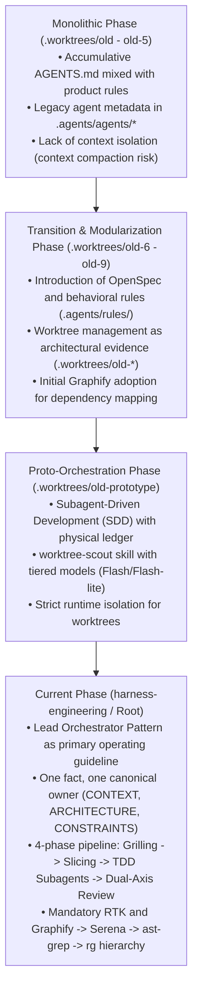

# Executive Summary: Orchestration and Subagent Patterns Evolution across Worktrees

## 1. Historical Architecture Overview

Cross-branch and worktree analysis across repository history reveals a clear progression toward context decoupling, subagent isolation, and knowledge graph adoption:

---

## 2. Extracted Orchestration Invariants

### A. Worktree Isolation (Worktree Scout Pattern)
- **Location:** `.worktrees/old-prototype/.agents/skills/worktree-scout/SKILL.md`
- **Invariant:** Code under `.worktrees/` must never be imported at runtime; it acts strictly as reference models, evidence, and prior-art specification.
- **1:1 Delegation:** The central orchestrator never reads worktree files sequentially. It dispatches a lightweight subagent (`flash_lite` / `flash`) scoped to each branch or specific subsystem, keeping the root conversation context clean.

### B. Subagent-Driven Development (SDD) Cycle
- **Location:** `.agents/skills/subagent-driven-development/SKILL.md`
- **Physical Ledger vs. Ephemeral Memory:** In-flight chat context does not survive context compaction. Progress, rulings, and task states are durably persisted to disk files (`.superpowers/sdd/` or `docs/exec-plans/active/`).
- **Dual-Axis Review:** Completed units undergo parallel evaluation by two specialized reviewers:
  1. **Standards Reviewer:** Verifies formatting, Biome linting, typing, and architectural code smells.
  2. **Spec Reviewer:** Validates conformance against user requirements and canonical product invariants (`INTENT.md` and `CONTEXT.md`).
- **Circuit Breaker Loop:** Max 5 corrective cycles per task. If not converging, the lead orchestrator issues a ruling (`Ruling: <decision> — <rationale> — <cost if wrong>`) to unblock the pipeline.

### C. Search Navigation and Memory Hierarchy
- **Graphify (`graphify-out/graph.json`):** First line of discovery for relationships and architectural topology, preventing unguided filesystem grepping.
- **Serena MCP (`.serena/memories/`):** Durable memory tracked in Git for architectural decisions, security boundaries, and multi-tenancy contracts.
