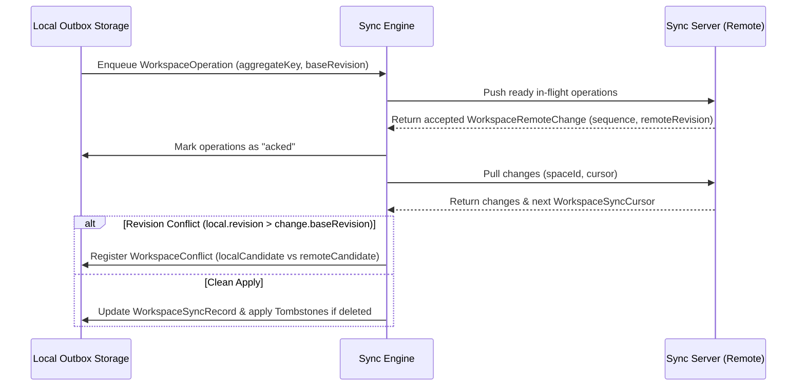

# Historical Reference Synthesis: Entity Evolution, Object Models, SRS Schemas, & Sync Protocols

> **Scope**: Synthesized architectural findings from historical reference worktrees located under `.worktrees/` (`old`, `old-2`, `old-3`, `old-4`, `old-5`). This document serves as the authoritative comparative specification for feature parity, data model evolution, and technical designs.

---

## 1. Bird's Eye View & Worktree Lineage

Across the repository history stored in `.worktrees/`, the application architecture evolved through three major paradigms:

```mermaid
flowchart LR
    subgraph Era1 ["Era 1: Worktrees old, old-2, old-3"]
        E1_Domain["Domain-Specific Study Model"]
        E1_Entities["Hardcoded Entities (StudyGoal, Question, Flashcard)"]
        E1_Activity["Immutable Activity Records (QuestionAttempt, FlashcardReview)"]
    end

    subgraph Era2 ["Era 2: Worktree old-4"]
        E2_Studio["Generic Capacities-Style Object Studio"]
        E2_Structure["WorkspaceStructure & Lifecycle Kinds"]
        E2_Sync["Outbox Operation Engine & Offline Matrix"]
    end

    subgraph Era3 ["Era 3: Worktree old-5"]
        E3_Space["Space-Scoped Multi-Tenant Architecture"]
        E3_FSRS["Modern FSRS & Goal Pacing Math"]
        E3_UI["Capacities Parity & Datatable Views"]
    end

    Era1 --> Era2 --> Era3
```



---

## 2. Entity Evolution

The data model underwent an evolution across the reference worktrees:

### Era 1: Domain-Specific Study Model (`old`, `old-2`, `old-3`)
- **Core Entities**:
  - `StudyGoal`: Target exam date, institution, daily targets (`dailyQuestionTarget`, `dailyReviewTarget`).
  - `StudyTopic`: Syllabus hierarchy with `parentTopic`, `coverageStatus`, and `importance`.
  - `Question`: Practice prompts, options, explanations, review status, and source attributes.
  - `Flashcard`: Spaced repetition item with `front`, `back`, `dueAt`, `intervalDays`, `ease`, and `lapses`.
  - `StudySession`: Aggregate metric records for completed practice blocks.
- **Activity Records**:
  - `QuestionAttempt` & `FlashcardReview`: Designed as immutable write-only internal logs rather than mutable entity properties, ensuring analytics history is never overwritten.

### Era 2: Generic Object Studio & `WorkspaceStructure` Schema (`old-4`)
- **Shift to Object-First**: Every item is represented as a behavior-light record with a stable identity, object type, title, properties, optional body, tags, and typed relations.
- **`WorkspaceStructure` Definition**:
  - `id`: Immutable identifier (e.g., `page`, `table`, `task`, `weblink`, `image`, `pdf`, `audio`, `file`, `tweet`, `ai-chat`, `tag`, `query`).
  - `lifecycleKind`: Enforced structural behavior (`document`, `file`, `query`, `quote`, `table`, `tag`, `task`, `url`).
  - `ownership`: Classification (`built-in`, `custom`, `legacy`, `reserved`).
- **Property System**:
  - Property definitions include ownership (`default`, `normal`, `system`) and value types (`title`, `text`, `number`, `boolean`, `date`, `entity`, `label`, `richText`, `url`, `media`, `createdAt`, `lastUpdatedAt`).
  - Strict default property guarantees (`title`, `aliases`, `description`, `icon`, `cover`, `createdAt`, `lastUpdatedAt`, `tags`).

### Era 3: Space-Scoped Multi-Tenant Architecture (`old-5`)
- **Space Isolation (`SpaceEntityRecord`)**:
  - Every entity record includes a mandatory `spaceId` context for complete workspace data partitioning.
  - Entities support workspace-scoped search, cross-space transfers (`object-transfer.ts`), graph projections (`space-projections.ts`), and space-bound collections (`space-collection-mutations.ts`).

---

## 3. Capacities Parity Object Models

The reference worktrees establish feature and visual parity with the **Capacities** object studio model:

### Standardized Property & Presentation Architecture
- **Presentation Views**: `gallery`, `list`, `table`, `wall`.
- **Property Label Options**: Unique color-coded options for single-select and multi-select tags/labels.
- **Number Presentations**: Supports raw `number`, `percent`, `currency` (ISO code formatted via `Intl.NumberFormat`), and `progress` bars with configurable steps and color tones.

### Capacities-Native Presets (13 Starter Types)
| Preset ID | Singular | Icon | Tone | Lifecycle Kind |
| :--- | :--- | :--- | :--- | :--- |
| `atomic-note` | Atomic note | `atomic-note` | `amber` | `document` |
| `book` | Book | `book` | `purple` | `document` |
| `person` | Person | `person` | `orange` | `document` |
| `area` | Area | `area` | `blue` | `document` |
| `meeting` | Meeting | `meeting` | `red` | `document` |
| `definition` | Definition | `definition` | `purple` | `document` |
| `idea` | Idea | `idea` | `amber` | `document` |
| `place` | Place | `place` | `emerald` | `document` |
| `project` | Project | `project` | `emerald` | `document` |
| `organization` | Organization | `organization` | `red` | `document` |
| `media` | Media | `media` | `cyan` | `document` |
| `travel` | Travel | `travel` | `purple` | `document` |
| `quote` | Quote | `quote` | `rose` | `quote` |

### Built-in Types (12 Core Structures)
- `page`, `table`, `task`, `weblink`, `image`, `pdf`, `audio`, `file`, `tweet`, `ai-chat`, `tag`, `query`, plus `archive` (reserved).

### Visual Contract & Design Tokens
- **Icon Tones**: `amber`, `blue`, `cyan`, `emerald`, `gray`, `green`, `orange`, `purple`, `red`, `rose`, `sky`.
- **UI Surfaces**: Detail view (header banner, icon picker, cover picker, property panel, block editor, backlinks preview panel) and Datatable view (toolbar, faceted filters, slider filters, view switcher).

---

## 4. SRS Burndown Schemas & Mathematical Engine

The Spaced Repetition System in `old-5` (`src/lib/srs/fsrs.ts`, `study-goal-dashboard.ts`) implements the **FSRS (Free Spaced Repetition Scheduler)** algorithm combined with **Goal-Driven Exam Pacing Math**:

### FSRS Memory Model & Data Interface
Each flashcard card state is tracked via `SRSItemState`:

```typescript
export interface SRSItemState {
  state: "new" | "learning" | "review" | "relearning";
  dueDate: string;          // ISO timestamp
  lastReviewedAt?: string;   // ISO timestamp
  interval: number;          // Days until next review
  easeFactor: number;        // Base ease (default 2500)
  repetitionCount: number;   // Successful consecutive reviews
  lapses: number;            // Number of lapses (rating = 1 "Again")
  stability?: number;        // Memory stability (in days)
  difficulty?: number;       // Card difficulty (clamped [1300, 3500])
}
```

### FSRS Retrievability & Scheduling Equations
1. **Retrievability Decay**:
   $$R(t, S) = \left(1 + \frac{19}{81} \cdot \frac{t}{S}\right)^{-0.5}$$
   Where $t$ is elapsed days since last review and $S$ is memory stability.

2. **Next Review Interval**:
   $$I(S, R_{\text{target}}) = \frac{S}{19/81} \cdot \left(R_{\text{target}}^{-1/0.5} - 1\right)$$
   Default target retrievability $R_{\text{target}} = 0.90$.

3. **Rating Multipliers**:
   - `1 (Again)`: Resets state to `relearning`/`learning`, stability multiplied by $0.20$, lapses incremented.
   - `2 (Hard)`: Stability multiplied by $1.20$, ease factor adjusted by $0.98$.
   - `3 (Good)`: Stability multiplied by $1.00$.
   - `4 (Easy)`: Stability multiplied by $1.80$.

### Exam Burndown & Goal Pacing Algorithm
Goal pacing evaluates whether a student is on track to complete all cards before an exam target date:

```typescript
export function estimatePacingStatus(inputs: GoalPacingInputs): PacingResult {
  const totalDays = Math.max(1, Math.floor(inputs.daysRemaining));
  const bufferDays = totalDays < 30 
    ? Math.max(1, Math.floor(totalDays * 0.2)) 
    : Math.min(7, Math.max(1, totalDays));
  
  const availableDays = Math.max(1, totalDays - bufferDays);
  const dailyNewCardQuota = Math.max(
    0,
    Math.ceil(inputs.unlearnedCardCount / Math.max(1, availableDays))
  );

  const elapsedRatio = Math.max(
    0,
    Math.min(1, inputs.daysElapsed / Math.max(1, totalDays + inputs.daysElapsed))
  );
  const expectedCompleted = inputs.totalCards * elapsedRatio;
  const normalizedActual = Math.max(0, inputs.actualCompletedCards);
  
  const status: PacingStatus =
    expectedCompleted === 0 && normalizedActual === 0
      ? "onTrack"
      : normalizedActual >= expectedCompleted * 1.05
        ? "ahead"
        : normalizedActual >= expectedCompleted * 0.95
          ? "onTrack"
          : "behind";

  return { status, expectedCompleted, dailyNewCardQuota, daysRemaining: totalDays, bufferDays };
}
```

---

## 5. Sync Protocol Structures & Offline Replication

Worktree `old-4` (`src/lib/workspace-offline-sync.ts`) defines the offline-first replication engine:



### Core Protocol Data Models

1. **Workspace Operation Outbox (`WorkspaceOperation`)**:
   - `idempotencyKey`: Deterministic operation key (`op:<spaceId>:<aggregateKey>:<baseRevision>:<kind>`).
   - `kind`: `aggregate-upsert` | `aggregate-delete` | `media-upload` | `media-download`.
   - `status`: `pending` | `in-flight` | `acked` | `failed`.
   - Exponential backoff retry math ($\text{delay} = \min(30000, 1000 \cdot 2^{\text{attempts}-1})$ ms).

2. **Sequence-Based Replication (`WorkspaceRemoteChange` & `WorkspaceSyncCursor`)**:
   - Pulled server changes contain sequential change IDs (`sequence`), revision increments (`remoteRevision`), and tombstone flags (`deleted`).

3. **Conflict Resolution (`WorkspaceConflict`)**:
   - Triggered when `local.revision > change.baseRevision`.
   - Stores `localCandidate` and `remoteCandidate` payloads. Supports resolution via `resolveWorkspaceConflict(state, conflictId, "local" | "remote")`.

4. **Tombstone Engine (`WorkspaceTombstone`)**:
   - Prevents resurrecting deleted records during asynchronous pull synchronization by maintaining immutable tombstone records with `deletedAt` timestamps and `remoteRevision` counters.

5. **Media Binary Sync Matrix (`WorkspaceMediaSyncState`)**:
   - Decouples metadata sync from heavy binary asset downloading using status flags (`available-local`, `available-remote`, `queued-download`, `queued-upload`, `syncing`, `unavailable-offline`).

6. **Offline Capability Matrix (`OfflineCapability`)**:
   - Categorizes features into strict capability levels:
     - `available-offline`: Block editor, task editing.
     - `local-data-only`: Object navigation, query index, media metadata.
     - `degraded-offline`: Media bytes, import/export.
     - `online-required`: AI assistant, calendar sync, MCP server, public API, remote enrichment, remote search.

---

## 6. Architecture Mapping & Recommendations

When implementing features in the primary workspace (`src/`):

1. **Entities**: Follow the space-scoped `SpaceEntityRecord` architecture from `old-5` combined with `WorkspaceStructure` validation from `old-4`.
2. **Capacities Parity**: Use `OBJECT_TYPE_PRESETS` and `BUILT_IN_STRUCTURES` from `old-4` to seed workspace schemas.
3. **SRS**: Use `fsrs.ts` and `study-goal-dashboard.ts` from `old-5` for flashcard scheduling and burndown quotas.
4. **Sync**: Implement `workspace-offline-sync.ts` from `old-4` for offline state management and server synchronization.

---

## Related Documents

- [Main Architecture Spec](../ARCHITECTURE.md)
- [Architecture Index](../docs/architecture/README.md)
- [ADR-0006 Architectural Decision Record](../docs/decisions/0006-historical-reference-architecture-synthesis.md)
- [Decision Log](../DECISIONS.md)
