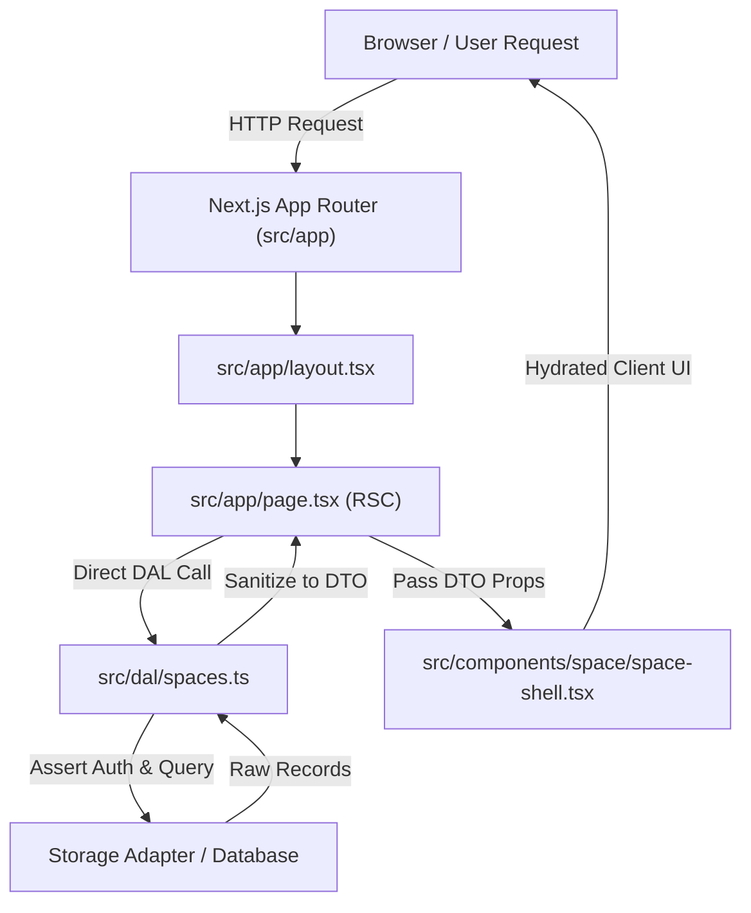
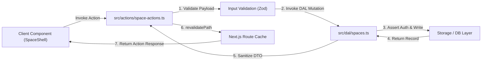

# Architecture Overview (Matklad Pattern)

This document provides a high-level overview of the **Notes App** architecture, directory layout, core abstractions, and engineering invariants. It is written following the **Matklad ARCHITECTURE.md** pattern to help new contributors and automated agents quickly orient themselves within the codebase.

---

## 1. Bird's Eye View

The **Notes App** is a local-first, zero-operating-cost unified study and knowledge management web application. It unifies three core domains:
1. **Object Architecture (Capacities-style)**: Interconnected notes, flexible object types, collections, bidirectional linking, and block transclusions.
2. **Document Ingestion (Readwise-style)**: Highlighting, document parsing, and external reading imports.
3. **Spaced Repetition System (Anki/FSRS-style)**: Flashcards, review queue management, and memory retention algorithms.

The application is built on **Next.js 16 (App Router)**, **React 19**, **TypeScript**, and **shadcn/ui** (styled with Tailwind CSS), optimized for speed, local-first storage (Dexie / IndexedDB), Plate rich-text editing, and secure Data Access Layer (DAL) isolation.

---

## 2. Code Map & Official Folder Structure

The project strictly follows the **official Next.js 16 App Router conventions** with a top-level `src/` directory, combined with the standard **shadcn/ui** component layout, a dedicated Data Access Layer (DAL), and a local-first Dexie database infrastructure. For full details on URL hierarchy, query taxonomy, and route parameters, see the [`URL Architecture & Routing Specification`](routing.md). For details on multi-tenant space management, see the [`Spaces Architecture Specification`](spaces.md). For details on entity polymorphism, see the [`Entities Architecture Specification`](entities.md).

```text
.
├── src/                          # Application source code
│   ├── actions/                  # Next.js Server Actions (mutations & DAL invocations)
│   │   └── space-actions.ts      # Space CRUD & activation actions with boundary validation
│   ├── app/                      # Next.js 16 App Router (root layout, page shell, global styles)
│   │   ├── favicon.ico           # Application favicon
│   │   ├── globals.css           # Tailwind CSS directives, theme tokens, typography scale
│   │   ├── globals-appearance.test.ts # Appearance token test suite
│   │   ├── layout.tsx            # Root Layout with next-intl provider and font configuration
│   │   └── page.tsx              # Main dashboard entrypoint hosting SpaceShell
│   ├── components/               # React UI Components (Server & Client)
│   │   ├── editor/               # Capacities-style rich-text editor built on Plate v53
│   │   │   ├── plugins/          # Custom Plate plugins (code/mermaid, multi-column, highlight, math, object, table)
│   │   │   ├── ui/               # Editor chrome (gutter handle, floating toolbar, suggestion combobox)
│   │   │   ├── editor-capacities.tsx # Main Plate editor integration component
│   │   │   └── editor.stories.tsx # Ladle story workbench for the editor
│   │   ├── ladle/                # Ladle story workbench utilities
│   │   │   ├── doc-viewer.tsx    # Markdown documentation viewer component
│   │   │   └── doc-viewer.test.tsx # Tests for doc-viewer
│   │   ├── objects/              # Capacities-style polymorphic object type system
│   │   │   ├── icons/            # 23+ object icons, icon registry, stories, and tests
│   │   │   └── split-buttons/    # 23+ object split buttons, split button registry, stories, and tests
│   │   ├── space/                # Space management and workspace UI
│   │   │   ├── space-shell.tsx   # Workspace shell (collapsible sidebar, space switcher, active space header)
│   │   │   ├── space-shell.stories.tsx # Ladle stories for SpaceShell
│   │   │   └── space-shell.test.tsx # Unit tests for SpaceShell
│   │   └── ui/                   # Primitive, presentational shadcn/ui components & Ladle stories
│   ├── dal/                      # Server-Only Data Access Layer (security, auth, DTO projections)
│   │   ├── auth.ts               # Session resolution, space access assertions, IDOR defense
│   │   ├── dtos.ts               # DTO sanitization & projection functions (toSpaceDTO, toEntityDTO)
│   │   ├── entities.ts           # Server-side entity queries
│   │   ├── errors.ts             # Domain error classes (NotFoundError, ForbiddenError, ValidationError)
│   │   ├── spaces.ts             # Space CRUD operations and server queries
│   │   ├── storage-adapter.ts    # Storage adapter abstraction for DAL persistence
│   │   └── dal.test.ts           # Colocated DAL unit test suite
│   ├── hooks/                    # Reusable React hooks
│   │   └── use-mobile.ts         # Viewport breakpoint detection hook (< 768px)
│   ├── lib/                      # Core domain models, local database, validations, and pure logic
│   │   ├── db/                   # Local-first IndexedDB database infrastructure (Dexie)
│   │   │   ├── hooks/            # useLiveQuery reactivity hooks
│   │   │   ├── repositories/     # Domain repositories (space, entity, collection, tag, trash, sync)
│   │   │   │   ├── repository-factory.ts # Repository factory and Repositories interface
│   │   │   │   └── repositories.test.ts # Repository test suite
│   │   │   ├── provider.tsx      # DatabaseProvider context for client components
│   │   │   ├── schema.ts         # Dexie schema definitions and table indexes
│   │   │   └── types.ts          # Compatibility facade for legacy database imports
│   │   ├── domain/                # Shared domain contracts and seed data
│   │   │   ├── records.ts         # Shared records used by DAL and local persistence
│   │   │   └── default-spaces.ts  # Shared space identifiers and default records
│   │   ├── editor/               # Pure block editor AST, matrix table model, and triggers
│   │   │   ├── document-schema.ts # Capacities document schema v3 AST & Slate conversion
│   │   │   ├── document-schema.test.ts # Document schema tests
│   │   │   ├── table-model.ts    # Matrix table block model & CSV/Markdown export
│   │   │   ├── table-model.test.ts # Table model tests
│   │   │   ├── trigger-controller.ts # Slash (`/`) and object (`@`, `[[`) trigger parser
│   │   │   └── trigger-controller.test.ts # Trigger controller tests
│   │   ├── validations/          # Payload validation schemas and functions
│   │   │   ├── space.ts          # validateCreateSpaceInput function
│   │   │   └── space.test.ts     # Validation test suite
│   │   ├── i18n-locale.ts        # Locale resolution and next-intl helpers
│   │   ├── i18n-locale.test.ts   # Locale resolution tests
│   │   ├── space-object-types.ts # Central domain types (SpaceIconName, ObjectIconName, ObjectIconTone, SpaceStats)
│   │   └── utils.ts              # Tailwind class merging utility (`cn`)
│   ├── messages/                 # i18n translation catalogs (next-intl)
│   │   ├── en.json               # English translations
│   │   └── pt-BR.json            # Brazilian Portuguese translations
│   └── types/                    # Pure TypeScript declarations (0 bytes runtime JS emitted)
│       ├── dtos.ts               # Pure DTO contracts (UserDTO, SpaceDTO, EntityDTO)
│       ├── raw.d.ts              # Ambient declarations for raw/markdown asset imports
│       ├── space.ts              # Space type facade & CreateSpaceInput
│       └── validation.ts         # Generic ValidationResult<T> interface
│
├── .agents/                      # AI agent instructions, operational rules, and skills
├── .ladle/                       # Ladle component workbench configuration
├── docs/                         # Architecture, decisions (ADRs), design, and guides
│   ├── architecture/             # Architecture specifications (routing, spaces, entities)
│   ├── decisions/                # Architecture Decision Records (ADR 0001-0009)
│   ├── design/                   # Design system documentation
│   ├── guides/                   # Developer workflows and component development guides
│   ├── plans/                    # Project roadmaps and plans
│   ├── reference/                # Conventions and design system reference
│   └── translations/pt-BR/       # Brazilian Portuguese documentation translations
├── graphify-out/                 # Knowledge graph and dependency topology generated by Graphify
├── public/                       # Static public assets (SVG icons, favicons)
└── .worktrees/                   # Historical reference implementations for feature parity
```

---

## 3. Architectural Invariants

Every contributor (and AI assistant) must strictly maintain the following engineering rules:

1. **React Server Components (RSC) by Default**:
   - All components inside `src/app/` are Server Components by default.
   - Add `"use client"` **only at the leaf nodes** of the component tree where browser interactivity (React state, event handlers, client APIs, Dexie reactivity) is required.

2. **Server-Only Data Access Layer (DAL) in `src/dal/`**:
   - All server-side data fetching, session verification, and mutations must go through the Data Access Layer in `src/dal/`.
   - Never expose raw database records directly to the client; all records must be sanitized into minimal DTOs (`toSpaceDTO`, `toEntityDTO`) to prevent IDOR vulnerabilities and credential leaks.
   - Enforce authorization checks (`assertSpaceAccess`) directly within DAL functions.

3. **Primitive Isolation in `src/components/ui/` (shadcn primitives)**:
   - Files within `src/components/ui/` belong exclusively to **shadcn/ui**.
   - **Invariant**: Never embed domain logic, API calls, or app-specific state in `src/components/ui/`. They must remain pure, presentational UI primitives.

4. **Domain Types Centralized in `src/lib/space-object-types.ts`**:
   - All Capacities object types, space definitions, icon names, and tones (`ObjectIconName`, `ObjectIconTone`, `StructureLifecycleKind`, `StructureOwnership`) must be defined in `src/lib/space-object-types.ts`.
   - Never isolate domain types inside UI component folders; UI and non-UI layers (DAL, database repositories, command registries) share this single source of truth.

5. **Colocated Test Files**:
   - Test files must be colocated with the implementation they exercise at the same directory level (e.g. `dal.test.ts` beside `dal.ts`, `table-model.test.ts` beside `table-model.ts`).
   - Do not create nested `__tests__` directories.

6. **Isolated Plate Editor Architecture (`src/components/editor/`)**:
   - The editor integrates Plate v53 (`@platejs/basic-nodes`, Slate AST) with custom domain plugins under `src/components/editor/plugins/`.
   - Pure AST conversions, table matrix math, and trigger controllers live in `src/lib/editor/` completely decoupled from React.

7. **Local-First Database & Repositories (`src/lib/db/`)**:
   - Client persistence is powered by Dexie (IndexedDB) with structured repositories (`src/lib/db/repositories/`) providing reactive `useLiveQuery` subscriptions, cascade deletions, and offline sync queues.
   - Shared persistence contracts live in `src/lib/domain/records.ts`; `src/lib/db/types.ts` remains only as a compatibility facade for older imports.

8. **Ladle Component Workbench & Story Colocation**:
   - Visual components have corresponding Ladle stories (`*.stories.tsx`) verifying states and theme tokens without running the Next.js development server.

---

## 4. Key Data Flows

### A. Data Fetching (RSC Direct Access via DAL)


### B. Data Mutation (Server Actions Flow)


---

## 5. Cross-Cutting Concerns

### Styling & Theming
- Styled using **Tailwind CSS** with **CSS Variables** defined in `src/app/globals.css`.
- Colors and design tokens map directly to shadcn CSS variables (`--background`, `--foreground`, `--primary`, etc.) and the Capacities tone system (`blue`, `emerald`, `amber`, etc.).
- Use the `cn(...)` utility from `src/lib/utils.ts` for conditional class joining.

### Internationalization (i18n)
- Built on **next-intl** with translation message files in `src/messages/en.json` and `src/messages/pt-BR.json`.
- Coordinated via `src/lib/i18n-locale.ts` and wrapped by `NextIntlClientProvider` in `src/app/layout.tsx`.

### Component Workbench & Documentation Viewer
- **Ladle** (`.ladle/`) is configured as the zero-V8-bundle component workbench.
- `src/components/ladle/doc-viewer.tsx` parses and renders architecture specifications, ADRs, and guides directly into visual Ladle stories.

---

## 6. Reference Worktrees & Codebase Topology

- **Historical Codebases & Synthesis**: Inspect `.worktrees/` (`old`, `old-2`, `old-3`, `old-4`, `old-5`) for baseline reference implementations. See [`HISTORICAL_REFERENCE_SYNTHESIS.md`](HISTORICAL_REFERENCE_SYNTHESIS.md), [`spaces.md`](spaces.md), [`entities.md`](entities.md), [`routing.md`](routing.md), and [`ADR-0006`](../decisions/0006-historical-reference-architecture-synthesis.md) for synthesized specs covering entity evolution, Capacities object model parity, FSRS exam burndown math, routing taxonomy, multi-tenant spaces, and sync protocols.
- **Editor Architecture & Component Isolation**: See [`ADR-0008`](../decisions/0008-plate-rich-text-editor-framework-migration.md) and [`ADR-0009`](../decisions/0009-capacities-block-editor-domain-and-plate-v53-plugin-architecture.md) for the Plate rich-text editor migration (`platejs` v53, `@platejs/basic-nodes`, Slate, and custom block plugins), headless static SSR rendering (`EditorStatic`), and visual verification in Ladle (`src/components/editor/editor.stories.tsx`).
- **Dependency Topology**: Refer to `graphify-out/GRAPH_REPORT.md` and `graphify-out/graph.json` for architectural relationship queries.

---

## 7. Project Governance & Decision Framework Matrix

To maintain codebase integrity, developer ergonomics, and agent alignment, governance artifacts are partitioned into four distinct layers:

| Governance Layer | Primary File / Location | Core Purpose | When to Use / Update |
| --- | --- | --- | --- |
| **Agent Directives** | [`AGENTS.md`](../../AGENTS.md) | Entry point for AI coding assistants | Overview of repository rules, sitemap, worktree references, and command triggers. |
| **Operational Rules** | [`.agents/rules/*.md`](../../.agents/rules/) | Single-responsibility, strict coding policies | Granular constraints (*"How to write code/configs"*), e.g. `domain-types-location.md`, `test-file-colocation.md`, `nextjs-server-architecture.md`. |
| **Architectural Decisions** | [`docs/decisions/`](../decisions/README.md) | MADR Decision Log (ADRs) | Documenting **WHY** a technical choice was made, trade-offs, and rejected options. |
| **Security Policies** | [`SECURITY.md`](../../SECURITY.md) | Threat model, trust boundaries, and security rules | Documenting **HOW** credentials, user data, server routes, and cloud permissions are isolated. |
