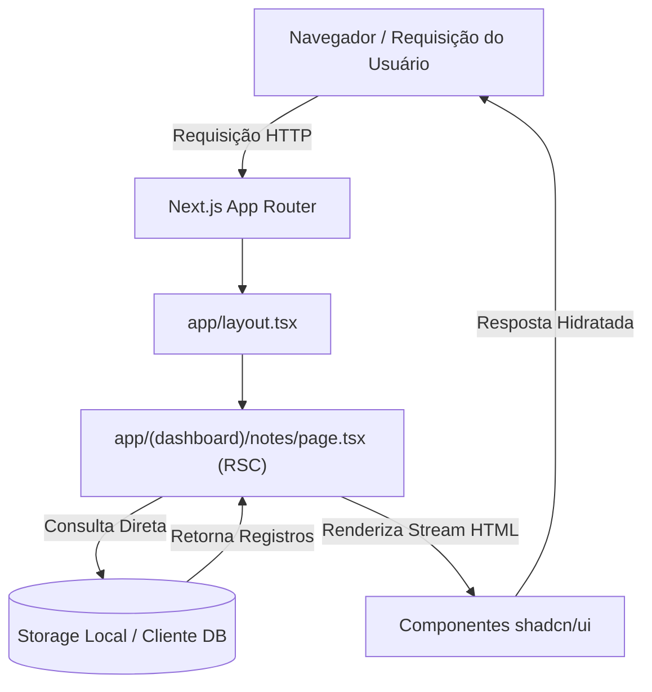
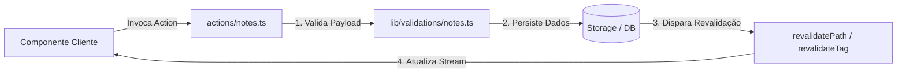

# Visão Geral da Arquitetura (Padrão Matklad)

Este documento oferece uma visão geral de alto nível da arquitetura do **Notes App**, estrutura de diretórios, abstrações principais e invariantes de engenharia. Foi escrito seguindo o padrão **Matklad ARCHITECTURE.md** para ajudar novos colaboradores e agentes automatizados a se orientarem rapidamente na base de código.

---

## 1. Visão Geral (Bird's Eye View)

O **Notes App** é uma aplicação web unificada de estudos e gestão de conhecimento com foco *local-first* e custo operacional zero. Ele unifica três domínios principais:
1. **Arquitetura de Objetos (Estilo Capacities)**: Notas interconectadas, tipos flexíveis de objetos e links bidirecionais.
2. **Ingestão de Documentos (Estilo Readwise)**: Destaques, parsing de documentos e importação de leituras externas.
3. **Sistema de Repetição Espaçada (Estilo Anki/FSRS)**: Flashcards, gestão de fila de revisão e algoritmos de retenção de memória.

A aplicação é construída com **Next.js (App Router)**, **React 19**, **TypeScript** e **shadcn/ui** (estilizado com Tailwind CSS), otimizada para velocidade, armazenamento local e desempenho de componentes no servidor (RSC).

---

## 2. Mapa do Código & Estrutura Oficial de Pastas

O projeto segue estritamente as **convenções oficiais do Next.js App Router** combinadas com a estrutura padrão de diretórios de componentes do **shadcn/ui**.

```text
.
├── app/                      # Next.js App Router (Rotas, Layouts, Páginas, Server Actions)
│   ├── (auth)/               # Grupo de rotas para autenticação (login, cadastro)
│   │   ├── login/
│   │   └── layout.tsx
│   ├── (dashboard)/          # Grupo de rotas para a interface principal da aplicação
│   │   ├── notes/            # Página /notes e rotas dinâmicas de detalhes
│   │   │   ├── [id]/
│   │   │   └── page.tsx
│   │   ├── srs/              # Interface de estudo por repetição espaçada /srs
│   │   ├── layout.tsx        # Shell do dashboard (layout Sidebar + Header)
│   │   └── page.tsx          # Página principal do dashboard
│   ├── api/                  # Route Handlers para endpoints REST externos / webhooks
│   │   └── route.ts
│   ├── globals.css           # Tailwind CSS global e definições de variáveis CSS do shadcn/ui
│   ├── layout.tsx            # Layout Raiz (Provedores de tema, configuração de fontes, metadados)
│   ├── loading.tsx           # UI global de carregamento fallback (React Suspense boundary)
│   ├── error.tsx             # Error Boundary global para erros não tratados em rotas
│   └── not-found.tsx         # Página 404 personalizada
│
├── components/               # Componentes React de UI (Server & Client)
│   ├── ui/                   # Componentes primitivos shadcn/ui sem estilo de domínio (Gerados via CLI)
│   │   ├── button.tsx
│   │   ├── dialog.tsx
│   │   └── input.tsx
│   ├── common/               # Componentes compostos e de layout compartilhado (Navbar, Sidebar, Footer)
│   │   ├── navbar.tsx
│   │   └── sidebar.tsx
│   └── features/             # Componentes de domínio de funcionalidade (Encapsulados por domínio)
│       ├── notes/            # Editor de notas, cards de nota, listas de tags
│       ├── srs/              # Visualizador de flashcards, botões de avaliação, gráficos SRS
│       └── ingestion/        # Importador de documentos, parser de destaques
│
├── lib/                      # Utilitários puros, clientes de banco de dados e motores de lógica de domínio
│   ├── utils.ts              # Utilitário de junção de classes `cn()` (clsx + tailwind-merge)
│   ├── db/                   # Cliente de banco de dados (SQLite/IndexedDB/instância ORM)
│   ├── srs/                  # Algoritmo matemático puro do FSRS e motor de agendamento de cards
│   └── validations/          # Schemas de validação Zod para formulários e server actions
│
├── actions/                  # Next.js Server Actions (Mutações backend & escrita de dados)
│   ├── notes.ts              # Server Actions CRUD para notas e objetos
│   └── srs.ts                # Server Actions para envio de revisões de cards SRS
│
├── hooks/                    # Hooks React reutilizáveis no lado do cliente
│   ├── use-debounce.ts
│   └── use-local-storage.ts
│
├── types/                    # Interfaces globais TypeScript e definições de tipo
│   ├── note.ts               # DTOs de notas/objetos e modelos de banco de dados
│   └── srs.ts                # Tipos de estado do flashcard e FSRS
│
├── public/                   # Arquivos estáticos públicos (imagens, ícones, SVGs)
├── .agents/                  # Configurações de agentes de IA, regras e skills
├── graphify-out/             # Grafo de conhecimento e topologia gerados pelo Graphify
└── .worktrees/               # Implementações de referência históricas para paridade de recursos
```

---

## 3. Invariantes Arquiteturais

Todo colaborador (e assistente de IA) deve manter estritamente as seguintes regras de engenharia:

1. **React Server Components (RSC) por Padrão**:
   - Todos os componentes dentro de `app/` e `components/` são Server Components por padrão.
   - Adicione `"use client"` **apenas nos nós folha** da árvore de componentes onde interatividade de navegador (estado React, manipuladores de evento, APIs de cliente) for necessária.

2. **Isolamento de Primitivos em `components/ui/` (Primitivos shadcn)**:
   - Arquivos dentro de `components/ui/` pertencem exclusivamente ao **shadcn/ui**.
   - **Invariante**: Nunca inclua lógica de domínio, chamadas de API ou estado específico da aplicação em `components/ui/`. Eles devem permanecer primitivos de UI puramente apresentacionais.

3. **Encapsulamento de Domínio em `components/features/`**:
   - A lógica de UI específica de um domínio deve ser organizada sob `components/features/<nome-feature>/`.
   - Nunca vaze componentes de domínio para `components/common/` ou `components/ui/` globais.

4. **Validação Estrita de Fronteiras (Zod)**:
   - Todo payload de entrada que chega via Server Actions ou Route Handlers deve ser validado usando schemas Zod localizados em `lib/validations/`.

5. **Lógica de Negócio Desacoplada em `lib/`**:
   - A lógica computacional central (ex.: algoritmos de repetição espaçada FSRS) deve ser implementada como funções TypeScript puras e agnósticas de framework em `lib/`. Isso permite testes unitários com zero overhead e execução local-first.

---

## 4. Fluxos de Dados Principais

### A. Busca de Dados (Acesso Direto RSC)


### B. Mutação de Dados (Fluxo de Server Actions)


---

## 5. Questões Transversais (Cross-Cutting Concerns)

### Estilização & Temas
- Estilizado usando **Tailwind CSS** com **Variáveis CSS** definidas em `app/globals.css`.
- Cores e tokens de design mapeiam diretamente para as variáveis CSS do shadcn (`--background`, `--foreground`, `--primary`, etc.).
- Use o utilitário `cn(...)` de `lib/utils.ts` para junção condicional de classes.

### Tratamento de Erros & Estados de Carregamento
- **`loading.tsx`**: Utiliza primitivos `Skeleton` do shadcn para fallbacks de carregamento instantâneo via React Suspense.
- **`error.tsx`**: Captura exceções de tempo de execução não tratadas no nível do segmento de rota sem quebrar a aplicação.

### Gerenciamento de Estado
- **Estado de Servidor**: Gerenciado nativamente por Next.js RSC, Server Actions e revalidação de cache.
- **Estado de Cliente**: Mantido localmente nos componentes interativos de UI (`useState`, `useReducer`) ou em Contextos React mínimos para sinalizadores de UI.

---

## 6. Worktrees de Referência & Topologia da Base de Código

- **Bases de Código Históricas**: Inspecione `.worktrees/` (`old`, `old-2`, `old-3`, `old-4`, `old-5`) para implementações de referência ao portar algoritmos ou recursos de paridade com o Capacities.
- **Topologia de Dependências**: Consulte `graphify-out/GRAPH_REPORT.md` e `graphify-out/graph.json` para consultas de relacionamentos arquiteturais.

---

## 7. Governança do Projeto & Matriz de Decisões

Para manter a integridade da base de código, ergonomia do desenvolvedor e alinhamento de agentes, os artefatos de governança estão divididos em quatro camadas distintas:

| Camada de Governança | Arquivo Principal / Local | Propósito Central | Quando Usar / Atualizar |
| --- | --- | --- | --- |
| **Diretivas de Agentes** | [`AGENTS.md`](../../AGENTS.md) | Ponto de entrada para assistentes de IA | Visão geral das regras do repositório, mapa de rotas, referências de worktree e gatilhos de comandos. |
| **Regras Operacionais** | [`.agents/rules/*.md`](../../.agents/rules/) | Políticas rígidas de código com responsabilidade única | Restrições granulares (*"Como escrever código/configs"*), ex.: `portable-paths.md`, `language.md`. |
| **Decisões Arquiteturais** | [`docs/decisions/`](../decisions/README.md) | Registro de Decisões MADR (ADRs) | Documentação de **POR QUE** uma escolha técnica foi feita, trade-offs e opções rejeitadas. |
| **Políticas de Segurança** | [`SECURITY.md`](../../SECURITY.md) | Modelo de ameaças, fronteiras de confiança e regras de segurança | Documentação de **COMO** credenciais, dados do usuário, rotas do servidor e permissões cloud são isoladas. |
