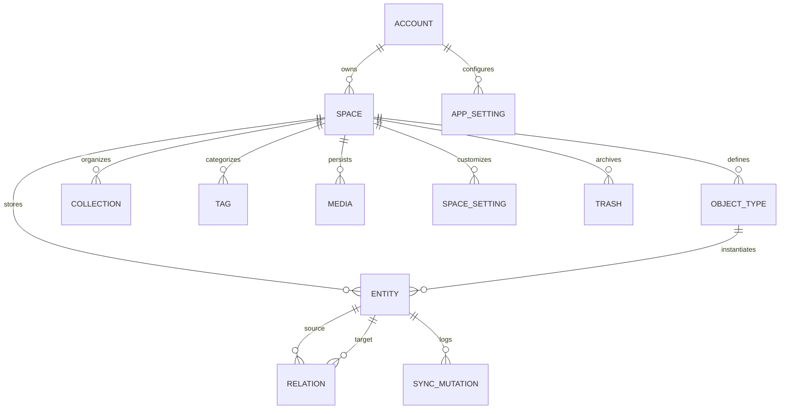
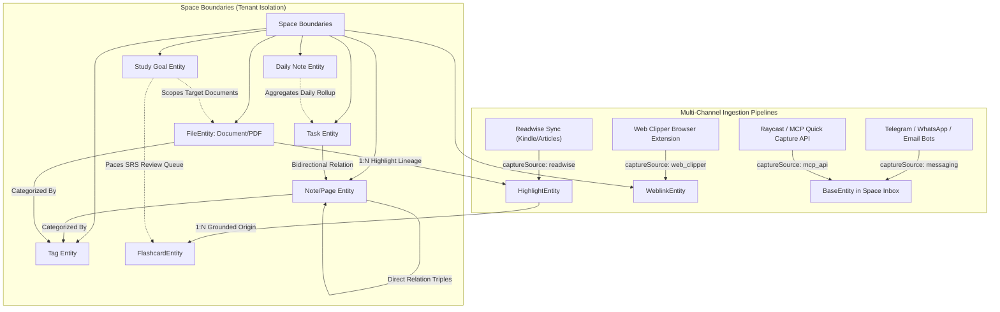
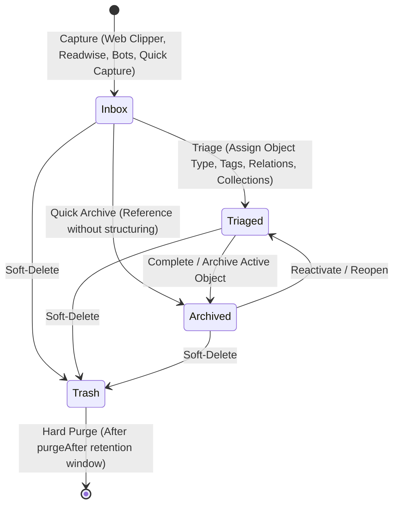
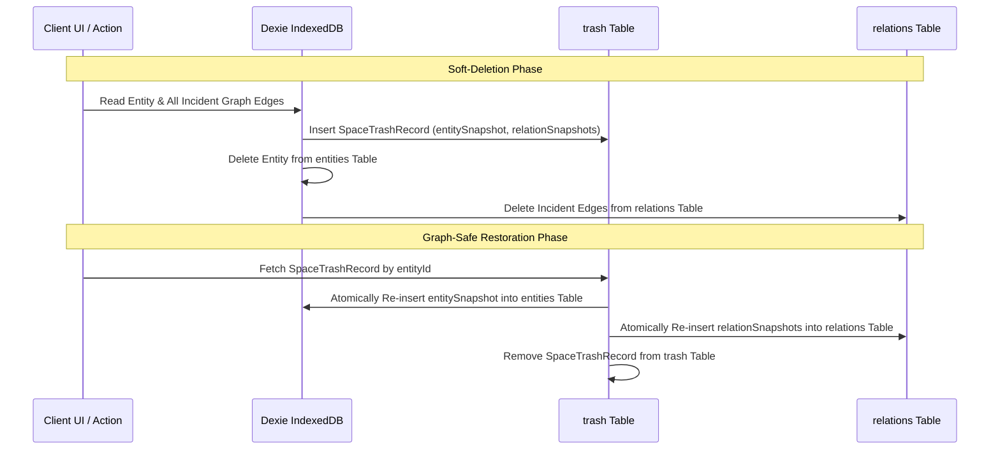
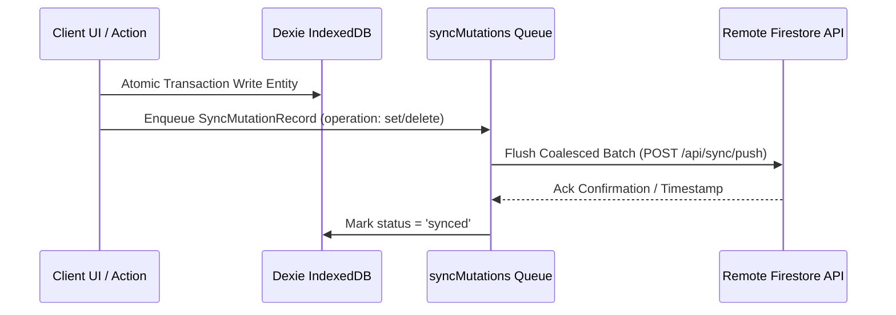
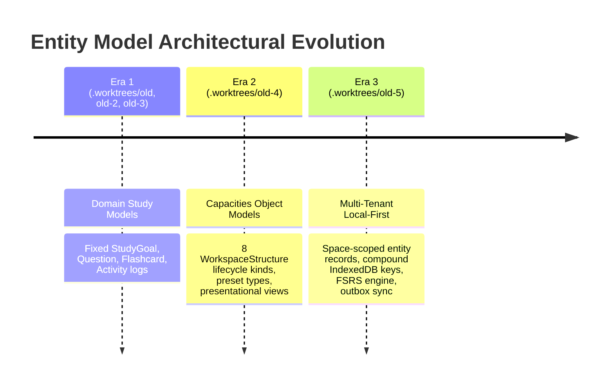
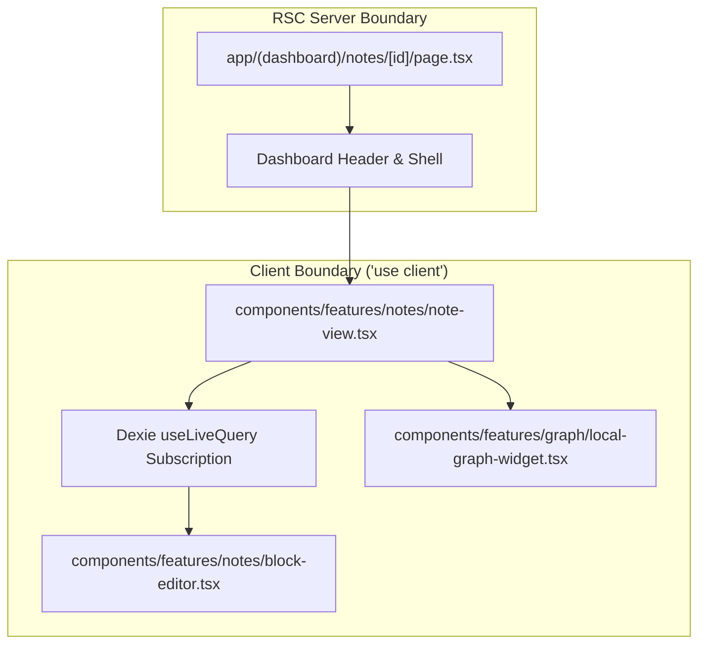

# Project Domain Entities & Knowledge Architecture Specification

This document provides a comprehensive architectural specification of all domain entities, database schemas, object models, entity relationships, lifecycles, security boundaries, and historical worktree evolution for the Notes App repository.

---

## 1. System Architecture & Entity Modeling Overview

The application utilizes a **Local-First Knowledge Graph Architecture** combining local reactive persistence in browser storage with remote cloud synchronization and server-side processing capabilities.



### Architecture Key Principles
1. **Object-First over Folder-First**: Information items exist as typed semantic objects (Pages, Daily Notes, Tasks, Weblinks, Files, Highlights, Flashcards, Study Goals, Queries, AI Chats) scoped within multi-tenant Spaces rather than rigid folder hierarchies.
2. **First-Class Graph Topography**: Explicit triple edges (`sourceId`, `targetId`, `propertyId`) enable fast bidirectional backlinks and local sub-graph extraction without full-text content parsing.
3. **Compound Key Space Partitioning**: All IndexedDB entity tables utilize compound keys (`[spaceId+id]`) guaranteeing tenant and workspace isolation.
4. **Coalesced LWW Offline Sync Outbox**: Atomic local transactions append mutation logs to `syncMutations`, using Last-Write-Wins (LWW) resolution and mutation coalescing prior to remote synchronization.
5. **Graph-Safe Tombstones**: Soft-deletion preserves entity and relation snapshots, allowing atomic undelete without orphaned graph edges.

---

## 2. Storage Layer & Dexie IndexedDB Database Schema

Persistent local state resides in browser IndexedDB managed by **Dexie.js** (`KnowledgeDatabase`). The database schema consists of **11 primary tables**:

| Table Name | Primary Key | Compound / Indexed Fields | Description |
| :--- | :--- | :--- | :--- |
| `spaces` | `id` | `accountId`, `sortOrder`, `[accountId+sortOrder]`, `name`, `createdAt`, `updatedAt` | Top-level tenant boundaries and workspace definitions. |
| `appSettings` | `id` | `id`, `value` | Global client application settings, active space pointer, and BYOK configurations. |
| `objectTypes` | `[spaceId+id]` | `spaceId`, `id`, `ownership`, `lifecycleKind` | Capacities-style dynamic and system object structures. |
| `entities` | `[spaceId+id]` | `spaceId`, `id`, `[spaceId+objectTypeId]`, `objectTypeId`, `type`, `updatedAt`, `*tags` | Primary entity storage for all workspace domain objects. |
| `collections` | `[spaceId+id]` | `spaceId`, `id`, `[spaceId+structureId]`, `structureId`, `name` | Virtual collections and saved database views. |
| `tags` | `[spaceId+id]` | `spaceId`, `id`, `[spaceId+name]`, `name` | Taxonomical classifications across space entities. |
| `relations` | `[spaceId+id]` | `spaceId`, `id`, `[spaceId+sourceId]`, `[spaceId+targetId]`, `sourceId`, `targetId`, `propertyId` | Graph relation triples supporting bidirectional backlinks. |
| `media` | `[spaceId+id]` | `spaceId`, `id`, `[spaceId+mimeType]`, `mimeType`, `updatedAt` | Binary assets, PDFs, audio, and image blob storage. |
| `spaceSettings` | `[spaceId+id]` | `spaceId`, `id`, `[spaceId+key]`, `key`, `updatedAt` | Space-specific preferences and layout configurations. |
| `trash` | `[spaceId+id]` | `spaceId`, `id`, `[spaceId+entityId]`, `entityId`, `purgeAfter`, `trashedAt` | Soft-deletion tombstones preserving `entitySnapshot: SpaceEntityRecord` and `relationSnapshots: SpaceRelationRecord[]` for graph-safe restoration. |
| `syncMutations` | `id` | `status`, `[status+updatedAt]`, `spaceId`, `entityId`, `entityType`, `operation`, `updatedAt` | Outbox mutation queue for local-first remote sync. |

### Dexie Class Declaration Contract
```typescript
export class KnowledgeDatabase extends Dexie {
  spaces!: EntityTable<SpaceRecord, "id">;
  appSettings!: EntityTable<AppSettingRecord, "id">;
  objectTypes!: Table<SpaceObjectTypeRecord, [string, string]>;
  entities!: Table<SpaceEntityRecord, [string, string]>;
  collections!: Table<SpaceCollectionRecord, [string, string]>;
  tags!: Table<SpaceTagRecord, [string, string]>;
  relations!: Table<SpaceRelationRecord, [string, string]>;
  media!: Table<SpaceMediaRecord, [string, string]>;
  spaceSettings!: Table<SpaceSettingRecord, [string, string]>;
  trash!: Table<SpaceTrashRecord, [string, string]>;
  syncMutations!: EntityTable<SyncMutationRecord, "id">;
}
```

---

## 3. Entity Specifications & Type Definitions

### A. Base Entity (`BaseEntity` / `SpaceEntityRecord`)
The polymorphic foundation extended by all workspace domain entities.

```typescript
export type SystemEntityType =
  | 'page'
  | 'daily_note'
  | 'task'
  | 'weblink'
  | 'file'
  | 'image'
  | 'audio'
  | 'pdf'
  | 'highlight'
  | 'flashcard'
  | 'study_goal'
  | 'query'
  | 'ai-chat'
  | 'tag'
  | (string & {});

export type InboxStatus = 'inbox' | 'triaged' | 'archived';

export type CaptureSource =
  | 'manual'
  | 'web_clipper'
  | 'readwise'
  | 'telegram'
  | 'whatsapp'
  | 'email'
  | 'raycast'
  | 'mcp_api';

export interface CaptureMetadata {
  sourceUrl?: string;
  sourceTitle?: string;
  capturedAt?: string;
  sender?: string;
  externalId?: string;
  rawPayload?: Record<string, unknown>;
}

export interface BaseEntity {
  id: string;
  type: SystemEntityType;
  title: string;
  createdAt: string;
  updatedAt: string;
  icon?: string;
  coverImage?: string;
  blocks: ContentBlock[];
  tags: string[];
  relations: EntityRelation[];
  backlinks?: EntityBacklink[];
  properties: Record<string, unknown>;
  srs?: SRSItemState;
  inboxStatus: InboxStatus;
  captureSource: CaptureSource;
  captureMetadata?: CaptureMetadata;
  _syncStatus?: 'synced' | 'pending' | 'conflict';
}

export type SpaceEntityRecord = BaseEntity & {
  spaceId: string;
  objectTypeId: string;
  collections?: string[];
};
```

#### ContentBlock Union Specification
Editor documents consist of an ordered list of `ContentBlock` elements supporting rich document composition:

```typescript
export type ContentBlockType =
  | 'paragraph'
  | 'heading_1'
  | 'heading_2'
  | 'heading_3'
  | 'bullet_list'
  | 'numbered_list'
  | 'task_item'
  | 'code'
  | 'math'
  | 'callout'
  | 'quote'
  | 'divider'
  | 'embed'
  | 'media_block'
  | 'table_block'
  | 'transclusion';

export interface ContentBlock {
  id: string;
  type: ContentBlockType;
  content: string;
  annotations?: {
    bold?: boolean;
    italic?: boolean;
    strikethrough?: boolean;
    code?: boolean;
    highlightColor?: string;
    linkUrl?: string;
  };
  metadata?: {
    // task_item
    checked?: boolean;
    dueDate?: string;
    // code & math
    language?: string;
    mathExpression?: string;
    // callout & embed
    calloutTone?: string;
    embedUrl?: string;
    embedProvider?: 'youtube' | 'twitter' | 'github' | 'generic';
    // media_block
    mediaId?: string;
    caption?: string;
    // table_block
    rows?: string[][];
    hasHeaderRow?: boolean;
    // transclusion
    transcludedEntityId?: string;
    transcludedBlockId?: string;
  };
}
```

---

### B. Daily Note Entity (`DailyNoteEntity`, `type: "daily_note"`)
* **Purpose**: Time-bound journal entry for daily reflections, meeting records, calendar bindings, and automatic task rollups.
* **Fields**:
  * `date`: string (ISO 8601 `YYYY-MM-DD` date key)
  * `linkedEventIds`?: string[] (references to external calendar events)
  * `calendarEvents`?: Array<{
      id: string;
      title: string;
      startTime: string;
      endTime: string;
      sourceCalendar?: string;
    }>
  * `taskRollup`: {
      scheduledTaskIds: string[];
      completedTaskIds: string[];
      carriedOverTaskIds: string[];
    }
  * `metrics`?: Record<string, number | string> (e.g. mood, energy, focus score)

---

### C. Task Entity (`TaskEntity`, `type: "task"`)
* **Purpose**: Actionable GTD unit with lifecycle tracking, priority scheduling, and bi-directional project/note associations.
* **Fields**:
  * `status`: `'todo' | 'in_progress' | 'done' | 'cancelled'`
  * `dueDate`?: string (ISO 8601 date-time string)
  * `completedAt`?: string (ISO 8601 date-time timestamp)
  * `priority`: `'low' | 'medium' | 'high' | 'urgent'`
  * `parentTaskId`?: string
  * `assignedEntityId`?: string (linked Project, Area, or Meeting entity)
  * `subtaskIds`?: string[]

---

### D. Weblink Entity (`WeblinkEntity`, `type: "weblink"`)
* **Purpose**: Enriched web bookmark, reading queue item, and reference repository entry.
* **Fields**:
  * `url`: string (canonical target URL)
  * `domain`: string (e.g. `github.com`, `arxiv.org`)
  * `favicon`?: string (favicon URL or base64 data URI)
  * `ogImage`?: string (Open Graph preview image asset URL)
  * `excerpt`?: string (parsed summary or meta description)
  * `author`?: string
  * `siteName`?: string
  * `readStatus`?: `'unread' | 'reading' | 'read'`
  * `readerContent`?: string (distilled reader-mode markdown content)

---

### E. Query Entity (`QueryEntity`, `type: "query"`)
* **Purpose**: Capacities-style dynamic database view that reactively filters and projects workspace entities.
* **Fields**:
  * `targetObjectTypes`: string[] (object type IDs to query against)
  * `conjunction`: `'and' | 'or'`
  * `rules`: Array<{
      propertyId: string;
      operator: 'equals' | 'not_equals' | 'contains' | 'not_contains' | 'greater_than' | 'less_than' | 'is_empty' | 'is_not_empty';
      value: unknown;
    }>
  * `sort`: {
      propertyId: string;
      direction: 'asc' | 'desc';
    }
  * `groupByPropertyId`?: string
  * `presentationView`: `'gallery' | 'list' | 'table' | 'wall'`

---

### F. AI Chat Entity (`AIChatEntity`, `type: "ai-chat"`)
* **Purpose**: Contextual conversational agent session grounded in space entities.
* **Fields**:
  * `modelId`: string (e.g. `gpt-4o`, `claude-3-5-sonnet`, `gemini-1.5-pro`)
  * `pinnedContextEntityIds`: string[] (entities explicitly injected into context window)
  * `systemPromptOverride`?: string
  * `temperature`?: number
  * `messages`: Array<{
      id: string;
      role: 'user' | 'assistant' | 'system';
      content: string;
      createdAt: string;
      tokensUsed?: number;
      citedEntityIds?: string[];
    }>

---

### G. Media Entities (`ImageEntity`, `AudioEntity`, `PdfEntity`)
Specialized representations of binary media assets stored in the `media` table:

#### 1. Image Entity (`ImageEntity`, `type: "image"`)
* `mediaId`: string (foreign key to `media` table)
* `mimeType`: `'image/jpeg' | 'image/png' | 'image/webp' | 'image/gif' | 'image/svg+xml'`
* `resolution`: `{ width: number; height: number }`
* `aspectRatio`: number
* `ocrText`?: string (indexed text for searchability)
* `altText`?: string
* `cameraMetadata`?: Record<string, unknown>

#### 2. Audio Entity (`AudioEntity`, `type: "audio"`)
* `mediaId`: string (foreign key to `media` table)
* `mimeType`: `'audio/mpeg' | 'audio/wav' | 'audio/ogg' | 'audio/webm' | 'audio/mp4'`
* `duration`: number (playback length in seconds)
* `transcript`?: string (full Whisper / STT transcript)
* `transcriptTimestamps`?: Array<{ start: number; end: number; text: string }>
* `waveform`?: number[] (normalized amplitude peaks)

#### 3. PDF Entity (`PdfEntity`, `type: "pdf"`)
* `mediaId`: string (foreign key to `media` table)
* `mimeType`: `'application/pdf'`
* `pageCount`: number
* `tableOfContents`?: Array<{ title: string; pageNumber: number; level: number }>
* `extractedText`?: string
* `ocrApplied`: boolean
* `fileSizeBytes`: number

---

### H. Note / Page Entity (`type: "page"`)
* **Purpose**: Freeform knowledge entry, document synthesis, and structured note-taking.
* **Fields**: Extends `BaseEntity` with rich `blocks`, custom property map (`properties`), tag associations (`tags`), and graph edges (`relations`).

---

### I. File / Document Entity (`FileEntity`, `type: "file"`)
* **Purpose**: External ingested reading assets (PDF, EPUB, Markdown, Web Articles).
* **Fields**:
  * `fileType`: `'pdf' | 'epub' | 'markdown' | 'web_article'`
  * `originalName`: string
  * `sourceUrl`?: string
  * `localBlobKey`?: string (reference to `media` table)
  * `sizeBytes`: number
  * `fileHash`: string (SHA-256 integrity digest)
  * `extractedText`?: string
  * `parsingStatus`: `'pending' | 'processing' | 'completed' | 'error'`
  * `pageCount`?: number

---

### J. Highlight Entity (`HighlightEntity`, `type: "highlight"`)
* **Purpose**: Immutable excerpt anchored to a parent `FileEntity` or `WeblinkEntity`.
* **Fields**:
  * `fileId`: string (foreign key to source entity)
  * `exactText`: string (verbatim excerpt)
  * `prefix`?: string, `suffix`?: string (fuzzy text context anchors)
  * `color`: `'yellow' | 'blue' | 'green' | 'pink' | 'purple'`
  * `location`: `{ pageNumber?: number; startOffset?: number; endOffset?: number; cfi?: string; domSelector?: string; }`
  * `userNote`?: string
  * `cardCount`?: number (generated flashcard counter)

---

### K. Flashcard Entity & Spaced Repetition (`FlashcardEntity`, `SRSItemState`, `type: "flashcard"`)
* **Purpose**: Spaced repetition study item powered by the Free Spaced Repetition Scheduler (FSRS) engine.
* **Fields**:
  * `cardType`: `'basic' | 'cloze' | 'reversed'`
  * `front`: string
  * `back`: string
  * `fileId`: string (source document provenance)
  * `sourceHighlightId`: string (source highlight provenance)
  * `sourceQuoteSnippet`: string (verbatim ground truth snippet)
  * `clozeContent`?: string
  * `targetGoalId`?: string
  * `aiGenerated`: boolean
  * `srs`: `SRSItemState`
* **SRSItemState Structure**:
  * `state`: `'new' | 'learning' | 'review' | 'relearning'`
  * `dueDate`: ISO 8601 Date string
  * `lastReviewedAt`?: ISO 8601 Date string
  * `interval`: number (days)
  * `easeFactor`: number (default 2500)
  * `repetitionCount`: number
  * `lapses`: number
  * `stability`: number (FSRS memory stability parameter)
  * `difficulty`: number (FSRS card difficulty parameter)

---

### L. Study Goal Entity (`StudyGoalEntity`, `type: "study_goal"`)
* **Purpose**: Pacing and exam target tracking for study sets.
* **Fields**:
  * `targetExamDate`: ISO Date string
  * `targetRetentionRate`: number (e.g. 0.90 for 90%)
  * `totalCards`: number
  * `dailyNewCardsQuota`: number
  * `expectedDailyReviews`: number
  * `targetFileIds`: string[]

---

### M. Object Type Model (`SpaceObjectTypeRecord` / `WorkspaceStructure`)
Capacities-style object type schema definition driving dynamic property validation, UI rendering, and graph relationships:

```typescript
export type StructureOwnership = "built-in" | "custom" | "legacy" | "reserved";

export type StructureLifecycleKind =
  | "document"
  | "file"
  | "query"
  | "quote"
  | "table"
  | "tag"
  | "task"
  | "url";

export type PropertyValueType =
  | "title"
  | "text"
  | "number"
  | "boolean"
  | "date"
  | "entity"
  | "label"
  | "richText"
  | "url"
  | "media"
  | "createdAt"
  | "lastUpdatedAt";

export type NumberPresentationColor =
  | "blue"
  | "gray"
  | "green"
  | "orange"
  | "purple"
  | "red";

export type NumberPresentation =
  | { readonly type: "number"; readonly fixedDecimals?: number }
  | { readonly type: "percent"; readonly fixedDecimals?: number }
  | { readonly type: "currency"; readonly currency: string; readonly fixedDecimals?: number }
  | {
      readonly type: "progress";
      readonly color: NumberPresentationColor;
      readonly fixedDecimals?: number;
      readonly steps: number;
    };

export type PropertyLabelOption = {
  readonly id: string;
  readonly name: string;
  readonly color?: string;
};

export type ObjectIconTone =
  | "amber"
  | "blue"
  | "cyan"
  | "emerald"
  | "fuchsia"
  | "gray"
  | "green"
  | "indigo"
  | "lime"
  | "neutral"
  | "orange"
  | "pink"
  | "purple"
  | "red"
  | "rose"
  | "sky"
  | "slate"
  | "teal"
  | "violet"
  | "yellow";

export type StructurePresentationView = "gallery" | "list" | "table" | "wall";

export type StructurePresentation = {
  readonly defaultView: StructurePresentationView;
  readonly availableViews: readonly StructurePresentationView[];
  readonly smallCardVisiblePropertyIds?: readonly string[];
};

export type PropertyDefinition = {
  readonly id: string;
  readonly name: string;
  readonly ownership: "default" | "normal" | "system";
  readonly valueType: PropertyValueType;
  readonly writable: boolean;
  readonly multiple: boolean;
  readonly description?: string;
  readonly iconName?: string;
  readonly fixedTargetObjectIds?: readonly string[];
  readonly inversePropertyDefinitionId?: string;
  readonly numberPresentation?: NumberPresentation;
  readonly options?: readonly PropertyLabelOption[];
  readonly targetStructureIds?: readonly string[];
};

export type WorkspaceStructure = {
  readonly id: string;
  readonly ownership: StructureOwnership;
  readonly singularName: string;
  readonly pluralName: string;
  readonly iconName: string;
  readonly tone: ObjectIconTone;
  readonly lifecycleKind: StructureLifecycleKind;
  readonly propertyDefinitions: readonly PropertyDefinition[];
  readonly collectionIds: readonly string[];
  readonly presentation: StructurePresentation;
};

export type SpaceObjectTypeRecord = WorkspaceStructure & {
  spaceId: string;
};
```

#### The 8 Structure Lifecycle Kinds
1. `document`: Narrative documents, atomic notes, meetings, and pages with block-level editing.
2. `file`: Uploaded file assets, documents, and attachments stored locally or in object storage.
3. `query`: Computed live queries filtering entities reactively by properties and relationships.
4. `quote`: Anchored extracts, citations, and highlights grounded in a source artifact.
5. `table`: Tabular data rows with strict column property definitions.
6. `tag`: Categorical classifications applied cross-cuttingly across entities.
7. `task`: Actionable tasks with completion tracking, due dates, and priority.
8. `url`: Bookmarked web URLs with OpenGraph preview and metadata enrichment.

#### The 12 Property Value Types
1. `title`: Canonical primary display name.
2. `text`: Plain text string scalar or array.
3. `number`: Numeric quantity formatted according to `NumberPresentation`.
4. `boolean`: Binary flag (`true` | `false`).
5. `date`: ISO date, datetime, or date-range object.
6. `entity`: Graph pointer to one or more workspace entities (`targetStructureIds`).
7. `label`: Controlled vocabulary chip selected from `PropertyLabelOption[]`.
8. `richText`: Full block editor document sub-tree.
9. `url`: Validated web URL.
10. `media`: Foreign key reference to a blob in the `media` table.
11. `createdAt`: Read-only system creation timestamp.
12. `lastUpdatedAt`: Read-only system mutation timestamp.

#### The 20 Tone Tokens
Object icon badges and type chips utilize a strict 20-tone semantic palette mapped to CSS variables (`--type-label-*` and `--token-*`):
`amber`, `blue`, `cyan`, `emerald`, `fuchsia`, `gray`, `green`, `indigo`, `lime`, `neutral`, `orange`, `pink`, `purple`, `red`, `rose`, `sky`, `slate`, `teal`, `violet`, `yellow`.

#### Bidirectional Properties via `inversePropertyDefinitionId`
When a property represents a relationship (e.g. `Author` on a `Book`), specifying `inversePropertyDefinitionId` (pointing to `Books` on `Author`) ensures mutations automatically maintain reciprocal relation triples in the `relations` table.

---

### N. Space Collection & Space Trash Records

```typescript
export type SpaceCollectionRecord = {
  id: string;
  spaceId: string;
  structureId: string;
  name: string;
};

export type SpaceTrashRecord = {
  id: string;
  spaceId: string;
  entityId: string;
  label: string;
  typeLabel: string;
  trashedAt: string;
  purgeAfter: string;
  entitySnapshot?: SpaceEntityRecord;
  relationSnapshots?: SpaceRelationRecord[];
};
```

---

### O. Outbox Sync Mutation (`SyncMutationRecord`)
* **Purpose**: Local transaction outbox queue for idempotent cloud replication.
* **Fields**:
  * `id`: string (idempotency key)
  * `spaceId`: string
  * `entityId`: string
  * `entityType`: `SystemEntityType`
  * `operation`: `'set' | 'delete'`
  * `status`: `'pending' | 'syncing' | 'synced' | 'conflict' | 'failed'`
  * `payload`?: Record<string, unknown>
  * `error`?: string
  * `retryCount`: number
  * `updatedAt`: string

---

## 4. Entity Provenance & Graph Topology



### Multi-Channel Ingestion Provenance Invariants
1. **Multi-Channel Ingestion Provenance**: Every entity entering the knowledge graph records its origin via `captureSource` (`'manual' | 'web_clipper' | 'readwise' | 'telegram' | 'whatsapp' | 'email' | 'raycast' | 'mcp_api'`) and structured `captureMetadata` preserving source URLs, external identifiers, author/sender details, and capture timestamps:
   - **Readwise Sync**: Continuous synchronization streaming highlights from Kindle, iBooks, web articles, and Twitter/X into `HighlightEntity` records attached to parent `FileEntity` or `WeblinkEntity` documents.
   - **Web Clipper Extension**: Browser extension capturing full-page DOM metadata, OpenGraph cards, reader-mode markdown, and excerpts directly into `WeblinkEntity` or `PageEntity` records.
   - **Messaging Bot Gateways (Telegram / WhatsApp / Email)**: Webhook endpoints receiving conversational capture (voice memos transcribed via Whisper to `AudioEntity`, photos OCRed to `ImageEntity`, text notes to `PageEntity`) routed straight to the Space Inbox.
   - **Raycast / MCP Quick Capture**: High-speed system launcher actions and Model Context Protocol (MCP) tool endpoints injecting quick thoughts, tasks, and clipboard snippets directly into local IndexedDB storage.
2. **Document Grounding**: `FileEntity` / `WeblinkEntity` $\rightarrow$ `HighlightEntity` $\rightarrow$ `FlashcardEntity`. All flashcards derive ground-truth provenance through `sourceHighlightId` and `sourceQuoteSnippet`, preventing AI hallucination during study drills.
3. **Triple Edge Graph**: Edges stored in `relations` (`[spaceId, sourceId, targetId, propertyId]`) support fast bidirectional lookup (`buildEntityBacklinks`) and local graph neighborhood extraction (`buildLocalEntityGraph`).

---

## 5. Entity Lifecycles

### A. Inbox Triage Lifecycle


1. **Capture (`inboxStatus: 'inbox'`)**: Raw information enters the user's workspace without cognitive overhead or mandatory categorization. The entity is immediately persisted locally and queued for background cloud replication.
2. **Triage (`inboxStatus: 'triaged'`)**: In the dedicated Inbox Triage interface, the user assigns an object type structure (e.g. Page, Task, Weblink, Meeting, Project), enriches custom properties, links related entities via bidirectional relations, and applies taxonomy tags.
3. **Archive (`inboxStatus: 'archived'`)**: When an item's active lifecycle concludes, it moves to `archived`. Graph relationships, search indices, and backlinks remain fully operational, while filtering the entity out of active daily workflows.

### B. Trash Soft-Deletion & Graph-Safe Restoration Lifecycle


1. **Snapshot-Based Soft Deletion**: Deleting an entity moves it out of `entities` while capturing an immutable `entitySnapshot: SpaceEntityRecord` and an array of all associated incident relation edges `relationSnapshots: SpaceRelationRecord[]` inside `trash` (`SpaceTrashRecord`).
2. **Atomic Graph-Safe Restoration**: Restoring an entity from the trash atomically re-inserts both the entity and its historical relations within a single Dexie transaction. This guarantees zero broken backlinks, zero dangling graph edges, and complete restoration of bidirectional references.
3. **Retention Grace Period & Hard Purge**: Trashed records retain a `purgeAfter` timestamp (default 30 days). A daily background task purges expired tombstones and cleans up orphan binary blobs in `media`.

### C. Persistence & Outbox Sync Lifecycle


### D. Document Ingestion Lifecycle
`pending` (upload) $\rightarrow$ `processing` (`/api/documents/parse`) $\rightarrow$ `completed` (text extracted, SHA-256 computed) OR `error`.

### E. Spaced Repetition (FSRS) Review Lifecycle
- **Rating 1 (Again)**: Card transitions to `relearning`, `lapses` incremented, `stability` scaled down by lapse factor.
- **Rating 2-4 (Hard / Good / Easy)**: Recalculates `stability` and `difficulty`, computes new `interval` in days, sets `dueDate = now + interval`, increments `repetitionCount`.

---

## 6. Historical Reference Worktrees Synthesis (`.worktrees/`)

Inspection of historical worktrees (`.worktrees/old` through `.worktrees/old-5`) demonstrates the architectural evolution of the entity model:



### Key Worktree Reference Models
- **Capacities Parity (`old-4` & `old-5`)**: Implements 13 starter object presets (`atomic-note`, `book`, `person`, `area`, `meeting`, `definition`, `idea`, `place`, `project`, `organization`, `media`, `travel`, `quote`) and 4 display views (`gallery`, `list`, `table`, `wall`).
- **SRS & Goal Burndown Math (`old-3` & `old-5`)**:
  $$\text{DailyNewCardQuota} = \left\lceil \frac{\text{UnlearnedCardCount}}{\max(1, \text{DaysRemaining} - \text{BufferDays})} \right\rceil$$
  where `BufferDays` defaults to 20% of remaining days (capped at 7). Retrievability follows:
  $$R(t, S) = \left(1 + \frac{19}{81} \cdot \frac{t}{S}\right)^{-0.5}$$

---

## 7. State Management & Next.js 16 / React 19 Component Boundaries

### Component Boundary Architecture
- **React Server Components (RSC)**: Layout shells, route wrappers (`app/(dashboard)/notes/page.tsx`), and metadata generation.
- **Leaf Client Components (`"use client"`)**: Block editors, graph visualizers (`graph-canvas.tsx`), and SRS study player controls.



---

## 8. Security Attributes & Authorization Matrix

| Entity Name | Storage Location | Sensitivity | Access Control & Auth | Encryption (Transit / Rest) | Invariants & Risk Mitigation |
| :--- | :--- | :--- | :--- | :--- | :--- |
| **API Keys / Credentials** | Server `.env` | **Critical** | Server-only. Never exported via `NEXT_PUBLIC_*` or imported into client components. | TLS 1.3 / Secret Manager | Strict separation of server secrets. |
| **Auth Tokens / Session** | Cookies / Memory | **Critical** | Verified server-side via Firebase Admin SDK on Server Actions & Route Handlers. | TLS 1.3 / HttpOnly, Secure Cookies | Mandatory token validation on write routes. |
| **User Notes & Entities** | IndexedDB / Firestore | **High** | Scoped to `users/{uid}/spaces/{spaceId}/...`. Enforced by Firestore Security Rules. | TLS 1.3 / AES-256 (Firestore) | Tenant isolation prevents cross-account reads. |
| **Document Assets (PDF/EPUB)**| IndexedDB / GCS | **High** | Read/write restricted to file owner (`request.auth.uid`). | TLS 1.3 / AES-256 (Storage) | MIME type validation, file size bounds. |
| **Flashcards (FSRS)** | IndexedDB / Firestore | **Medium-High**| Scoped to user namespace. | TLS 1.3 / AES-256 (Firestore) | Card grounding metadata (`sourceQuoteSnippet`). |
| **Sync Outbox Mutations** | IndexedDB / API | **High** | Validated via TypeScript guards / Zod schemas prior to application. | TLS 1.3 in Transit | Schema validation prevents corrupt state writes. |

---

## 9. Verification & Quality Invariants

- **TypeScript Typechecking**: Verified zero type errors via `pnpm typecheck`.
- **Vitest Unit Test Suite**: Verified passing state for unit tests via `pnpm test`.
- **Biome Code Quality**: Verified zero formatting/linting errors via `pnpm check`.
