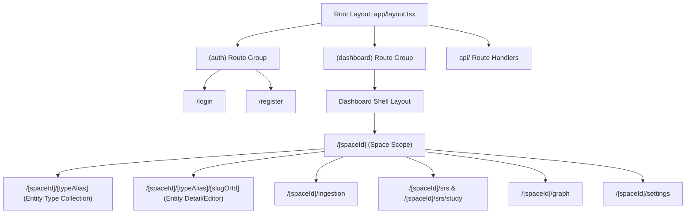
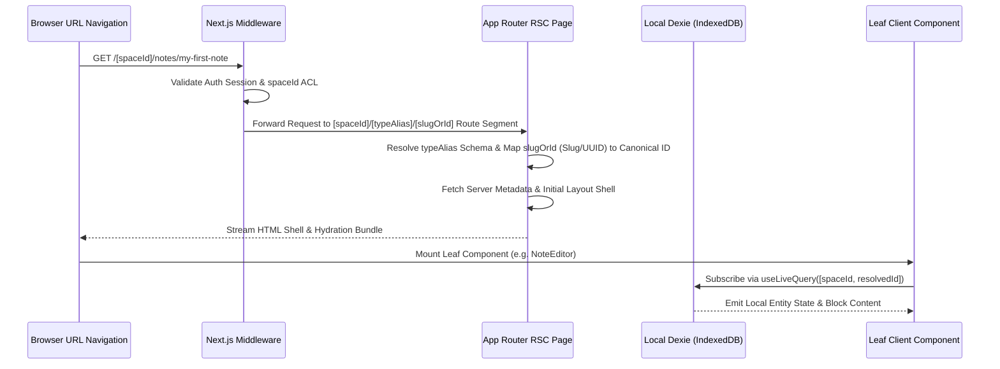

# URL Architecture & Routing Taxonomy Specification

This document provides a comprehensive architectural specification of the URL taxonomy, route structure, page hierarchies, navigation paradigms, parameter schemas, and layout boundaries for the **Notes App** repository.

---

## 1. Routing System Overview

The **Notes App** utilizes the **Next.js 16 App Router** architecture, leveraging React Server Components (RSC), route groups, dynamic route segments, parallel routes, and intercepted modal routes.

To provide a consistent, object-oriented user experience inspired by Capacities and modern knowledge bases, the application adopts a unified dynamic entity routing taxonomy: **`/[spaceId]/[typeAlias]/[slugOrId]`**.



### Core Routing Principles
1. **Space-Scoped Multi-Tenant Isolation**: Primary application views are namespaced under `/[spaceId]/` to enforce multi-tenant Space boundary isolation and deep-link shareability across team/workspace scopes.
2. **Unified Semantic Object Taxonomy (`/[spaceId]/[typeAlias]/[slugOrId]`)**: All system objects—whether core notes (`notes`), imported reading documents (`documents`), flashcard decks (`decks`), saved collections (`collections`), tags (`tags`), or custom user-defined Capacities-style object types (`books`, `people`, `meetings`)—share a unified dynamic route path pattern.
3. **Dual Slug-or-ID Resolution**: The `[slugOrId]` segment accepts either a human-readable URL slug (e.g., `quantum-computing-notes`) or a canonical UUIDv4 / KSUID string identifier, with fast fallback resolution logic.
4. **Deep-Linkable Query State**: Intersecting UI controls (active view modes, search queries, active inspector tabs, graph filter depth) are synchronized in URL query parameters for reproducible state sharing.
5. **Non-Blocking Modal Interception**: Contextual object inspections and quick creation forms utilize Next.js intercepted routes (`@modal/(.)[slugOrId]`) for seamless slide-over overlays without unmounting the background page context.

---

## 2. Directory Taxonomy & App Router Map

The application routes are structured under the Next.js `app/` directory as follows:

```text
app/
├── (auth)/                       # Authentication Route Group (unauthenticated layout)
│   ├── layout.tsx                # Auth centered card layout shell
│   ├── login/
│   │   └── page.tsx              # User login page
│   └── register/
│       └── page.tsx              # User account registration page
│
├── (dashboard)/                  # Main Application Route Group (authenticated layout)
│   ├── layout.tsx                # Main dashboard shell (Sidebar, Header, Space Selector)
│   ├── page.tsx                  # Root redirect or workspace launcher page
│   └── [spaceId]/                # Space-scoped multi-tenant dynamic route segment
│       ├── page.tsx              # Space home dashboard & activity feed
│       ├── [typeAlias]/          # Dynamic Object Type & Entity Taxonomy Segment
│       │   ├── page.tsx          # Collection view for given object type (gallery/table/list)
│       │   ├── [slugOrId]/       # Specific entity instance dynamic route segment
│       │   │   └── page.tsx      # Full-page entity editor / detail inspector view
│       │   └── @modal/           # Parallel route slot for slide-over entity inspector
│       │       └── (.)[slugOrId]/
│       │           └── page.tsx  # Intercepted entity detail overlay
│       ├── ingestion/            # Document & Reading Ingestion domain
│       │   └── page.tsx          # Document import dashboard, dropzone & processing status
│       ├── srs/                  # Spaced Repetition System (Anki/FSRS domain)
│       │   ├── page.tsx          # SRS study dashboard & goal burndown charts
│       │   ├── study/
│       │   │   └── page.tsx      # Active flashcard review session player
│       │   └── goals/
│       │       └── [goalId]/
│       │           └── page.tsx  # Exam goal burndown detail view
│       ├── graph/                # Knowledge Graph Domain
│       │   └── page.tsx          # Interactive 2D/3D graph visualization canvas
│       └── settings/             # Space-Level Settings & Configuration
│           └── page.tsx          # Space preferences, member roles, sync status outbox
│
├── api/                          # REST Route Handlers & Webhooks
│   ├── health/
│   │   └── route.ts              # Service healthcheck endpoint
│   ├── sync/
│   │   ├── push/
│   │   │   └── route.ts          # Outbox mutation batch upload handler
│   │   └── pull/
│   │       └── route.ts          # Delta sync retrieval handler
│   └── documents/
│       └── parse/
│           └── route.ts          # PDF/EPUB document text extraction pipeline
│
├── globals.css                   # Tailwind CSS & design tokens
├── layout.tsx                    # Root HTML layout (Providers, Fonts, Metadata)
├── loading.tsx                   # Global Suspense fallback loading UI
├── error.tsx                     # Global error boundary
└── not-found.tsx                 # Custom 404 page
```

---

## 3. URL Parameter & Query Parameter Taxonomy

| Route URL Pattern | Route Type | Parameter Schemas | Query Parameters | Description |
| :--- | :--- | :--- | :--- | :--- |
| `/[spaceId]` | Page (RSC) | `spaceId: string` | `tab?: string` | Space home dashboard and recent activity overview. |
| `/[spaceId]/[typeAlias]` | Page (RSC/Client) | `spaceId: string`, `typeAlias: string` | `view?: 'gallery' \| 'list' \| 'table' \| 'wall'`, `sort?: string`, `q?: string`, `filter?: string` | Object collection index for a specific entity type (e.g. `notes`, `documents`, `books`). |
| `/[spaceId]/[typeAlias]/[slugOrId]` | Page (RSC/Client) | `spaceId: string`, `typeAlias: string`, `slugOrId: string` | `mode?: 'edit' \| 'preview'`, `tab?: 'properties' \| 'backlinks' \| 'graph'`, `highlightId?: string` | Full-screen object editor or inspector for a target entity (resolved by slug or UUID). |
| `/[spaceId]/ingestion` | Page (RSC) | `spaceId: string` | `status?: 'pending' \| 'completed'` | Document import dropzone and processing status list. |
| `/[spaceId]/srs` | Page (RSC) | `spaceId: string` | `goalId?: string` | SRS flashcard study dashboard and burndown metrics. |
| `/[spaceId]/srs/study` | Page (Client) | `spaceId: string` | `deckId?: string`, `limit?: number` | Interactive FSRS flashcard study session player. |
| `/[spaceId]/srs/goals/[goalId]` | Page (RSC/Client) | `spaceId: string`, `goalId: string` | `tab?: 'cards' \| 'burndown'` | Study goal exam target and pacing detail view. |
| `/[spaceId]/graph` | Page (Client) | `spaceId: string` | `focusedId?: string`, `depth?: number` | Knowledge graph visualization canvas. |
| `/[spaceId]/settings` | Page (RSC/Client) | `spaceId: string` | `section?: 'general' \| 'members' \| 'sync'` | Space configuration and local-first sync outbox inspector. |

---

## 4. Navigation & State Hydration Data Flow



---

## 5. Architectural Routing Invariants

1. **Space Parameter Isolation**: Every dashboard route dynamic path MUST accept `spaceId` as its first parameter segment. Components must never hardcode or assume a single default space ID.
2. **Type Alias Standardization**: The `[typeAlias]` dynamic segment maps to standard core entity domains (`notes`, `documents`, `decks`, `collections`, `tags`) as well as dynamic user-defined Capacities object types (`books`, `people`, `meetings`).
3. **Dual Slug-or-ID Resolution**: Routing logic for `[slugOrId]` MUST support dual resolution: test if `slugOrId` matches UUID format; if not, query the space-scoped slug lookup index. Canonical database lookups and internal state references always resolve to the underlying entity UUID.
4. **Query Parameter Synchronization**: Interactive UI state switches (such as switching from `view=gallery` to `view=table` or changing inspector tabs) MUST update URL query state via `next/navigation` (`useRouter` / `useSearchParams`) to maintain browser history back/forward navigation.
5. **Server vs. Client Data Boundaries**: Route pages (`page.tsx`) perform lightweight Server Component layout rendering and metadata pre-generation. Deep interactive state (live subscriptions, block editing, webgl canvas) is delegated to leaf client components (`"use client"`).
6. **Intercepted Routes for Context Preservation**: Quick inspectors and modal popovers MUST use intercepted route slots (`@modal/(.)[slugOrId]`) to maintain the underlying collection or graph background URL context.

---

## 6. Security Boundaries & Authorization Matrix

| Route Segment | Authentication Requirement | Authorization Level | Security Enforcement |
| :--- | :--- | :--- | :--- |
| `/(auth)/*` | Public / Unauthenticated | Guest | Redirects to dashboard if valid session cookie exists. |
| `/api/health` | Public | None | Rate-limited health probe. |
| `/[spaceId]/*` | Authenticated | Space Member / Owner | Verified by Next.js Middleware & Server Action token validation against space permissions. |
| `/[spaceId]/[typeAlias]/[slugOrId]` | Authenticated | Space Member / Owner | Resolves entity ownership within the active space boundary; rejects cross-space accesses. |
| `/api/sync/*` | Authenticated | Account Owner | Authenticates Firebase Admin bearer token; restricts sync mutations to owned spaces. |
| `/api/documents/parse` | Authenticated | Document Owner | Validates file size, MIME type, and account ownership before processing. |
