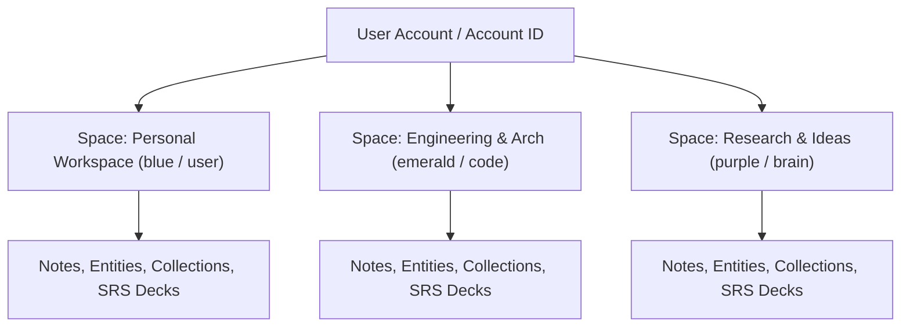
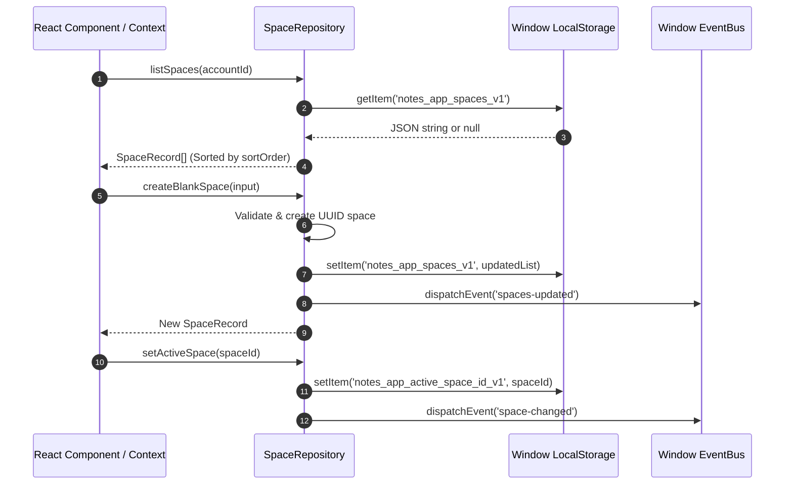

# Spaces Multi-Tenant Architecture & Workspace Management

This document provides a comprehensive architectural specification for the **Spaces** multi-tenant domain and workspace management suite in the **Notes App**. It details the local-first storage protocol, domain entity models, component suite under `src/components/spaces`, tone color system, icon mapping, and React 19 Context integration.

---

## 1. Overview & Architectural Goals

The **Notes App** implements a multi-tenant workspace partitioning architecture inspired by **Capacities-like space parity**. A **Space** represents an isolated workspace boundary for a user's knowledge graph, notes, collections, spaced repetition cards, and uploaded documents.



### Core Architecture Invariants
1. **Multi-Tenant Workspace Isolation**: Every top-level entity, note, collection, and SRS item belongs strictly to a `spaceId`. Queries are scoped by `spaceId` to guarantee isolation between distinct domains (e.g., separating personal journal entries from engineering specs).
2. **Capacities-Style Space Parity**: Workspaces are customizable through distinct visual identities, consisting of a name, description, Lucide icon, and color tone palette.
3. **Local-First & Offline Storage Protocol**: Spaces are managed via `SpaceRepository` using browser `localStorage` (key: `notes_app_spaces_v1` and `notes_app_active_space_id_v1`) with fallback to in-memory state during SSR or non-browser environments. Custom window events (`spaces-updated`, `space-changed`) trigger instant UI synchronization across context consumers.

---

## 2. Domain Entity Models & Validation

The domain models for the Spaces subsystem are defined in [`src/types/space.ts`](../../src/types/space.ts).

### Data Types & Interfaces

```typescript
export type ObjectIconTone =
  | "amber"
  | "blue"
  | "emerald"
  | "indigo"
  | "purple"
  | "rose"
  | "sky"
  | "slate"
  | "orange"
  | "teal";

export type SpaceIconName =
  | "folder"
  | "briefcase"
  | "book-open"
  | "code"
  | "brain"
  | "zap"
  | "user"
  | "sparkles"
  | "layers"
  | "globe"
  | "terminal"
  | "compass";

export interface SpaceRecord {
  id: string;
  name: string;
  description?: string;
  icon: SpaceIconName;
  color: ObjectIconTone;
  accountId: string;
  sortOrder: number;
  createdAt: string;
  updatedAt: string;
}

export interface SpaceStats {
  entityCount: number;
  noteCount: number;
  flashcardCount: number;
  fileCount: number;
}

export interface CreateSpaceInput {
  name: string;
  description?: string;
  icon?: SpaceIconName;
  color?: ObjectIconTone;
}
```

### Validation Protocol

Input payloads for space creation are validated client-side via `validateCreateSpaceInput`:
- **Space Name**: Mandatory non-empty string, maximum 50 characters.
- **Description**: Optional string, maximum 200 characters.

---

## 3. Storage Protocol & Repository Pattern

The [`SpaceRepository`](../../src/lib/db/repositories/space-repository.ts) provides a static service interface for workspace CRUD operations, order management, and active space persistence.



### Default Spaces Seed
When no spaces are present in storage, `SpaceRepository` initializes two default workspaces for `default-user`:
1. **Personal Workspace** (`id: "personal-space"`, icon: `"user"`, color: `"blue"`).
2. **Engineering & Arch** (`id: "engineering-space"`, icon: `"code"`, color: `"emerald"`).

### Event-Driven Reactive Synchronization
`SpaceRepository` dispatches browser native custom events upon mutation:
- `spaces-updated`: Fired when a space is created, updated, deleted, or reordered.
- `space-changed`: Fired when the active workspace context changes.

---

## 4. Component Suite Architecture

The components reside in [`src/components/spaces/`](../../src/components/spaces/).

```text
src/components/spaces/
├── space-card.tsx         # Space preview card with stats & action triggers
├── space-nav-item.tsx     # Sidebar space item with active state & options dropdown
├── space-theme-utils.ts   # Icon mapping and tone color palette utilities
└── spaces-provider.tsx    # React 19 Context provider & custom hook (useSpacesContext)
```

### Component Breakdown

| Component | Responsibility & Interface | Key Integrations |
| :--- | :--- | :--- |
| `SpacesProvider` | Manages state for spaces list, active space ID, loading state, and modal open states. Subscribes to window sync events. | React 19 Context, `SpaceRepository` |
| `SpaceNavItem` | Renders an interactive sidebar navigation item for a space. Displays tone icon badge, space name, active highlights, and settings dropdown. | `DropdownMenu`, `Button`, `getSpaceIcon`, `getSpaceToneClasses` |
| `SpaceCard` | Displays full space overview card with domain statistics (`SpaceStats`: notes, objects count), active indicator badge, and action buttons. | `Card`, `Badge`, `Button`, `FileText`, `Layers`, `Settings` |
| `SpaceSwitcher` | Select dropdown / combobox component allowing users to switch the current active space from the global header or navigation shell. | `DropdownMenu` / `Select`, `useSpacesContext` |
| `SpaceList` | Grid or vertical list component displaying active and inactive spaces with drag/drop or reorder capabilities. | `SpaceCard`, `SpaceNavItem` |
| `CreateSpaceModal` | Dialog overlay for creating a new workspace, featuring input fields for name/description, icon picker grid, and tone color selector. | `Dialog`, `Input`, `Textarea`, `validateCreateSpaceInput` |
| `SpaceSettingsModal` | Dialog overlay for editing existing space metadata, changing visual theme, or performing destructive deletion. | `Dialog`, `Button`, `SpaceRepository.deleteSpace` |

---

## 5. Visual Styling & Tone Palette Architecture

Visual styling uses Lucide icons and shadcn CSS variable theme integration via [`src/components/spaces/space-theme-utils.ts`](../../src/components/spaces/space-theme-utils.ts).

### Icon Mapping (`ICON_MAP`)
12 Lucide icons are registered to correspond to `SpaceIconName`:
- `folder` $\rightarrow$ `Folder`
- `briefcase` $\rightarrow$ `Briefcase`
- `book-open` $\rightarrow$ `BookOpen`
- `code` $\rightarrow$ `Code`
- `brain` $\rightarrow$ `Brain`
- `zap` $\rightarrow$ `Zap`
- `user` $\rightarrow$ `User`
- `sparkles` $\rightarrow$ `Sparkles`
- `layers` $\rightarrow$ `Layers`
- `globe` $\rightarrow$ `Globe`
- `terminal` $\rightarrow$ `Terminal`
- `compass` $\rightarrow$ `Compass`

### Tone Color System (`TONE_CLASSES`)
Every `ObjectIconTone` maps to a set of Tailwind CSS classes designed for both light and dark mode transparency:

```typescript
export const TONE_CLASSES: Record<
  ObjectIconTone,
  { bg: string; text: string; border: string; badgeBg: string }
> = {
  blue: {
    bg: "bg-blue-500/10",
    text: "text-blue-500 dark:text-blue-400",
    border: "border-blue-500/20",
    badgeBg: "bg-blue-500",
  },
  emerald: {
    bg: "bg-emerald-500/10",
    text: "text-emerald-500 dark:text-emerald-400",
    border: "border-emerald-500/20",
    badgeBg: "bg-emerald-500",
  },
  // ... amber, purple, rose, sky, indigo, slate, orange, teal
};
```

---

## 6. React 19 Context & API Integration

The `SpacesProvider` exposes state and handlers via `useSpacesContext()`.

### Provider Usage Example

```tsx
import { SpacesProvider } from "@/components/spaces/spaces-provider";

export default function DashboardLayout({ children }: { children: React.ReactNode }) {
  return (
    <SpacesProvider>
      <div className="flex h-screen">
        <Sidebar />
        <main className="flex-1 overflow-auto">{children}</main>
      </div>
    </SpacesProvider>
  );
}
```

### Client Component Consumer Example

```tsx
"use client";

import { useSpacesContext } from "@/components/spaces/spaces-provider";
import { SpaceNavItem } from "@/components/spaces/space-nav-item";
import { Button } from "@/components/ui/button";

export function SidebarSpacesSection() {
  const { spaces, activeSpaceId, selectSpace, setCreateModalOpen, setSettingsSpace } =
    useSpacesContext();

  return (
    <div className="space-y-1 p-2">
      <div className="flex items-center justify-between px-2 py-1 text-xs font-semibold text-muted-foreground">
        <span>SPACES</span>
        <Button variant="ghost" size="sm" onClick={() => setCreateModalOpen(true)}>
          + New
        </Button>
      </div>

      {spaces.map((space) => (
        <SpaceNavItem
          key={space.id}
          space={space}
          isActive={space.id === activeSpaceId}
          onSelect={selectSpace}
          onOpenSettings={setSettingsSpace}
        />
      ))}
    </div>
  );
}
```
