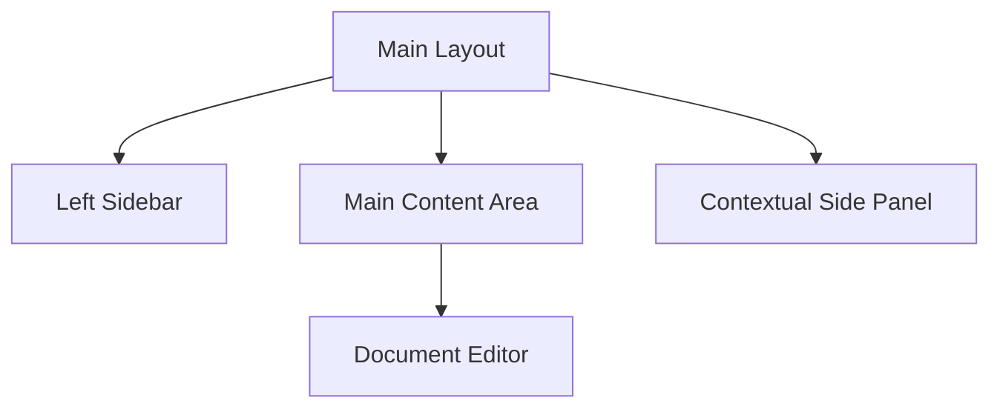

# Main Content Architecture Overview

This documentation describes the component structure and data flow of the Notes App user interface.

## Render Flow

## Key Features

Notes App supports global i18n (pt-BR and en), dark/light themes, and Markdown document visualization with Ladle.
