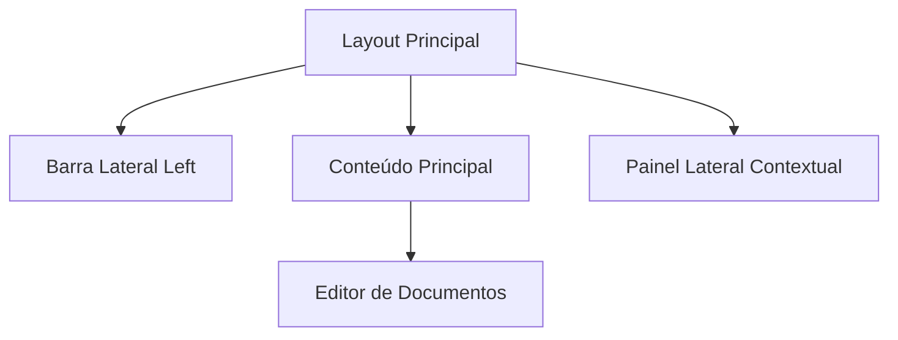

# Visão Geral da Arquitetura do Conteúdo Principal

Esta documentação descreve a estrutura dos componentes e fluxo de dados da interface do Notes App.

## Fluxo de Renderização

## Recursos Principais

O Notes App oferece suporte a i18n global (pt-BR e en), temas escuro/claro e visualização de documentos em Markdown com Ladle.
