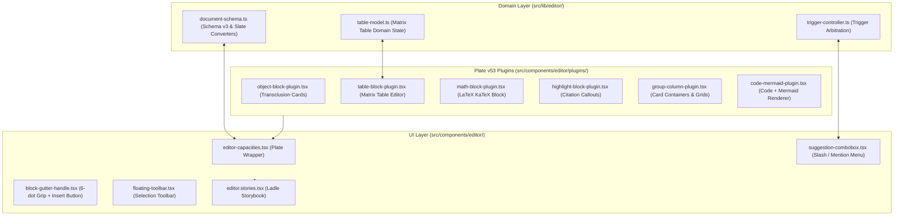

# ADR-0009: Capacities Block Editor Domain and Plate v53 Plugin Architecture

* **Status**: Accepted
* **Deciders**: Engineering Team
* **Date**: 2026-09-14
* **Consulted**: Architectural Reference Worktrees (`.worktrees/old-4`, `.worktrees/old-5`)
* **Informed**: Core Application Engineers

## Context and Problem Statement

`notes-app` requires a full-featured, object-based rich-text block editor that mirrors the capabilities of **Capacities** (PKM with typed entities, granular block identifiers, object transclusion cards, math formulas, syntax highlighted code with Mermaid diagram visualization, and matrix spreadsheet tables).

Following [ADR-0008](0008-plate-rich-text-editor-framework-migration.md), the repository adopted **Plate JS v53** (powered by Slate AST) for its React 19 compatibility and headless server-side static pre-rendering (`EditorStatic`). We needed to design and implement the domain contracts, AST serialization schemas, custom Plate plugins, trigger arbitration controller, and interactive chrome to achieve 100% feature parity with Capacities.

## Decision Drivers

* **Capacities Document Schema v3 Parity**: Strict preservation of block IDs (`block:<uuid>`) for deep transclusion, backlinks, and depth constraints (`MAX_BLOCK_DOCUMENT_DEPTH = 8`).
* **Clean Separation of Concerns**: Pure functional domain models in `src/lib/editor/` (`document-schema.ts`, `table-model.ts`, `trigger-controller.ts`) decoupled from UI rendering layers.
* **React 19 & Next.js 16 Compatibility**: Support for headless static server-side rendering (`EditorStatic`) with zero layout shifts.
* **Interactive UI Parity**: Hover drag handles (`+` insert button and 6-dot drag grip), selection floating toolbars, and trigger comboboxes (`/`, `@`, `[[`, `((`, `#`, `+`).
* **Ladle Story Visibility**: Mandatory export and verification of all block variants and stories in `src/components/editor/editor.stories.tsx`.

## Considered Options

1. **Plate JS v53 with Custom Domain Plugins (Selected)**: Implement pure functional AST converters (`capacitiesDocToSlate` and `slateToCapacitiesDoc`) in `src/lib/editor/` and custom Plate plugins (`ObjectBlockPlugin`, `TableBlockPlugin`, `MathBlockPlugin`, `HighlightBlockPlugin`, `GroupBlockPlugin`, `ColumnLayoutPlugin`, `CodeBlockMermaidPlugin`) in `src/components/editor/plugins/`.
2. **Monolithic ProseMirror / TipTap Engine**: Port the legacy ProseMirror schema directly from `.worktrees/old-4`.
3. **Third-Party Pre-Packaged Notion Clones (e.g., BlockNote, Novel)**: Use pre-packaged out-of-the-box block editors.

## Decision Outcome

Chosen option: **Plate JS v53 with Custom Domain Plugins**, because:
- It maintains exact JSON document schema compatibility (`schemaVersion: 3`) with Capacities.
- It leverages Slate AST for clean functional transformations without DOM reconcile issues in React 19.
- It enables headless SSR pre-rendering via `EditorStatic` (`platejs/static`) for instant First Contentful Paint.
- It isolates domain logic (`TableBlockModel`, `SharedSuggestionController`) into tested, pure TypeScript modules in `src/lib/editor/`.

### Positive Consequences

* **15+ Block Types Supported**: Full parity across Paragraphs, Headings (H1–H4), Bullet/Numbered/Task Lists, Quotes, Code Blocks with Mermaid diagrams, LaTeX Math equations, Highlight Callouts with source citations, 2–4 Column Grids, Card Containers, Matrix Tables, and Object Transclusion Cards.
* **Bidirectional AST Round-Tripping**: Lossless conversion between Plate Slate AST and Capacities Document Schema v3.
* **Granular Backlink Anchoring**: All blocks receive stable `block:<uuid>` identifiers required for block-level references (`((`) and transclusions.
* **100% Test Coverage**: Complete Vitest test suites (`src/lib/editor/document-schema.test.ts` and `table-model.test.ts`) validating AST depth limits, ID persistence, and table operations.

### Negative Consequences

* Requires maintaining custom Plate plugins rather than relying solely on off-the-shelf basic block presets.

## Architecture and Component Boundaries

## References

* [ADR-0008: Plate Rich-Text Editor Framework Migration](0008-plate-rich-text-editor-framework-migration.md)
* [ADR-0006: Historical Reference Architecture Synthesis](0006-historical-reference-architecture-synthesis.md)
* [ADR-0005: Ladle Component Workbench and Documentation Viewer](0005-ladle-component-workbench-and-documentation-viewer.md)
* [Capacities Editor Documentation & Block Parity Reference](https://docs.capacities.io/reference/blocks)
