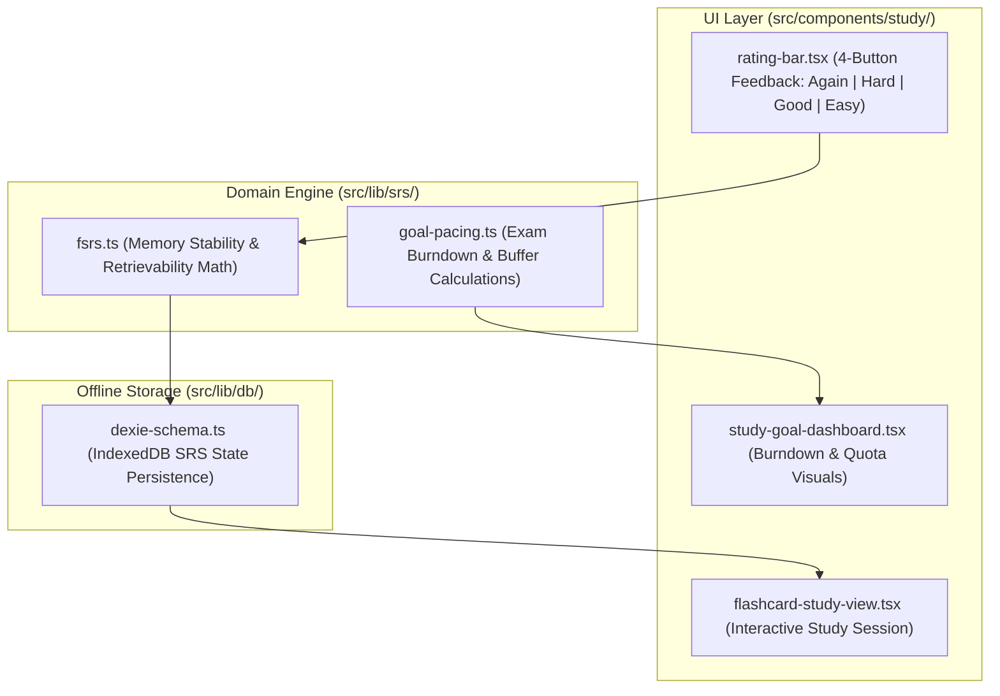

# ADR-0010: FSRS Spaced Repetition Engine and Goal Burndown Architecture

* **Status**: Accepted
* **Deciders**: Engineering Team
* **Date**: 2026-09-14
* **Consulted**: Architectural Reference Worktrees (`.worktrees/old-5`), Domain Spec (`docs/architecture/HISTORICAL_REFERENCE_SYNTHESIS.md`)
* **Informed**: Core Application Engineers, Study Domain Engineers

## Context and Problem Statement

`notes-app` requires a modern Spaced Repetition System (SRS) and goal-driven exam burndown pacing engine. Legacy flashcard implementations (e.g., Anki SM-2) rely on fixed ease multipliers and naive intervals, leading to over-studying or premature memory decay. Furthermore, students preparing for exam deadlines need adaptive daily study quotas that account for target dates, elapsed time, unlearned card backlogs, and safety buffers.

We needed to establish an authoritative architecture for flashcard scheduling using the **FSRS (Free Spaced Repetition Scheduler)** algorithm integrated with dynamic goal burndown pacing math, client-side Dexie persistence, and interactive study components.

## Decision Drivers

* **FSRS Memory Stability & Retrievability Modeling**: Precise mathematical modeling of card stability ($S$), difficulty ($D$), and retrievability ($R$) decay over elapsed time ($t$).
* **Goal-Driven Exam Burndown Pacing**: Dynamic daily new card quota calculation with adaptive buffer days based on remaining time until target exam dates.
* **Offline-First Client Execution**: Fast sub-10ms card rating evaluation directly in the browser via Dexie IndexedDB.
* **Granular Rating Outcomes**: Standardized 4-button rating feedback (`1: Again`, `2: Hard`, `3: Good`, `4: Easy`) with deterministic state transitions.

## Considered Options

1. **FSRS Engine with Goal Burndown Pacing Math (Selected)**: Implement pure functional FSRS scheduling (`fsrs.ts`) and goal pacing math (`study-goal-dashboard.ts`) with Dexie DAL persistence.
2. **Legacy SuperMemo SM-2 Algorithm**: Traditional ease-factor algorithm with fixed intervals.
3. **Fixed Daily Static Quotas**: Hardcoded daily card counts without adaptive burndown or buffer safety calculations.

## Decision Outcome

Chosen option: **FSRS Engine with Goal Burndown Pacing Math**, because:
- FSRS optimizes retention rates (target $R = 0.90$) while reducing total review workload by 20–30% compared to SM-2.
- Exam burndown pacing dynamically adjusts daily quotas based on unlearned card counts and remaining days, automatically embedding safety buffers (up to 7 days).
- Functional domain logic (`src/lib/srs/fsrs.ts`) remains decoupled from UI rendering, enabling thorough unit testing in Vitest.

### Positive Consequences

* **Mathematical Precision**: Retrievability decay $R(t, S) = \left(1 + \frac{19}{81}\cdot\frac{t}{S}\right)^{-0.5}$ and interval equation $I(S, R_{\text{target}}) = \frac{S}{19/81}\cdot(R_{\text{target}}^{-1/0.5} - 1)$ guarantee mathematically sound scheduling.
* **Adaptive Exam Pacing**: Automatic classification into `ahead`, `onTrack`, or `behind` pacing states with dynamic daily card quotas.
* **Full Offline Support**: Card ratings update IndexedDB instantly without blocking on remote API calls.
* **Comprehensive Test Coverage**: Complete unit test suite in `src/lib/srs/fsrs.test.ts` verifying all rating state transitions and pacing edge cases.

### Negative Consequences

* Requires maintaining card stability ($S$) and difficulty ($D$) attributes per card in the database schema alongside traditional interval metrics.

## Architecture and Component Boundaries

## References

* [ADR-0006: Historical Reference Architecture Synthesis](0006-historical-reference-architecture-synthesis.md)
* [Historical Reference Synthesis Spec](../architecture/HISTORICAL_REFERENCE_SYNTHESIS.md)
* [FSRS Algorithm Paper & Open Standard](https://github.com/open-spaced-repetition/fsrs4anki)
