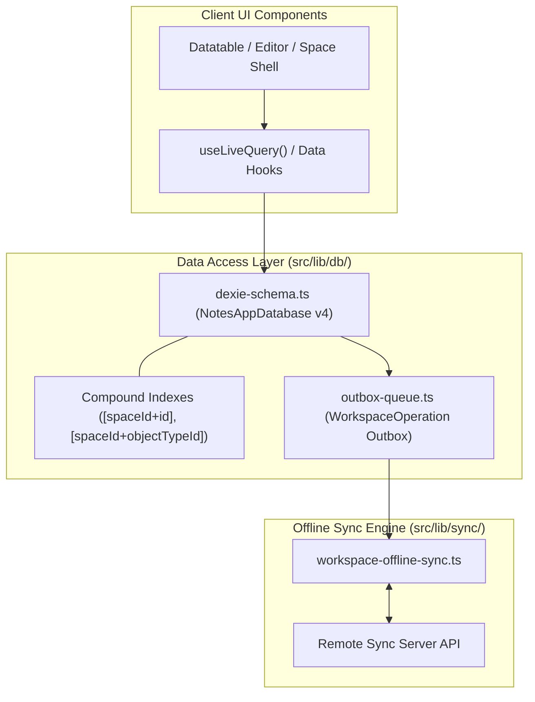

# ADR-0011: Dexie v4 Offline-First Data Access Layer and Compound Key Partitioning Architecture

* **Status**: Accepted
* **Deciders**: Engineering Team
* **Date**: 2026-09-14
* **Consulted**: Architectural Reference Worktrees (`.worktrees/old-4`, `.worktrees/old-5`), Domain Spec (`docs/architecture/spaces.md`)
* **Informed**: Core Application Engineers, Data Layer Engineers

## Context and Problem Statement

`notes-app` operates as a local-first application where user data must be immediately accessible, editable offline, and isolated across multi-tenant **Spaces**. Relying on network requests for basic navigation or object operations causes unacceptable latency and breaks offline functionality.

We needed an authoritative data access layer (DAL) architecture that guarantees sub-5ms local reads/writes, strict workspace space partitioning, live reactive UI updates, and background outbox synchronization.

## Decision Drivers

* **Sub-5ms Query Latency**: Local database execution for instant document rendering and object switching.
* **Multi-Tenant Space Isolation**: Mandatory space partitioning using compound indexes (`[spaceId+id]`, `[spaceId+objectTypeId]`, `[spaceId+updatedAt]`).
* **Reactive Data Binding**: Native React hook integration (`useLiveQuery`) for automatic UI updates on database changes.
* **Offline Operation Outbox**: Outbox queue storage (`WorkspaceOperation`) supporting idempotent mutation sync and conflict tracking.

## Considered Options

1. **Dexie v4 with Compound Key Partitioning (Selected)**: IndexedDB wrapper with typed `DexieTable` schemas, compound indexes, and live query hooks.
2. **Raw Browser IndexedDB API**: Direct use of native `window.indexedDB` without abstraction.
3. **SQLite via WebAssembly (WASM)**: Client-side SQLite compiled to WASM (e.g., wa-sqlite, absurd-sql).

## Decision Outcome

Chosen option: **Dexie v4 with Compound Key Partitioning**, because:
- It delivers sub-5ms lookup performance while avoiding the heavy WASM binary payload (~2–5MB) and virtual file system overhead of SQLite WASM.
- Compound indexes like `[spaceId+id]` ensure zero data leakage across different workspace spaces.
- `useLiveQuery` provides seamless reactive integration with React 19 Client Components.
- It natively supports versioned migrations (`db.version(x).stores(...)`) for schema evolution.

### Positive Consequences

* **Strict Space Partitioning**: Queries strictly bounded by `spaceId` context, ensuring multi-tenant safety.
* **Instant Offline Responsiveness**: Read and write operations complete synchronously against local IndexedDB.
* **Reliable Outbox Replication**: Idempotent operations (`op:<spaceId>:<aggregateKey>:<baseRevision>:<kind>`) stored locally prior to server synchronization.
* **Type-Safe DAL**: Strongly typed entity tables in `src/lib/db/dexie-schema.ts`.

### Negative Consequences

* Requires managing IndexedDB schema migration scripts as entity schemas evolve.

## Architecture and Component Boundaries

## References

* [ADR-0006: Historical Reference Architecture Synthesis](0006-historical-reference-architecture-synthesis.md)
* [Space Partitioning & Multi-Tenant Spec](../architecture/spaces.md)
* [Dexie v4 Documentation](https://dexie.org/docs/Version/Dexie)
