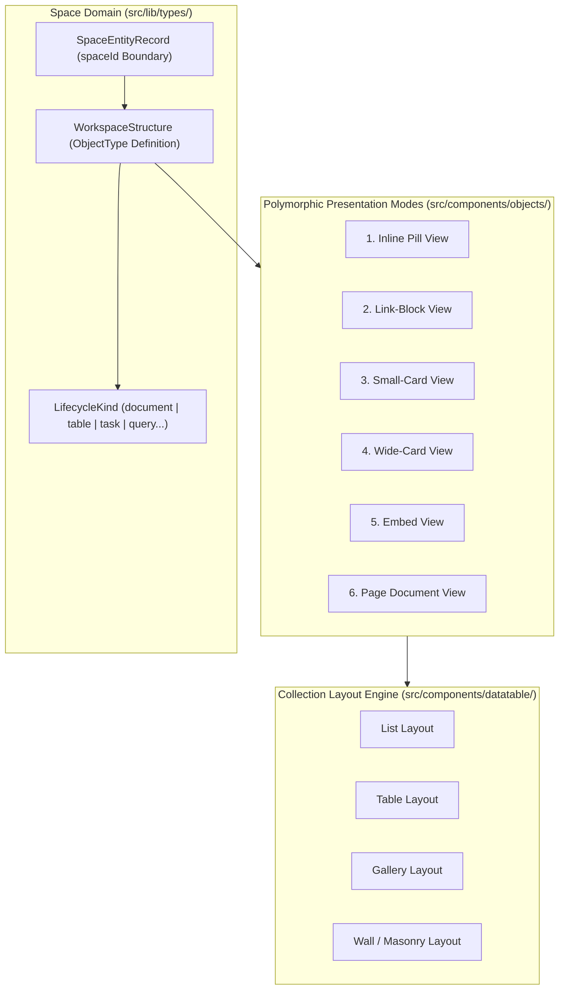

# ADR-0012: Capacities Polymorphic Space Object Types Architecture

* **Status**: Accepted
* **Deciders**: Engineering Team
* **Date**: 2026-09-14
* **Consulted**: Architectural Reference Worktrees (`.worktrees/old-4`), Design System Spec (`docs/design/README.md`), Entity Spec (`docs/architecture/entities.md`)
* **Informed**: Core Application Engineers, Domain Modelers

## Context and Problem Statement

Traditional note-taking applications organize information into rigid folder trees, causing data fragmentation and limiting cross-domain knowledge synthesis. To deliver a modern Personal Knowledge Management (PKM) studio with Capacities feature parity, `notes-app` requires a polymorphic, object-first architecture where every entity is a typed object with dynamic properties, structural lifecycle rules, visual color tones, and flexible presentation views.

We needed to establish the foundational architecture for space-scoped object structures, starter type presets, dynamic property definitions, and multi-view rendering.

## Decision Drivers

* **Capacities Feature & Visual Parity**: Support for 13 starter object presets (`atomic-note`, `book`, `person`, `area`, `meeting`, `definition`, `idea`, `place`, `project`, `organization`, `media`, `travel`, `quote`) and 12 built-in core structures (`page`, `table`, `task`, `weblink`, `image`, `pdf`, `audio`, `file`, `tweet`, `ai-chat`, `tag`, `query`).
* **Enforced Structural Lifecycle Kinds**: Behavior classification (`document`, `file`, `query`, `quote`, `table`, `tag`, `task`, `url`).
* **Polymorphic Object Renderers**: 6 presentation modes (Inline Pill, Link-Block, Small-Card, Wide-Card, Embed, Page view) across 4 collection views (List, Table, Gallery, Wall/Masonry).
* **Dynamic Property Schema**: Typed property definitions (`title`, `text`, `number`, `boolean`, `date`, `entity`, `label`, `richText`, `url`, `media`) with OKLCH 18-tone visual accent palette.

## Considered Options

1. **Polymorphic Object Model with Capacities Starter Presets (Selected)**: Implement flexible `WorkspaceStructure` entity schemas with dynamic property maps, lifecycle constraints, and 6-mode object presentation components.
2. **Traditional Hierarchical File & Folder Tree**: Nested filesystem directory tree.
3. **Monolithic Un-Typed Text Documents**: Single document type differentiated only by plain text tags.

## Decision Outcome

Chosen option: **Polymorphic Object Model with Capacities Starter Presets**, because:
- It turns notes into structured knowledge objects that can be queried, related, filtered, and rendered dynamically.
- It enables rich interactive UI features such as transclusion embed cards, property inspector panels, and graph view projections.
- Space custom object types empower users to define domain-specific schemas without code changes.

### Positive Consequences

* **Rich Knowledge Graphing**: Typed objects establish explicit graph connections (`sourceId` $\rightarrow$ `targetId`) inspectable in the D3/WebGL inspector panel.
* **Flexible Presentation Engine**: Objects render seamlessly as inline pills inside text, expandable cards in datatables, or full-page block documents.
* **Visual Identity**: Full integration with the 18 OKLCH color tone system for immediate type recognition.
* **Extensible Schema**: Support for space-scoped custom object types alongside system built-in presets.

### Negative Consequences

* Higher initial UI complexity compared to a plain text editor, requiring structured property inspectors and type selection comboboxes.

## Architecture and Component Boundaries

## References

* [ADR-0006: Historical Reference Architecture Synthesis](0006-historical-reference-architecture-synthesis.md)
* [Design System Specification](../design/README.md)
* [Entities & Domain Architecture Spec](../architecture/entities.md)
