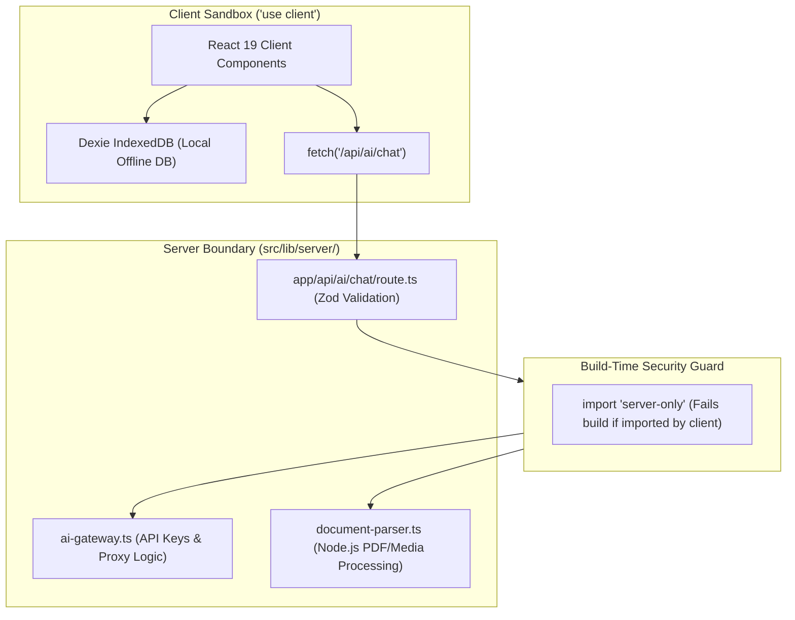

# ADR-0013: Server-Only Data Access Layer and Security Isolation Architecture

* **Status**: Accepted
* **Deciders**: Engineering Team
* **Date**: 2026-09-14
* **Consulted**: Security Spec (`SECURITY.md`), Architecture Spec (`ARCHITECTURE.md`)
* **Informed**: Core Application Engineers, Security Engineers

## Context and Problem Statement

`notes-app` uses Next.js 16 App Router with React 19 Server Components and API Route Handlers for server-side processing (AI gateway proxying, document parsing, web scraping, and key decryption). Accidentally importing server-side modules or API credentials into Client Components can leak sensitive credentials into public client JavaScript bundles.

We needed an architectural pattern that strictly enforces server boundary isolation, prevents credential exposure at build time, and ensures safe server-side execution.

## Decision Drivers

* **Zero Credential Exposure**: Absolute prevention of leaking API keys, secrets, or internal backend URLs to client bundles.
* **Build-Time Safeguards**: Automatic build failures if client code attempts to import server-only modules.
* **Safe API Proxying**: Next.js 16 Route Handlers (`src/app/api/`) providing validated entrypoints for AI gateway and ingestion operations.
* **Strict Payload Validation**: Zod schema validation for all inbound HTTP request bodies and parameters.

## Considered Options

1. **`server-only` Module Guards with App Router Route Handlers (Selected)**: Enforce `import "server-only"` at the top of all modules in `src/lib/server/` and validate all API payloads with Zod.
2. **Shared Un-Guarded Helper Modules**: Allow helper utility modules to be imported indiscriminately by both server and client components.
3. **Direct Client API Provider Calls**: Issue third-party API calls directly from client browser components using client-exposed keys.

## Decision Outcome

Chosen option: **`server-only` Module Guards with App Router Route Handlers**, because:
- The `server-only` package throws an explicit build-time compilation error if any module containing server logic or credentials is imported by a Client Component (`"use client"`).
- Route Handlers isolate sensitive operations (AI Gateway token minting, PDF text extraction) behind secure server HTTP endpoints.
- Zod schema validation guarantees malicious or malformed payloads are rejected at the network edge before reaching application logic.

### Positive Consequences

* **Build-Time Compilation Safety**: CI/CD builds fail immediately if secret-handling code is accidentally linked into client bundles.
* **Centralized API Security**: All AI Gateway requests and server integrations pass through `src/lib/server/` handlers.
* **Clean Architectural Boundaries**: Clear directory separation between client DAL (`src/lib/db/`) and server DAL (`src/lib/server/`).
* **Audit Compliance**: Simplifies security code reviews by isolating credential operations into strictly marked server modules.

### Negative Consequences

* Developers must explicitly create API Route Handlers or Server Actions when client components require server-side execution.

## Architecture and Component Boundaries

## References

* [ADR-0001: Next.js 16 + React 19 Baseline](0001-nextjs-16-react-19-baseline.md)
* [Main Architecture Specification](../ARCHITECTURE.md)
* [Security Specification](../../SECURITY.md)
* [Next.js `server-only` Documentation](https://nextjs.org/docs/app/building-your-application/rendering/composition-patterns#keeping-server-only-code-out-of-the-client-environment)
