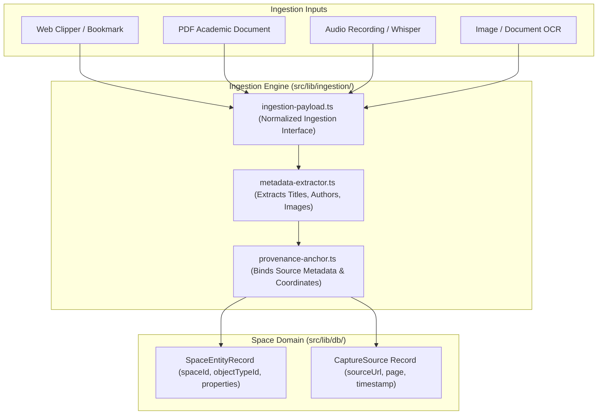

# ADR-0014: Multi-Channel Ingestion and Grounded Provenance Architecture

* **Status**: Accepted
* **Deciders**: Engineering Team
* **Date**: 2026-09-14
* **Consulted**: Domain Entities Spec (`docs/architecture/entities.md`), Design Spec (`docs/design/README.md`)
* **Informed**: Core Application Engineers, Ingestion Pipeline Engineers

## Context and Problem Statement

`notes-app` captures knowledge from diverse input sources: web clippings, PDF academic whitepapers, audio recordings, image OCR, book quotes, and AI synthesis dialogues. Importing content without maintaining strict source metadata leads to lost context, untraceable quotes, and unverified AI hallucinations.

We needed a multi-channel ingestion architecture that guarantees **Grounded Provenance**—ensuring every ingested highlight, note, flashcard, or summary preserves immutable source anchors back to its original origin.

## Decision Drivers

* **Grounded Provenance Anchoring**: Permanent preservation of source attributes (`sourceUrl`, `sourceId`, `author`, `publisher`, `pageNumber`, `capturedAt`, DOM selector / bounding coordinates).
* **Multi-Format Ingestion Pipelines**: Pipeline handlers for Web links (`weblink`), PDF whitepapers (`pdf`), Audio recordings (`audio` with Whisper transcript peaks), Images (`image` with OCR text), and Literature citations (`quote`).
* **AI Grounding & Hallucination Prevention**: Ensuring AI chat assistant responses cite exact user notes and raw source excerpts.
* **Space-Scoped Object Mapping**: Automatic mapping of ingested payloads into space-scoped polymorphic objects (`WorkspaceStructure`).

## Considered Options

1. **Grounded Provenance Pipeline with Explicit Source Anchors (Selected)**: Implement structured ingestion handlers in `src/lib/ingestion/` that extract content and attach immutable `CaptureSource` metadata records.
2. **Lossy Plain-Text Import Pipeline**: Stripping source metadata and converting all incoming content to unanchored plain text.
3. **Manual User Copy-Pasting**: Relying on manual copy-pasting without automated metadata extraction.

## Decision Outcome

Chosen option: **Grounded Provenance Pipeline with Explicit Source Anchors**, because:
- It maintains verifiable integrity across the knowledge graph—users can click any highlight or AI response and jump directly to the exact page, timestamp, or line of the source document.
- It enables rich object rendering (e.g., Audio blocks with interactive waveform visualizers, PDF viewers with highlighted bounding boxes).
- It provides structured context required for FSRS flashcard generation grounded in textbook excerpts.

### Positive Consequences

* **Full Traceability**: Highlights and flashcards reference exact source coordinates (`pageNumber`, `timestampMs`, `url`).
* **Multi-Channel Support**: Unified ingestion interface (`IngestionPayload`) supporting web, audio, PDF, image, and text imports.
* **Grounded AI RAG**: AI RAG pipelines use grounded source chunks, preventing ungrounded hallucinations.
* **High-Fidelity Object Creation**: Automatic instantiation of appropriate `objectTypeId` (`pdf`, `weblink`, `audio`, `quote`).

### Negative Consequences

* Requires extra storage per ingested object to store source metadata structures and waveform peak arrays.

## Architecture and Component Boundaries

## References

* [ADR-0006: Historical Reference Architecture Synthesis](0006-historical-reference-architecture-synthesis.md)
* [ADR-0012: Capacities Polymorphic Space Object Types Architecture](0012-capacities-polymorphic-space-object-types-architecture.md)
* [Domain Entities & Knowledge Architecture Spec](../architecture/entities.md)
