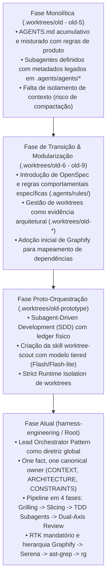

# Síntese Executiva: Evolução dos Padrões de Orquestração e Subagentes nas Worktrees

## 1. Visão Geral da Arquitetura Histórica

A análise cruzada das branches e worktrees do repositório revela uma progressão nítida em direção ao desacoplamento de contexto, isolamento por subagentes e uso de grafos de conhecimento:

---

## 2. Invariantes de Orquestração Extraídos

### A. Isolamento de Worktrees (Worktree Scout Pattern)
- **Localização:** `.worktrees/old-prototype/.agents/skills/worktree-scout/SKILL.md`
- **Invariante:** Código em `.worktrees/` nunca deve ser importado em tempo de execução; atua estritamente como modelo, evidência e especificação de prior-art.
- **Delegação 1:1:** O orquestrador central nunca lê sequencialmente múltiplos arquivos de worktrees. Ele despacha um subagente leve (`flash_lite` / `flash`) dedicado para cada branch ou subsistema específico, preservando o contexto principal.

### B. Ciclo de Desenvolvimento Subagent-Driven (SDD)
- **Localização:** `.agents/skills/subagent-driven-development/SKILL.md`
- **Ledger Físico vs. Memória de Conversação:** A memória de chat não sobrevive à compactação de contexto (`context compaction`). Por isso, todo progresso, decisão de arbitragem (`Ruling`) e estado de tarefas são persistidos em arquivos em disco (`.superpowers/sdd/` ou `docs/exec-plans/active/`).
- **Dual-Axis Review:** Cada incremento concluído é submetido a dois subagentes avaliadores paralelos:
  1. **Standards Reviewer:** Valida formatação, linter (Biome), tipagem e code smells de Fowler.
  2. **Spec Reviewer:** Valida aderência às histórias de usuário originais e invariantes de produto (`INTENT.md` e `CONTEXT.md`).
- **Breaker Loop:** No máximo 5 ciclos de correção por tarefa. Se não convergir, o orquestrador assume a decisão (`Ruling: <decisão> — <motivo> — <custo se errada>`) e destrava o pipeline.

### C. Navegação e Memória
- **Graphify (`graphify-out/graph.json`):** Primeira linha de pesquisa para relacionamentos e topologia arquitetural, prevenindo varreduras cegas de arquivos via grep.
- **Serena MCP (`.serena/memories/`):** Memória permanente versionada em Git para decisões de engenharia, limites de segurança e contratos de multi-tenancy.
