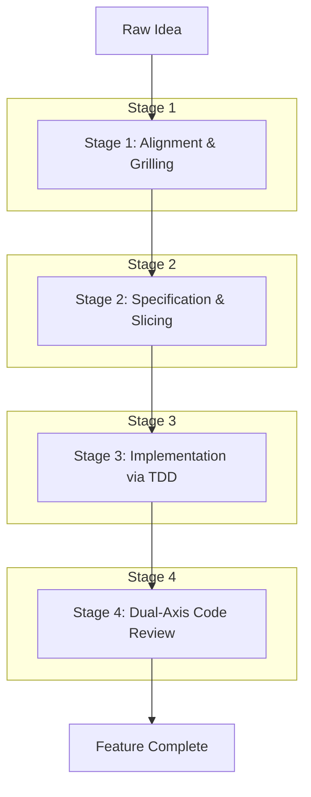

# Matt Pocock's AI Engineering Workflow

Welcome to the definitive guide on integrating Matt Pocock's AI Engineering Workflow into this repository. This guide will help you transition from chaotic "vibe coding" to a disciplined, highly reproducible, and professional AI engineering process.

---

## 1. Overview & Philosophy

### From "Vibe Coding" to AI Engineering
Unstructured interactions with AI often result in code that works initially but degrades into spaghetti as complexity grows. By adopting a structured workflow, we separate the *design* phase from the *implementation* phase, resulting in maintainable, predictable output.

### The "Smart Zone" vs. The "Dumb Zone"
AI models degrade in performance as their context window fills up (typically struggling around the ~100k token mark). 
- **The Smart Zone:** Fresh context, explicit instructions, singular focus.
- **The Dumb Zone:** Long, meandering conversations spanning multiple topics where the AI forgets constraints and introduces subtle bugs.

**Rule of Thumb:** Always start fresh sessions for distinct tasks to stay in the Smart Zone.

### Tracer Bullets & Vertical Slicing
Rather than building out the entire database layer, then the API, then the UI (horizontal slicing), we use **Tracer Bullets**. A tracer bullet is a narrow, end-to-end slice that cuts through all layers of the application—from schema to API to UI to tests. This ensures that integration works early and delivers vertical value.

### Prefactoring
*"Make the change easy, then make the easy change."* Before implementing new features, use AI to refactor the existing codebase so that the new feature naturally fits into the architecture.

### Living Repository Context
To keep agents aligned with the project's architecture and constraints, we rely on living context files:
- `CONTEXT.md`: High-level domain context, glossaries, and architecture rules.
- `AGENTS.md`: Specific instructions on how agents should interact with the repo.
- **ADRs (Architecture Decision Records):** Historical logs of major technical decisions located in `docs/adr/`.

---

## 2. The 4-Stage Lifecycle

This workflow is divided into four distinct stages to ensure alignment, clarity, quality, and correctness.



### Stage 1: Alignment & Grilling (`/grill-me`, `/grill-with-docs`)
Before writing any code, the agent must extract all necessary context from you.
- **The Design Tree:** Working systematically through open questions.
- **Separation of Roles:** Fact-finding and option-generation is the agent's job. Making architectural decisions is the developer's job.
- **Validation:** The agent checks the proposed idea against existing ADRs, domain glossaries, and repo constraints.

### Stage 2: Specification & Slicing (`/to-spec`, `/to-tickets`)
Once aligned, formalize the plan.
- **`/to-spec`:** Synthesize the alignment phase into a core specification without re-interviewing. 
  - *Must include:* Problem Statement, Solution, Exhaustive Numbered User Stories, Implementation Decisions, Testing Decisions (seams), and Out of Scope.
- **`/to-tickets`:** Slice the specification into vertical tracer bullets.
  - Dependencies must be mapped explicitly using `Blocked by`.
  - Target outputs can be local files (`.scratch/<feature>/issues/<NN>-<slug>.md`) or directly pushed to GitHub/Linear with `ready-for-agent` labels.
- **Wide Refactors Exception:** For broad changes, use an Expand-Contract sequence (Expand → Batch migrate by blast radius → Contract).

### Stage 3: Implementation via TDD & Fresh Contexts (`/implement`)
Execute the tickets predictably.
- **Reset Context:** Start a *fresh* AI session for each ticket. This prevents context bloat and keeps the AI in the "Smart Zone".
- **Work the Frontier:** Only pick up tickets whose blockers are resolved.
- **Test-Driven Development (TDD):** Implement tests at the agreed-upon testing seams first, then write the implementation to pass them.
- **Verification Discipline:** Frequently typecheck, run single test files during iteration, and ensure a full test suite pass before concluding the ticket.

### Stage 4: Dual-Axis Code Review (`/code-review`)
Review the implemented feature strictly against a fixed point in version control (e.g., `<fixed-point>...HEAD`).
To prevent context pollution, utilize two independent parallel sub-agents:
1. **Standards Axis:** Checks against repository coding standards and the Fowler code smell baseline.
2. **Spec Axis:** Checks conformance to the originating specification, issue, and user stories.
Finally, merge the findings side-by-side for the developer to review.

---

## 3. Skills in this Repository

We utilize a set of local, defined skills to execute this workflow. These skills are located in the workspace under `.agents/skills/`.

**Available Skills:**
- `grilling`, `grill-me`, `grill-with-docs`
- `to-spec`, `to-tickets`
- `implement`
- `code-review`

> [!TIP]
> **Setup:** If you haven't installed the required skills, run the setup command `/setup-matt-pocock-skills` or manually install them via:
> ```bash
> npx skills@latest add mattpocock/skills
> ```

---

## 4. Walkthrough / Practical Cheat Sheet

Follow this step-by-step example to take a raw idea through the entire lifecycle.

### Step 1: Grilling
*Open a new session.*
> **User:** "I want to add a feature to export notes as PDF."
> **Agent:** *(Uses `/grill-me`)* Proceeds to ask questions about layout, PDF library constraints, edge cases, and asynchronous vs. synchronous generation.

### Step 2: Specification
*In the same session, once all questions are answered.*
> **User:** "Great, run `/to-spec`."
> **Agent:** Generates a comprehensive markdown specification detailing the user stories, PDF library choice (e.g., Puppeteer or pdfkit), and the chosen testing seam.

### Step 3: Ticketing
*Still in the same session.*
> **User:** "Run `/to-tickets`."
> **Agent:** Splits the spec into distinct vertical slices:
> 1. `01-pdf-service.md` (Setup PDF generation utility)
> 2. `02-api-endpoint.md` (Blocked by 01)
> 3. `03-ui-export-button.md` (Blocked by 02)

### Step 4: Implementation (TDD)
*Open a **NEW** session for Ticket 01.*
> **User:** "Please `/implement` `.scratch/pdf-feature/issues/01-pdf-service.md`."
> **Agent:** Reads the ticket, writes a failing test for the PDF utility, implements the utility, verifies type safety, and runs the test. Completes when tests pass.

### Step 5: Code Review
*Before merging the PR.*
> **User:** "Run `/code-review main...HEAD`."
> **Agent:** Spawns two sub-agents to check the diff against repository standards and the original specification. Reports back with suggested refactors or approvals.

---
By adhering to this structured, predictable cycle, you maximize the efficiency of AI tooling while maintaining an exceptionally high bar for code quality.
