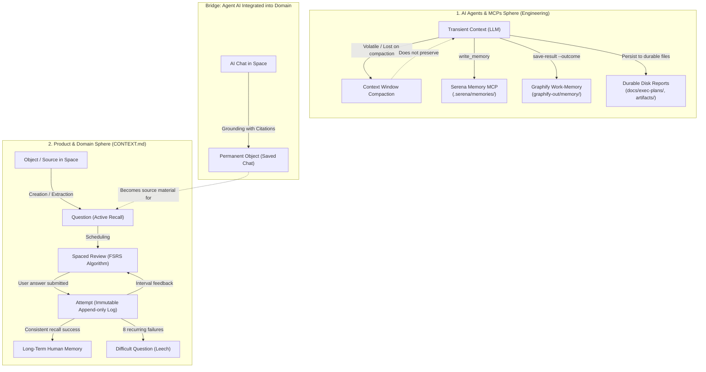

# Memory Architecture and Flow Guide: MCPs, Tools, Skills, and Domain

This guide documents the comprehensive ecosystem of **memory, retention, persistence, and lifecycle of data** across the `notes-app` repository, covering both the AI engineering / agent layer and the product's human cognitive retention domain.

---

## 1. High-Level Flow: The Dual Spheres of Memory

---

## 2. Engineering Sphere: Agents, MCPs, and Tools

### A. Serena MCP (`mcp-server-serena`)
Provides long-term external memory for coding agents.
- **Storage Location**: `.serena/memories/` (version-controlled Markdown files organized by topic, e.g., `permissions/`, `architecture/`).
- **Lifecycle**: Permanent on disk, tracked by Git.
- **Core Operations**:
  - `write_memory`: Stores durable directives, decisions, and patterns.
  - `read_memory`: Reads indexed memories on demand.
  - `list_memories`: Lists available operational memory keys.
  - `edit_memory` / `delete_memory`: Updates or prunes obsolete memory.

### B. Graphify MCP (`mcp-server-graphify`)
Serves as the structural and semantic memory of the codebase.
- **Primary Graph**: `graphify-out/graph.json` (network of code nodes, classes, symbols, and dependencies).
- **Work-Memory Overlay**:
  - Located in `graphify-out/memory/`, powered by `.agents/skills/graphify/reflect.py`.
  - Enables agents to tag trajectory results with feedback (`--outcome useful|dead_end|corrected`) so subsequent agent sessions learn optimal navigation paths.
  - Consolidates recurring takeaways into `graphify-out/reflections/LESSONS.md`.

### C. Transient Context vs. Disk Persistence (Subagent Development)
As specified in `.agents/skills/subagent-driven-development/SKILL.md`:
> *"Conversation memory does not survive compaction... the report file is the persistent memory either way."*
- LLM prompt context is volatile and lost during context window compaction.
- **Rule**: All non-trivial conclusions, implementation steps, and task state must be persisted as files on disk (`docs/exec-plans/active/`, `docs/`, or `.serena/memories/`).

### D. Prohibition of "Training-Data Memory"
As enforced in `.agents/rules/command-invariants.md`:
- Agents must never invent API parameters, shell flags, or domain terminology based on unverified "training memory".
- Agents must query authoritative sources via `ctx7` for third-party libraries, `Serena` for local symbols, and `Graphify` for repo topology.

---

## 3. Product Domain Sphere: Human Memory & Retention (`CONTEXT.md`)

In the product domain, "memory" directly refers to **human memory retention, active recall, and spaced repetition**:

| Concept | Canonical Term | Role in Memory Architecture |
| :--- | :--- | :--- |
| **Spaced Review** | `Review` | Spaced memorization mode scheduling Questions approaching forgetting using the FSRS algorithm. |
| **Attempt** | `Attempt` | Append-only immutable record of every answer submitted, tracking mnemonic stability over time. |
| **Target Retention** | `DailyLimit` | Configurable parameter setting the desired retention rate in long-term memory (e.g., 90%). |
| **Leech** | `Leech` | Question automatically flagged after repeated mnemonic failures (default: 8 "Forgot" reviews). |
| **Version History** | `VersionHistory` | Temporal memory of Object revisions enabling comparison and historical recovery. |
| **Permanent Chat** | `Chat` | AI conversations persisted as first-class domain Objects with exact source citations. |

---

## 4. Comprehensive Memory Matrix

| Mechanism | Location | Persistence | Primary Purpose |
| :--- | :--- | :--- | :--- |
| **Serena Memory** | `.serena/memories/*.md` | Permanent (Git) | Operational directives and conventions for coding agents |
| **Graphify Work-Memory** | `graphify-out/memory/` | Permanent (Disk) | Self-improving codebase navigation and Q&A outcomes |
| **LLM Context Window** | Process RAM / Tokens | Ephemeral (Volatile) | Immediate reasoning during an active agent turn |
| **Execution Plans / Artifacts** | `docs/exec-plans/`, `docs/` | Permanent (Git) | Durable state for multi-step agent workflows |
| **FSRS Review & Attempt** | Product Data Store | Permanent (Append-only) | Cognitive human memory tracking and spaced repetition |
| **Theme / LocalStorage** | Browser `localStorage` | Client Persistent | Web app theme preference (`light`/`dark`) |
