# Product-to-Engineering Lifecycle Flow

This guide defines the end-to-end development lifecycle for the `notes-app` repository, integrating high-level **Product Intent** (`INTENT.md`), detailed specifications (`docs/product-specs/`), domain invariants (`CONTEXT.md`), and the disciplined **AI Engineering Workflow** (`docs/guide/matt-pocock-workflow.md`).

---

## 1. End-to-End Lifecycle Overview

```mermaid
flowchart TD
    subgraph Product_Framing["1. Product Framing (Upstream Intent)"]
        direction TB
        Intent["INTENT.md<br/>• Problem & Outcomes (§1-§2)<br/>• Goals G-1..G-9 & Non-Goals NG-1..NG-7<br/>• Success Criteria P1..P8 (§8)"]
        Specs["docs/product-specs/<br/>• Phase Breakdown (0 to 6)<br/>• Conceptual Model & Invariants (INV-*)"]
        Context["CONTEXT.md<br/>• Canonical Domain Terms<br/>• Decisions (D-1..D-6)"]

        Intent --> Specs
        Specs --> Context
    end

    subgraph AI_Engineering["2. AI Engineering Workflow (Matt Pocock Lifecycle)"]
        direction TB
        Stage1["Stage 1: Alignment & Grilling<br/>(/grill-me, /grill-with-docs)<br/>• Stress-test idea against INTENT.md & CONTEXT.md<br/>• Resolve design options & identify testing seams"]
        Stage2["Stage 2: Specification & Slicing<br/>(/to-spec & /to-tickets)<br/>• Formal Markdown Spec with numbered stories<br/>• Vertical Tracer Bullets with Blocked-by graph"]
        Stage3["Stage 3: Implementation via TDD<br/>(/implement in fresh sessions)<br/>• Fresh context per ticket<br/>• Tests first, code second, RTK verification"]
        Stage4["Stage 4: Dual-Axis Code Review<br/>(/code-review & subagents)<br/>• Standards Axis vs Fowler smells & repo rules<br/>• Spec Axis vs originating ticket & INTENT.md"]

        Stage1 --> Stage2
        Stage2 --> Stage3
        Stage3 --> Stage4
    end

    subgraph Quality_Floor["3. Verification & Done Gate"]
        direction TB
        Gate["Pre-PR & Quality Floors<br/>• check:fast & check:ci<br/>• floor-guard & zero-duplication<br/>• Documentation & memory sync"]
        Main["Main Branch (Ship Value)"]

        Stage4 --> Gate
        Gate --> Main
    end

    Product_Framing -->|"Grounds and Constrains"| AI_Engineering
```

---

## 2. Phase-by-Phase Breakdown

### Phase 1: Upstream Product Grounding (`INTENT.md` & `CONTEXT.md`)
Every code change must trace back to an authorized intent before design or code begins:
1. **Identify the Goal and Phase**:
   - Check `INTENT.md` §3: Does this align with `G-1` through `G-9`? Does it violate any non-goals (`NG-1` through `NG-7`)?
   - Check `docs/product-specs/knowledge-learning-workspace.md` §9: In which phase does this feature belong (e.g., Phase 0 Foundation, Phase 1 Capture & Provenance, Phase 2 Queries & Views, Phase 3 Retention)?
2. **Anchor Vocabulary**:
   - Verify all entities and relations in `CONTEXT.md` §4. Avoid prohibited terms (e.g., use `Review` not "flashcard study", use `Question` not "exercise", use `Concept` not "tag").
3. **Check Invariants**:
   - Ensure changes respect core architectural invariants (`INV-1` single space ownership, `INV-4` provenance retention, `INV-10` bidirectional single-record relations).

---

### Phase 2: Alignment & Grilling (Stage 1)
- **Command / Skill**: `/grill-me` (or `/grill-with-docs`)
- **Objective**: Extract all edge cases, verify library behaviors using `ctx7`, and resolve open trade-offs before writing specifications.
- **Rules**:
  - The agent generates options and presents trade-offs; the developer makes architectural decisions.
  - Test boundaries and seams are identified up front.

---

### Phase 3: Specification & Vertical Slicing (Stage 2)
- **Command / Skill**: `/to-spec` followed by `/to-tickets`
- **Output**:
  - **Spec**: Located in `.scratch/<feature>/spec.md`. Contains user stories, non-goals, chosen testing seam, and links to `INTENT.md` criteria (`P1`–`P8`).
  - **Tickets**: Sliced into vertical tracer bullets (`.scratch/<feature>/issues/<NN>-<slug>.md`). Each ticket defines:
    - Target acceptance test.
    - Explicit `Blocked by:` dependencies.
    - Full vertical slice across domain, storage, and UI when applicable.

---

### Phase 4: Implementation via TDD in Fresh Contexts (Stage 3)
- **Command / Skill**: `/implement <ticket-path>`
- **Discipline**:
  - **Fresh Context**: Start a new session for each ticket to stay in the "Smart Zone" (<100k tokens).
  - **Test-Driven**: Write tests at the agreed seam first (using `vitest`), observe failure, implement minimum code to pass, refactor.
  - **Tool Invariants**: Always run commands through `rtk <command>`. Never invent unverified APIs from training memory.

---

### Phase 5: Dual-Axis Review & Quality Floors (Stage 4 & Done Gate)
- **Command / Skill**: `/code-review <fixed-point>...HEAD`
- **Parallel Axes**:
  - **Standards Axis**: Validates formatting (Biome), types (tsc), module boundaries (dependency-cruiser), and coding style.
  - **Spec Axis**: Verifies that implementation matches the originating user stories and preserves `INTENT.md` invariants.
- **Verification Gate**:
  - `rtk pnpm run check:fast` must pass.
  - Documentation and Serena memory must be kept synchronized.

---

## 3. Practical Example: Tracing a Feature End-to-End

| Step | Action | Artifact / Evidence |
| :--- | :--- | :--- |
| **0. Product Anchor** | Developer requests: *"Add text highlighting on source pages with persistent provenance."* | Anchored in `INTENT.md` (`G-3`, `P1`, `P2`) and Phase 1 of `knowledge-learning-workspace.md` (`R-PROV`, `INV-4`). Uses `Highlight` and `Locator` from `CONTEXT.md`. |
| **1. Grilling** | Agent executes `/grill-me`. Asks how W3C selectors are serialized, how orphaned highlights are handled, and what testing seam will be used. | Developer clarifies: store text quote + start/end offset, seam at `HighlightService`. |
| **2. Spec & Slicing** | Agent generates spec and runs `/to-tickets`. | Produces: `01-locator-model.md`, `02-highlight-service.md` (Blocked by 01), `03-ui-selection-overlay.md` (Blocked by 02). |
| **3. Implementation** | Fresh session executes `/implement 01-locator-model.md`. | Unit tests for locator serialization written first; implemented; passes `vitest`. |
| **4. Review & Quality** | Agent runs `/code-review`. | Both Standards and Spec axes pass. Verified with `rtk pnpm run check:fast`. Ready for PR. |
