# Notes App Design System Reference

> **Status**: Authoritative Reference  
> **Source**: Synchronized directly with [`DESIGN.md`](../../DESIGN.md)  
> **Architecture**: Local-First Knowledge Graph & Object Studio  
> **Visual Direction**: Editorial Minimalism, Monastic Knowledge Sanctuary, Capacities Parity  
> **UI Stack**: Next.js 16 (App Router), React 19, Tailwind CSS v4, Base UI Primitives, Plate Rich-Text Editor  

---

## 1. Product Identity & Design Philosophy

The Notes App visual identity and product experience are founded upon the principles of an **editorial monastic knowledge sanctuary**—a contemplative, high-precision digital studio engineered for deep focus, structured synthesis, and long-term knowledge compounding.

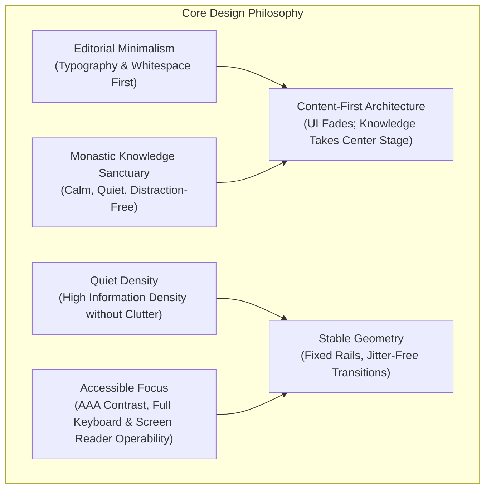

### Core Tenets

1. **Editorial Minimalism**: Typography and whitespace are treated as primary structural elements rather than mere decoration. Layouts evoke the restraint and clarity of bespoke editorial publishing.
2. **Monastic Knowledge Sanctuary**: The interface offers a serene, private environment devoid of noisy gamification badges, pulsing promotional banners, or chaotic widget toolbars. Every visual element earns its presence through functional necessity.
3. **Content-First Presentation**: Chrome, navigation rails, and property panes recede into the backdrop, elevating the user's notes, object relations, and multimedia synthesis to primary prominence.
4. **Quiet Density**: Visual hierarchy optimizes for information density without visual congestion. Compact controls, subtle typography scales, and modular cards ensure extensive knowledge graphs can be inspected comfortably at a glance.
5. **Stable Geometry & Jitter-Free Transitions**: Panel widths, gutters, and layout rails adhere to strict mathematical metrics. Accordions, drawers, and modal transitions utilize hardware-accelerated transforms (`transform`, `opacity`) to eliminate layout shift (CLS = 0).
6. **Accessible Focus & Inclusive Ergonomics**: Strict compliance with WCAG 2.2 AAA text contrast ratios and AA non-text UI control contrast. All interactive components maintain distinct focus rings (`outline-ring/50`) and full keyboard navigation lifecycles.

---

## 2. Semantic Color Tokens & OKLCH Architecture

The design system utilizes the **OKLCH** (Lightness, Chroma, Hue) color model to ensure perceptual uniformity, consistent contrast curves across varying hues, and predictable dark-mode transitions.

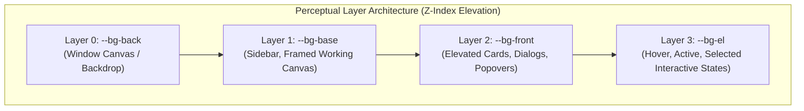

### Semantic Surface & Background Tokens

| CSS Variable | Light Mode (OKLCH) | Dark Mode (OKLCH) | Functional Role |
| :--- | :--- | :--- | :--- |
| `--bg-back` | `oklch(0.9856 0.0016 67)` | `oklch(0.1605 0.0063 285.63)` | Root application backdrop, gutter canvas surrounding floating framed panes. |
| `--bg-base` | `oklch(1 0.0001 263.28)` | `oklch(0.1971 0.006 285.78)` | Primary working surface, editor canvas body, sidebar panel background. |
| `--bg-front` | `oklch(1 0.0001 263.28)` | `oklch(0.2191 0.0058 285.84)` | Elevated surfaces, hover cards, dropdown menus, modal dialogs, inspector sheets. |
| `--bg-el` | `oklch(0.9676 0.0016 67.02)` | `oklch(0.2987 0.0072 285.88)` | Selected list rows, active tabs, subtle card backgrounds, badge foundations. |
| `--bg-el-hover` | `oklch(0.9406 0.0016 67.05)` | `oklch(0.3226 0.007 285.92)` | Ephemeral pointer hover overlay on interactive items and button controls. |
| `--bg-el-active` | `oklch(0.9163 0.0017 67.07)` | `oklch(0.3688 0.0051 286.01)` | Pressed/depressed state for buttons, active navigation selections. |
| `--bg-el-strong` | `oklch(0.9163 0.0017 67.07)` | `oklch(0.3688 0.0051 286.01)` | Strong selected state and compact control emphasis. |

### Border & Divider Tokens

| CSS Variable | Light Mode (OKLCH) | Dark Mode (OKLCH) | Functional Role |
| :--- | :--- | :--- | :--- |
| `--border-base` | `oklch(0.9163 0.0017 67.07)` | `oklch(0.2987 0.0072 285.88)` | Standard structural borders, card perimeters, panel dividers. |
| `--border-front` | `oklch(0.9163 0.0017 67.07)` | `oklch(0.2987 0.0072 285.88)` | Capacities parity hairline border for popovers, preview cards, and framed front surfaces. |
| `--border-base-strong` | `oklch(0.8643 0.0017 67.13)` | `oklch(0.3461 0.0069 285.94)` | Stronger control outlines and emphasized dividers. |
| `--border-subtle` | `oklch(0.000 0 0 / 6%)` | `oklch(1.000 0 0 / 8%)` | Hairline list dividers, table row borders, nested block boundaries. |
| `--border-strong` / `--ring` | `oklch(0.7161 0.006 30.59)` | `oklch(0.8643 0.0017 67.13)` | High-emphasis borders, active selection outlines, selected table cells, and keyboard focus rings. |

### Text & Typography Ink Tokens

| CSS Variable | Light Mode (OKLCH) | Dark Mode (OKLCH) | Contrast Ratio (vs Surface) | Functional Role |
| :--- | :--- | :--- | :--- | :--- |
| `--text-primary` | `oklch(0.2191 0.0058 285.84)` | `oklch(1 0.0001 263.28)` | AA+ | Document headings, primary body prose, active title labels. |
| `--text-secondary` | `oklch(0.3887 0.0052 301.05)` | `oklch(0.9163 0.0017 67.07)` | AA+ | Secondary descriptions, timestamps, property keys, metadata badges, and the shadcn `--primary` action ink. |
| `--text-subtle` | `oklch(0.5725 0.0051 33.89)` | `oklch(0.7161 0.006 30.59)` | AA | Placeholder text, disabled controls, breadcrumb separators, hotkey hints. |
| `--text-inverse` | `oklch(0.985 0 0)` | `oklch(0.145 0 0)` | ~14.5:1 (AAA) | High-contrast button labels, inverted badge text, solid tooltip prose. |

### Runtime Alias Contract

`src/app/globals.css` exposes the Capacities parity palette through both shadcn-compatible tokens (`--background`, `--foreground`, `--card`, `--popover`, `--primary`, `--border`, `--input`, `--ring`) and app-specific aliases (`--app-bg-*`, `--app-border-*`, `--app-text-*`, `--app-shadow-*`). Components should consume these aliases instead of duplicating literal OKLCH values.

The shadcn `--primary` token intentionally uses the measured Capacities action ink (`oklch(0.3887 0.0052 301.05)` in light mode) rather than a saturated brand color. Blue, red, green, amber, and violet remain semantic cues for focus, destructive actions, status, warnings, and relations.

---

## 3. Capacities 18-Tone Color System

The application adopts the complete **Capacities 18-Tone Palette** to power object type identities, taxonomy tags, status pills, and graph node categories. Every tone provides calibrated text, background, and border formulas that maintain legibility in both light and dark modes.

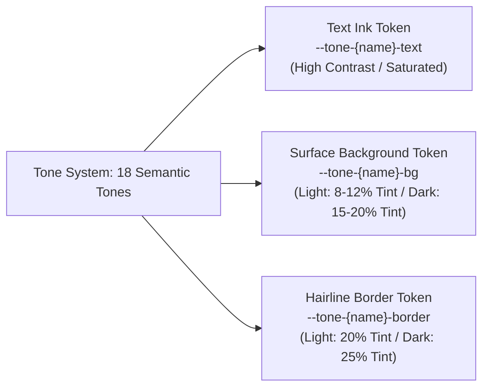

### Complete 18-Tone Token Specification

| Tone Name | Light Text (OKLCH) | Light Bg (OKLCH) | Dark Text (OKLCH) | Dark Bg (OKLCH) | Default Object / Domain Mapping |
| :--- | :--- | :--- | :--- | :--- | :--- |
| **Amber** | `oklch(0.55 0.16 75)` | `oklch(0.96 0.04 75)` | `oklch(0.82 0.14 75)` | `oklch(0.28 0.08 75)` | `atomic-note`, `idea`, `warning` callouts |
| **Blue** | `oklch(0.48 0.18 250)` | `oklch(0.95 0.04 250)` | `oklch(0.78 0.15 250)` | `oklch(0.26 0.08 250)` | `area`, `weblink`, `info` callouts |
| **Cyan** | `oklch(0.50 0.14 210)` | `oklch(0.95 0.03 210)` | `oklch(0.80 0.13 210)` | `oklch(0.26 0.07 210)` | `media`, `audio`, `transcripts` |
| **Emerald** | `oklch(0.48 0.16 155)` | `oklch(0.95 0.04 155)` | `oklch(0.80 0.14 155)` | `oklch(0.26 0.07 155)` | `project`, `place`, `active` status |
| **Fuchsia** | `oklch(0.50 0.22 320)` | `oklch(0.95 0.05 320)` | `oklch(0.80 0.18 320)` | `oklch(0.27 0.10 320)` | `ai-chat`, `creative prompt`, `synthesis` |
| **Gray** | `oklch(0.45 0.02 260)` | `oklch(0.94 0.01 260)` | `oklch(0.75 0.02 260)` | `oklch(0.25 0.01 260)` | `file`, `archive`, `system default` |
| **Green** | `oklch(0.46 0.17 140)` | `oklch(0.95 0.04 140)` | `oklch(0.78 0.15 140)` | `oklch(0.26 0.08 140)` | `task (done)`, `success` callout, `verified` |
| **Indigo** | `oklch(0.45 0.20 275)` | `oklch(0.95 0.04 275)` | `oklch(0.78 0.16 275)` | `oklch(0.26 0.08 275)` | `query`, `collection`, `database view` |
| **Lime** | `oklch(0.50 0.18 125)` | `oklch(0.96 0.04 125)` | `oklch(0.82 0.16 125)` | `oklch(0.28 0.08 125)` | `quick capture`, `highlight`, `active sprint` |
| **Neutral** | `oklch(0.40 0.00 0)` | `oklch(0.94 0.00 0)` | `oklch(0.80 0.00 0)` | `oklch(0.24 0.00 0)` | `page`, `generic note`, `plain text` |
| **Orange** | `oklch(0.52 0.18 55)` | `oklch(0.96 0.04 55)` | `oklch(0.80 0.15 55)` | `oklch(0.28 0.08 55)` | `person`, `contact`, `in progress` task |
| **Pink** | `oklch(0.52 0.20 350)` | `oklch(0.95 0.04 350)` | `oklch(0.80 0.17 350)` | `oklch(0.27 0.09 350)` | `highlight (pink)`, `inspiration`, `social` |
| **Purple** | `oklch(0.48 0.20 295)` | `oklch(0.95 0.04 295)` | `oklch(0.78 0.17 295)` | `oklch(0.26 0.09 295)` | `book`, `definition`, `travel`, `study topic` |
| **Red** | `oklch(0.50 0.22 25)` | `oklch(0.95 0.05 25)` | `oklch(0.78 0.18 25)` | `oklch(0.27 0.10 25)` | `meeting`, `organization`, `urgent` task |
| **Rose** | `oklch(0.50 0.20 10)` | `oklch(0.95 0.04 10)` | `oklch(0.80 0.17 10)` | `oklch(0.27 0.09 10)` | `quote`, `citation`, `favourite` |
| **Sky** | `oklch(0.50 0.16 230)` | `oklch(0.95 0.04 230)` | `oklch(0.80 0.14 230)` | `oklch(0.26 0.07 230)` | `pdf`, `whitepaper`, `cloud asset` |
| **Teal** | `oklch(0.48 0.15 185)` | `oklch(0.95 0.04 185)` | `oklch(0.78 0.13 185)` | `oklch(0.26 0.07 185)` | `flashcard`, `spaced repetition (FSRS)` |
| **Violet** | `oklch(0.46 0.21 285)` | `oklch(0.95 0.04 285)` | `oklch(0.78 0.17 285)` | `oklch(0.26 0.09 285)` | `study goal`, `curriculum`, `milestone` |

### Derived Tone Formulas

```css
/* Badge / Chip Formula */
.tone-badge-[tone] {
  color: var(--tone-[tone]-text);
  background-color: var(--tone-[tone]-bg);
  border: 1px solid var(--tone-[tone]-border, color-mix(in oklch, var(--tone-[tone]-text) 20%, transparent));
}

/* Hover Accent Formula */
.tone-hover-[tone]:hover {
  background-color: color-mix(in oklch, var(--tone-[tone]-text) 8%, var(--bg-base));
}
```

---

## 4. Typography Scale & Hierarchy

The typographic system utilizes **Inter** for clean, legible interface and document prose, paired with **Overpass Mono** or **JetBrains Mono** for code, math formulas, and tabular numerical records.

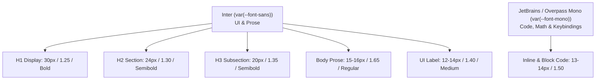

### Typographic Scale

| Token | Size | Line Height | Weight | Tracking | Usage Context |
| :--- | :--- | :--- | :--- | :--- | :--- |
| `text-xxs` | 10px (`0.625rem`) | 14px (`0.875rem`) | 500 (Medium) | `0` | Shortcut pills (`⌘K`), micro count badges, graph node labels |
| `text-xs` | 12px (`0.750rem`) | 16px (`1.000rem`) | 400 / 500 | `0` | Sidebar navigation, property keys, metadata timestamps |
| `text-sm` | 13px–14px (`0.875rem`) | 20px (`1.250rem`) | 400 / 500 | `0` | Standard buttons, inspector text, table cells, form inputs |
| `text-base` | 15px–16px (`1.000rem`) | 24px–26px (`1.625rem`) | 400 (Regular) | `0` | Primary note reading prose, block editor paragraph text |
| `text-lg` | 18px (`1.125rem`) | 28px (`1.750rem`) | 500 / 600 | `-0.01em` | Callout headers, subheadings, card section titles |
| `text-xl` | 20px (`1.250rem`) | 28px (`1.750rem`) | 600 (Semibold) | `-0.015em` | H3 document headings, modal dialog titles |
| `text-2xl` | 24px (`1.500rem`) | 32px (`2.000rem`) | 600 (Semibold) | `-0.02em` | H2 document headings, object collection titles |
| `text-3xl` | 30px (`1.875rem`) | 38px (`2.375rem`) | 700 (Bold) | `-0.025em` | H1 primary document title, space banner display header |

### Reading Ergonomics & Measure
- **Optimal Line Length**: Capped between `65` and `75` characters per line (`max-w-3xl` / `680px`–`760px`).
- **Letter Spacing**: Default `letter-spacing: 0` for body text to preserve native font metrics and screen-rendering clarity.

---

## 5. Spatial Metrics, Radii, Whisper Shadows & Glass

### Standard Control Height Metrics

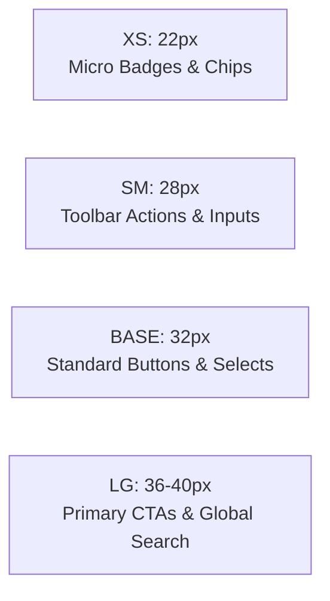

| Control Size | Height | Horizontal Padding | Icon Size | Font Token | Use Case |
| :--- | :--- | :--- | :--- | :--- | :--- |
| `xs` | 22px (`1.375rem`) | 6px (`0.375rem`) | 12px | `text-xxs` | Inline property badges, micro pill tags, tag chips |
| `sm` | 28px (`1.750rem`) | 8px (`0.500rem`) | 14px | `text-xs` | Toolbar icon buttons, table cell triggers, view switcher |
| `base` | 32px (`2.000rem`) | 12px (`0.750rem`) | 16px | `text-sm` | Primary form buttons, standard inputs, dropdown selectors |
| `lg` | 36px–40px (`2.250rem`) | 16px (`1.000rem`) | 18px | `text-base` | Hero action buttons, global search bar (`⌘K`), quick-add button |

### Border Radii Progression

| Radius Token | Value | Applied Components |
| :--- | :--- | :--- |
| `rounded-xs` | 4px (`0.25rem`) | Tooltips, micro status dots, inline code snippets |
| `rounded-sm` | 6px (`0.375rem`) | Property label chips, tag pills, small menu items |
| `rounded-md` | 8px (`0.500rem`) | Standard buttons, inputs, context menus, dropdown popovers |
| `rounded-lg` / `radius` | 10px–12px (`0.625rem`–`0.75rem`) | Framed space canvas, cards, modal dialogs, inspector sheets |
| `rounded-full` | 9999px | Avatars, floating pill action bars, status pills |

### Whisper Shadows & Glassmorphism

```css
/* Ambient Whisper Shadow (Cards, Popovers) */
.shadow-whisper {
  box-shadow: 
    0 1px 2px 0 oklch(0 0 0 / 4%),
    0 2px 6px 1px oklch(0 0 0 / 2%);
}

/* Elevated Whisper Shadow (Modals, Floating Command Palette) */
.shadow-whisper-elevated {
  box-shadow: 
    0 12px 32px -4px oklch(0 0 0 / 8%),
    0 4px 12px -2px oklch(0 0 0 / 4%);
}

/* Glassmorphism Surface (Sticky Headers, Floating Toolbars) */
.surface-glass {
  background-color: color-mix(in oklch, var(--bg-base) 80%, transparent);
  backdrop-filter: blur(12px) saturate(180%);
  -webkit-backdrop-filter: blur(12px) saturate(180%);
  border: 1px solid var(--border-subtle);
}
```

---

## 6. Three-Pane Space Shell Geometry

The space shell operates on a rigid **Three-Pane Framed Canvas Architecture**, isolating navigation, editing, and relational inspection into predictable spatial zones.

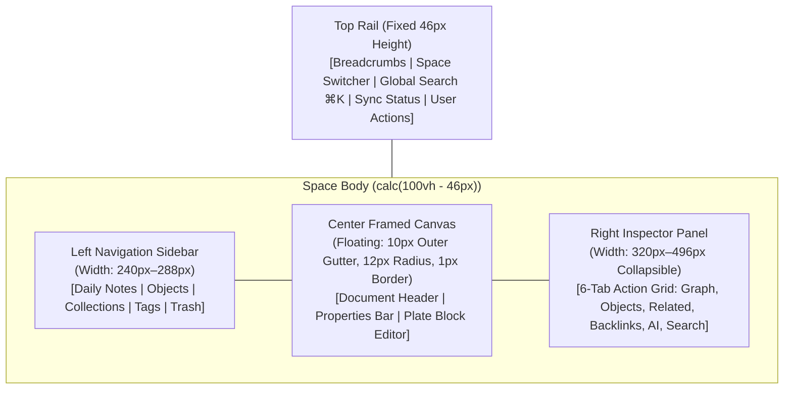

### Spatial Grid Metrics

1. **Top Rail (46px Fixed)**: Persistent global header with space switcher, breadcrumb path, fast search button (`⌘K`), sync mutation indicator, and user profile.
2. **Left Sidebar (240px–288px)**: Collapsible navigation column supporting drag-resizable boundaries, pinned daily notes calendar, object types directory, and custom collection views.
3. **Center Framed Canvas**:
   - Floating framed container elevated over `--bg-back` with a **10px outer gutter**.
   - Border radius: **12px** (`rounded-xl`).
   - Hairline border: `1px solid var(--border-base)`.
   - Independent vertical scrolling (`overflow-y: auto`) with zero horizontal jitter.
   - Reading prose column centered with `max-w-3xl` (760px).
4. **Right Inspector Panel (320px–496px)**: Multi-tab context drawer providing instant access to graph relationships and metadata:
   - **Tab 1: Graph** — Local interactive D3/WebGL node-link visualization centered on active entity.
   - **Tab 2: Objects** — Child entity references and embedded structured objects.
   - **Tab 3: Related** — Explicit typed graph relations (`sourceId` $\rightarrow$ `targetId`).
   - **Tab 4: Backlinks** — Incoming reciprocal references and unlinked keyword mentions.
   - **Tab 5: AI Chat** — Grounded conversational assistant with active note context injection.
   - **Tab 6: Search / Properties** — Dynamic property schema inspector and faceted search filters.

### Responsive Breakpoints & Adaptive Layouts

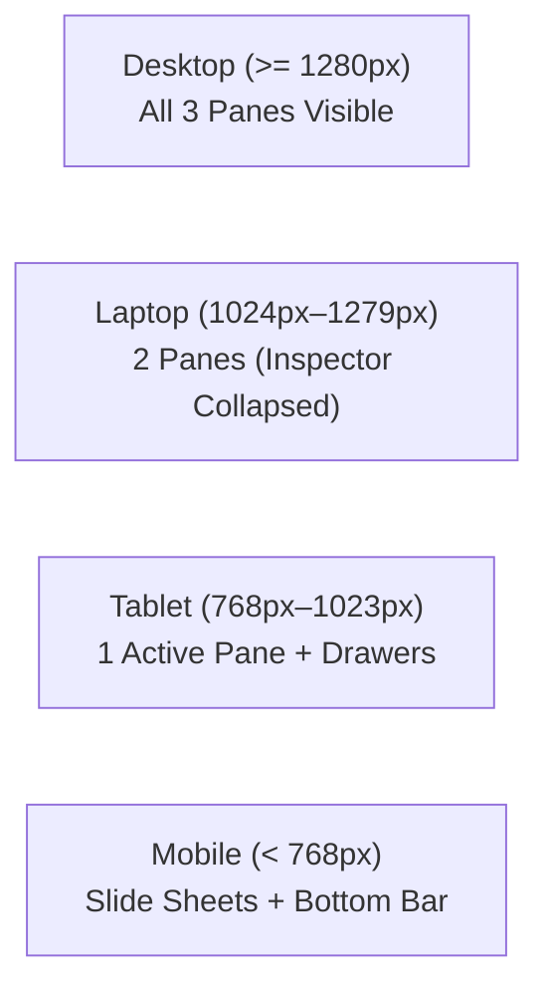

- **Desktop (`>= 1280px`)**: Full three-pane simultaneous layout. Left sidebar and right inspector remain pinned.
- **Laptop / Medium (`1024px – 1279px`)**: Two-pane primary layout. Right inspector defaults to collapsed state, opening as an overlay sheet on demand.
- **Tablet (`768px – 1023px`)**: Single active framed canvas. Left sidebar slides out as a modal drawer; right inspector operates as an overlay sheet.
- **Mobile (`< 768px`)**: Full-screen single canvas. Bottom navigation bar replaces top rail navigation; sidebar and inspector convert to bottom slide sheets; dynamic `visualViewport` event handling prevents soft-keyboard input clipping (`padding-bottom: env(safe-area-inset-bottom)`).

---

## 7. Object-Based Architecture & Entity Models

In contrast to traditional folder-bound note applications, all items are modeled as first-class, typed semantic objects residing within partitioned multi-tenant **Spaces**.

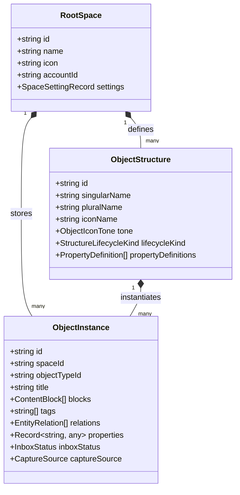

### Core Domain Entities

1. **Daily Notes (`type: "daily_note"`)**: Time-anchored journal entries binding external calendar events, automated task rollups (scheduled, completed, carried-over), and daily reflection metrics.
2. **Tasks (`type: "task"`)**: Actionable GTD items featuring lifecycle status (`todo`, `in_progress`, `done`, `cancelled`), due date intervals, priority tiers (`low`, `medium`, `high`, `urgent`), and reciprocal parent/subtask relations.
3. **Media Assets (`type: "image" | "audio" | "pdf" | "file"`)**: Binary files persisted in the `media` storage table with extracted OCR text, Whisper audio transcripts with waveform peaks, and PDF table-of-contents trees.
4. **Highlights & Citations (`type: "highlight"`)**: Verbatim grounded excerpts anchored to source files or web articles with color codes, DOM selectors, and page coordinates.
5. **Flashcards (`type: "flashcard"`)**: Spaced repetition study cards grounded in source quotes, scheduled via the Free Spaced Repetition Scheduler (**FSRS**) mathematical engine (`stability`, `difficulty`, `interval`, `lapses`).
6. **Study Goals (`type: "study_goal"`)**: Pacing dashboards calculating daily card quotas and exam burndown milestones.

---

## 8. Object Views & Data-View Layouts

Entities can be embedded across documents or rendered inside collection views via **6 Object Presentation Modes** and **4 Collection Data-View Layouts**.

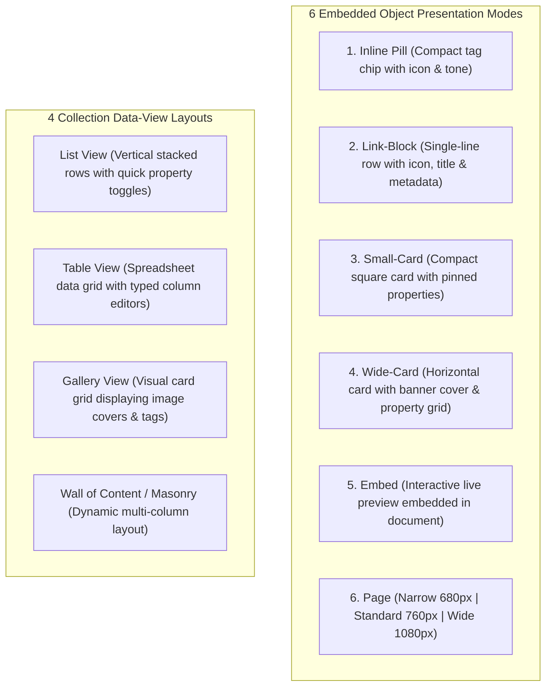

### Embedded Object Presentations

1. **Inline Pill**: Compact inline chip containing object icon, tone background, title, and interactive hover-card trigger.
2. **Link-Block**: Full-width single-line callout block with leading icon, title, excerpt snippet, and quick relation badge.
3. **Small-Card**: Compact grid card highlighting object icon, title, and up to 3 pinned properties (`smallCardVisiblePropertyIds`).
4. **Wide-Card**: Feature card with top/left media cover image, object type badge, title, full property key-value grid, and backlink counter.
5. **Embed**: Embedded interactive sub-view allowing full reading and block editing inside parent documents.
6. **Page View**: Full-screen object space supporting three selectable layout widths:
   - **Narrow**: 680px centered reading column.
   - **Standard**: 760px balanced editorial column.
   - **Wide**: 1080px or 100% full-width canvas for wide tables, data queries, and board views.

### Collection Data-View Layouts

1. **List View**: Clean vertical list optimized for rapid scanning, batch selection, and inline status toggles.
2. **Table View**: High-density spreadsheet grid with drag-and-drop column reordering, adjustable column widths, typed cell renderers (select pills, currency, progress bars, entity links), sorting, and multi-filter bars.
3. **Gallery View**: Visually-driven grid rendering aspect-ratio covers, object badges, and primary tag chips.
4. **Wall of Content / Masonry**: Adaptive multi-column layout distributing object cards by content height to maximize viewport utilization without awkward vertical gaps.

---

## 9. Block Editor & Content Components

The rich-text block editing layer is built on the **Plate** framework (`platejs` v53, Slate foundation) with locally-owned source components from the `@plate` registry.

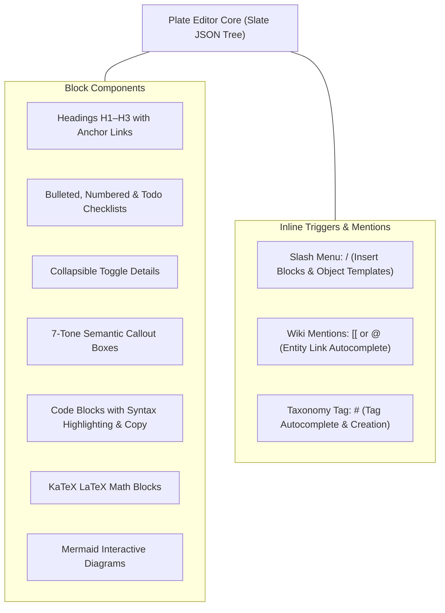

### Callout Status Types (7 Semantic Variants)

| Callout Type | Tone Token | Icon | Functional Meaning |
| :--- | :--- | :--- | :--- |
| **Info** | Blue | `Info` | Neutral informative notes, contextual background |
| **Note** | Slate / Neutral | `FileText` | General annotations, author commentary |
| **Success** | Emerald / Green | `CheckCircle2` | Successful validations, verified facts, completed goals |
| **Warning** | Amber | `AlertTriangle` | Cautionary advisories, potential pitfalls, exam alerts |
| **Danger / Error** | Red | `AlertOctagon` | Critical errors, destructive actions, invalidated hypotheses |
| **Tip / Idea** | Lime / Yellow | `Lightbulb` | Actionable tips, brainstorm prompts, creative ideas |
| **Quote** | Rose / Violet | `Quote` | Direct quotations, literary citations, grounded excerpts |

---

## 10. Floating UI & Interaction Timing Contract

To ensure predictable, responsive, and fatigue-free navigation, all floating UI elements adhere to strict **interaction timing contracts**.

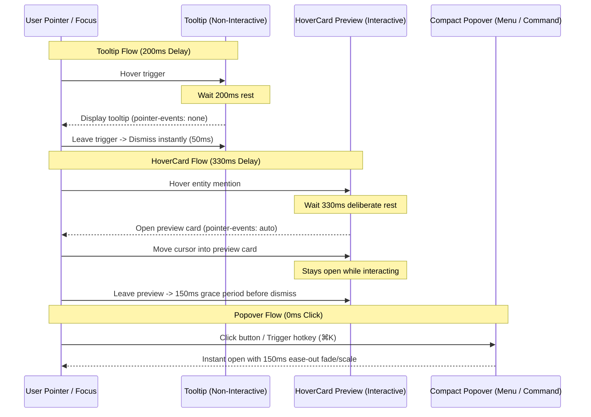

### Interaction Timing Specification

| Floating UI Type | Show Delay | Hide Delay / Grace | Pointer Events | Animation Transform | Use Case |
| :--- | :--- | :--- | :--- | :--- | :--- |
| **Tooltip** | 200ms | 50ms | `none` | Fade in (100ms) | Icon button descriptions, hotkey shortcuts |
| **HoverCard Preview** | 330ms | 150ms grace period | `auto` | Fade & scale (`scale(0.98)` $\rightarrow$ `1.0`) | Entity wiki-links, mention chips, user profile cards |
| **Compact Popover** | 0ms (instant click) | 0ms (on outside click/esc) | `auto` | Spring ease-out (150ms, `cubic-bezier(0.16, 1, 0.3, 1)`) | Slash commands, dropdown menus, color pickers |
| **Command Palette (`⌘K`)** | 0ms (instant hotkey) | 0ms | `auto` | Fade & slide down (120ms) | Global search, command execution, quick switch |

---

## 11. AI Assistant & Agent Interaction Protocols

The space integrates a privacy-conscious, context-grounded AI assistant operating under strict user-approval boundaries.

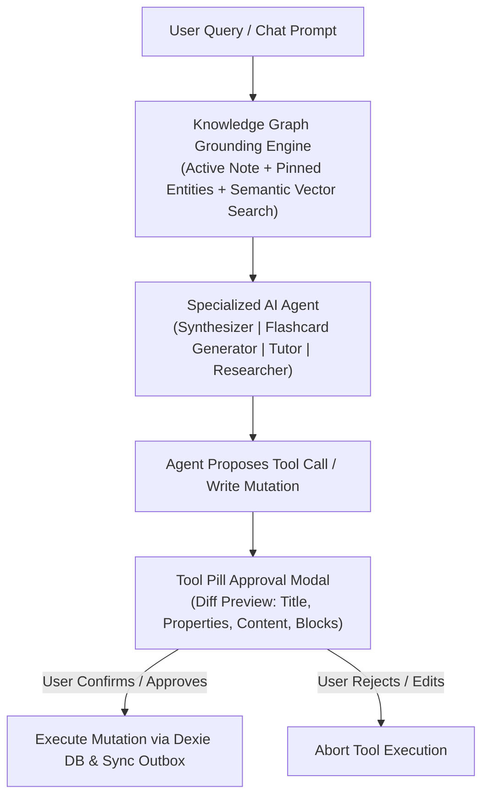

### Specialized AI Agent Archetypes

1. **Knowledge Synthesizer**: Generates cross-document summaries, extracts thematic tags, and discovers emergent entity clusters across spaces.
2. **Flashcard Generator (FSRS)**: Parses highlighted study texts and creates atomic Q&A / cloze flashcard sets grounded in source snippets.
3. **Socratic Tutor**: Conducts interactive active-recall dialogues grounded strictly in the user's verified notes and ingested textbooks.
4. **Research Assistant**: Formats structured bibliographies, web clip summaries, and literature comparison tables.

### Tool Pill Approval & Mutation Safety

- **Zero Silent Mutations**: The AI cannot silently modify user notes, create records, or delete items.
- **Tool Pill Approval Modal**: Before executing any write tool (e.g. `create_entity`, `update_properties`, `delete_relation`), a structured diff preview card is presented showing:
  - Exact property modifications (before vs. after).
  - Target entity title, space, and icon badge.
  - One-click **Approve** (`Enter`) or **Reject** (`Esc`).
- **BYOK & Local MCP Protocols**:
  - Full support for **Bring-Your-Own-Key (BYOK)** with client-side encrypted storage.
  - Native integration with **Model Context Protocol (MCP)** tool servers for external filesystem access and terminal tooling.

---

## 12. Verification & Architectural Cross-References

### Verification Standards

1. **TypeScript Typing Invariants**: All entity models, property value types, and tone definitions must compile with zero errors (`pnpm typecheck`).
2. **Biome Linter & Formatter**: Clean formatting and zero lint violations across all documentation, stories, and components (`pnpm check`).
3. **Ladle Story Workbench**: Every design token, button size, callout variant, and editor block is visually verifiable in Ladle stories under `src/components/ladle/` and `docs/design/design.stories.tsx`.

### Related Architecture Documents

- [Primary Architecture Specification](../../ARCHITECTURE.md)
- [Domain Entities & Knowledge Architecture Specification](../architecture/entities.md)
- [Space Partitioning & Multi-Tenant Specification](../architecture/spaces.md)
- [Routing & App Router Layout Specification](../architecture/routing.md)
- [Historical Reference Synthesis (Worktrees & Capacities)](../../graphify-out/HISTORICAL_REFERENCE_SYNTHESIS.md)
- [Architectural Decision Records Index (MADR)](../../DECISIONS.md)
- [ADR-0008: Plate Rich-Text Editor Framework Migration](../decisions/0008-plate-rich-text-editor-framework-migration.md)
- [Design System Specification Root](../../DESIGN.md)
