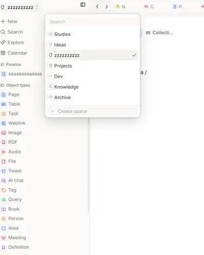

# Capacities sidebar Task placement reference

This reference records the placement visible in the user-provided Capacities screenshot and is consistent with the archived workspace sources supplied for the Notes App parity work.

## Confirmed observations

- Primary navigation contains New, Search, Explore, and Calendar.
- Pinned content follows primary navigation.
- `Task` is an object-type row, not a primary-navigation row.
- Within the visible built-in object types, the order is Page, Table, Task, Weblink, Image, PDF, Audio, File, Tweet, AI chat, Tag, and Query before optional preset types.
- The reference image uses English copy; Notes App localizes the same Structure as `Tarefa` in Portuguese.

## Source provenance

- User-provided screenshot received on 2026-08-24.
- `capacities-wacz-complete-source(1).jsonl` and the supplied WACZ archives were checked as supporting reference sources.
- The screenshot is stored in the repository because repository instructions require supplied visual references to remain available with the project source.
