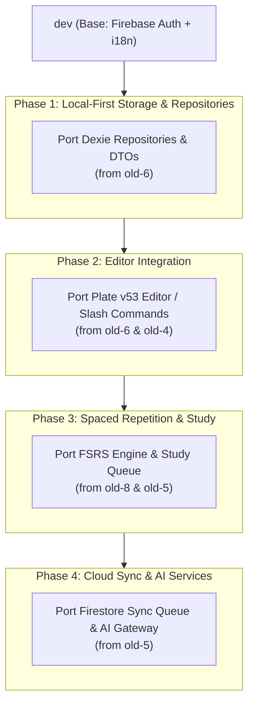

# Git Worktrees Comprehensive Audit & Porting Roadmap

**Date:** 2026-09-18  
**Scope:** Audit of all 9 historical worktrees (`.worktrees/old` through `.worktrees/old-8`) compared against the active branch `feature/home` and `dev`.  
**Auditors Dispatched:** 3 parallel `worktree-auditor` subagents partitioning the workspace surface area.

---

## Executive Summary

The repository contains 9 git worktrees under `.worktrees/`, created from past experimental and feature development iterations. All 9 worktrees have **clean working copies** (0 uncommitted/untracked files) and their branches are backed up on `origin/`.

Across the 9 worktrees, several mature, production-grade subsystems were developed that are absent from `feature/home` (which recently established the modern Firebase Auth + i18n routing baseline). These subsystems represent significant value and can be selectively cherry-picked and integrated.

### Worktree Status & Action Matrix

| Worktree | Branch | HEAD Commit | Commits vs `feature/home` | Core Feature Focus | Action Recommendation |
| :--- | :--- | :--- | :--- | :--- | :--- |
| **`old`** | `old` | `e2234be5` | +36 (orphan) / -42 | Early Graphify setup, 17 OpenSpec change sets | **Remove worktree** (export specs if needed) |
| **`old-1`** | `old-1` | `c2fca623` | +6 / -49 | Agent guidelines, `grill-me` planning skill | **Cherry-pick skill & remove worktree** |
| **`old-2`** | `old-2` | `7d142092` | +18 / -49 | Capacities UI/UX reverse engineering, 3.4k line shell | **Keep branch; port Capacities UI shell** |
| **`old-3`** | `old-3` | `19105d01` | +22 / -49 | Prototype Capacities layout & reference graphs | **Remove worktree** (superseded by `old-4`/`old-5`) |
| **`old-4`** | `old-4` | `2839f410` | +379 / -49 | Full Block Editor (slash commands), Workspace DB, E2E | **Keep worktree** (port Editor & DB engine) |
| **`old-5`** | `old-5` | `0857a997` | +157 / -49 | FSRS engine, AI card generation, Firestore sync, D3 graph | **Keep worktree** (port SRS, AI & sync) |
| **`old-6`** | `old-6` | `f336db18` | +80 / -49 | Plate v53 Block Editor, Dexie repositories, Object buttons | **Keep branch** (port Plate editor & Dexie DAL) |
| **`old-7`** | `old-7` | `e5d9048a` | +39 / -49 | Prototype Space Shell, Study API, React Best Practices | **Remove worktree** (superseded by `old-6`/`old-8`) |
| **`old-8`** | `old-8` | `d930d7a7` | +21 / -49 | "Revisa" FSRS Spaced Repetition engine & multi-card viewer | **Keep worktree** (port FSRS study suite) |

---

## Detailed Findings by Worktree Group

### Group 1: Scaffolding, Governance & Early Parity (`old`, `old-1`, `old-2`)

1. **`.worktrees/old` (`e2234be5`)**:
   - **Characteristics**: Built upon an orphaned root commit (`fb20e8ea`) with no common merge base with `feature/home`.
   - **Key Assets**: 17 structured OpenSpec change sets in `openspec/changes/` covering knowledge object models, rich editors, AI assistant specs, and graph discovery.
   - **Recommendation**: Prune the physical worktree directory (`git worktree remove .worktrees/old`).

2. **`.worktrees/old-1` (`c2fca623`)**:
   - **Characteristics**: Diverged directly at commit `46a64d8a`; contains no application source code.
   - **Key Assets**: Plan sharpening agent skill under `.agents/skills/grill-me/`.
   - **Recommendation**: Cherry-pick `.agents/skills/grill-me/` into main development and prune the worktree (`git worktree remove .worktrees/old-1`).

3. **`.worktrees/old-2` (`7d142092`)**:
   - **Characteristics**: Deep reverse-engineering and visual parity effort for Capacities-style workspaces.
   - **Key Assets**:
     - `src/components/workspace-shell.tsx` (3,440-line component matching Capacities navigation, object types, and panels).
     - Extracted design tokens and asset extraction scripts in `reverse-engineering/` and `scripts/`.
     - Knowledge base comparison graphs in `docs/references/knowledge-bases/` (`CAPACITIES_GRAPH.md`, `OBSIDIAN_GRAPH.md`, `READWISE_GRAPH.md`).
   - **Recommendation**: Retain branch `old-2`; adapt UI shell components into the new localized `app/[lang]/` layout.

---

### Group 2: Advanced Workspace Architecture & Backend Services (`old-3`, `old-4`, `old-5`)

1. **`.worktrees/old-3` (`19105d01`)**:
   - **Characteristics**: Early iteration of the collapsible sidebar and Capacities layout.
   - **Key Assets**: Benchmark graph fixtures (`capacities.json`, `obsidian.json`, `readwise.json`).
   - **Recommendation**: Prune worktree (`git worktree remove .worktrees/old-3`) as all components are superseded with higher fidelity in `old-4` and `old-5`.

2. **`.worktrees/old-4` (`2839f410`)**:
   - **Characteristics**: Massive 379-commit feature development branch implementing a full-featured note workspace.
   - **Key Assets**:
     - Custom Block Editor Engine: `src/editor/` (`block-editor.tsx`, `slash-command.tsx`, `table-block.tsx`, `block-command-catalog.tsx`).
     - Workspace Data & Graph Layer: `src/lib/workspace-database.ts`, `workspace-graph.ts`, `workspace-query-engine.ts`, `workspace-table-formulas.ts`.
     - Comprehensive E2E testing: 57 test files in `tests/e2e/`.
   - **Recommendation**: Keep worktree `.worktrees/old-4` active as an implementation reference; port the block editor and query engine into clean PRs on `dev`.

3. **`.worktrees/old-5` (`0857a997`)**:
   - **Characteristics**: 157-commit backend and intelligence feature branch.
   - **Key Assets**:
     - FSRS Spaced Repetition Engine: `src/lib/srs/fsrs.ts`, `flashcard-review.ts`.
     - AI Gateway & Grounded Card Generation: `src/lib/ai/ai-gateway.ts`, `grounded-card-orchestrator.ts`.
     - Document Extraction: `src/lib/documents/document-binary-extractors.ts`.
     - Cloud Firestore Sync Engine: `src/lib/sync/sync-engine.ts`, `firestore-writer.ts`, `sync-queue.ts`.
     - D3 Knowledge Graph: `src/components/ui/knowledge-graph.tsx`.
   - **Recommendation**: Keep worktree `.worktrees/old-5` active; prioritize porting the FSRS algorithm, AI gateway, and Firestore sync queue.

---

### Group 3: Modern Editor Subsystems & Flashcard Application (`old-6`, `old-7`, `old-8`)

1. **`.worktrees/old-6` (`f336db18`)**:
   - **Characteristics**: 80-commit branch implementing a modern Plate v53 block editor and local-first Dexie repositories.
   - **Key Assets**:
     - Plate v53 Editor Integration: `src/components/editor/` & `src/lib/editor/` (supporting Mermaid diagrams, math blocks, highlight blocks, tables).
     - Dexie/IndexedDB Repository Layer: `src/lib/db/repositories/` (entities, spaces, collections, relations, tags, trash, mutations) with full test coverage.
     - 28 Object Icons & Split-Buttons: `src/components/objects/icons/` and `src/components/objects/split-buttons/`.
     - Portuguese Architecture Decisions: `docs/translations/pt-br/decisions/` (ADR 0006–0009).
   - **Recommendation**: Keep branch `old-6`; port Plate v53 editor and Dexie repositories into the main application.

2. **`.worktrees/old-7` (`e5d9048a`)**:
   - **Characteristics**: Intermediate space shell prototype.
   - **Key Assets**: Review API route (`src/app/api/reviews/route.ts`) and Vercel React Best Practices rules.
   - **Recommendation**: Prune worktree (`git worktree remove .worktrees/old-7`); the branch remains preserved on Git.

3. **`.worktrees/old-8` (`d930d7a7`)**:
   - **Characteristics**: Dedicated "Revisa" Spaced Repetition flashcard system.
   - **Key Assets**:
     - Complete FSRS scheduling engine: `src/domain/scheduler.ts` (using `ts-fsrs`), `study-queue.ts`, `goals.ts`, `error-analysis.ts`.
     - Multi-format Card Viewers: `src/components/study/` (Anki cards, Readwise highlights, exam questions).
     - Decks, Backup, & Analytics UI: `src/components/deck/`, `src/components/backup/`, `src/components/analytics/`.
     - Playwright E2E Suite: `e2e/revisa.spec.ts`.
   - **Recommendation**: High priority to merge or port into a dedicated study route (e.g. `feature/fsrs-study`). Keep worktree `.worktrees/old-8` until migration is complete.

---

## Strategic Porting Roadmap

To avoid unmanageable merge conflicts, **do NOT execute `git merge` directly on these branches**. Instead, port components incrementally into focused feature branches targeting `dev`:



### Immediate Cleanup Action Plan
1. **Prune redundant worktrees**:
   ```bash
   git worktree remove .worktrees/old
   git worktree remove .worktrees/old-1
   git worktree remove .worktrees/old-3
   git worktree remove .worktrees/old-7
   ```
2. **Retain for active migration**:
   - `.worktrees/old-4` (Editor catalog & workspace graph)
   - `.worktrees/old-5` (AI gateway & Firestore sync engine)
   - `.worktrees/old-6` (Plate v53 editor & Dexie repositories)
   - `.worktrees/old-8` (FSRS study engine & card renderers)
