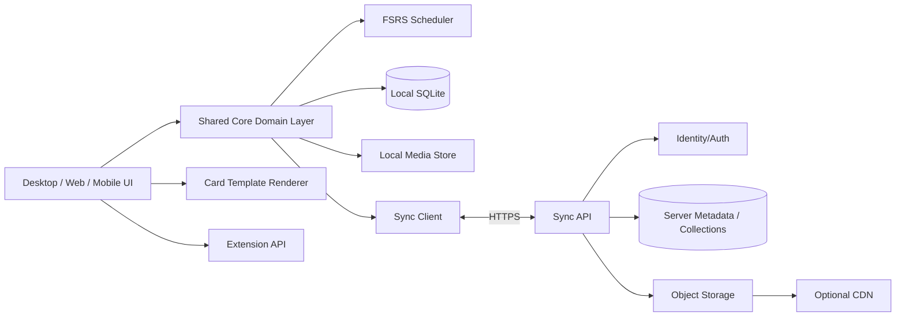
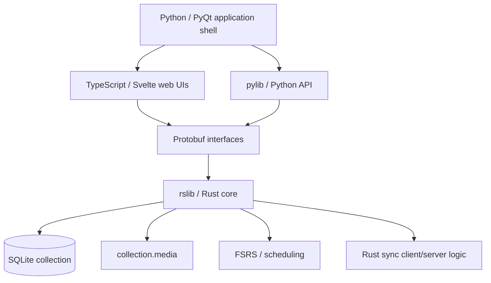
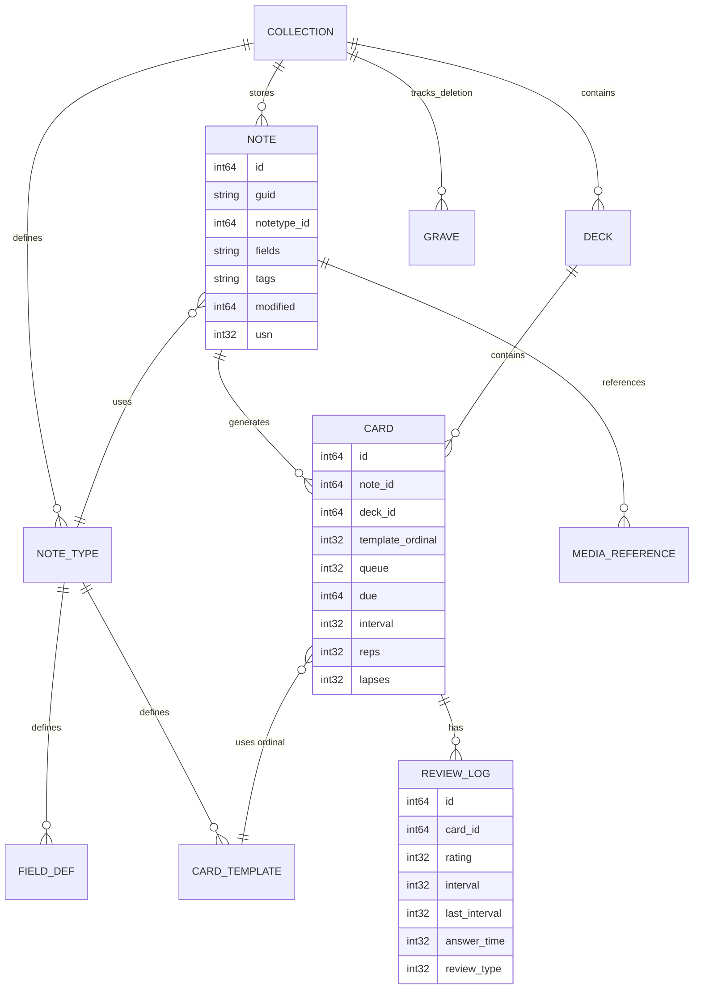
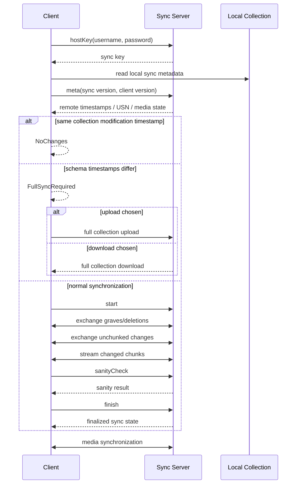

# Recreating an Anki-Class Spaced-Repetition Application: Architecture, Formats, Algorithms, Sync, Extensions, Security, and Implementation Blueprint

## Executive summary

Anki is best understood not as a “flashcard app” but as a **local-first database application with a scheduling engine, HTML/CSS card-rendering system, synchronization protocol, media store, extensibility runtime, import/export compatibility layer, and cross-platform UI**. The desktop implementation has progressively moved core logic into Rust while retaining a Python/PyQt desktop layer and TypeScript/Svelte webview-based interfaces. The authoritative desktop codebase is the [`ankitects/anki`](https://github.com/ankitects/anki) repository. As of August 10, 2026, the latest GitHub release is **Anki 26.08.1**, released August 5, 2026. citeturn26search11turn19search2

For a new application, there are two fundamentally different strategies:

| Strategy | What it means | Main consequence |
|---|---|---|
| **Anki-derived implementation** | Fork or directly reuse substantial portions of the official code | Fastest path to exact compatibility, but the main Anki code is AGPL-3.0-or-later and your distribution/network-use obligations must be assessed accordingly. citeturn5view0 |
| **Clean-room Anki-compatible implementation** | Reimplement behavior, file compatibility, scheduler semantics, and UX using your own code | More engineering work, but gives substantially more flexibility over architecture and licensing. The Anki trademark must still be treated separately from code copyright. citeturn24search4turn5view0 |

For a modern greenfield product, my recommended architecture is:



This preserves the most valuable architectural property of Anki: **the local database is authoritative for normal application use, and studying does not require a network round trip**. The official application stores collection information in `collection.anki2` and media in `collection.media`, and its self-hosted sync server likewise stores server-side copies of collection and media data. citeturn18search0turn26search5

For scheduling, a new implementation should make **FSRS the primary scheduler**, while implementing legacy Anki/SM-2-compatible scheduling only when import/export or behavior compatibility requires it. Current Anki exposes FSRS as an alternative to its legacy SM-2-derived scheduler, and Anki 26.08 updated its FSRS implementation to `fsrs-rs 6.6.1`. FSRS models three memory variables—difficulty, stability, and retrievability—and can optimize parameters from a user’s review history. citeturn12view0turn18search5turn11view0

The hardest engineering areas are **not basic flashcards**. They are:

1. preserving database and `.apkg` compatibility over multiple Anki generations;
2. reproducing scheduler edge cases;
3. offline/online synchronization and full-sync recovery;
4. safe rendering of arbitrary HTML/CSS/JavaScript from shared decks;
5. media synchronization;
6. card-generation semantics for templates, cloze, and image occlusion;
7. search/browser behavior;
8. a stable add-on API.

The official source already exposes most of the protocol and implementation details needed to study those areas. In particular, the Rust sync tree contains collection and media synchronization implementations, including metadata negotiation, graves/deletions, change chunks, sanity checks, full upload/download and authentication. citeturn15view0turn15view1turn15view2turn16view0

A realistic engineering estimate—not an Anki project estimate—is **roughly 45–75 experienced engineer-months for a production-quality Anki-class cross-platform product**, and potentially well over **100 engineer-months for very high Anki compatibility, mobile clients, a robust cloud service, import/export edge cases, plugin compatibility, accessibility and polished UX**. A focused desktop/web MVP can be substantially smaller. These estimates are inferred from the breadth of the official source, protocol, scheduler, editor, browser, media, package and extension systems described below. citeturn4view0turn20search2turn15view0turn21search2

## Official codebase and architectural baseline

The most important rule for this project is: **treat the upstream Anki repository as the executable specification, and the manual as the user-visible specification**. The database schema, package formats and sync protocol are implementation details that have evolved; hard-coding an old community description without testing against current Anki is likely to produce compatibility bugs. The official add-on documentation itself recommends going through Anki's APIs instead of directly mutating SQLite because APIs maintain synchronization metadata and other invariants. citeturn21search6turn20search2

**Primary source map**

| Resource | Direct link | Why it matters |
|---|---|---|
| Anki desktop source | [github.com/ankitects/anki](https://github.com/ankitects/anki) | Canonical desktop/core implementation. citeturn26search11 |
| Anki Manual | [docs.ankiweb.net](https://docs.ankiweb.net/) | Canonical description of product behavior and UX. citeturn0search19 |
| GitHub releases | [github.com/ankitects/anki/releases](https://github.com/ankitects/anki/releases) | Release history, compatibility changes and security fixes. Latest observed release: 26.08.1. citeturn19search2 |
| Main license | [github.com/ankitects/anki/blob/main/LICENSE](https://github.com/ankitects/anki/blob/main/LICENSE) | AGPL-3.0-or-later and component-license exceptions. citeturn5view0 |
| Security policy | [github.com/ankitects/anki/blob/main/SECURITY.md](https://github.com/ankitects/anki/blob/main/SECURITY.md) | Critical if you render shared-deck HTML/JavaScript. citeturn25view2 |
| Development/build guide | [github.com/ankitects/anki/blob/main/docs/development.md](https://github.com/ankitects/anki/blob/main/docs/development.md) | Build process, tests, Python wheels and packaging. citeturn6view0 |
| JS/TS package configuration | [github.com/ankitects/anki/blob/main/package.json](https://github.com/ankitects/anki/blob/main/package.json) | Shows current Svelte/TypeScript/Vite-related frontend dependencies. citeturn13search3 |
| Python project configuration | [github.com/ankitects/anki/blob/main/pyproject.toml](https://github.com/ankitects/anki/blob/main/pyproject.toml) | Python workspace/build configuration. citeturn13search4 |
| Add-on development docs | [addon-docs.ankiweb.net](https://addon-docs.ankiweb.net/) | Official extension architecture documentation. citeturn21search2 |
| Add-on hooks | [addon-docs.ankiweb.net/hooks-and-filters.html](https://addon-docs.ankiweb.net/hooks-and-filters.html) | Hook/filter/WebView extension mechanisms. citeturn21search0 |
| `anki` Python API | [addon-docs.ankiweb.net/the-anki-module.html](https://addon-docs.ankiweb.net/the-anki-module.html) | Programmatic collection/card/note APIs. citeturn21search6 |
| Self-hosted sync documentation | [github.com/ankitects/anki-manual/blob/main/src/sync-server.md](https://github.com/ankitects/anki-manual/blob/main/src/sync-server.md) | Official server setup and operational constraints. citeturn26search5 |

The repository reflects a deliberately mixed architecture. The core repository has Rust (`rslib`), Python library code (`pylib`), Qt desktop code (`qt`), TypeScript/web code (`ts`) and protocol definitions (`proto`). The official add-on documentation summarizes the UI as primarily Python/PyQt with a number of screens using TypeScript and Svelte. Current `package.json` includes Svelte, SvelteKit, Vite, Playwright, Vitest, D3, Fabric, CodeMirror, MathJax and protobuf-related components. citeturn4view0turn26search1turn13search3

A useful reconstruction of the upstream architecture is therefore:



That architecture is worth copying conceptually even if you do not copy code: **keep scheduling, persistence, searching, card generation, imports/exports and sync rules in a platform-neutral domain layer**. A desktop shell, web app and mobile app should call the same semantic operations rather than each independently implementing “answer card”, “change note”, “generate cards”, or “merge sync changes”. The official Python API already exhibits that pattern by delegating operations such as imports, note updates, browser queries and image-occlusion operations into the backend. citeturn20search2

For build/release reproducibility, Anki's source development workflow includes Rust tooling, Ninja/N2-oriented builds, application tests and frontend checks, while the repository produces native installers/packages for supported desktop platforms. citeturn6view0turn18search2turn18search4turn18search6

A clean-room project should go one step further and formalize a **stable internal service API** such as:

```text
CollectionService
  createNote()
  updateNote()
  deleteNotes()
  generateCards()
  searchNotes()
  searchCards()

SchedulerService
  getNextCard()
  answerCard()
  previewIntervals()
  optimizeFSRS()
  reschedule()

TemplateService
  renderQuestion()
  renderAnswer()
  validateTemplate()
  enumerateGeneratedCards()

MediaService
  importAsset()
  resolveAsset()
  checkMedia()
  syncMedia()

SyncService
  getStatus()
  normalSync()
  fullUpload()
  fullDownload()
```

The important detail is that UI code should not issue arbitrary SQL. The official Anki API documentation explicitly warns that direct database writes can lead to problems and recommends methods that correctly mark items for synchronization. citeturn21search6

## Collection data model, packages, templates, and media

At the user-profile level, Anki stores card/collection information in `collection.anki2`, media in `collection.media`, and maintains backups separately. Anki warns against live synchronization of the profile directory with generic file-sync systems because simultaneous filesystem synchronization can corrupt the SQLite database. citeturn18search0turn26search10

The most useful canonical legacy/compatibility schema source is:

[**`rslib/src/storage/schema11.sql`**](https://github.com/ankitects/anki/blob/main/rslib/src/storage/schema11.sql) citeturn1search0

Its core tables are:

| Table | Purpose | Important fields |
|---|---|---|
| `col` | Collection-global metadata/configuration | collection timestamps, schema timestamp, sync USN, JSON/configuration data, models, decks, tags. citeturn1search0 |
| `notes` | User-authored semantic notes | `id`, `guid`, note-type/model ID `mid`, modification/sync fields, tags, packed fields `flds`, sort field, checksum. citeturn1search0 |
| `cards` | Generated reviewable cards | `id`, note ID `nid`, deck ID `did`, template ordinal `ord`, scheduling state/queue, due, interval, ease factor, repetitions, lapses, original deck/due. citeturn1search0 |
| `revlog` | Individual answer/review events | card ID, answer/ease, resulting interval, previous interval, factor, elapsed answer time and review type. citeturn1search0 |
| `graves` | Deletion tombstones | synchronization sequence number, deleted object ID and type. citeturn1search0 |

The classic schema also creates indices around synchronization sequence numbers, card→note lookup, scheduling, review-log→card lookup and note checksums, which is a strong clue about the hot query paths you need to optimize in a compatible implementation. citeturn1search0

A logical data model looks like this:



This diagram intentionally represents the **logical model**, not a promise that every object is stored today as a normalized SQL table. Historically, substantial configuration such as note types/decks lived as serialized values associated with the collection, and modern Rust code performs schema upgrades and transformations. For exact compatibility, treat current Anki itself and its import/export tests as the authority rather than assuming `schema11.sql` is the complete modern physical schema. citeturn1search0turn0search20

The key conceptual separation is:

**Note → content**  
**Note type → field definitions + card templates**  
**Card → generated review object + scheduling state**

A single note can generate multiple cards. For example, a language note with `English` and `Spanish` fields can generate an English→Spanish card and a Spanish→English card. Anki's built-in types include Basic, Basic with typed answer, Cloze and Image Occlusion, and note types exist collection-wide rather than belonging exclusively to a deck. citeturn23search3turn0search5

A compatible internal object model might look like:

```json
{
  "note": {
    "id": 1900000000001,
    "guid": "stable-import-guid",
    "noteTypeId": 1001,
    "fields": {
      "Front": "capital of France",
      "Back": "Paris"
    },
    "tags": ["geography", "europe"]
  },
  "noteType": {
    "id": 1001,
    "name": "Basic",
    "fields": ["Front", "Back"],
    "templates": [
      {
        "ordinal": 0,
        "name": "Card 1",
        "question": "{{Front}}",
        "answer": "{{FrontSide}}<hr id=\"answer\">{{Back}}"
      }
    ],
    "css": ".card { font-family: sans-serif; }"
  },
  "card": {
    "noteId": 1900000000001,
    "templateOrdinal": 0,
    "deckId": 1
  }
}
```

That is a normalized illustrative representation rather than a byte-for-byte dump of Anki's current structures. Anki templates themselves are HTML with CSS styling and field substitutions, and the template editor previews the generated front and back. citeturn23search7turn23search15

**Card-generation rule.** Do not store redundant front/back HTML as the primary card content. Store the note fields plus note-type templates and generate rendered cards from them. This is what allows one note-type template change to update thousands of cards and one note to generate multiple sibling cards. Anki's manual explicitly describes card templates as controlling both what appears on front/back and which cards get generated. citeturn23search7

**Cloze.** Anki represents cloze markup in note text, for example:

```text
Canberra was founded in {{c1::1913}}.
```

Hints can be encoded as:

```text
{{c1::Canberra::city}}
```

Anki supports multiple cloze indices and nested cloze deletions, subject to implementation limits. citeturn24search11

A cloze parser therefore needs to produce an AST rather than relying solely on a simplistic regular expression if you want correct nested-cloze behavior:

```text
ClozeNode
  index: integer
  text: string | Node[]
  hint: optional string
```

Then determine the set of generated cards from the distinct cloze indices used by the note.

**Image Occlusion.** Native Image Occlusion has been supported since Anki 23.10. It supports rectangle, ellipse and polygon masks; Hide All/Guess One and Hide One/Guess One behavior; shape grouping; text overlays; editing, zooming, alignment, translucency and one generated card per independent shape/group. The backend Python facade exposes methods to create/update image-occlusion notes and passes image paths and serialized occlusion data into the backend. citeturn24search11turn20search2

For a greenfield implementation, I would model masks explicitly:

```json
{
  "image": "anatomy-heart.webp",
  "mode": "hide_all_guess_one",
  "objects": [
    {
      "id": "mask-a",
      "kind": "rectangle",
      "x": 0.21,
      "y": 0.33,
      "width": 0.18,
      "height": 0.09,
      "group": null
    }
  ]
}
```

Use normalized coordinates so masks survive resizing, and serialize an interoperable representation at import/export boundaries.

**Packages.** Anki distinguishes `.apkg` deck packages from `.colpkg` full-collection packages. An `.apkg` can contain notes, note types, decks, cards, media and optionally scheduling information. A collection package represents an entire collection and has different replacement semantics on import. citeturn0search0turn19search9

The current protocol definitions are especially important:

[**`proto/anki/import_export.proto`**](https://github.com/ankitects/anki/blob/main/proto/anki/import_export.proto) citeturn20search1

Current package metadata recognizes:

| Package generation | Collection entry |
|---|---|
| Legacy version 1 | `collection.anki2` |
| Legacy version 2 | `collection.anki21` |
| Current package version | `collection.21b`, with the protocol describing zstd compression and structured media entries. citeturn20search1 |

The current `MediaEntries` representation includes each asset's name, size and SHA-1 digest, with compatibility support for legacy numeric zip filenames. citeturn20search1

Older `.apkg` generations conventionally use a ZIP archive containing the collection plus a `media` mapping where numbered ZIP entries correspond to original media filenames. Historical Anki exporter code demonstrates the numeric media mapping and writes a `collection.anki2` member for legacy packages. citeturn19search1

**Do not design your parser around only one `.apkg` generation.** Build:

```text
PackageReader
  detectVersion()
  validateArchive()
  readCollection()
  readMediaManifest()
  streamMedia()
  normalizeIntoInternalModel()

PackageWriter
  writeLegacyApkg()
  writeCurrentApkg()
  writeCollectionPackage()
```

Anki 23.10+ also permits more sophisticated deck-update behavior: imported notes/note types can be updated, preserved, or merged, and modern field/template IDs help merge note types. citeturn19search9

**Media on disk.** Normal media lives in `collection.media`. Anki can detect missing and unused files with Check Media. Files intended to be referenced directly from templates should normally begin with `_`, which tells Anki not to classify them as unused merely because the scanner does not find them in note fields. citeturn26search2turn26search16

Media references should be stored explicitly in note fields rather than assembled dynamically in a template. The manual warns that constructs such as:

```html

```

cannot be reliably handled by media checking/import/export. citeturn26search14

For your implementation, maintain a parsed media-reference index:

```text
note_id → {
    image filenames,
    audio filenames,
    video filenames,
    template-static assets
}
```

and separately maintain an asset table:

```text
asset_id
logical_filename
sha256
byte_size
mime_type
created_at
local_state
remote_state
```

Using SHA-256 internally is my recommendation; retain SHA-1 only where Anki package compatibility requires it. Current Anki package metadata specifically includes SHA-1 for media entries. citeturn20search1

A storage comparison:

| Storage design | Advantages | Problems | Recommendation |
|---|---|---|---|
| **SQLite + filesystem media** | Matches Anki's local-first model; transactional structured data; excellent offline behavior. | Need a separate media-consistency layer. | **Best default client architecture.** Anki itself follows this pattern. citeturn18search0turn26search2 |
| SQLite with blobs | Atomic single database | Huge DB files, costly incremental media sync and backup behavior | Avoid for large media. |
| IndexedDB/browser storage | Natural for pure web/PWA | Harder `.anki2` compatibility and browser quota/lifecycle constraints | Useful for web-only clients, not canonical format. |
| Server PostgreSQL + object storage | Horizontal SaaS-friendly metadata/media split | Requires explicit mapping from local collection semantics | Recommended cloud architecture for a greenfield SaaS. |
| Generic cloud-drive sync of SQLite | Very little backend work | Concurrent file synchronization risks corruption | **Do not use as live collection sync.** Anki explicitly warns against this model. citeturn26search10 |

## Scheduling engines and memory math

The scheduler must be treated as a domain subsystem rather than a collection of UI delay calculations. At minimum it needs states for **new**, **learning**, **review**, **relearning**, **suspended**, **buried**, and filtered-deck/original-deck behavior. Anki exposes separate learning/relearning steps, sibling burying, daily limits, ordering rules, maximum intervals and four review ratings—Again, Hard, Good and Easy. citeturn12view0turn23search2turn23search8turn23search11

### Core algorithm choices

| Algorithm | State | Personalization | Modern Anki relevance | Implementation recommendation |
|---|---|---|---|---|
| **SM-2** | repetition count, interval, ease factor | Very limited | Historical foundation | Implement for reference/import compatibility. citeturn8search4 |
| **Anki legacy scheduler** | card state, ease, interval, deck options, learning steps | User-configured scheduler parameters | Still documented as legacy alternative to FSRS | Required for close Anki behavior compatibility. citeturn12view0 |
| **FSRS** | Difficulty `D`, Stability `S`, Retrievability `R`, learned parameters | High; parameters can be fit from review history | Current strategic scheduler; Anki 26.08 uses fsrs-rs 6.6.1 | **Recommended default.** citeturn11view0turn18search5 |

The original SM-2 description comes from Piotr Woźniak's SuperMemo work:

[**SuperMemo SM-2 algorithm**](https://super-memory.com/english/ol/sm2.htm) citeturn8search4

A simplified classical SM-2 process is:

For answer quality \(q \in [0,5]\), update ease factor approximately as:

\[
EF' = EF + 0.1-(5-q)(0.08+(5-q)\cdot0.02)
\]

with a minimum ease of approximately:

\[
EF' \ge 1.3
\]

For successful answers, the early intervals are initialized approximately as:

\[
I_1 = 1,\qquad I_2 = 6
\]

and later intervals use:

\[
I_n \approx I_{n-1}\cdot EF
\]

while failed answers restart the repetition sequence. Those are the historical SM-2 mechanics; Anki's legacy scheduler has evolved additional state, learning steps and configurable interval modifiers rather than being a literal implementation of the original algorithm. citeturn8search4turn12view0

The legacy Anki options documented today include concepts such as **Starting Ease**, **Easy Bonus**, **Interval Modifier**, **Hard Interval** and **New Interval**. The manual currently documents defaults including a Starting Ease of 2.50 and Easy Bonus of 1.30. citeturn12view0

For a clone, never represent the scheduler as just:

```text
nextDue = today + previousInterval * multiplier
```

because learning/relearning steps, filtered decks, sibling burying, lapse handling, fuzzing, maximum intervals, daily limits and scheduler ordering all influence actual behavior. citeturn12view0turn23search5

### FSRS model

The most important implementation resources are:

- [FSRS project / implementations](https://github.com/open-spaced-repetition/free-spaced-repetition-scheduler) citeturn10view0
- [Current algorithm description](https://github.com/open-spaced-repetition/awesome-fsrs/wiki/The-Algorithm) citeturn11view0
- [`fsrs-rs`](https://github.com/open-spaced-repetition/fsrs-rs), the optimizer/library family used in Anki's ecosystem. citeturn11view1
- [`rs-fsrs`](https://github.com/open-spaced-repetition/rs-fsrs) citeturn11view2
- [`ts-fsrs`](https://github.com/open-spaced-repetition/ts-fsrs) for TypeScript applications. citeturn11view3
- Ye et al., **“A Stochastic Shortest Path Algorithm for Optimizing Spaced Repetition Scheduling,” KDD 2022**, [ACM DOI](https://dl.acm.org/doi/10.1145/3534678.3539081). The work used a dataset of hundreds of millions of review logs and reported deployment results in the MaiMemo system. citeturn9search0turn9search15
- Original research/code associated with the KDD work: [`maimemo/SSP-MMC`](https://github.com/maimemo/SSP-MMC). citeturn9search5

FSRS describes memory through:

\[
D = \text{Difficulty}
\]

\[
S = \text{Stability}
\]

\[
R = \text{Retrievability}
\]

where current documentation defines stability as the interval at which retrievability falls to approximately 90%, and grades are encoded as `1=Again`, `2=Hard`, `3=Good`, `4=Easy`. citeturn11view0

The current FSRS-6 documentation gives the default parameter vector:

```text
[
  0.212,
  1.2931,
  2.3065,
  8.2956,
  6.4133,
  0.8334,
  3.0194,
  0.001,
  1.8722,
  0.1666,
  0.796,
  1.4835,
  0.0614,
  0.2629,
  1.6483,
  0.6014,
  1.8729,
  0.5425,
  0.0912,
  0.0658,
  0.1542
]
```

corresponding to \(w_0\ldots w_{20}\). citeturn11view0

The FSRS-6 forgetting curve is:

\[
R(t,S)=
\left(
1+\text{factor}\cdot\frac{t}{S}
\right)^{-w_{20}}
\]

with:

\[
\text{factor}=0.9^{-1/w_{20}}-1
\]

which ensures:

\[
R(S,S)=0.9
\]

by construction. citeturn11view0

Solving that curve for an interval \(t\) that corresponds to a target retention \(r\) gives:

\[
t=
\frac{S}{\text{factor}}
\left(
r^{-1/w_{20}}-1
\right)
\]

This inversion follows algebraically from the published FSRS-6 forgetting curve. citeturn11view0

The current FSRS-6 same-day stability formulation is documented as:

\[
S'(S,G)
=
S\cdot
\exp(w_{17}(G-3+w_{18}))
\cdot
S^{-w_{19}}
\]

where \(G\) is the rating. citeturn11view0

Earlier FSRS-family formulations illustrate the broader transition structure. Initial stability is rating-dependent, and difficulty is initialized and then adjusted based on answer grades with damping/mean reversion. Successful recalls increase stability based on current stability, difficulty and retrievability; failed recalls calculate a new post-lapse stability. The current authoritative equations should be taken from the FSRS algorithm page and the exact `fsrs-rs` version you vendor, because FSRS has evolved through multiple model generations. citeturn11view0turn11view1

**Do not independently retype the algorithm into three clients.** Put it in a single core library or use official/reference FSRS implementations appropriate to each platform. The FSRS repository lists maintained implementations across Rust, TypeScript, Python, Go, Dart, Swift and other ecosystems. citeturn10view0

Anki's FSRS UX also introduces **desired retention**. The manual describes 90% as the default and explains the fundamental tradeoff: increasing desired retention generally increases workload. Parameters can be optimized from the user's own review history and are associated with deck presets. citeturn12view0

Your scheduler API should therefore resemble:

```text
schedule(
  cardMemoryState,
  reviewHistory,
  rating,
  timestamp,
  fsrsParameters,
  desiredRetention,
  learningConfiguration
) -> {
  updatedMemoryState,
  nextInterval,
  nextDue,
  reviewLogEntry
}
```

The review log should be append-oriented and treated as analytically valuable data. Anki's `revlog` tracks each answer and supports statistics such as answer-button distributions; FSRS parameter optimization likewise depends on review history. citeturn1search0turn23search20turn12view0

## Synchronization, APIs, and conflict handling

The official sync code is unusually valuable for a reimplementation because both client and self-hostable server components live in the public source tree.

Primary links:

| Sync component | Direct source |
|---|---|
| Sync root | [rslib/src/sync](https://github.com/ankitects/anki/tree/main/rslib/src/sync) citeturn15view0 |
| Collection sync | [rslib/src/sync/collection](https://github.com/ankitects/anki/tree/main/rslib/src/sync/collection) citeturn15view1 |
| Media sync | [rslib/src/sync/media](https://github.com/ankitects/anki/tree/main/rslib/src/sync/media) citeturn15view2 |
| Collection protocol | [collection/protocol.rs](https://github.com/ankitects/anki/blob/main/rslib/src/sync/collection/protocol.rs) citeturn16view0 |
| Sync-state negotiation | [collection/meta.rs](https://github.com/ankitects/anki/blob/main/rslib/src/sync/collection/meta.rs) citeturn17view5 |
| Normal sync orchestration | [collection/normal.rs](https://github.com/ankitects/anki/blob/main/rslib/src/sync/collection/normal.rs) citeturn17view3 |
| Authentication/login | [sync/login.rs](https://github.com/ankitects/anki/blob/main/rslib/src/sync/login.rs) citeturn17view0 |
| Request/auth representation | [sync/request](https://github.com/ankitects/anki/blob/main/rslib/src/sync/request/mod.rs) citeturn1search3 |
| Self-hosted server guide | [sync-server.md](https://github.com/ankitects/anki-manual/blob/main/src/sync-server.md) citeturn26search5 |

The collection protocol currently exposes operations corresponding to login/metadata/start, deletion exchange, change exchange, chunk streaming, sanity checking, finalization/abort, and one-way upload/download. The protocol enum contains endpoints including `hostKey`, `meta`, `start`, `applyGraves`, `applyChanges`, `chunk`, `applyChunk`, `sanityCheck2`, `finish`, `abort`, `upload` and `download`. citeturn16view0

A normal sync is approximately:



That order is directly reflected in `normal.rs`: after metadata/status negotiation, normal sync begins a transaction, starts and processes deletions, processes unchunked changes, reads server chunks, sends client chunks, performs a sanity check and then finalizes. On failure the local transaction is rolled back and the server is asked to abort. citeturn17view3

The metadata phase is particularly useful for reproducing full-sync semantics. Anki compares local and remote collection metadata:

\[
remote.modified = local.modified
\Rightarrow \text{NoChanges}
\]

\[
remote.schema \ne local.schema
\Rightarrow \text{FullSyncRequired}
\]

otherwise:

\[
\text{NormalSyncRequired}
\]

The metadata also includes collection modification timestamp, schema timestamp, USN, server time/message and media state information. citeturn17view5

That provides an important architectural distinction:

**Content edits** can normally merge incrementally.  
**Schema-changing operations** can force a one-way/full collection synchronization.

This prevents a very difficult class of merge problems where clients disagree about note-type/card-generation structure. citeturn17view5

The classic schema's `usn` fields and `graves` deletion tombstones provide the persistence foundation for incremental synchronization. A deletion cannot simply erase all knowledge of an object locally, because another device may need to learn that the object was deleted. citeturn1search0

For your own system, make this explicit:

```text
SyncTrackedObject {
    id
    modified_at
    revision_or_usn
    deleted
}
```

or keep a separate tombstone stream:

```text
Tombstone {
    object_type
    object_id
    revision
    deleted_at
}
```

The exact same-object conflict semantics should be validated against Anki's upstream sync tests rather than summarized as a simplistic universal “last-write-wins” rule. The upstream implementation has distinct paths for notes, cards, decks/configuration, deletions and chunks, so compatibility testing is more reliable than imposing a generic database-sync theory on the protocol. citeturn15view1turn17view3

Authentication starts by sending a username/password request to the `hostKey` operation. The login implementation serializes the username as `u` and password as `p`, and the returned host/sync key becomes the credential used for subsequent synchronization. The request layer additionally distinguishes the long-lived sync key from a session key used for stateful/concurrent synchronization behavior. citeturn17view0turn1search3

The official self-hosted server supports multiple configured users through environment variables, can use PHC-format password hashes instead of plaintext configured passwords, and stores server data under `~/.syncserver` by default unless `SYNC_BASE` is changed. citeturn26search5

Crucially, the built-in server listens over unencrypted HTTP. The official documentation explicitly recommends not exposing that directly to the internet and instead placing it on a protected network/VPN or behind an HTTPS reverse proxy. citeturn26search5

For a public SaaS clone, I would **not** reproduce that deployment shape literally. Use:

```text
Internet
   ↓ HTTPS
Load Balancer / API Gateway
   ↓
Stateless Sync/API nodes
   ├── Identity service
   ├── Collection-sync coordinator
   └── Media API
            ↓
      Metadata database
            +
       Object storage
            ↓
         CDN
```

For very large scale, one useful sharding key is `user_id`, because the natural transactional boundary of this product is usually a user's collection/profile rather than arbitrary cards spread across many users.

A sync-backend comparison:

| Backend | Compatibility | Scalability | Complexity | Best use |
|---|---:|---:|---:|---|
| **Official Anki sync-server code/protocol** | Highest | Moderate without additional infrastructure | Low–medium | Compatibility-first/self-hosted product. Official server is documented and open in the Anki codebase. citeturn15view0turn26search5 |
| Custom protocol-compatible server | High if carefully tested | High | High | Commercial service that needs Anki clients/import workflows |
| Custom revision-based API | None automatically | High | Medium | New product where Anki compatibility is only at import/export boundaries |
| Generic database sync/BaaS | Low | Potentially high | deceptively low initially | Prototype; often awkward once schema changes, tombstones and full-sync rules matter |
| CRDT-based sync | Requires translation layer | High | Very high | Collaborative editing, not necessary for ordinary Anki-style single-user collections |

For compatibility testing, build a **protocol differential test harness**: create identical collections, apply edits on A/B, sync against Anki's reference server and your server, then compare resulting notes/cards/review history/decks/media and synchronization metadata. Include simultaneous note editing, deletion on one device/update on another, note-type changes, deck renaming, review on multiple clients, interrupted chunk transfer, clock skew and full-sync cases.

Media synchronization should be a separate subsystem from structured collection sync, matching Anki's own separate `sync/media` implementation. citeturn15view2

## Product surface, add-ons, media, security, and legal constraints

A functional Anki replacement requires considerably more UX than “question, answer, four buttons.”

The core editor must support note types, fields, tags, deck selection, duplicate detection, rich text, bold/italic/underline, subscript/superscript, colors, lists, media attachment, microphone recording, MathJax/LaTeX, cloze creation, HTML editing and field-level behavior such as sticky fields. Anki checks the first field for duplicates within a note type and offers broader duplicate finding from the browser. citeturn23search0turn24search11

The card renderer needs HTML/CSS templates, field substitution, front-side reuse, conditional behavior, typed answers, embedded fonts/media and MathJax. Templates determine both rendering and card generation. citeturn23search7turn23search15

The reviewer needs at minimum question→answer transition, Again/Hard/Good/Easy ratings, interval preview, undo, editing during review, mark/flag, suspend, bury, sibling handling, audio replay, keyboard/touch controls and statistics logging. Anki supports `1–4` answer shortcuts, Space/Enter, sibling burying and distinct semantics for buried vs suspended cards. citeturn23search2

The browser is effectively a query workbench. Anki supports separate Card and Note table modes, a searchable hierarchical sidebar, deck/tag/search composition, saved searches, sortable columns and an inline editing area. Its browser and filtered-deck features share the same search language. citeturn23search1turn23search13

Do not underestimate the search language. It becomes a platform API because browser views, filtered decks and even FSRS optimization scopes can depend on searches. citeturn23search13

An approximate product-level module map is:

```text
Library
  Deck tree
  Due/new counts
  Deck options

Editor
  Note type
  Fields
  Tags
  Rich text
  Media
  Cloze
  Image occlusion
  Template editor

Reviewer
  Render front/back
  Audio
  Again / Hard / Good / Easy
  Undo
  Edit / bury / suspend / flag

Browser
  Search DSL
  Card/note table
  Bulk operations
  Sort columns
  Inline editing
  Preview

Scheduler
  Learning/relearning
  FSRS
  Legacy scheduling
  Filtered decks
  Limits/order/burying

Statistics
  Review history
  Retention
  Future due
  Answer buttons
  Workload

Platform
  Sync
  Import/export
  Media
  Backups
  Add-ons
```

### Add-on ecosystem

Official add-on development starts here:

[**Writing Anki Add-ons**](https://addon-docs.ankiweb.net/) citeturn21search2

Desktop add-ons are Python modules loaded at startup. They can register hooks, manipulate application objects and modify UI behavior. citeturn21search2

Modern hooks are exposed through typed hook collections such as `gui_hooks`, while legacy `addHook()`/`runHook()` mechanisms remain relevant to older extensions. The official hook documentation points to generated hook definitions and example add-ons. citeturn21search0

Useful official links:

- [Hooks and Filters](https://addon-docs.ankiweb.net/hooks-and-filters.html) citeturn21search0
- [Reviewer JavaScript](https://addon-docs.ankiweb.net/reviewer-javascript.html) citeturn21search1
- [`anki` Module API](https://addon-docs.ankiweb.net/the-anki-module.html) citeturn21search6
- [Add-on configuration](https://addon-docs.ankiweb.net/addon-config.html) citeturn21search4
- [Sharing `.ankiaddon` packages](https://addon-docs.ankiweb.net/sharing.html) citeturn21search5
- [Monkey-patching guidance](https://addon-docs.ankiweb.net/monkey-patching.html) citeturn21search9

Webview hooks can modify HTML/CSS/JavaScript content, receive JS→Python messages via `pycmd()`, and expose add-on assets under controlled `/_addons` paths through `setWebExports()`. citeturn21search0

A few ecosystem examples illustrate what third-party users expect an extension platform to make possible:

| Add-on | Capability worth learning from |
|---|---|
| [Review Heatmap](https://ankiweb.net/shared/info/1771074083) | Adds review-history visualization to the main UI. citeturn22search0 |
| [Advanced Browser](https://ankiweb.net/shared/info/874215009) | Adds sortable/custom browser columns and browsing capabilities. citeturn22search1 |
| [HyperTTS](https://ankiweb.net/shared/info/111623432) | Integrates external text-to-speech workflows into card creation/review. citeturn22search8 |
| [AwesomeTTS](https://ankiweb.net/shared/info/1436550454) | Another example of media-generation/TTS integration. citeturn22search2 |

For a new product, I would **not give extensions unrestricted Python process access by default**. Anki's flexibility is extraordinary, but its own manual notes that add-ons can modify arbitrary parts of the application and may break after application updates. citeturn23search12

A safer extension architecture is capability-based:

```json
{
  "name": "Example Extension",
  "apiVersion": 3,
  "permissions": [
    "cards.read",
    "notes.write",
    "reviewer.decorate",
    "media.read"
  ],
  "entrypoint": "index.js"
}
```

Expose stable hooks such as:

```text
onNoteCreated
onNoteUpdated
onCardGenerated
beforeCardRender
afterQuestionShown
afterAnswerShown
beforeReviewCommitted
afterReviewCommitted
browserColumns
editorToolbarItems
deckOverviewWidgets
```

and keep extension code out of the synchronization/storage internals wherever possible.

### Media and CDN architecture

Anki's media scanner can identify files that are unused or referenced but missing; it also sanitizes filenames when media is added through the UI and skips incompatible filenames during synchronization. Symbolic links are not followed for synchronization. citeturn26search2

For a cloud implementation, use local files for offline speed and object storage remotely:

```text
Local
collection.media/
  heart.webp
  pronunciation.mp3
  _custom-font.woff2

Remote
objects/{user}/{contentHash}

Manifest
logicalName → contentHash → size → MIME → remoteVersion
```

The API should upload/download assets by content hash where practical so identical bytes do not need repeated transfer. A CDN should be used only for remote delivery; the reviewer should still cache media locally so studying remains offline-first.

### Security

Security is one of the biggest reasons not to treat card templates as ordinary trusted HTML.

Anki explicitly allows JavaScript in card templates. Its security policy says the desktop app attempts to maintain a limited interface between card JavaScript and the surrounding application, while AnkiWeb places the study/editing interface on a separate `ankiuser.net` domain so malicious card JavaScript cannot simply invoke endpoints on the main site. citeturn25view2

This should translate into a strong isolation model:

```text
Trusted application UI origin
        │
        │ controlled message bridge
        ▼
Sandboxed card-rendering origin
        │
        ├── no arbitrary filesystem access
        ├── no authenticated application cookies
        ├── restricted networking
        ├── CSP
        └── explicit media resolver only
```

Do **not** render downloaded deck HTML in the same privileged origin/process context as authentication, filesystem or internal application APIs.

This is not theoretical. Anki 25.09.3 was released as a security update for insufficient validation in its local media server that could allow a malicious website to read local files while Anki was running, and 25.09.4 fixed a vulnerability where importing an untrusted `.apkg` could read local files. citeturn19search2

Your package importer should therefore defend against, at minimum:

```text
ZIP path traversal
absolute paths
file:// references
symlinks
archive bombs
huge decompressed entries
malformed zstd streams
duplicate conflicting filenames
MIME/extension confusion
host filesystem references
HTML script injection
malicious SVG
template JS privilege escalation
resource-exhaustion attacks
```

Those are defensive design recommendations informed by the fact that shared decks are untrusted active content and recent Anki security releases have involved deck import and local-media boundaries. citeturn25view2turn19search2

### Licensing, trademark and privacy

Anki's main code is licensed under **GNU AGPL version 3 or later**, with portions/components under other licenses. The repository license file identifies examples including BSD-licensed portions and vendored dependencies/assets under MIT, Apache, BSD, CC BY and other terms. You must inventory licenses rather than assuming every source file has identical provenance. citeturn5view0

Direct license link:

[**Anki LICENSE**](https://github.com/ankitects/anki/blob/main/LICENSE) citeturn5view0

If you copy, modify or link in substantial AGPL-covered Anki code, obtain legal advice about the corresponding-source and network-interaction obligations that apply to your distribution/service model. A closed-source commercial product should not simply copy AGPL implementation code and assume that replacing the UI makes it proprietary.

A clean-room implementation can instead use the official behavior, file/protocol observations and independently licensed scheduler implementations as compatibility references. FSRS' central repository describes its implementation ecosystem separately from the Anki application code. citeturn10view0turn5view0

**Branding is separate from source licensing.** The official Anki site currently states that **Anki is a registered trademark of Ankitects Pty Ltd**. Do not name an independent clone “Anki”, use the Anki logo as your product identity, or create branding that suggests official endorsement without appropriate permission. citeturn24search4

The Anki repository's license also contains separate provisions concerning the logo/branding assets, reinforcing that code licensing and brand identity must not be conflated. citeturn5view0

For privacy design, AnkiWeb's current privacy policy is a useful baseline: synchronization stores users' card data, associated media and review history; data is private by default but may be accessible to support personnel when investigating service issues, and certain review-history/options information can be used for statistical/product research. citeturn24search15

Direct references:

- [AnkiWeb Privacy Policy](https://ankiweb.net/account/privacy) citeturn24search15
- [AnkiWeb Terms](https://ankiweb.net/account/terms) citeturn24search0

A new service should provide explicit policies for account data, cards, media, review logs, backups, telemetry, retention, account deletion, exported decks and support access. Operationally, use TLS in transit, encryption at rest where appropriate, least-privilege service access, credential hashing, audit logs for privileged support access and reliable account/data deletion.

Shared decks also raise an ethical/content issue independent of software licensing: users may upload text, images, audio or educational materials for which they do not own redistribution rights. A public sharing service should have terms governing user-uploaded content and a process for reporting/removing infringing or abusive material.

## Reproduction blueprint, technology choices, effort, and risks

The most practical implementation approach is **Anki-compatible at the boundaries, cleaner internally**. Do not clone historical internal representations simply because they exist. Preserve the things external users depend on—`.apkg`, card behavior, SRS semantics, HTML templates, search, review history and sync compatibility where required—while designing stronger APIs internally.

### Recommended stack

My default high-quality stack would be:

| Layer | Recommended option | Rationale |
|---|---|---|
| Core domain | **Rust** | Strong fit with current Anki architecture; good SQLite/protobuf/FSRS ecosystem; portable to desktop/mobile/server. Anki already concentrates substantial core logic in Rust. citeturn4view0 |
| Local database | **SQLite** | Direct fit with Anki-compatible collections and excellent local-first/offline behavior. citeturn1search0turn18search0 |
| Scheduler | **fsrs-rs / FSRS-6**, legacy scheduler separately | Current Anki uses the FSRS Rust implementation family; legacy behavior remains useful for compatibility. citeturn18search5turn11view1 |
| Desktop UI | Svelte/TypeScript + Tauri **or** Qt | Svelte/TS aligns with Anki's ongoing web UI work; Qt is closer to upstream desktop architecture. citeturn26search1turn13search3 |
| Mobile | Native Swift/Kotlin or Flutter around shared Rust core | Keeps scheduler/storage semantics shared |
| Rich editor | ProseMirror/Lexical/TipTap or custom web editor | Better long-term structured editing than `contenteditable` without abstractions |
| Image occlusion | SVG/Canvas, e.g. Fabric-style geometry | Anki's current JS dependencies include Fabric and native IO is geometry-heavy. citeturn13search3turn24search11 |
| Math | MathJax | Matches Anki's current frontend dependencies/behavior. citeturn13search3 |
| API server | Rust/Axum, Go or TypeScript | Rust gives maximum shared-code potential; Anki's sync source currently uses Rust HTTP infrastructure. citeturn1search3 |
| Cloud metadata | PostgreSQL | Good transactional SaaS store |
| Media | S3-compatible object storage + optional CDN | Scales independently from collection metadata |
| Protocol | Protobuf internally; JSON/HTTP where public API simplicity matters | Anki already defines substantial backend interfaces in protobuf. citeturn20search1 |
| Testing | Rust tests + Playwright + property/fuzz tests | Current Anki frontend stack includes Playwright/Vitest and upstream development emphasizes automated checks. citeturn13search3turn6view0 |

A React/TypeScript application with `ts-fsrs` is also a completely reasonable architecture when maximum code reuse with Anki's Rust internals is not a goal. `ts-fsrs` provides a dedicated TypeScript FSRS implementation. citeturn11view3

### Technical reproduction checklist

**Establish a compatibility corpus first.** Before building UI, create small reference Anki profiles demonstrating Basic, reversed Basic, typed-answer cards, multiple templates, conditional fields, cloze, nested cloze, image occlusion, HTML/CSS, custom fonts, images, audio, MathJax, tags, flags, suspended/buried cards, learning/relearning cards, filtered decks, FSRS, legacy scheduling and several `.apkg` generations. Export each from the current Anki release and keep binary fixtures. The current stable release observed during this research is 26.08.1. citeturn19search2turn23search3turn24search11

**Implement the local model.** Build migrations and repositories for collections, notes, note types, templates, cards, decks, review logs, graves/tombstones and application config. Preserve stable note GUIDs and explicit modification/synchronization metadata. Use the official schema and backend APIs as behavioral references. citeturn1search0turn20search2

**Implement note→card generation.** A mutation to note content or note-type templates must calculate which cards should exist, create missing cards and identify now-empty/invalid generated cards. This is central to Basic/reversed/cloze behavior. Anki's templates explicitly determine card generation, and the browser provides Empty Cards-related workflows. citeturn23search7turn24search11

**Build the template renderer.** Implement field substitutions, `FrontSide`, conditionals, HTML/CSS, typed-answer elements, cloze rendering, media URLs, MathJax and sandboxed JavaScript. Treat rendering as an untrusted-content boundary. citeturn23search7turn25view2

**Implement media.** Create filename normalization, collision handling, local storage, reference parsing, missing/unused detection, static underscore assets, checksums and a local media URL scheme. Match package media manifests on import/export. citeturn26search2turn20search1

**Implement `.apkg`/`.colpkg`.** Support legacy `collection.anki2`, later `collection.anki21`, current package metadata/`collection.21b`, media manifests, zstd where required and scheduling-preservation options. Build malicious-package tests at the same time as functionality. citeturn20search1turn0search0turn19search2

**Implement the review event model before scheduler UI.** Every answer should produce a deterministic scheduler transition plus a persisted review event. Use a fake clock in tests so due dates and intervals are reproducible. Anki's schema and stats model depend on per-answer review logs. citeturn1search0turn23search20

**Integrate FSRS.** Pin a specific FSRS implementation/version, store its model version and parameter vector, expose desired retention, provide parameter optimization and write deterministic test vectors. Anki 26.08's release notes demonstrate why pinning matters: scheduler dependency versions continue to advance. citeturn18search5turn11view0

**Implement legacy scheduling if compatibility requires it.** Include learning/relearning steps, ease, Hard/Good/Easy interval behavior, lapse handling, interval modifiers, limits, ordering and sibling burying. citeturn12view0turn23search2

**Build reviewer, editor and browser as clients of the core.** The editor never manually “creates a card”; it creates/updates notes and lets card generation run. The reviewer never directly edits scheduler columns; it calls `answerCard`. The browser uses the same search service as filtered decks. That separation mirrors the public API patterns and product behavior documented upstream. citeturn21search6turn23search13

**Implement image occlusion.** Start with rectangle/ellipse/polygon geometry, grouping and Hide-One/Hide-All modes, then add editing, zoom, alignment, text, duplicate and mask-preview controls. citeturn24search11

**Implement synchronization in two stages.** First create a correct revision/tombstone-based sync for your own application. Then, only if Anki client compatibility is a product requirement, implement the official protocol endpoints and run differential tests against the reference sync-server code. citeturn16view0turn17view3

**Separate media synchronization.** Maintain a media manifest and transfer media independently of collection rows so large binaries do not block normal collection synchronization, matching Anki's separate media-sync subsystem. citeturn15view2

**Build full-sync recovery.** A client must be able to decide between no sync, normal incremental sync and one-way/full sync; Anki uses collection/schema timestamps to drive this distinction. citeturn17view5

**Add backups and integrity checking.** Include automated snapshots/backups, SQLite integrity checks, media checking and recovery tests. Anki maintains backups and explicitly warns about corruption risks from inappropriate filesystems/synchronizers. citeturn18search0turn26search10

**Build the extension API only after domain APIs stabilize.** Start with typed hooks and permissions rather than exposing your internal classes. Add versioned APIs for reviewer decorations, editor actions, browser columns, media and read/write note operations. Anki's long add-on history demonstrates both the value of hooks and the fragility of monkey-patching internal implementation details. citeturn21search0turn21search9

**Security review before shared-deck launch.** Fuzz every import parser, sandbox card JavaScript, isolate the privileged UI origin, prevent filesystem URL access, enforce archive limits, verify media-server path handling and treat SVG/HTML as active content. Recent Anki security releases show that import and local-media boundaries deserve dedicated adversarial testing. citeturn19search2turn25view2

### Suggested milestones and effort

The following is my engineering estimate for a team of roughly **5–7 experienced engineers plus part-time design/QA/security support**. It is not an estimate published by Ankitects.

| Milestone | Scope | Engineering effort |
|---|---|---:|
| Compatibility laboratory | Fixtures, current `.apkg` inspection, SQLite tools, scheduler test vectors | 2–4 weeks |
| Core domain/database | notes, cards, decks, notetypes, revlog, migrations, search foundations | 6–10 weeks |
| Templates/media/imports | renderer, media manager, legacy/current package readers/writers | 6–10 weeks |
| Scheduler | FSRS, learning/relearning, review logs, legacy compatibility | 4–8 weeks |
| Reviewer/editor/browser | primary UX, search, bulk editing, template editor | 8–14 weeks |
| Image occlusion/statistics | mask editor, reports, review charts | 4–8 weeks |
| Cloud sync | auth, incremental sync, media transfer, full-sync/recovery | 8–14 weeks |
| Production hardening | backups, observability, rate limits, fuzzing, sandbox, import security | 6–12 weeks |
| Desktop/mobile distribution | installers, updates, device integration, accessibility | 8–16+ weeks |
| Extension ecosystem | stable hooks, SDK, permissions, packaging, documentation | 6–12 weeks |

Because several streams can run in parallel, that does **not** imply adding every row serially. A credible production v1 is roughly a **9–14 month program** with a skilled team; a narrow desktop-first MVP can appear much sooner. Near-parity with Anki across desktop/mobile, mature sync, old-package compatibility and a robust add-on ecosystem is more plausibly an **18–30 month** program. The uncertainty is largely driven by compatibility edge cases rather than ordinary CRUD implementation.

### Biggest technical risks

| Risk | Why it is serious | Mitigation |
|---|---|---|
| **Scheduler mismatch** | Small semantic differences accumulate into different due dates for users | Differential tests, pinned FSRS version, golden review histories. FSRS and Anki scheduling continue to evolve. citeturn18search5turn11view0 |
| **`.apkg` compatibility drift** | Multiple package generations exist | Version-detect, normalize to internal representation, continuously test current Anki exports. citeturn20search1 |
| **Sync corruption/data loss** | Offline clients modify the same collection independently | Transactions, tombstones, schema/full-sync distinction, sanity checks and exhaustive interruption testing modeled on the reference protocol. citeturn17view3turn17view5 |
| **Untrusted card content** | Templates can contain JavaScript and media | Separate origin/sandbox, narrow bridge, CSP, no filesystem privileges. citeturn25view2 |
| **Malicious imports** | Deck packages are untrusted archives | Harden archive extraction, resource limits and path validation; Anki has recently patched import/local-file vulnerabilities. citeturn19search2 |
| **Plugin instability** | Extensions can depend on internals | Versioned typed hooks/capability API; avoid monkey-patching. Anki explicitly documents monkey-patching as fragile. citeturn21search9 |
| **AGPL/trademark mistakes** | Can affect ability to ship a proprietary product or branding | Decide “fork vs clean-room” before writing production code; maintain a dependency/license bill of materials. Anki code and the Anki mark have distinct legal regimes. citeturn5view0turn24search4 |
| **Media cost** | Audio/image-heavy decks can dwarf relational collection size | Content-hashed object storage, deduplication, resumable transfer, lifecycle rules and CDN where justified |
| **Cross-platform divergence** | Three independent schedulers/renderers eventually disagree | Shared core library and cross-client golden tests |

The highest-leverage first artifact is therefore **not a screen mock-up**. It is a headless compatibility engine capable of opening a collection, reading notes/cards/templates, rendering a Basic/Cloze card, importing/exporting representative packages, running deterministic FSRS review transitions and producing the same logical result across platforms.

Once that is stable, a modern interface can be dramatically better than Anki without compromising compatibility. The core product differentiator can then be UX—better editing, AI-assisted card creation, richer visual organization, collaboration, mobile design or learning analytics—while the difficult foundational work of **notes → templates → cards → scheduler → review log → sync** remains rigorous and deterministic. The official Anki repository, manual, sync implementation, schema, import/export protobufs and FSRS reference implementation together provide enough primary-source material to make such a reimplementation technically feasible. citeturn26search11turn1search0turn20search1turn15view0turn11view1