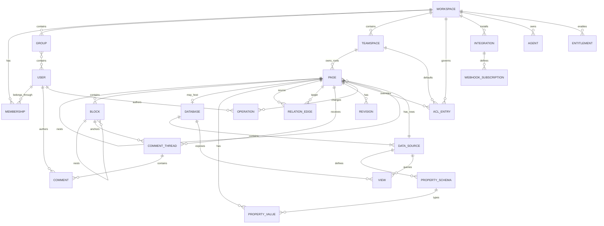
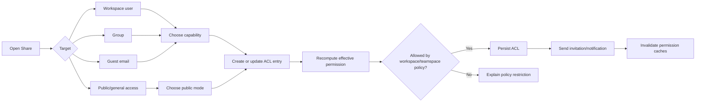
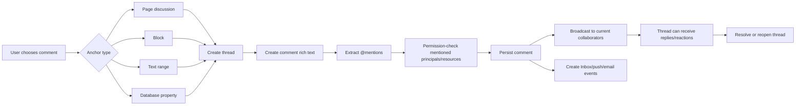
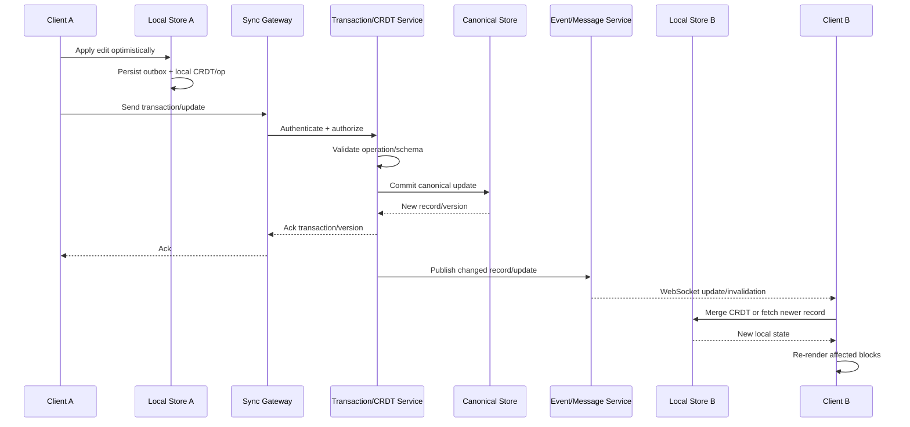
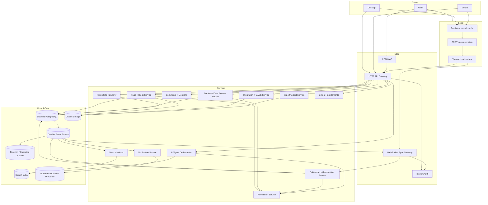

# Recreating Notion: Complete Product, Data, UX, API, and Architecture Specification

## Executive summary

This report treats **“recreate Notion” as recreating the core Notion workspace application and its publicly documented 2026 product surface**, rather than copying Notion’s branding, source code, or undocumented proprietary implementation. It covers the block editor, nested pages, databases and views, collaboration, sharing, offline behavior, APIs, integrations, AI/agents, publishing, enterprise controls, and cross-platform behavior. Notion Calendar and Notion Mail are separate products in the broader suite; their **integration points with the workspace** are in scope, but reproducing those two standalone applications is not. The research is current to **August 10, 2026**.

The central design idea is simple but profound: **model content as small composable records rather than monolithic documents**. Notion’s own engineering description says that pages, text, images, lists, and even database rows are represented through a block-oriented data model. Blocks have UUIDs, typed properties, ordered child references, and a parent relationship used in the permissions hierarchy. Local edits are converted into operations, applied optimistically, persisted, indexed, and propagated to other clients. citeturn11search0turn8view2

Modern Notion is no longer merely a document editor. A faithful clone requires at least six interacting product systems:

| System | What must be reproduced |
|---|---|
| Document system | Nested pages, block editor, formatting, media, embeds, slash commands, drag/drop, synced content |
| Structured-data system | Databases, multiple data sources, typed properties, relations, rollups, formulas, views, forms, charts, dashboards, automations |
| Collaboration system | Presence, optimistic editing, comments, suggestions, mentions, notifications, sharing, permissions, version history |
| Local-first client layer | Persistent caches, queued writes, offline pages, reconnection, conflict resolution |
| Platform layer | REST API, OAuth, webhooks, file upload API, integrations, synced databases, embeds, MCP |
| Enterprise/AI layer | Teamspaces, SSO/SCIM, audit/security controls, AI search, Agent, custom agents, AI meeting notes, enterprise connectors |

Notion publicly described its earlier real-time architecture as **local optimistic transactions + persistent client caches + a server source of truth + WebSocket invalidations/notifications**. In 2025, when Notion launched full offline editing for desktop and mobile, it disclosed that offline-enabled pages are migrated into a **CRDT-based data model** so concurrent offline and online edits can converge after reconnection. Notion has not publicly disclosed which CRDT algorithm/library it uses, so a recreation should not pretend that Yjs, Automerge, or another implementation is “what Notion uses”; those are suitable replacement technologies. citeturn11search0turn7search2turn11search1

For persistence at scale, Notion has publicly documented extensive use of **PostgreSQL sharding**. Its application servers have used PgBouncer in front of sharded Postgres databases, with data partitioned around workspace boundaries. Client applications have separately used SQLite-family caches; the browser implementation added WASM SQLite persisted through OPFS, coordinated by workers to avoid multiple writers corrupting the database. citeturn7search5turn7search6turn7search7

The current public developer API has also evolved. As of August 2026, the latest documented Notion API version is **`2026-03-11`**. Since the `2025-09-03` API revision, a database is a container that can hold **one or more independently schematized data sources**; database rows remain Page objects. The developer platform exposes Pages, Blocks, Databases, Data Sources, Comments, Views/querying, Files, Search, Users, custom emoji, OAuth, and webhooks. citeturn16view2turn15search22turn15search26

**Engineering estimate, not a Notion-provided figure:** a credible collaborative Notion-like MVP is approximately **30–55 engineer-months**, typically 5–7 elapsed months for a strong six-to-eight-engineer team. A broad desktop/web/mobile product with offline sync, mature databases, import/export, APIs, enterprise administration, sites, advanced integrations, and AI is more plausibly a **20–30+ month, several-hundred-engineer-month program**. Exact feature parity is an ongoing program rather than a finite MVP because Notion continues to ship capabilities.

The most important technical advice for another LLM implementing this specification is:

1. **Do not build the editor around HTML blobs or Markdown blobs.** Persist typed blocks and stable IDs.
2. **Treat database rows as pages**, not unrelated relational records.
3. **Separate database containers, data sources/schemas, and views.**
4. **Make every mutation an idempotent operation/transaction** that can be applied optimistically.
5. **Use a persistent client-side outbox** from the beginning; otherwise offline support becomes a rewrite.
6. **Use a CRDT or equivalently rigorous merge protocol for collaborative page content.**
7. **Keep permissions server-authoritative** even when content is local-first.
8. **Derive search, notifications, revisions, webhooks, and analytics asynchronously from committed operations.**
9. **Do not couple the editor to any one database view.** Table, board, calendar, timeline, gallery, form, chart, feed, map, and dashboard are projections over the same structured rows.
10. **Build enterprise security and auditability into the entity model early**, even if SSO/SCIM and compliance certification come later.

The exact frontend language/framework, native/mobile strategy, cloud provider, CRDT implementation, message broker, object storage, and search engine are **unspecified by the user**. Recommendations below therefore describe required semantics and give interchangeable implementation choices rather than imposing a stack.

## Product surface and feature inventory

The following inventory combines current Notion Help Center documentation, current Developer Platform documentation, and Notion engineering publications. Where internal implementation is not publicly specified, this report describes observable product behavior rather than inventing implementation details.

**Workspace shell, pages, and authoring**

| Area | Recreation requirements | Primary references |
|---|---|---|
| Navigation shell | Workspace switcher; collapsible/resizable sidebar; hierarchical page tree; Private, Shared, Teamspaces and Favorites areas; drag pages to reorder/reparent; Search and Inbox entry points; account/settings entry points. Notion documents effectively unlimited page nesting in its sidebar hierarchy. | [Sidebar navigation](https://www.notion.com/help/navigate-with-the-sidebar) citeturn19search4 |
| Page | Stable page ID; title; icon/custom emoji; cover; parent; children; breadcrumbs; creator/editor metadata; sharing metadata; page style; full-width mode; small text; Default/Serif/Mono typography; duplicate/move/delete/restore/favorite/lock behaviors. | [Writing & editing](https://www.notion.com/help/writing-and-editing-basics) citeturn19search10turn19search8 |
| Page hierarchy | Pages inside pages; pages inside database rows; sidebar tree; breadcrumbs; inherited access; page moves must update the hierarchy and effective access. | [Sidebar navigation](https://www.notion.com/help/navigate-with-the-sidebar) citeturn19search4turn11search0 |
| Editing UX | Block handle on hover, drag/drop, slash-command menu, `+` insertion, floating selection toolbar, Markdown-like keyboard shortcuts, undo/redo, copy/paste, block duplication/deletion, block transformation, indentation, multi-column desktop layouts. | [Writing & editing](https://www.notion.com/help/writing-and-editing-basics), [Keyboard shortcuts](https://www.notion.com/help/keyboard-shortcuts) citeturn19search10turn19search0 |
| Basic blocks | Text, page/subpage, to-do, Heading 1/2/3, simple table, bulleted list, numbered list, toggle list, quote, divider and callout. Toggles can contain nested blocks. | [Writing & editing](https://www.notion.com/help/writing-and-editing-basics) citeturn19search10 |
| Rich text | Bold, italic, underline, strikethrough, inline code, hyperlinks, text/background colors, rich-text mentions, dates, equations, comments attached to selections where supported. | [Writing & editing](https://www.notion.com/help/writing-and-editing-basics) citeturn19search10 |
| Media blocks | Image, video, audio, arbitrary file, code block, PDF and web bookmark. Media may be uploaded or externally referenced depending on type. | [Writing & editing](https://www.notion.com/help/writing-and-editing-basics) citeturn19search10 |
| Advanced blocks | Inline equations, Button, breadcrumb and table of contents. Buttons can insert blocks, create database pages, edit pages/properties, notify users, and in supported configurations send mail. | [Buttons](https://www.notion.com/help/buttons) citeturn14search20turn19search10 |
| Inline entities | `@person`, `@page`, dates/reminders, emoji/custom emoji. Mentions should resolve against permissions and generate notification events where appropriate. | [Writing & editing](https://www.notion.com/help/writing-and-editing-basics) citeturn19search10turn2search6 |
| Synced blocks | One content instance represented in several locations; editing one synchronized instance updates the others. Permission to a synchronized copy is constrained by access to its original content. Users can unsync a copy. | [Synced blocks](https://www.notion.com/help/synced-blocks) citeturn1search2 |
| Spell checking | Browser version uses the browser's spell checker; desktop exposes built-in spell checking. | [Writing & editing](https://www.notion.com/help/writing-and-editing-basics) citeturn19search10 |
| Templates | Duplicateable public/template pages plus database-specific templates. Database templates can pre-populate both properties and page blocks and can recur on schedules. | [Duplicate public pages](https://www.notion.com/help/duplicate-public-pages), [Notion Templates](https://www.notion.com/templates) citeturn19search18turn3search0 |
| Wiki mode | Pages can participate in wikis with page ownership and verification. Verification can expire; Business/Enterprise also support verification for pages outside wiki databases. | [Wikis & verified pages](https://www.notion.com/help/wikis-and-verified-pages) citeturn19search21turn6search18 |

Notion describes “everything is a block” internally, but a reproduction does **not** have to expose that implementation distinction to users. The public API has distinct Page, Block, Database and Data Source object types even though the underlying conceptual model is highly composable. citeturn11search0turn16view2

**Databases and structured information**

A current Notion database should not be modeled simply as a SQL table. The 2026 public API defines a **Database as a container for one or more Data Sources**. Each Data Source owns an independent property schema, and rows are Pages. Views present those rows in different layouts. citeturn15search22turn15search26

| Area | Recreation requirements | Primary references |
|---|---|---|
| Database container | Inline or full-page container; icon/title/description; one or more data sources; views. | [Database API object](https://developers.notion.com/reference/database) citeturn15search22 |
| Data source | Independent schema and collection of row-pages within a database; adding another data source can create a corresponding standard table view. | [Create a data source](https://developers.notion.com/reference/create-a-data-source) citeturn15search2 |
| Database rows | Every item opens as a complete Notion Page and can therefore contain ordinary blocks beneath its structured properties. | [Database views guide](https://www.notion.com/help/guides/when-to-use-each-type-of-database-view) citeturn14search17turn15search26 |
| Property types | Title/Name, Text, Number, Select, Status, Multi-select, Date, Formula, Relation, Rollup, Person, File, Checkbox, URL, Email, Phone, Created time, Created by, Last edited time, Last edited by, Button, unique ID and Place. | [Database properties](https://www.notion.com/help/database-properties) citeturn16view3 |
| Number formatting | Number properties can represent ordinary numbers and formatted values such as currency/progress presentations. | [Database properties](https://www.notion.com/help/database-properties) citeturn16view3 |
| Status | Structured task state grouped conceptually into To-do, In Progress and Complete categories, with customizable options. | [Database properties](https://www.notion.com/help/database-properties) citeturn16view3 |
| Formula | Expression runtime over properties, operators, booleans and built-in functions; formulas can also participate in buttons and automations. | [Formula documentation](https://www.notion.com/help/formulas) citeturn14search13 |
| Relations | One-way or two-way links between database pages, optionally limiting a relation to one related page. | [Relations & rollups](https://www.notion.com/help/relations-and-rollups) citeturn1search6 |
| Rollups | Derived aggregation over properties reachable through a relation. Notion documents limitations such as not rolling up another rollup. | [Relations & rollups](https://www.notion.com/help/relations-and-rollups) citeturn1search6 |
| Table | Spreadsheet-like rows/columns; property editing; sorting/filtering; column sizing/freezing; calculations; conditional formatting. | [Table view](https://www.notion.com/help/tables) citeturn14search26turn16view3 |
| Board | Kanban presentation grouped by a selected property, optional subgroups, drag cards between groups, card previews/properties/sizes. | [Board view](https://www.notion.com/help/boards) citeturn14search10 |
| List | Minimal linear representation of rows. | [Database views](https://www.notion.com/help/category/database-views/all) citeturn14search14 |
| Gallery | Card/grid representation with configurable cover/content/file preview, card size and visible properties. | [Gallery view](https://www.notion.com/help/galleries) citeturn14search27 |
| Calendar | Date-based row layout; items positioned according to configured date properties. | [Database view guide](https://www.notion.com/help/guides/using-database-views) citeturn14search19 |
| Timeline | Time-range/Gantt-like representation backed by dates and grouping/filtering. | [Database views](https://www.notion.com/help/category/database-views/all) citeturn14search14turn14search19 |
| Chart | Bar, line and donut-style visualization of database information. | [Charts](https://www.notion.com/help/charts) citeturn1search9turn14search23 |
| Dashboard | Layout composed of widgets such as charts, tables, boards, calendars and timelines, with an at-a-glance dashboard presentation. | [Charts & dashboards](https://www.notion.com/help/charts) citeturn14search23 |
| Feed | Linear stacked-card/social-feed-like database presentation useful for updates and internal communication. | [Feed view](https://www.notion.com/help/feeds) citeturn14search6 |
| Map | Interactive map visualization using Place/location information. | [Map view](https://www.notion.com/help/maps) citeturn14search2turn16view3 |
| Form | Form builder backed by database properties; submitting a form writes structured data into the database. Conditional question logic is available on higher plans. | [Forms](https://www.notion.com/help/forms) citeturn14search1 |
| View configuration | Per-view property visibility, filters, sorts, grouping/subgrouping, layout/card settings and opening behavior such as peek/full-page presentation. | [Views, filters, sorts & groups](https://www.notion.com/help/views-filters-and-sorts) citeturn14search16turn1search5 |
| Advanced filters | Nested AND/OR filter groups; current Help Center documentation allows nesting to three layers. | [Views, filters, sorts & groups](https://www.notion.com/help/views-filters-and-sorts) citeturn14search16 |
| Conditional color | Rules may color rows/properties in supported views based on property conditions. | [Database properties](https://www.notion.com/help/database-properties) citeturn16view3 |
| Database search | Search within a database/view in addition to global workspace search. | [Views, filters, sorts & groups](https://www.notion.com/help/views-filters-and-sorts) citeturn1search5 |
| Database templates | Reusable default property values + page body; recurring schedules support repeated creation. | [Database templates](https://www.notion.com/help/database-templates) citeturn3search0 |
| Page layouts | A consistent database-page layout can control placement/presentation of properties and page content. | [Database properties](https://www.notion.com/help/database-properties) citeturn16view3 |
| Automations | Trigger/action rules responding to database changes; examples include assignment and Slack notifications. Automations are subject to plan/permission restrictions. | [Database automations](https://www.notion.com/help/database-automations) citeturn14search5 |
| Buttons/database buttons | User-triggered workflow actions including creating pages, modifying values, inserting content and notifications. | [Buttons](https://www.notion.com/help/buttons) citeturn14search20 |
| Property comments | Comments can be attached to many database property values; Notion documents exclusions for properties such as Name, Formula, Rollup, Button and ID. | [Database properties](https://www.notion.com/help/database-properties) citeturn16view3 |

A clone should therefore implement a view as approximately:

```text
View =
  {
    id,
    database_id,
    data_source_id,
    type,
    visible_properties[],
    filter_ast,
    sorts[],
    group_by?,
    subgroup_by?,
    layout_config,
    card_config?,
    conditional_format_rules[],
    open_mode
  }
```

The important consequence is that changing a view **must not duplicate the underlying rows**. Every view is a query/projection of the same data source.

**Sharing, collaboration, search, versioning, and notifications**

| Area | Required behavior | Primary references |
|---|---|---|
| Workspace membership | Workspace owners/admin roles, ordinary members, restricted members where applicable, guests and groups. Guests are page-scoped rather than full workspace members. | [Who's who](https://www.notion.com/help/whos-who-in-a-workspace) citeturn5search5turn5search7turn14search15 |
| Teamspaces | Team-scoped areas with membership and access controls; current documentation describes Open, Closed and Private modes. | [Teamspace admin guide](https://www.notion.com/help/guides/what-are-teamspaces-a-guide-for-notion-admins) citeturn19search2 |
| Page sharing | Invite a person/group/guest by email or expose content using general-access settings. Access is inherited down the page hierarchy unless overridden where supported. | [Sharing & permissions](https://www.notion.com/help/sharing-and-permissions) citeturn14search8turn5search11 |
| Access levels | Full access, edit, comment and view semantics; database-oriented contexts additionally require a distinction between editing content and changing database structure where applicable. | [Sharing & permissions](https://www.notion.com/help/sharing-and-permissions) citeturn2search15turn5search11 |
| Public access | Pages can be shared using public links; publishing as a Notion Site is a distinct publishing workflow. | [Sharing](https://www.notion.com/help/sharing-and-permissions), [Sites](https://www.notion.com/help/public-pages-and-web-publishing) citeturn14search8turn14search0 |
| Comments | Page-level discussion, inline comments, threads, replies, resolution/reopening, edit/delete and reactions/mentions where supported. | Notion Help Center comments documentation. citeturn2search2 |
| Suggested edits | Users with appropriate permission can propose changes to supported text/list content for acceptance or rejection rather than immediately replacing the canonical text. | Notion suggested-edits documentation. citeturn4search0 |
| Mentions | Person and page mentions in content/comments; mentions participate in notifications and permission-aware entity lookup. | [Writing & editing](https://www.notion.com/help/writing-and-editing-basics) citeturn19search10turn2search2 |
| Reminders | Date/reminder tokens schedule notifications. | Notion reminder documentation. citeturn4search9turn19search10 |
| Notifications | In-product Inbox for comments, mentions, reminders and relevant updates; notifications can be marked read/archived. Integrations can additionally emit notifications such as Slack messages. | Notion Inbox/notifications documentation. citeturn2search16turn2search19turn2search21 |
| Presence and live editing | Multiple users may edit concurrently; clients receive live updates while locally authored edits are optimistic. Notion's documented architecture uses long-lived real-time connections plus record-version synchronization. | Notion engineering data-model article. citeturn11search0turn9view2 |
| Version history | Notion periodically records page versions while editing and provides restore/history UI. Current documented retention varies by plan: Free 7 days, Plus 30, Business 90, Enterprise unlimited. | Notion version-history documentation. citeturn4search1 |
| Workspace search | Fast workspace-wide page/content lookup and keyboard access through Command Search/Search UI. | [Search](https://www.notion.com/help/search) citeturn19search19turn2search3 |
| Desktop Command Search | Desktop can invoke search/Notion AI from a global shortcut/menu-bar/task-bar entry without foregrounding the main app. | [Notion for desktop](https://www.notion.com/help/notion-for-desktop) citeturn19search17 |
| Enterprise Search | AI-assisted search over the Notion workspace and supported connected services, producing answers/reports rather than only keyword results. | [Enterprise Search guide](https://www.notion.com/help/guides/find-answers-and-generate-reports-with-enterprise-search) citeturn19search9turn2search7 |
| Admin content search | Enterprise/admin tooling can search content for administrative/security purposes independent of normal end-user navigation. | Notion admin content-search documentation. citeturn2search22 |

**Publishing, import/export, integrations, and AI**

Notion can publish an unlimited number of pages through Sites. The current public Sites documentation describes a `notion.site` domain, search-engine indexing, live update when the underlying page changes, and additional paid customization including themes, SEO-related settings, Google Analytics and custom-domain options. citeturn14search0turn14search4

| Area | Required behavior | Primary references |
|---|---|---|
| Notion Sites | Turn page trees into web sites; public renderer; navigation/header; breadcrumbs; site search; theme; favicon; sharing preview; SEO/indexing; optional custom domain; Google Analytics integration. | [Publish a Site](https://www.notion.com/help/public-pages-and-web-publishing), [Customize Sites](https://www.notion.com/help/edit-and-customize-your-notion-sites) citeturn14search0turn14search4 |
| Import | Desktop/web import path supporting formats including text, Markdown, Word, CSV, HTML, PDF and ZIP, plus migrations from supported third-party products. Mobile does not expose the same import workflow. | Notion import documentation. citeturn3search1turn4search18 |
| Export | Page/database/workspace export to combinations of Markdown/CSV, HTML and PDF depending on content/context. | Notion export documentation. citeturn0search0turn4search18 |
| Web Clipper | Chrome/Safari browser extension to capture a web page into a chosen workspace/page/database for later editing. | [Web Clipper](https://www.notion.com/help/web-clipper) citeturn19search11 |
| Generic embeds | Rich embeds for web resources. Current embed documentation describes support spanning more than 1,900 domains through its embedding infrastructure. | Notion embeds documentation. citeturn13search0 |
| Named embed shortcuts | Google Drive, GitHub Gist, Google Maps, PDF, Figma, Loom, Typeform and other first-class shortcuts alongside generic `/embed`. | [Writing & editing](https://www.notion.com/help/writing-and-editing-basics) citeturn19search10 |
| Live link previews | Authenticated previews/mentions for supported external objects such as Jira, GitHub, Slack, Trello and Asana. | Notion link-preview documentation. citeturn13search5 |
| Synced databases | Continuous one-way external data synchronization from supported systems including Jira, GitHub, Asana and GitLab into Notion database representations; local Notion properties may augment synchronized rows. | Notion synced-database documentation. citeturn13search1 |
| Slack | Link previews, notifications/automations and search/AI-connector use cases depending on configuration. | Notion Slack/integration documentation. citeturn2search21turn13search5 |
| Public API | OAuth/token-authenticated API for pages, blocks, databases/data sources, comments, files, search, users and additional developer objects. | [API introduction](https://developers.notion.com/reference/intro) citeturn16view2 |
| Webhooks | Change-event delivery for page/database/data-source/comment/file/view event classes. | Notion webhook documentation. citeturn12search3turn15search24 |
| MCP | Model Context Protocol endpoint allowing compatible AI applications such as Claude, ChatGPT and Cursor to read/write authorized workspace content. | [Notion MCP](https://www.notion.com/help/notion-mcp) citeturn14search12turn6search5 |
| Notion Agent | Connected AI assistant embedded in the workspace that can create/edit/summarize/analyze content and use workspace context. | [AI for docs](https://www.notion.com/help/guides/notion-ai-for-docs) citeturn19search5turn0search19 |
| Enterprise AI search/connectors | Retrieval and answer generation across Notion and enabled external systems while respecting accessible sources. | [Enterprise Search](https://www.notion.com/help/guides/find-answers-and-generate-reports-with-enterprise-search) citeturn19search9turn2search25 |
| Custom Agents | Persistent/shared automations with instructions, access to configured data sources and scheduled/event-driven execution/actions. Permissions must be explicitly modeled because an agent can have capabilities independent of an initiating user. | Notion Custom Agents documentation. citeturn3search6turn0search13 |
| AI Meeting Notes | Meeting transcription plus automatic key-point/action-item extraction. Notion currently documents this feature as beta. | [AI Meeting Notes](https://www.notion.com/help/ai-meeting-notes) citeturn19search16 |
| Agent skills/instructions | Reusable task knowledge/instructions can customize recurring AI behavior. | Notion Skills and Agent Instructions documentation. citeturn6search10turn6search28 |
| Developer agent platform | Notion's 2026 Developer Platform additionally documents developer-facing Workers/agent-related capabilities and a CLI; availability is feature/program dependent and should be checked against the live docs before cloning plan gating. | Notion Developer Platform announcement/documentation. citeturn8view3 |

**Platform, offline, administration, billing, security, localization, and accessibility**

| Area | Current behavior to recreate | Primary references |
|---|---|---|
| Web | Full browser workspace/editor. Notion has publicly described a WASM SQLite cache backed by OPFS and worker coordination for performance; this browser cache is not equivalent to the user-facing desktop/mobile offline feature. | Notion engineering: browser SQLite. citeturn7search7turn9view3 |
| Desktop | macOS/Windows application; native application shell around the workspace experience, persistent cache/offline features, built-in spell check and global Command Search. | [Desktop](https://www.notion.com/help/notion-for-desktop) citeturn19search17turn19search10 |
| Mobile | iOS/Android read/edit/comment workflows, mobile insertion toolbar rather than desktop hover/slash UX, mobile widgets/AI shortcuts, responsive page/database rendering. | [Mobile](https://www.notion.com/help/notion-for-mobile), [Mobile widgets](https://www.notion.com/help/mobile-widgets) citeturn19search14turn19search1turn19search10 |
| Mobile layout differences | Desktop multi-column content collapses into a single-column mobile presentation; some administrative/import/multi-selection behaviors differ or are unavailable. | Notion mobile documentation. citeturn4search4 |
| Offline availability | Current offline editing is exposed in desktop and mobile apps rather than the browser UI. Users can mark pages available offline; paid plans add automatic downloading of recent/favorited content. | Notion offline documentation and engineering article. citeturn4search3turn7search2 |
| Offline database scope | Notion documents bounded offline download behavior for databases, including up to 50 pages from the relevant view in documented offline flows rather than recursively materializing every database record. | Notion offline engineering/documentation. citeturn7search2turn10view0 |
| Billing | Free, Plus, Business and Enterprise plan families; paid workspaces are primarily seat/member based, while guests are treated differently from full billable workspace members. Exact prices are intentionally omitted here because they are dynamic. | [Pricing](https://www.notion.com/pricing), Notion billing documentation. citeturn5search0turn5search6 |
| Plan entitlements | History retention, forms conditional logic, automations, advanced teamspace/security controls, enterprise administration and other features vary by plan. Entitlements should therefore be a first-class backend subsystem rather than scattered UI `if` statements. | Notion plan/downgrade docs. citeturn14search22turn4search1 |
| Security | Encryption in transit and at rest, least-privilege access, secure development practices, vulnerability/bug-bounty practices, permission controls and enterprise identity features are publicly documented security characteristics. | [Notion Security](https://www.notion.com/security) citeturn0search2 |
| Enterprise identity/admin | SAML 2.0 SSO, SCIM provisioning and audit/admin controls are part of the enterprise security surface. | [Notion Security](https://www.notion.com/security) citeturn0search2turn19search6 |
| Compliance | Notion publicly lists certifications/attestations including SOC 2 Type II and ISO 27001-family certifications, along with HIPAA support through appropriate Enterprise arrangements/BAA. A clone must obtain its **own** certifications; copying UI does not confer compliance. | [Notion Security](https://www.notion.com/security) citeturn0search2 |
| AI privacy | AI data handling and subprocessors have a distinct security/privacy policy surface; access filtering must prevent the AI layer from surfacing content that the requesting principal cannot access. | [AI security practices](https://www.notion.com/help/notion-ai-security-practices) citeturn19search20 |
| Localization | The current language selector supports a broad localized interface including English variants, Japanese, French, German, Spanish variants, Brazilian Portuguese, Simplified/Traditional Chinese, Dutch, Nordic languages, Korean, Vietnamese, Thai, Indonesian, Arabic, Hebrew and Italian. Arabic/Hebrew require RTL-aware layout. | Notion language documentation. citeturn5search2 |
| Keyboard accessibility | Notion publicly documents a very extensive keyboard-shortcut surface and explicitly promotes accomplishing workflows without touching the mouse. | [Keyboard shortcuts](https://www.notion.com/help/keyboard-shortcuts) citeturn19search0 |
| Accessibility target for a clone | The targeted search for this report did **not** surface a current public Notion VPAT or comprehensive WCAG-conformance specification. Therefore, do not infer exact accessibility compliance from feature parity. The clone should independently target WCAG 2.2 AA, semantic UI, visible focus, complete keyboard operation, screen-reader labels/live regions, zoom/reflow, reduced motion and non-color-only status cues. | [W3C WCAG 2.2](https://www.w3.org/TR/WCAG22/) citeturn19search3 |

A faithful product specification should therefore include accessibility tests as product requirements rather than attempting to copy undocumented shortcomings. In particular, a block editor requires deliberate handling of arrow-key semantics, block selection, drag/drop alternatives, slash menus, popovers, comment anchors, database grids and live collaborative announcements.

## Data model and interaction flows

Notion's published engineering model is unusually useful for recreation. In the 2021 description, a Block includes a UUIDv4 identifier, typed properties, an ordered collection of child block IDs and a pointer toward its parent. Notion specifically explained that the ordered child list is used to render the page tree while the upward parent relationship is important to permission resolution. User mutations become operations bundled into transactions, are applied optimistically to the local cache, and are subsequently validated and committed server-side. citeturn11search0turn9view1

The current public API introduces an additional conceptual layer important for modern parity: databases can contain multiple data sources, each with independent schemas, while rows are still Pages. citeturn15search22turn15search2

A practical canonical model is therefore:

| Entity | Essential fields | Notes |
|---|---|---|
| `User` | `id`, identity/profile fields, locale, timezone, status | Global identity |
| `Workspace` | `id`, name, plan, security config, entitlement set | Primary tenant/sharding boundary |
| `Membership` | `workspace_id`, `user_id`, role, state | Owner/admin/member/restricted semantics |
| `Group` | `id`, workspace, members | Permission principal |
| `Teamspace` | `id`, workspace, mode, owners, defaults | Open/closed/private |
| `Page` | `id`, workspace, parent, title, icon, cover, style, creator/editor, timestamps, trash state | Normal page **or database row** |
| `Block` | `id`, page, parent block, type, payload, ordered rank/version | Typed content node |
| `Database` | `id`, parent page/workspace, title, display configuration | Container |
| `DataSource` | `id`, database, schema version | Independent structured collection |
| `PropertySchema` | `id`, data source, name, type, config | Column definition |
| `PropertyValue` | `page_id`, `property_id`, typed value | Row cell |
| `RelationEdge` | source page/property, target page | Prefer explicit relation edges for indexing |
| `View` | `id`, database/data source, type, filter AST, sorts, grouping, layout config | Projection/query, not copied data |
| `Template` | `id`, scope, default properties, root block snapshot, schedule | Database/page reusable content |
| `ACL` | resource, principal, capability, allow/deny/inherit metadata | Server-authoritative permission |
| `CommentThread` | anchor page/block/text/property, resolved state | Anchor abstraction |
| `Comment` | thread, author, rich text, timestamp | Thread messages |
| `Revision` | page, snapshot/op range, actor/timestamps | Restorable history |
| `Operation` | transaction, object, action, payload, actor, logical time | Durable mutation unit |
| `File` | metadata, object key, MIME, size, ownership | Binary stored separately |
| `Notification` | recipient, event, resource, state | Inbox/push/email projection |
| `Integration` | workspace, provider, capabilities, encrypted credentials | OAuth/API connection |
| `WebhookSubscription` | integration, filters, target, signing secret | External event delivery |
| `OfflinePin` | user/device/page, reason, state | Available-offline tree |
| `Agent` | workspace, instructions, permissions, triggers/actions | AI/custom agent |
| `Entitlement` | workspace/plan, feature, limits | Billing-controlled capability |

The recommended relationship graph is:



This diagram intentionally keeps `Page` and `Block` distinct for application ergonomics even though Notion's internal engineering article describes a more thoroughly block-oriented model. The public API itself treats Pages and Blocks separately, so this hybrid representation maps cleanly to a Notion-compatible external API. citeturn11search0turn16view2

**Create-page flow**

Notion's sidebar allows creation from a teamspace, Private area, existing page or generic compose button; a recreation should immediately allocate an ID locally so typing never waits for a network round trip. citeturn19search4turn11search0

```mermaid
flowchart LR
    A[User selects New page] --> B[Choose parent or default Private]
    B --> C[Generate stable page UUID locally]
    C --> D[Insert local Page record]
    D --> E[Render empty title and editor immediately]
    E --> F[User types title/content]
    F --> G[Create optimistic operations]
    G --> H[Persist operations to local outbox]
    H --> I[Send transaction to server]
    I --> J{ACL and schema valid?}
    J -- Yes --> K[Commit canonical records]
    K --> L[Index search and create revision events]
    L --> M[Broadcast changed versions]
    M --> N[Client marks transaction acknowledged]
    J -- No --> O[Return structured rejection]
    O --> P[Rollback or corrective merge]
```



**Create-database flow**

The modern model should create three objects atomically: the Database container, its first Data Source, and an initial View. Notion's current API explicitly does this for database creation and allows additional data sources afterward. citeturn15search18turn15search23turn15search2

```mermaid
flowchart LR
    A[Insert database] --> B[Choose inline or full page]
    B --> C[Create Database container]
    C --> D[Create initial Data Source]
    D --> E[Create Name/Title property schema]
    E --> F[Create initial Table view]
    F --> G[Render empty database]
    G --> H[Add/edit properties]
    H --> I[Add rows as Page objects]
    I --> J[Add alternate views]
    J --> K[Persist filters, sorts, groups and layout per view]
```



**Share flow**

Permissions should be represented as capabilities rather than a single integer role because future features introduce distinctions such as comment-only, content editing, administrative editing, agent access and public access.



The evaluation order should roughly be `workspace policy → teamspace policy → ancestor inheritance → page-specific ACL → database-row rule → public access`, with explicit server-side rules defining which levels may override which others. Notion documents hierarchical sharing and teamspace policy behavior, although its complete production ACL evaluator is proprietary. citeturn14search8turn19search2turn5search11

**Comment flow**



Notion's public API can create ordinary page/block discussion comments, but not every rich inline-selected-text anchoring capability exposed by the native application. That distinction should also be maintained if API compatibility is a goal. citeturn12search13

**Real-time editing flow**



This reproduces the behaviors described by Notion's engineering publications: optimistic local transactions, a durable local transaction queue, authoritative server validation, asynchronous indexing/version-history work, and a long-lived real-time channel used to notify interested clients of record changes. citeturn11search0turn9view2

## Backend architecture, storage, sync, and conflict resolution

A suitable high-level recreation architecture is:



**How closely does this match disclosed Notion architecture?** The principles are strongly grounded in official engineering material, but the specific service decomposition above is a recreation design. Notion has publicly discussed its block store, transaction APIs, MessageStore, Postgres sharding, caches and search/history side effects; it has not published a complete 2026 microservice diagram or disclosed every current infrastructure product. citeturn11search0turn7search5turn7search6

Notion's 2021 engineering description included a local `RecordCache`, SQLite/IndexedDB persistence, a `TransactionQueue`, an internal `/saveTransactions` call, server-side before/after record validation, asynchronous version-history/Quick-Find work, and a `MessageStore` that communicates with clients over long-lived WebSockets. Those internal route/service names are useful architecture references but **are not part of the supported public Notion API and should not be treated as current compatibility contracts**. citeturn11search0turn9view2

**Storage comparison**

| Storage option | Best use in clone | Benefits | Main downside | Recommendation |
|---|---|---|---|---|
| PostgreSQL | Workspaces, pages, block metadata, database schemas/values, ACL, comments, integrations, transactions | Strong transactions; relational integrity; JSON support where needed; proven by Notion's disclosed architecture | Requires partitioning/sharding as scale becomes very large | **Primary canonical store.** Notion itself has publicly described workspace-oriented Postgres sharding. citeturn7search5turn7search6 |
| Document DB | Entire page/block objects | Flexible JSON representation | Harder cross-entity relational constraints/transactions; database relations and ACL become awkward | Viable but less attractive as the sole authoritative store |
| Wide-column/KV store | Huge append/query workloads, operation logs, presence-like records | Horizontal scale | More application-managed relational semantics | Optional specialized store, not necessary initially |
| Object storage | Images, audio, video, PDFs, exported archives and other binaries | Cheap durable binary storage; CDN friendly | Not queryable like application metadata | **Strongly recommended** alongside Postgres |
| Search index | Full-text, faceting, prefix/search ranking, Enterprise Search retrieval | Purpose-built retrieval | Secondary/index consistency must be handled | **Recommended** once workspace search matters |
| Redis-like ephemeral store | Presence, hot ACL cache, rate limits, transient session/pub-sub state | Very low latency | Not canonical durability | Useful but replaceable with another low-latency system |
| Durable event log | Notification derivation, integrations, webhooks, search indexing, analytics | Decouples write path from projections | Operational complexity | Recommended at medium scale |
| SQLite | Desktop/mobile local state and offline cache | Embedded, transactional, mature | Sync logic remains application responsibility | **Recommended.** Notion publicly uses SQLite-like local caches. citeturn7search7turn7search2 |
| WASM SQLite + OPFS | Browser persistent cache/performance | SQL/local persistence inside modern browsers | Cross-tab writer coordination and browser support complexity | Optional parity optimization. Notion documented this architecture in 2024. citeturn7search7turn9view3 |
| CRDT binary/state store | Collaborative page content and offline merge state | Deterministic convergence for concurrent edits | More sophisticated compaction/version semantics | Recommended for rich content/offline collaboration |

Notion's browser engineering article is particularly instructive. To persist SQLite through browser OPFS safely, Notion coordinated access so that only one writer operates at a time, used worker-based architecture, and reported an improvement in page-navigation performance after the migration. A clone does not need this optimization for its first version, but it should avoid assuming ordinary browser `localStorage` is an adequate replacement for a large structured workspace cache. citeturn7search7turn9view3

**Canonical write protocol**

Every mutation should have a durable envelope:

```json
{
  "transaction_id": "01J...ULID",
  "workspace_id": "uuid",
  "client_id": "device-or-tab-id",
  "actor_id": "user-uuid",
  "idempotency_key": "uuid",
  "base_versions": {
    "page:abc": 241,
    "block:def": 19
  },
  "operations": [
    {
      "object_id": "def",
      "object_type": "block",
      "action": "set_rich_text",
      "payload": {
        "crdt_update": "<binary-or-base64-update>"
      }
    }
  ],
  "client_timestamp": "2026-08-10T14:00:00Z"
}
```

Recommended server processing is:

```text
authenticate
→ authorize against canonical ACL
→ deduplicate idempotency key
→ validate schema/reference integrity
→ merge or apply operation
→ commit canonical transaction
→ assign new version / commit sequence
→ acknowledge writer
→ publish durable domain event
→ asynchronously derive:
     search index
     revision/version snapshot
     notifications
     webhooks
     analytics
     public-site invalidations
     AI-index updates
```

This follows the broad transaction and secondary-processing principles Notion has described publicly. citeturn11search0

**Conflict resolution should be field-specific rather than one universal “last write wins” rule.**

| Data class | Recommended merge strategy |
|---|---|
| Rich text | Sequence/text CRDT |
| Block insertion/deletion/order | CRDT sequence or stable ordered identifiers plus tombstones |
| Toggle/heading/type transformations | Transactional operation with base object/version |
| Title/plain scalar property | CRDT register or HLC/LWW register with explicit history |
| Checkbox | LWW/register |
| Multi-select | Observed-remove set or per-option state |
| Relations | Set CRDT / idempotent edge operations |
| Person assignment | Set CRDT where multi-valued; register where single-valued |
| Numeric database property | Register; never add concurrent values unless the operation is explicitly an increment |
| Formula | Never synchronize computed value as authority; recompute from canonical dependencies |
| Rollup | Derived materialized value; invalidate/recompute from relation graph |
| Page hierarchy | Transactional move with cycle prevention |
| ACL | **Server-authoritative transactional state**, not peer-merged |
| Database schema | Serialized/schema-versioned mutation; migration rules required |
| Card ordering | Fractional/order key or sequence CRDT |
| Comment messages | Append-only IDs plus explicit edit/delete operations |
| Version history | Append operations + periodic immutable snapshots |

Notion's late-2025 offline engineering article explicitly says offline-enabled pages use a CRDT model to address conflicts, but it does not disclose its concrete CRDT algorithm. citeturn7search2turn11search1 A strong implementation option is [Yjs](https://docs.yjs.dev/), whose documentation provides shared CRDT types, awareness/presence support and IndexedDB-based offline persistence. citeturn18search3turn18search15turn18search19 The foundational research reference is Shapiro et al.'s work on [Conflict-Free Replicated Data Types](https://inria.hal.science/inria-00609399).

**Offline design**

Notion's 2025 architecture provides useful parity semantics. Offline pages are persisted locally; Notion tracks why pages need to be offline and propagates that requirement through page/database relationships. When reconnecting, it compares local download state with server update timing and retrieves content that changed while the device was disconnected. The engineering post also describes server notifications followed by clients fetching updated content rather than necessarily pushing every full page through the notification channel. citeturn7search2turn9view0turn10view0

A recreation should implement:

```text
Local database
├── materialized pages/blocks/properties
├── CRDT states
├── pending transaction outbox
├── last acknowledged server sequence
├── per-page sync metadata
├── offline pins + reason graph
├── downloaded attachment metadata
└── tombstones
```

Reconnect protocol:

```text
1. Authenticate and refresh device session.
2. Exchange last-known workspace/page server sequence.
3. Upload unsent local CRDT updates/transactions idempotently.
4. Server validates ACL and schema against current canonical state.
5. Merge content changes.
6. Fetch remote deltas since client's checkpoint.
7. Reconcile hierarchy and database pages needed for offline roots.
8. Refresh derived computed properties.
9. Resolve missing/deleted references.
10. Advance checkpoint only after durable local commit.
```

The implementation should never discard the outbox merely because an HTTP request timed out: retry must be idempotent.

**Real-time subscriptions**

A practical WebSocket protocol can be:

```json
{
  "type": "subscribe",
  "channels": [
    "page:7b...",
    "database:9d..."
  ],
  "since": 9182441
}
```

Client mutation:

```json
{
  "type": "transaction",
  "id": "tx_123",
  "operations": [
    {
      "resource": "block:abc",
      "operation": "crdt_update",
      "update": "..."
    }
  ]
}
```

Server acknowledgement:

```json
{
  "type": "ack",
  "transaction_id": "tx_123",
  "commit_sequence": 9182442,
  "resource_versions": {
    "block:abc": 64
  }
}
```

Remote event:

```json
{
  "type": "resource_updated",
  "commit_sequence": 9182443,
  "resources": [
    {
      "id": "abc",
      "type": "block",
      "version": 65
    }
  ]
}
```

These payloads are **proposed clone protocol**, not copied Notion private API payloads. Notion's published architecture supports the overall invalidate/version/fetch pattern, but its production private protocol is not a public compatibility target. citeturn11search0

**Scaling**

For an MVP, one Postgres cluster with tenant IDs and good indexes is preferable to premature sharding. When the product reaches enough scale that a workspace's operations should be isolated, workspace-based partitioning has a useful property: nearly all page, block, comment, database and permission transactions for one workspace can remain colocated. Notion described exactly this motivation when it partitioned related data using workspace identifiers and later expanded the physical shard fleet. citeturn7search5turn7search6

Search, AI indexing, notifications, version-history snapshots, outgoing webhooks, export jobs and automation executions should be **asynchronous projections** off the canonical event stream. User edits should not be blocked by Elasticsearch/OpenSearch downtime, a Slack timeout, PDF generation, or an embedding job.

## API, integrations, and extensibility

The public API should be kept separate from the internal collaboration API. The former is stable, rate-limited, versioned and OAuth-capable; the latter prioritizes low latency, CRDT synchronization, presence and client caching.

Notion's official API uses `https://api.notion.com` over HTTPS, JSON request/response bodies, bearer authentication, UUID-addressable resources and a mandatory API-version header. The current version documented on August 10, 2026 is `2026-03-11`. citeturn16view2turn16view1

**Current Notion-compatible API surface**

| Resource | Representative routes/operations | Notes and references |
|---|---|---|
| Authentication | `POST /v1/oauth/token` and OAuth lifecycle endpoints | Internal connection tokens, OAuth public connections and supported personal-token mechanisms. citeturn12search6turn12search12 |
| Pages | `POST /v1/pages`, `GET /v1/pages/{page_id}`, `PATCH /v1/pages/{page_id}` | Page retrieval returns properties; content blocks are fetched separately. [Create page](https://developers.notion.com/reference/post-page) citeturn15search21turn15search17 |
| Blocks | Retrieve/update block; list children; append children; delete/archive/trash semantics as exposed by version | Page body hierarchy. citeturn12search11turn12search1turn12search15 |
| Databases | Create, retrieve, update database container | Current database object contains data-source references rather than serving as the sole property schema. citeturn15search18turn15search14 |
| Data Sources | Create/retrieve/update/query data source | `POST /v1/data_sources/{data_source_id}/query` queries rows. citeturn15search0turn15search2turn15search4turn15search9 |
| Comments | Create/list comments | API comment anchoring is less capable than every native inline-comment UX. citeturn12search13 |
| Search | `POST /v1/search` | Searches pages/data sources shared with the connection; not a substitute for querying a known data source. [Search API](https://developers.notion.com/reference/post-search) citeturn15search1turn16view1 |
| Users | List/retrieve users and current bot/user where supported | Workspace-aware identity discovery. citeturn0search14 |
| Files | Create upload, send bytes, complete multipart upload, retrieve/list upload records | Current file-upload lifecycle is a first-class API subsystem. citeturn15search10turn15search12turn15search19turn15search15 |
| Views/query objects | View listing/query-related API surface | Current developer docs list Views as an API object/endpoint category, but the data-source docs state that full database-view configuration management is not generally exposed. citeturn16view2turn15search2 |
| Custom emoji | Custom emoji object/endpoint family | Present in current developer documentation. citeturn16view2 |
| Webhooks | Page, database, data-source, comment, file-upload and view event categories | Use signed event delivery and retry/idempotency. citeturn16view2turn15search24 |

Current developer documentation specifies cursor pagination for list-style APIs, with opaque `next_cursor` handling. It also documents an average rate limit around three requests per second per connection, with platform limits subject to Notion's current rules. citeturn16view2turn12search16

A key compatibility detail is the 2025 database/data-source split. Implementations written against old API versions may assume `/databases/{id}/query`; a modern compatibility layer must represent **Database → Data Sources → Pages** and version behavior through the `Notion-Version` header. citeturn15search25turn15search22

**Create a page/row**

Representative modern request:

```http
POST /v1/pages
Authorization: Bearer <token>
Notion-Version: 2026-03-11
Content-Type: application/json
```

```json
{
  "parent": {
    "type": "data_source_id",
    "data_source_id": "11111111-2222-3333-4444-555555555555"
  },
  "properties": {
    "Name": {
      "title": [
        {
          "type": "text",
          "text": {
            "content": "Ship offline sync"
          }
        }
      ]
    },
    "Status": {
      "status": {
        "name": "In progress"
      }
    }
  },
  "children": [
    {
      "object": "block",
      "type": "paragraph",
      "paragraph": {
        "rich_text": [
          {
            "type": "text",
            "text": {
              "content": "Implementation notes go here."
            }
          }
        ]
      }
    }
  ]
}
```

The current API documents creation of a page under either a page or data source, and treats rows as Pages. citeturn15search21turn15search26

**Query a data source**

```http
POST /v1/data_sources/{data_source_id}/query
Authorization: Bearer <token>
Notion-Version: 2026-03-11
Content-Type: application/json
```

```json
{
  "filter": {
    "and": [
      {
        "property": "Status",
        "status": {
          "equals": "In progress"
        }
      },
      {
        "property": "Due",
        "date": {
          "on_or_before": "2026-08-31"
        }
      }
    ]
  },
  "sorts": [
    {
      "property": "Due",
      "direction": "ascending"
    }
  ],
  "page_size": 50
}
```

The documented endpoint is `POST https://api.notion.com/v1/data_sources/<data_source_id>/query`, with filters available for typed properties and cursor pagination. citeturn16view2turn15search11

**Search**

```http
POST /v1/search
```

```json
{
  "query": "offline sync",
  "filter": {
    "property": "object",
    "value": "page"
  },
  "page_size": 50
}
```

The Search API only sees resources available to the connection and is title/resource oriented; Notion explicitly recommends the data-source query API for querying a known structured source. citeturn16view1

**Clone-specific endpoints that should exist even though Notion's public API does not expose them in this form**

```text
POST   /internal/sync/transactions
GET    /internal/sync/delta?after=<sequence>
WS     /internal/realtime
POST   /internal/presence
GET    /internal/pages/:id/offline-manifest
POST   /internal/pages/:id/pin-offline
DELETE /internal/pages/:id/pin-offline

GET    /internal/permissions/:resource/effective
PUT    /internal/permissions/:resource/:principal
DELETE /internal/permissions/:resource/:principal

GET    /internal/pages/:id/revisions
POST   /internal/pages/:id/revisions/:revision/restore

POST   /internal/import-jobs
POST   /internal/export-jobs
GET    /internal/jobs/:id

POST   /internal/automations/:id/run
POST   /internal/integrations/:provider/oauth/start
POST   /internal/integrations/:provider/oauth/callback
```

These should **not** be advertised as Notion's private API. They are a clean-room interface needed by the recreated application's own first-party clients.

**Integration taxonomy**

| Integration type | Examples | Direction | Recreation strategy | Sources |
|---|---|---|---|---|
| Generic embeds | Video, prototypes, maps, docs, audio, forms and thousands of URL domains | External → rendered page | URL metadata/unfurl service + iframe/provider allowlist + sandbox/CSP | Notion embeds. citeturn13search0turn19search10 |
| Web bookmarks | Arbitrary web URLs | External → page | OpenGraph/oEmbed fetch and cached card | [Writing & editing](https://www.notion.com/help/writing-and-editing-basics) citeturn19search10 |
| Authenticated link previews | GitHub, Jira, Slack, Trello, Asana | External → live inline card | OAuth + provider adapter + cache + webhook/poll refresh | Notion link previews. citeturn13search5 |
| Synced databases | GitHub, Jira, Asana, GitLab | Primarily external → Notion data source | Provider cursor/webhooks → normalized external object → synchronized row + local-only fields | Notion synced databases. citeturn13search1 |
| Connected properties | External resource metadata represented as database property/context | External → Notion | OAuth provider adapter and typed external-object property | Notion Connections documentation. citeturn13search3turn13search9 |
| Automation action | Slack notification | Notion → external | Durable automation job + OAuth + retries | [Database automations](https://www.notion.com/help/database-automations) citeturn14search5 |
| Button action | Gmail/mail and notifications where enabled | Notion → external | User-authorized OAuth credential and queued action | [Buttons](https://www.notion.com/help/buttons) citeturn14search20 |
| AI connector | Google Drive, Slack and other enabled enterprise knowledge sources | External ↔ AI retrieval layer | Permission-aware connector indexing/federated retrieval | Notion AI connector docs. citeturn2search25turn19search9 |
| REST integration | Custom third-party applications | Bidirectional | OAuth/bearer token + versioned REST + rate limits | [Developer API](https://developers.notion.com/reference/intro) citeturn16view2 |
| Webhook | Custom applications | Notion → external | Signed queued delivery + exponential retries + idempotent event IDs | Notion webhooks. citeturn12search3 |
| MCP | ChatGPT, Claude, Cursor and compatible AI clients | Bidirectional subject to permissions | OAuth/authorization + permission-aware MCP tools | [Notion MCP](https://www.notion.com/help/notion-mcp) citeturn14search12 |
| Importers | Markdown, Word, CSV, HTML, PDF/ZIP and supported SaaS exporters | Batch external → workspace | Staged parse → normalized page/block tree → attachments → validation | Notion import docs. citeturn3search1 |
| Export | Markdown/CSV, HTML, PDF | Workspace → portable files | Background traversal/render/archive job | Notion export docs. citeturn0search0 |
| Web Clipper | Chrome/Safari | Web → workspace | Browser extension + authenticated capture endpoint | [Web Clipper](https://www.notion.com/help/web-clipper) citeturn19search11 |
| Sites analytics | Google Analytics | Public Notion Site → analytics | Public renderer inserts configured analytics ID | [Site customization](https://www.notion.com/help/edit-and-customize-your-notion-sites) citeturn14search4 |

A robust provider abstraction should look approximately like:

```ts
interface IntegrationProvider {
  authenticate(input: OAuthCallback): Promise<CredentialSet>;
  refresh(credentials: CredentialSet): Promise<CredentialSet>;

  unfurl?(url: string, user: Principal): Promise<LinkPreview>;

  listObjects?(
    cursor: string | null,
    credentials: CredentialSet
  ): Promise<{ objects: ExternalObject[]; nextCursor: string | null }>;

  getObject?(
    externalId: string,
    credentials: CredentialSet
  ): Promise<ExternalObject>;

  subscribe?(
    target: ExternalObjectRef,
    callbackUrl: string
  ): Promise<ExternalSubscription>;

  executeAction?(
    action: ProviderAction,
    credentials: CredentialSet
  ): Promise<ActionResult>;
}
```

The **normalized external object** should store provider name, immutable external ID, canonical URL, title, status, author/assignee, timestamps, raw provider metadata and a sync cursor/version. Do not scatter GitHub/Jira-specific fields through the ordinary Page schema.

## Open-source implementations and reusable components

No open-source project currently provides a drop-in clone of every Notion capability described above. They are nevertheless extremely valuable as implementation references. License compatibility must be reviewed before copying source code; “open source” does not imply code can automatically be incorporated into a proprietary product under any desired terms.

| Project/tool | Useful parts to study or reuse | Limits relative to full Notion recreation | Reference |
|---|---|---|---|
| **AppFlowy** | One of the most directly Notion-oriented open-source workspaces; pages/docs, databases, projects, collaboration, offline/self-hosting patterns and cross-platform client architecture. Current GitHub repository identifies itself as an open-source Notion alternative and uses AGPL-3.0. | Not exact Notion parity; licensing matters if incorporating code. | [GitHub: AppFlowy](https://github.com/AppFlowy-IO/AppFlowy) citeturn18search0turn18search8 |
| **AFFiNE** | Local-first workspace combining document, structured information and canvas concepts; useful reference for block modeling, local-first persistence and multi-modal editing. | Product model intentionally differs from Notion, especially through its Miro-like canvas. | [GitHub: AFFiNE](https://github.com/toeverything/AFFiNE) citeturn17search1 |
| **Docmost** | Collaborative open-source wiki/documentation system; good reference for pages/spaces, comments, permissions and collaborative editing. | More wiki/document-centric and less database-centric than Notion. | [GitHub: Docmost](https://github.com/docmost/docmost) citeturn17search10 |
| **Outline** | Mature collaborative team knowledge-base codebase; React/TypeScript-oriented architecture, PostgreSQL/Redis backend patterns, realtime collaboration, integrations and self-hosting. | Knowledge-base-first rather than Notion's generalized relational database/workspace model. | [GitHub: Outline](https://github.com/outline/outline) citeturn18search1turn18search33 |
| **BlockNote** | Notion-like block editor toolkit; custom blocks, structured document model, rich editing and Yjs utilities. Excellent for avoiding years of basic editor plumbing. | Does not give you Notion databases, ACL, sync backend, billing or workspace model. | [BlockNote](https://www.blocknotejs.org/) citeturn17search7 |
| **ProseMirror** | Highly extensible editor toolkit and document schema; mature selection/transaction/plugin model. | Lower-level than a turnkey Notion editor; significant UX work remains. | [ProseMirror](https://prosemirror.net/), [Yjs ProseMirror binding](https://github.com/yjs/y-prosemirror) citeturn17search23turn17search27 |
| **Tiptap** | Developer-friendly layer over ProseMirror with extensible nodes/marks and collaboration integrations. | Some ecosystem capabilities/services have their own licensing/commercial distinctions. | [Tiptap](https://tiptap.dev/) citeturn18search22 |
| **Yjs** | CRDT shared types, editor bindings, awareness/presence protocol, offline persistence and provider ecosystem. | You still need ACL, persistence design, history semantics, database conflicts and your application-level sync envelope. | [Yjs docs](https://docs.yjs.dev/) citeturn18search3turn18search15turn18search19 |
| **Hocuspocus** | Open-source Yjs collaboration backend from the Tiptap ecosystem; WebSocket rooms, authorization hooks, persistence/scaling patterns. | Does not automatically give you the Notion transaction/data/database model. | [Hocuspocus](https://tiptap.dev/docs/hocuspocus/getting-started/overview) citeturn18search2turn18search6 |

A particularly pragmatic web implementation path is:

```text
BlockNote or Tiptap/ProseMirror
        │
        ├── Yjs collaborative document
        │      ├── awareness / cursors
        │      ├── IndexedDB offline state
        │      └── binary CRDT updates
        │
        └── Hocuspocus or custom WebSocket provider
               ├── auth/ACL callback
               ├── persistence callback
               ├── document-room routing
               └── horizontal fanout
```

BlockNote exposes explicit conversion/utilities between its block structures and Yjs collaborative documents. Tiptap's Hocuspocus documentation describes Yjs-based realtime merging, authorization, persistence and offline synchronization. citeturn17search7turn18search2turn18search30

The important architectural warning is that **CRDT state should not be carelessly converted to JSON and recreated on every connection**. Hocuspocus documentation specifically warns that primary Yjs persistence should preserve the Yjs binary/state representation because reconstructing an equivalent-looking JSON document does not preserve the causal information necessary for correct merging. citeturn18search26

A strong reuse strategy would be:

| Capability | Build vs reuse recommendation |
|---|---|
| Basic rich/block editor | **Reuse** BlockNote/Tiptap/ProseMirror unless editor technology itself is the product differentiator |
| CRDT | **Reuse** Yjs/Automerge-class implementation; do not invent a CRDT casually |
| Collaboration transport | Reuse Hocuspocus or build a thin custom provider around established CRDT protocol |
| Database/view engine | **Build application-specific layer** |
| Formula runtime | Build or adopt a sandboxed expression language; isolate from server runtime |
| ACL/effective permission engine | Build product-specific model, possibly on a policy library |
| Search | Use established full-text engine rather than writing an inverted index |
| Object storage | Use S3-compatible service |
| Import parsers | Reuse format parsers; build your normalization pipeline |
| PDF rendering | Reuse a browser/renderer; do not implement a PDF engine |
| OAuth | Use well-maintained libraries/provider SDKs |
| Webhooks | Build thin durable delivery infrastructure |
| Billing | Integrate a billing platform; keep product entitlements in your own database |
| SSO/SCIM | Prefer standards-compliant libraries/services |
| AI | Use model-provider abstraction plus your own permission-aware retrieval/action layer |
| Accessibility primitives | Reuse mature accessible component primitives, but still perform manual AT testing |

Do not fork AppFlowy/AFFiNE simply because they are the nearest visual match unless their architecture and license align with the intended product. Studying them and composing lower-level editor/sync libraries often gives a cleaner path to a Notion-compatible domain model.

## Implementation roadmap and MVP priorities

**Planning assumptions:** technology stack is unspecified. Estimates below assume a capable team familiar with collaborative editors and distributed systems. Product design, QA, security and infrastructure effort are included qualitatively but the figures are primarily engineering capacity estimates. These are planning estimates, **not Notion engineering estimates**.

| Milestone | Scope | Approximate engineering effort | Exit condition |
|---|---|---:|---|
| Foundation | Auth, workspace, sidebar/page hierarchy, canonical IDs, block persistence, basic editor, file uploads | 6–10 engineer-months | One user can reliably create/edit/nest pages with rich blocks |
| Collaborative documents | Optimistic transaction layer, WebSocket sync, presence, comments, mentions, permissions, notifications, history basics | 8–14 engineer-months | Several clients edit one page safely in real time |
| Database core | Database/data-source model, typed properties, table/list/board, filters/sorts/groups, row-pages | 10–18 engineer-months | Useful project/task database workflows work end-to-end |
| MVP hardening | Search, exports, basic imports, backups, observability, responsive/mobile web, security review | 6–12 engineer-months | Production-capable MVP |
| Advanced databases | Calendar, gallery, timeline, formulas, relations, rollups, templates, layouts, conditional formatting | 12–22 engineer-months | Database system covers mainstream Notion workflows |
| Offline/local-first | Persistent desktop/mobile data, outbox, CRDT migration/state, reconnect, attachment caching, offline manifests | 10–18 engineer-months | Edits survive hours/days offline and converge correctly |
| Platforms | Desktop shell, native-quality mobile client, mobile widgets/OS integration | 14–24 engineer-months | First-class desktop/iOS/Android experiences |
| Platform/API | Public REST, OAuth, webhooks, rate limiting, developer console, file APIs | 8–14 engineer-months | Third parties can build reliable integrations |
| Advanced workflow | Forms, charts, dashboard, feed, map, buttons, database automations | 12–20 engineer-months | Modern database/productivity parity |
| Publishing/integrations | Sites, domains, SEO, embeds, link previews, integrations, Web Clipper, synchronized sources | 12–22 engineer-months | External-content and publishing ecosystem works |
| Enterprise | Teamspace administration, SAML, SCIM, audit, retention, admin search, policy enforcement | 12–20 engineer-months | Enterprise technical feature set is credible |
| AI/agents | Search/RAG, AI editor actions, meeting notes, connectors, agent permissions, automation, MCP | 18–35+ engineer-months | AI can safely read/write/act under permission constraints |
| Compliance/performance | Security program, penetration testing, DR, certification work, sharding, abuse controls, localization, accessibility | Ongoing | Enterprise-grade operational maturity |

These phases can overlap; adding the effort figures is **not** the same as elapsed calendar time.

A reasonable organization plan is:

```text
Initial MVP
6–8 engineers
1 product designer
1 PM
shared QA/SRE/security
≈ 5–7 months
≈ 30–55 engineer-months

Strong cross-platform v1
10–14 engineers
≈ 10–15 months total from project start
≈ 100–200 engineer-months

Broad 2026 Notion-like parity
15–25+ engineers plus security/infra/data/AI specialists
≈ 20–30+ months
≈ several hundred engineer-months
```

The greatest schedule risks are **not** drawing the editor UI. They are editor correctness, collaborative ordering, offline convergence, permissions, formula/database semantics, migration/import fidelity, mobile performance, enterprise identity/security, and permission-safe AI.

**MVP priority matrix**

| Priority | Feature | Minimum acceptable behavior |
|---|---|---|
| **P0** | Identity/workspaces | Account login, workspace membership, session management |
| **P0** | Page hierarchy | Create/move/delete/restore/nest pages; stable IDs; sidebar |
| **P0** | Core block editor | Paragraph, headings, lists, todo, toggle, quote, divider, callout, code |
| **P0** | Editing UX | Slash menu, selection toolbar, keyboard shortcuts, drag/drop, copy/paste |
| **P0** | Media | Image/file upload, URL bookmark, generic safe embed |
| **P0** | Autosave | No explicit Save button; durable optimistic transaction queue |
| **P0** | Realtime collaboration | Multiple users edit same page without losing changes |
| **P0** | Presence | Active collaborators visible; cursor/selection awareness desirable |
| **P0** | Permissions | Private pages; user sharing; view/comment/edit/full-access semantics |
| **P0** | Comments | Page/block threads, replies, resolve |
| **P0** | Mentions | Mention person/page; notification creation |
| **P0** | Database model | Database → data source → row-as-page |
| **P0** | Core properties | Title, Text, Number, Select, Multi-select, Status, Date, Person, Checkbox, URL |
| **P0** | Table view | Editable structured rows and columns |
| **P0** | Board view | Group by Status/Select and drag to change group value |
| **P0** | Filters/sorts | Persisted per-view filters and sorting |
| **P0** | Search | Page/title/content full-text lookup |
| **P0** | History/backups | Recover accidentally changed/deleted content |
| **P0** | Responsive web | Usable desktop and mobile browser interface |
| **P0** | Security baseline | TLS, encrypted secrets, ACL on every read/write, audit-friendly events, backup/restore |

The P0 product is recognizably “Notion-like”: pages and databases share one content system, structured rows open into full pages, and collaboration is instantaneous.

| Priority | Feature | Why it follows |
|---|---|---|
| **P1** | Relations and rollups | Critical to serious database use |
| **P1** | Formula properties | Enables flexible computed workflows |
| **P1** | Calendar/list/gallery | Covers common alternate database presentations |
| **P1** | Database templates | Major productivity multiplier |
| **P1** | Page/database templates | Repeatable workspace structures |
| **P1** | Synced blocks | Important reusable-content primitive |
| **P1** | Inline comments/suggestions | Mature document-review workflows |
| **P1** | Notifications/Inbox | Collaboration becomes manageable at team scale |
| **P1** | Import/export | User acquisition and data portability |
| **P1** | Public page sharing | Common external-sharing workflow |
| **P1** | REST API | Automation and ecosystem entry point |
| **P1** | OAuth/webhooks | Real external integrations |
| **P1** | Desktop application | Better shortcuts/local integration |
| **P1** | Basic offline mode | Read/edit pinned pages without network |

| Priority | Feature | Scope |
|---|---|---|
| **P2** | Timeline | Project planning |
| **P2** | Charts/dashboard | Reporting |
| **P2** | Forms | External/internal structured collection |
| **P2** | Feed | Communication-oriented database display |
| **P2** | Map/Place | Location workflows |
| **P2** | Conditional formatting | Database presentation |
| **P2** | Buttons | User-triggered workflow automation |
| **P2** | Database automations | Trigger/action workflows |
| **P2** | Full desktop/mobile offline | Local-first behavior and attachment caching |
| **P2** | Native iOS/Android | Platform-quality mobile experience |
| **P2** | Sites | Publishing, SEO, navigation, domain support |
| **P2** | Web Clipper | Browser capture |
| **P2** | Link previews | GitHub/Jira/Slack/etc. |
| **P2** | External synced databases | GitHub/Jira/Asana/GitLab model |
| **P2** | Teamspaces | Organization-scale content partitioning |
| **P2** | Advanced page/database ACL | Enterprise/content-owner requirements |
| **P2** | Localization | Complete string/date/number/RTL infrastructure |
| **P2** | WCAG 2.2 AA program | Keyboard, screen-reader, focus/reflow/contrast testing |

| Priority | Feature | Scope |
|---|---|---|
| **P3** | SAML/SCIM | Enterprise identity lifecycle |
| **P3** | Audit logs/admin search | Enterprise governance |
| **P3** | Advanced retention/security policy | Enterprise compliance |
| **P3** | AI workspace search | Permission-aware RAG |
| **P3** | AI editor/Agent | Generate, edit and analyze workspace data |
| **P3** | AI Meeting Notes | Audio capture/transcription/summarization |
| **P3** | AI connectors | External enterprise knowledge retrieval |
| **P3** | Custom Agents | Scheduled/event-driven autonomous work |
| **P3** | MCP | External AI assistant interoperability |
| **P3** | Advanced developer platform | Hosted agent/code execution, richer extension runtime |
| **P3** | Enterprise certifications | Independent SOC/ISO/HIPAA program where commercially required |

The implementation should not postpone all “hard infrastructure” until P2/P3. Four foundations belong in the first database schema even if their full UI ships later: **stable object IDs, transaction IDs, ACLs, and revision/change metadata**. Retrofitting any of those after millions of blocks have been created is far more expensive than initially storing a few extra columns.

A useful MVP acceptance test is a scenario rather than a feature count:

> Two users create a workspace. One creates a page, adds nested text/tasks/images and a database, adds custom properties, creates a board view, shares the page with the other user, and both edit it concurrently. One user goes temporarily offline, edits several blocks, reconnects, and sees a converged document without data loss. They comment on a block, mention each other, receive notifications, search for the page later, inspect an older version, export the content, and access the same structured row as a full page.

Once that works reliably, the product has the architectural core of Notion. Everything else—timeline, forms, charts, Sites, sophisticated integrations, enterprise administration and AI—is an extension of that same underlying system rather than a separate application.

The strongest primary technical references for implementation are Notion's own engineering descriptions of its **block/transaction model**, **Postgres sharding**, **browser SQLite caching**, and **offline CRDT migration**, combined with the current Developer API's Database/Data Source/Page object definitions. Together, those sources constrain the recreation far more accurately than visual reverse engineering alone. citeturn11search0turn7search5turn7search7turn7search2turn15search22turn15search26