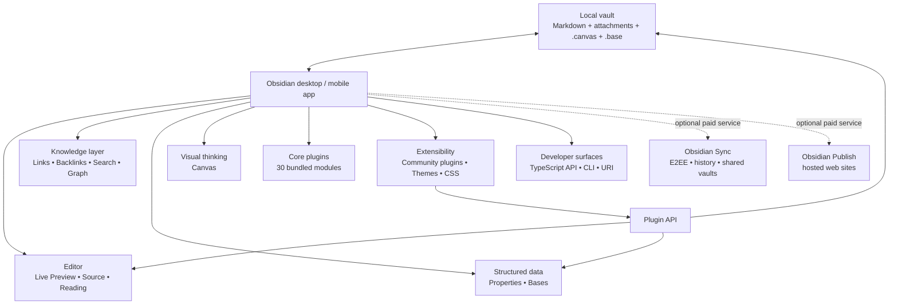

# Obsidian Feature and Functionality Landscape

## Executive summary

**Research date: August 10, 2026.** Obsidian is best understood not as a conventional cloud note-taking service, but as a **local-first, file-based knowledge environment with a modular application layer**. Notes live primarily as local plain-text Markdown files; Obsidian adds rich editing, bidirectional linking, graph visualization, structured properties, database-like Bases, visual Canvas documents, search/navigation, extensible UI, automation, and an unusually broad plugin/theme ecosystem. The core application is free without functional limits and no sign-up is required; Sync and Publish are optional paid services. Commercial use has also been free since February 20, 2025, with the Commercial license now an optional support mechanism. citeturn22view0turn20view0turn23view3

Obsidian's most important architectural characteristic is that **the user's files remain the durable layer**. Ordinary notes are Markdown, Properties are YAML-compatible structured metadata stored in the notes, Canvas uses the open JSON Canvas format, and Bases operates over Markdown files and their properties while storing view definitions as `.base` files or embedded `base` code blocks. This substantially reduces lock-in compared with products whose underlying information exists only in a proprietary remote database. citeturn21view0turn21view1turn25view3turn15search0

The built-in application is highly modular. Obsidian currently identifies **30 core plugins**, including Backlinks, Bases, Canvas, Graph view, Search, Templates, Workspaces, Sync and Publish. Core plugins are built and supported by the Obsidian team and ship with the application, although some are disabled by default. Obsidian also directly maintains the open-source Importer and Maps community plugins. citeturn25view0

The extension model is a major differentiator. Obsidian officially supports community plugins written in TypeScript, themes and CSS snippets, provides generated TypeScript API documentation, a sample-plugin repository, a community-directory submission process, APIs for files, editors, workspace/views, events, metadata and Bases, plus the newer Obsidian CLI and Headless Sync facilities. The public site describes the ecosystem as containing **thousands of plugins and themes**. citeturn19search0turn19search1turn22view0

Mobile is not positioned as a reduced viewer. The official mobile product supports iOS/iPadOS and Android and includes tabs, Command Palette, plugins, custom hotkeys and core plugins such as Graph view. Mobile-specific functionality adds a configurable editing toolbar, pull-down Quick Action and mobile navigation; the operating-system integrations add widgets, iOS Shortcuts/Siri/Share Sheet/Spotlight and Android widgets, Quick Settings tiles and app shortcuts. citeturn15search13turn16view0turn16view1turn16view2

The current commercial model is unusually simple: **core Obsidian is $0**, Sync Standard is $4/user/month when billed annually or $5 monthly, Sync Plus is $8/$10, and Publish is $8/site/month annually or $10 monthly. Catalyst ($25 one-time) and Commercial ($50/user/year) are support licenses rather than feature unlocks for the basic app. citeturn20view0turn20view1turn23view3

## Architecture and comprehensive capability map

The following model captures how the main product layers relate. The important distinction is between the **durable local vault**, the **application/core-plugin layer**, **third-party extensions**, and **optional network services**. Markdown notes, properties, Canvas and Bases can remain local; Sync and Publish add hosted capabilities rather than replacing that local data model. citeturn22view0turn25view3turn15search0turn20view1turn20view2

**Availability terminology in the table:** “Core” means built into the base application; “Core plugin” means an Obsidian-maintained module bundled with the application; “Official tool” means an Obsidian-maintained companion capability; “Community” means third-party ecosystem functionality; “Paid” denotes an optional paid service. Core features are generally available on desktop and many also operate on mobile unless a platform limitation applies. Obsidian's official core-plugin index and product documentation are the baseline sources for the catalogue. citeturn25view0turn15search13

| Category | Feature | What it does | Direct source | Availability |
|---|---|---|---|---|
| Data model | Local-first vault | Stores the user's knowledge in folders/files on the local device and remains usable offline. | [Obsidian overview](https://obsidian.md/) | Core; desktop; mobile |
| Data model | Plain-text Markdown notes | Normal notes are durable Markdown text rather than records that require an Obsidian server to read. | [Obsidian Flavored Markdown](https://obsidian.md/help/obsidian-flavored-markdown) | Core |
| Data model | Open formats | Obsidian emphasizes open file formats and user ownership; Canvas additionally uses open JSON Canvas. | [Overview](https://obsidian.md/) / [Canvas](https://obsidian.md/canvas) | Core |
| Editing | Editing view | Editable Markdown document view. | [Views and editing mode](https://obsidian.md/help/edit-and-read) | Core |
| Editing | Live Preview | Renders formatting inline while hiding most Markdown syntax until the cursor enters the formatted area. | [Views and editing mode](https://obsidian.md/help/edit-and-read) | Core |
| Editing | Source mode | Displays all underlying Markdown syntax literally for precise editing. | [Views and editing mode](https://obsidian.md/help/edit-and-read) | Core |
| Reading | Reading view | Fully rendered note view without normal Markdown syntax. | [Views and editing mode](https://obsidian.md/help/edit-and-read) | Core |
| Markdown | CommonMark | Supports the CommonMark Markdown specification as part of Obsidian's parsing model. | [Obsidian Flavored Markdown](https://obsidian.md/help/obsidian-flavored-markdown) | Core |
| Markdown | GitHub Flavored Markdown | Supports GitHub-flavored Markdown constructs in addition to CommonMark. | [Obsidian Flavored Markdown](https://obsidian.md/help/obsidian-flavored-markdown) | Core |
| Markdown | LaTeX/math | LaTeX is included in Obsidian's supported formatting stack. | [Obsidian Flavored Markdown](https://obsidian.md/help/obsidian-flavored-markdown) | Core |
| Markdown | Obsidian extensions | Adds wikilinks, embeds, block references, footnotes, comments, highlights, callouts, task lists, fenced code and tables. | [Obsidian Flavored Markdown](https://obsidian.md/help/obsidian-flavored-markdown) | Core |
| Linking | Wikilinks | `[[Note]]` syntax for internal links with autocomplete. | [Internal links](https://obsidian.md/help/links) | Core |
| Linking | Standard Markdown links | Internal links can alternatively use normal Markdown-link syntax for interoperability. | [Internal links](https://obsidian.md/help/links) | Core |
| Linking | Automatic link updates | Can update internal links when a referenced file is renamed. | [Internal links](https://obsidian.md/help/links) | Core |
| Linking | Heading links | Links can target headings in the current or another note. | [Internal links](https://obsidian.md/help/links) | Core |
| Linking | Block references | Can link to individually identified paragraphs/list items or other blocks using `^id`. | [Internal links](https://obsidian.md/help/links) | Core |
| Linking | Aliased/display links | Link text can differ from the note name, and reusable note aliases are supported. | [Internal links](https://obsidian.md/help/links) | Core |
| Linking | Embedded/transcluded files | `![[...]]` embeds linked content rather than merely linking to it. | [Obsidian Flavored Markdown](https://obsidian.md/help/obsidian-flavored-markdown) | Core |
| Knowledge graph | Backlinks | Shows notes that explicitly link to the active note. | [Backlinks](https://obsidian.md/help/plugins/backlinks) | Core plugin |
| Knowledge graph | Unlinked mentions | Detects textual mentions of the current note name even where no explicit link exists. | [Backlinks](https://obsidian.md/help/plugins/backlinks) | Core plugin |
| Knowledge graph | Backlinks in document | Backlink results can be displayed below the note itself instead of only in a side panel. | [Backlinks](https://obsidian.md/help/plugins/backlinks) | Core plugin |
| Knowledge graph | Global Graph view | Interactive visualization of notes as nodes and internal links as edges. | [Graph view docs](https://github.com/obsidianmd/obsidian-help/blob/master/en/Plugins/Graph%20view.md) | Core plugin |
| Knowledge graph | Local Graph | Restricts the graph to a selected note and a configurable neighborhood/depth. | [Graph view docs](https://github.com/obsidianmd/obsidian-help/blob/master/en/Plugins/Graph%20view.md) | Core plugin |
| Knowledge graph | Graph filters | Can filter graph content and optionally show tags, attachments, existing-only links and orphan nodes. | [Graph view docs](https://github.com/obsidianmd/obsidian-help/blob/master/en/Plugins/Graph%20view.md) | Core plugin |
| Knowledge graph | Graph groups | Search queries can define visual groups in the graph. | [Graph view docs](https://github.com/obsidianmd/obsidian-help/blob/master/en/Plugins/Graph%20view.md) | Core plugin |
| Knowledge graph | Graph physics/display controls | Controls node/link appearance and graph forces such as center, repel and link-distance behavior. | [Graph view docs](https://github.com/obsidianmd/obsidian-help/blob/master/en/Plugins/Graph%20view.md) | Core plugin |
| Knowledge graph | Graph time-lapse | Can animate graph changes chronologically. | [Graph view docs](https://github.com/obsidianmd/obsidian-help/blob/master/en/Plugins/Graph%20view.md) | Core plugin |
| Structured data | Properties | Adds structured note metadata including text, lists, numbers, checkboxes, dates/date-times and tags. | [Properties](https://obsidian.md/help/properties) | Core |
| Structured data | YAML storage | Properties are represented in YAML-compatible frontmatter at the top of Markdown files. | [Properties](https://obsidian.md/help/properties) | Core |
| Structured data | Default metadata | Built-in conventions include `tags`, `aliases`, and `cssclasses`; Publish recognizes additional publication metadata. | [Properties](https://obsidian.md/help/properties) | Core |
| Structured data | Property search | Search syntax can query note properties. | [Properties](https://obsidian.md/help/properties) | Core |
| Structured data | Bases | Database-like dynamic views over files and their properties without moving note data into a separate database. | [Introduction to Bases](https://obsidian.md/help/bases) | Core plugin |
| Structured data | Base table view | Displays matching files as rows with selected properties as columns. | [Bases](https://obsidian.md/help/bases) | Core plugin |
| Structured data | Base list view | Displays results in list form. | [Bases](https://obsidian.md/help/bases) | Core plugin |
| Structured data | Base cards view | Grid/gallery-style presentation, including image-oriented layouts. | [Bases](https://obsidian.md/help/bases) | Core plugin |
| Structured data | Base map view | Geographic map layout supplied through the Obsidian-maintained Maps extension. | [Bases](https://obsidian.md/help/bases) | Official community plugin |
| Structured data | Base filtering/sorting/grouping | Views can narrow, order and group the notes represented by the base. | [Bases](https://obsidian.md/help/bases) | Core plugin |
| Structured data | Base formulas/functions | Derived values and filter expressions can be computed from properties. | [Bases](https://obsidian.md/help/bases) | Core plugin |
| Structured data | `.base` format | View definitions can be persisted as `.base` files or embedded in Markdown `base` code blocks. | [Bases](https://obsidian.md/help/bases) | Core plugin |
| Structured data | Extensible Base layouts | Plugins can register completely new Bases view types using the official API. | [Build a Bases view](https://docs.obsidian.md/plugins/guides/bases-view) | Plugin API |
| Visual thinking | Infinite Canvas | Two-dimensional infinite workspace for arranging knowledge spatially. | [Canvas Help](https://obsidian.md/help/plugins/canvas) | Core plugin; free |
| Visual thinking | Canvas text cards | Free-standing cards containing Markdown, links and code without requiring a separate file. | [Canvas Help](https://obsidian.md/help/plugins/canvas) | Core plugin |
| Visual thinking | Canvas note cards | Existing Markdown notes can be placed on and edited from the canvas. | [Canvas](https://obsidian.md/canvas) | Core plugin |
| Visual thinking | Canvas media cards | Supports images, PDFs, audio, video and other vault files. | [Canvas](https://obsidian.md/canvas) | Core plugin |
| Visual thinking | Canvas web cards | Interactive web pages/URLs can be embedded as cards. | [Canvas Help](https://obsidian.md/help/plugins/canvas) | Core plugin |
| Visual thinking | Nested Canvas | Canvas documents can be embedded in notes and nested in other canvases. | [Canvas](https://obsidian.md/canvas) | Core plugin |
| Visual thinking | Canvas connections | Directed connections between cards can be created, retargeted, labeled and colored. | [Canvas Help](https://obsidian.md/help/plugins/canvas) | Core plugin |
| Visual thinking | Canvas groups | Cards can be visually grouped and groups can be nested. | [Canvas](https://obsidian.md/canvas) | Core plugin |
| Visual thinking | Canvas arrangement tools | Selection, duplication, snapping, alignment, spreading, resizing, panning and zooming. | [Canvas](https://obsidian.md/canvas) | Core plugin |
| Visual thinking | Canvas image export | Can export the visible region or entire canvas as an image. | [Canvas](https://obsidian.md/canvas) | Core plugin |
| Visual thinking | JSON Canvas | `.canvas` files use the open JSON Canvas format so other tools/scripts can create or modify them. | [Canvas](https://obsidian.md/canvas) | Core/open format |
| Navigation | Search | Full-vault file/content search with Obsidian search operators. | [Core plugins](https://obsidian.md/help/plugins) | Core plugin |
| Navigation | Quick switcher | Keyboard-oriented note search, creation and opening. | [Core plugins](https://obsidian.md/help/plugins) | Core plugin |
| Navigation | File explorer | Hierarchical browser for vault files and folders. | [Core plugins](https://obsidian.md/help/plugins) | Core plugin |
| Navigation | Outline | Generates a navigable table of contents for the active note. | [Core plugins](https://obsidian.md/help/plugins) | Core plugin |
| Navigation | Outgoing links | Displays links originating in the active note. | [Core plugins](https://obsidian.md/help/plugins) | Core plugin |
| Navigation | Page preview | Hover previews linked content without navigating away. | [Core plugins](https://obsidian.md/help/plugins) | Core plugin |
| Navigation | Bookmarks | Bookmarks notes, headings, searches and other targets. | [Core plugins](https://obsidian.md/help/plugins) | Core plugin |
| Navigation | Tags view | Aggregates tags used across the vault. | [Core plugins](https://obsidian.md/help/plugins) | Core plugin |
| Navigation | Tabs | Multiple documents/views can remain open simultaneously; the feature also exists on mobile. | [Mobile product page](https://obsidian.md/mobile) | Core; desktop/mobile |
| Workspace | Workspaces | Saves and restores application layouts. | [Core plugins](https://obsidian.md/help/plugins) | Core plugin |
| Workspace | Multiple view types | Notes and plugin views coexist in tabbed workspace leaves/panes. | [Developer docs](https://docs.obsidian.md/) | Core/API |
| Commands | Command Palette | Central searchable launcher for application and plugin commands. | [Core plugins](https://obsidian.md/help/plugins) | Core plugin |
| Commands | Slash commands | Runs commands from inside the editor after typing `/`. | [Core plugins](https://obsidian.md/help/plugins) | Core plugin |
| Commands | Custom hotkeys | Commands can have user-defined keyboard shortcuts; multiple shortcuts can map to a command. | [Hotkeys](https://obsidian.md/help/hotkeys) | Core |
| Templates | Template insertion | Inserts reusable predefined content at the cursor. | [Templates](https://obsidian.md/help/plugins/templates) | Core plugin |
| Templates | Template variables | Supports `{{title}}`, `{{date}}`, `{{time}}` and custom date/time format strings. | [Templates](https://obsidian.md/help/plugins/templates) | Core plugin |
| Templates | Property templates | Properties in templates are added/merged into target notes. | [Templates](https://obsidian.md/help/plugins/templates) | Core plugin |
| Capture | Daily notes | Creates/opens a note associated with the current date. | [Core plugins](https://obsidian.md/help/plugins) | Core plugin |
| Capture | Unique note creator | Generates uniquely named notes using time-coded titles. | [Core plugins](https://obsidian.md/help/plugins) | Core plugin |
| Capture | Audio recorder | Records audio directly into the note workflow. | [Core plugins](https://obsidian.md/help/plugins) | Core plugin |
| Recovery | File recovery | Maintains regular snapshots for recovering work. | [Core plugins](https://obsidian.md/help/plugins) | Core plugin |
| Transformation | Note composer | Splits one note or merges notes. | [Core plugins](https://obsidian.md/help/plugins) | Core plugin |
| Transformation | Format converter | Converts supported Markdown conventions from other apps into Obsidian-compatible formatting. | [Core plugins](https://obsidian.md/help/plugins) | Core plugin |
| Presentation | Slides | Turns Markdown notes into presentations. | [Core plugins](https://obsidian.md/help/plugins) | Core plugin |
| Browser | Web viewer | Opens external web content inside Obsidian. | [Core plugins](https://obsidian.md/help/plugins) | Core plugin |
| Writing metrics | Word count | Shows word and character counts. | [Core plugins](https://obsidian.md/help/plugins) | Core plugin |
| Footnotes | Footnotes view | Aggregates footnotes from the active document. | [Core plugins](https://obsidian.md/help/plugins) | Core plugin |
| Appearance | Themes | Installs and manages community-created application themes. | [Themes](https://obsidian.md/help/themes) | Community |
| Appearance | CSS snippets | Vault-local CSS can selectively override Obsidian's appearance. | [CSS snippets](https://obsidian.md/help/snippets) | Core customization |
| Appearance | CSS variables | Official CSS variables provide theme-compatible customization hooks. | [Developer CSS docs](https://docs.obsidian.md/Reference/CSS+variables/CSS+variables) | Developer/customization |
| Extensibility | Community plugins | Third-party TypeScript/JavaScript extensions add commands, views, integrations, file handling and workflows. | [Community plugins](https://obsidian.md/help/community-plugins) | Community |
| Extensibility | Restricted Mode | Disables execution of community plugins. | [Plugin security](https://obsidian.md/help/plugin-security) | Core security |
| Extensibility | Plugin safety score/review | Submitted plugin versions are automatically scanned; selected plugins also receive manual review. | [Plugin security](https://obsidian.md/help/plugin-security) | Community governance |
| Automation | Obsidian CLI | Command-line access for reading, creating, searching, querying and automating an active Obsidian application. | [Obsidian CLI](https://obsidian.md/cli) | Official tool |
| Automation | CLI TUI | Interactive terminal interface with autocomplete and keyboard navigation. | [Obsidian CLI](https://obsidian.md/cli) | Official tool |
| Automation | Headless Sync | Runs Obsidian Sync without the GUI for servers and automated environments. | [CLI / Headless Sync](https://obsidian.md/cli) | Official tool + paid Sync |
| Capture | Web Clipper | Browser extension for highlighting and capturing web pages into durable vault files. | [Web Clipper](https://obsidian.md/clipper) | Official tool |
| Capture | Web Clipper templates | Controls file structure, properties and captured page metadata for different kinds of sites/content. | [Web Clipper](https://obsidian.md/clipper) | Official tool |
| Mobile | iOS/iPadOS app | Full Obsidian mobile client with platform integrations. | [iOS Help](https://obsidian.md/help/ios) | Mobile |
| Mobile | Android app | Full Obsidian mobile client, including selectable vault-storage model. | [Android Help](https://obsidian.md/help/android) | Mobile |
| Mobile | Mobile toolbar | Configurable editing action bar including global commands. | [Mobile Help](https://obsidian.md/help/mobile) | Mobile |
| Mobile | Quick Action | Pull-down gesture invokes a configurable Obsidian command. | [Mobile Help](https://obsidian.md/help/mobile) | Mobile |
| Cloud service | Obsidian Sync | End-to-end encrypted, cross-device synchronization with version history and shared vaults. | [Obsidian Sync](https://obsidian.md/sync) | Paid |
| Publishing | Obsidian Publish | Converts selected vault content into a hosted web wiki/knowledge base/documentation/digital garden. | [Obsidian Publish](https://obsidian.md/publish) | Paid |

Several details in that table are especially important. Obsidian's Markdown implementation combines CommonMark, GitHub Flavored Markdown and LaTeX, then adds Obsidian-specific constructs such as `[[wikilinks]]`, embeds, block references, comments, highlights, callouts and tasks. Markdown placed *inside raw HTML elements* is intentionally not processed. citeturn21view1

Properties currently support **Text, List, Number, Checkbox, Date, Date & time and Tags** types. They are stored as YAML-compatible frontmatter; a property name has a vault-wide assigned type, and default property conventions include `tags`, `aliases` and `cssclasses`. Properties can be searched and are a central source of data for Bases and plugins. citeturn21view0

Links are more sophisticated than simple file references. Obsidian supports both wikilinks and Markdown links, file/folder paths, heading targets, cross-vault heading search, block references, custom display text and aliases; it can automatically update links after file renames. Some constructs—notably block references—are intentionally Obsidian-specific rather than portable standard Markdown. citeturn21view3

## Official plugins and high-value native workflows

Obsidian's own definition is precise: **core plugins are built and supported by the Obsidian team, are included with the application, and can be enabled or disabled independently**. The table below reproduces the complete current core-plugin set, plus the two additional open-source plugins the Obsidian team explicitly says it maintains. citeturn25view0

| Official plugin | Type | Function | Direct documentation/source |
|---|---|---|---|
| Audio recorder | Core plugin | Record and save audio directly in notes. | [Official source](https://github.com/obsidianmd/obsidian-help/blob/master/en/Plugins/Audio%20recorder.md) |
| Backlinks | Core plugin | Show linked and unlinked references to a note. | [Backlinks Help](https://obsidian.md/help/plugins/backlinks) |
| Bases | Core plugin | Database-like views for editing/filtering/sorting note properties. | [Bases Help](https://obsidian.md/help/bases) |
| Bookmarks | Core plugin | Save notes, headings, searches and other navigation targets. | [Official source](https://github.com/obsidianmd/obsidian-help/blob/master/en/Plugins/Bookmarks.md) |
| Canvas | Core plugin | Infinite visual workspace for notes, media and web cards. | [Canvas Help](https://obsidian.md/help/plugins/canvas) |
| Command palette | Core plugin | Search and execute application/plugin commands. | [Official source](https://github.com/obsidianmd/obsidian-help/blob/master/en/Plugins/Command%20palette.md) |
| Daily notes | Core plugin | Open/create date-based notes. | [Official source](https://github.com/obsidianmd/obsidian-help/blob/master/en/Plugins/Daily%20notes.md) |
| File explorer | Core plugin | Browse and manipulate vault files and folders. | [Official source](https://github.com/obsidianmd/obsidian-help/blob/master/en/Plugins/File%20explorer.md) |
| File recovery | Core plugin | Recover content from regular local snapshots. | [Official source](https://github.com/obsidianmd/obsidian-help/blob/master/en/Plugins/File%20recovery.md) |
| Footnotes view | Core plugin | List the current note's footnotes. | [Official source](https://github.com/obsidianmd/obsidian-help/blob/master/en/Plugins/Footnotes%20view.md) |
| Format converter | Core plugin | Normalize Markdown imported from other applications. | [Official source](https://github.com/obsidianmd/obsidian-help/blob/master/en/Plugins/Format%20converter.md) |
| Graph view | Core plugin | Global/local visualization of relationships between notes. | [Official source](https://github.com/obsidianmd/obsidian-help/blob/master/en/Plugins/Graph%20view.md) |
| Note composer | Core plugin | Merge notes or split a note into separate notes. | [Official source](https://github.com/obsidianmd/obsidian-help/blob/master/en/Plugins/Note%20composer.md) |
| Outgoing links | Core plugin | Show links originating from the current note. | [Official source](https://github.com/obsidianmd/obsidian-help/blob/master/en/Plugins/Outgoing%20links.md) |
| Outline | Core plugin | Outline/table of contents for the active note. | [Official source](https://github.com/obsidianmd/obsidian-help/blob/master/en/Plugins/Outline.md) |
| Page preview | Core plugin | Hover-preview linked content. | [Official source](https://github.com/obsidianmd/obsidian-help/blob/master/en/Plugins/Page%20preview.md) |
| Properties view | Core plugin | Browse vault-wide properties and properties of the active note. | [Official source](https://github.com/obsidianmd/obsidian-help/blob/master/en/Plugins/Properties%20view.md) |
| Publish | Core plugin interface | Publish notes through the paid Obsidian Publish service. | [Publish](https://obsidian.md/publish) |
| Quick switcher | Core plugin | Keyboard-first note finding, creation and opening. | [Official source](https://github.com/obsidianmd/obsidian-help/blob/master/en/Plugins/Quick%20switcher.md) |
| Random note | Core plugin | Open a randomly selected vault note. | [Official source](https://github.com/obsidianmd/obsidian-help/blob/master/en/Plugins/Random%20note.md) |
| Search | Core plugin | Search files and content throughout a vault. | [Official source](https://github.com/obsidianmd/obsidian-help/blob/master/en/Plugins/Search.md) |
| Slash commands | Core plugin | Trigger commands from the editor with `/`. | [Official source](https://github.com/obsidianmd/obsidian-help/blob/master/en/Plugins/Slash%20commands.md) |
| Slides | Core plugin | Create presentations from Markdown notes. | [Official source](https://github.com/obsidianmd/obsidian-help/blob/master/en/Plugins/Slides.md) |
| Sync | Core plugin interface | Connect a vault to paid Obsidian Sync. | [Sync](https://obsidian.md/sync) |
| Tags view | Core plugin | Browse tags used throughout the vault. | [Official source](https://github.com/obsidianmd/obsidian-help/blob/master/en/Plugins/Tags%20view.md) |
| Templates | Core plugin | Insert reusable notes/text and dynamic date/time/title variables. | [Templates Help](https://obsidian.md/help/plugins/templates) |
| Unique note creator | Core plugin | Create notes with time-based unique titles. | [Official source](https://github.com/obsidianmd/obsidian-help/blob/master/en/Plugins/Unique%20note%20creator.md) |
| Web viewer | Core plugin | Open web links inside Obsidian. | [Official source](https://github.com/obsidianmd/obsidian-help/blob/master/en/Plugins/Web%20viewer.md) |
| Word count | Core plugin | Report words and characters. | [Official source](https://github.com/obsidianmd/obsidian-help/blob/master/en/Plugins/Word%20count.md) |
| Workspaces | Core plugin | Save and restore window/workspace layouts. | [Official source](https://github.com/obsidianmd/obsidian-help/blob/master/en/Plugins/Workspaces.md) |
| Importer | Obsidian-maintained community plugin | Imports/converts content from other note-taking apps and formats. | [Official GitHub repository](https://github.com/obsidianmd/obsidian-importer) |
| Maps | Obsidian-maintained community plugin | Adds an interactive map layout to Bases. | [Official core-plugin index](https://obsidian.md/help/plugins) |

The complete official list and the distinction between bundled plugins and Obsidian-maintained community plugins are documented on the current Core plugins page. citeturn25view0

**Canvas is considerably more than a whiteboard.** Cards can contain independent Markdown text, normal notes, media, PDFs, URLs and folders; text cards can be converted into notes; cards can be edited in-place and connected by directed, labelable, colorable edges; items can be grouped, aligned, distributed, duplicated, snapped, zoomed and panned. Canvas can be embedded in Markdown, and Obsidian's product page additionally documents nested canvases and whole/visible-canvas image export. Because the file format is open JSON Canvas, scripts and other applications can manipulate the graph of cards/connections independently of the Obsidian UI. citeturn25view3turn22view1

**Graph view is primarily a relationship-analysis view rather than a note storage system.** Notes are nodes and links are edges; the view offers query-based filters/groups, display controls, force-layout controls, chronological animation and Local Graph for exploring the immediate neighborhood of a note. Its value is therefore strongest when the vault already uses internal linking consistently. citeturn9view0

**Backlinks form the reverse edge of that model.** The plugin separates explicit Linked mentions from Unlinked mentions, can filter and sort the results, can pin a backlinks view to a specific note, and can display backlinks at the bottom of the note. citeturn25view2

**Bases represents a significant expansion beyond traditional Markdown note browsing.** A Base does not replace notes with proprietary database rows: source data continues to reside in Markdown files and their Properties. Bases creates filtered/sorted/grouped projections of those files in table, list, card and extensible layouts, with formula/function support. Plugins can register new layouts against the same Bases data model, which makes Bases both an end-user feature and an API surface. citeturn15search0turn19search5

**The editor deliberately offers three experiences over the same underlying Markdown.** Reading view renders the content, Live Preview performs inline formatting while retaining editability, and Source mode exposes the literal syntax. This is an important design distinction: users do not have to choose permanently between a WYSIWYG-like experience and editable source text. citeturn21view2

**Templates are deliberately lightweight in core Obsidian.** The official plugin inserts arbitrary predefined note content and supplies `{{title}}`, `{{date}}` and `{{time}}`, with Moment-style custom format strings. Templates can contain Properties, which Obsidian merges into the destination note. More elaborate programmatic templating is an area where community plugins extend the core model. citeturn18view1

**Hotkeys are command-based.** Users can assign keyboard combinations to Obsidian commands, assign multiple shortcuts to one command, inspect them through the Command Palette, and filter the Hotkeys settings to commands that already have assignments. This architecture also means commands registered by plugins naturally participate in the same user-configurable hotkey system. citeturn15search1turn17search0

**CSS snippets offer a customization layer below full themes.** A `.css` snippet in the vault configuration directory can change the Obsidian UI and note presentation, can use official CSS variables, can target individual notes through the `cssclasses` property, and works on desktop as well as mobile/tablet when the snippet is placed in the vault configuration directory. citeturn18view0

## Mobile and platform capabilities

Obsidian's official positioning is that Mobile brings the power of the desktop app to iOS and Android: tabs, Command Palette, plugins and custom hotkeys are present, core plugins including Graph view operate there, and community plugins can be installed directly. Platform compatibility of a particular community plugin still depends on how it was written; the plugin manifest includes an `isDesktopOnly` flag for plugins relying on Node.js/Electron APIs. citeturn15search13turn19search2

| Mobile feature | Functionality | Platform | Direct source |
|---|---|---|---|
| Full mobile vault | Open/edit local Obsidian vaults with core note functionality. | iOS/iPadOS + Android | [Mobile](https://obsidian.md/mobile) |
| Core plugins | Core features such as Graph view are available on mobile. | iOS/iPadOS + Android | [Mobile](https://obsidian.md/mobile) |
| Community plugins | Community extensions can be installed on mobile when plugin compatibility permits. | iOS/iPadOS + Android | [Mobile](https://obsidian.md/mobile) |
| Tabs | Multiple open tabs/views. | iOS/iPadOS + Android | [Mobile](https://obsidian.md/mobile) |
| Command Palette | Execute Obsidian/plugin commands on mobile. | iOS/iPadOS + Android | [Mobile](https://obsidian.md/mobile) |
| Custom hotkeys | Keyboard shortcuts for users with suitable keyboards. | Mobile | [Mobile](https://obsidian.md/mobile) |
| Mobile toolbar | Configurable bottom editing toolbar; actions can be added, removed and reordered. | iOS/iPadOS + Android | [Mobile Help](https://obsidian.md/help/mobile) |
| Global toolbar commands | Mobile toolbar can include global application commands, not only editor actions. | iOS/iPadOS + Android | [Mobile Help](https://obsidian.md/help/mobile) |
| Quick Action | Pull down from the top to invoke a user-selected command; defaults to Command Palette. | iOS/iPadOS + Android | [Mobile Help](https://obsidian.md/help/mobile) |
| Mobile navigation bar | Back/forward navigation, create/find note and tab management. | iOS/iPadOS + Android | [Mobile Help](https://obsidian.md/help/mobile) |
| Menu-based ribbon actions | Because mobile has no desktop-style Ribbon, equivalent actions are exposed through the mobile menu. | iOS/iPadOS + Android | [Mobile Help](https://obsidian.md/help/mobile) |
| Widgets | Quick access to notes, new notes, daily notes, search and app launch. | iOS/iPadOS + Android | [iOS](https://obsidian.md/help/ios) / [Android](https://obsidian.md/help/android) |
| Apple Shortcuts | Open notes, create notes, open/capture to daily note and capture to bookmarked note. | iOS/iPadOS | [iOS Help](https://obsidian.md/help/ios) |
| Siri | Voice actions for capture, daily note and search. | iOS/iPadOS | [iOS Help](https://obsidian.md/help/ios) |
| Native Share Sheet | Capture content from Safari/other applications into new, daily, bookmarked or existing notes and bookmarks. | iOS/iPadOS 18+ for documented native integration | [iOS Help](https://obsidian.md/help/ios) |
| Share Sheet templates | Captured web content can use templates with title, author, URL, image, publication date, word count and other placeholders. | iOS/iPadOS | [iOS Help](https://obsidian.md/help/ios) |
| Spotlight actions | New Note, Search and Daily Note actions appear through iOS Spotlight. | iOS/iPadOS | [iOS Help](https://obsidian.md/help/ios) |
| Android device storage | Vault stored in shared device storage, allowing access by other file/sync tools. | Android | [Android Help](https://obsidian.md/help/android) |
| Android app storage | Private application storage option, suitable for Obsidian Sync/plugin sync but isolated from ordinary shared-storage tools. | Android | [Android Help](https://obsidian.md/help/android) |
| Quick Settings tile | Launch/access Obsidian from Android Quick Settings. | Android 7.0+ | [Android Help](https://obsidian.md/help/android) |
| Android app shortcuts | Launcher shortcuts for actions such as opening a note or daily note. | Android 7.1+ | [Android Help](https://obsidian.md/help/android) |

The iOS integration has become especially rich. Current documentation covers Lock Screen, Control Center and Home Screen widgets, Apple Shortcuts, Siri, Spotlight and a native Share Sheet. The Share Sheet can capture into a new note, daily note, bookmarked note, existing note or a new bookmark, and configurable “Locations” can apply templates and choose append/prepend behavior. citeturn16view1

Android exposes a different set of system primitives. Users can choose shared device storage or Obsidian's private app storage, install widgets, use Quick Settings tiles and access launcher shortcuts. The storage choice matters: shared device storage works better with external tools such as file-based sync utilities; app storage provides stronger application-level isolation but is removed if the Obsidian app itself is uninstalled. citeturn16view2

## Sync, Publish, and pricing

Obsidian separates the **free application** from optional hosted services. The basic app has no subscription requirement; Sync supplies hosted encrypted synchronization/collaboration, while Publish supplies hosted public/private web delivery. Commercial and Catalyst licenses support the company rather than being required to unlock normal core-app functionality. citeturn20view0turn23view3

**Current prices below are the official USD prices observed on August 10, 2026.** citeturn20view0turn20view1turn20view2

| Product/tier | Current price | Included functionality | Direct source |
|---|---:|---|---|
| Obsidian core app | **$0** | Full local application; no sign-up required; commercial/work use permitted; core plugins, local files, plugins/themes and customization. | [Pricing](https://obsidian.md/pricing) |
| Sync Standard — annual billing | **$4/user/month** | Sync features plus **1 synced vault, 1 GB total storage, 5 MB maximum file size, 1-month version history**. | [Sync](https://obsidian.md/sync) |
| Sync Standard — monthly billing | **$5/user/month** | Same Standard limits/features, paid month-to-month. | [Sync](https://obsidian.md/sync) |
| Sync Plus — annual billing | **$8/user/month** | **10 synced vaults, 10 GB total storage, 200 MB maximum file size, 12-month version history; storage upgradable to 100 GB**. | [Sync](https://obsidian.md/sync) |
| Sync Plus — monthly billing | **$10/user/month** | Same Plus feature/limit set, month-to-month. | [Sync](https://obsidian.md/sync) |
| Publish — annual billing | **$8/site/month** | Hosted Publish site up to **4 GB**, priority email support, customizable theme/domain, SEO/mobile optimization, connected-note web features. | [Publish](https://obsidian.md/publish) |
| Publish — monthly billing | **$10/site/month** | Same Publish service paid monthly. | [Publish](https://obsidian.md/publish) |
| Catalyst | **$25 one-time** | Early access to beta versions, community badges and exclusive community channels; primarily a support license. | [Pricing](https://obsidian.md/pricing) |
| Commercial | **$50/user/year** | Optional organizational support license; commercial use does **not** require it. | [Pricing](https://obsidian.md/pricing) |

**Sync functionality extends well beyond copying Markdown files.** Data is end-to-end encrypted with AES-256; the service operates across macOS, Windows, Linux, iOS and Android and supports Headless Sync on servers. It works offline and synchronizes when connectivity returns, keeps version history, and supports shared vaults. citeturn20view1

Sync can also synchronize configuration selectively: editor/file/link settings, appearance settings, themes, CSS snippets, enabled plugins and custom hotkeys. Users can exclude folders and independently toggle synchronization of images, audio, video, PDFs and other file types. Recovery facilities expose snapshots, deleted files and a synchronization activity log. citeturn20view1

This means Sync is better characterized as **vault-and-configuration synchronization** than as a simplistic Markdown-file replication service. The architecture remains device-local and offline-capable: every device works on local files, while Sync coordinates encrypted state among those devices. citeturn20view1turn22view0

**Publish has a separate purpose.** It hosts selected connected notes as a wiki, knowledge base, documentation site or digital garden. Reader-facing features include hover previews, site Graph view, stacked pages and backlinks. Authors continue writing in Markdown inside Obsidian and can publish from desktop or mobile. citeturn20view2

Publish includes customization through CSS and JavaScript, custom domains, password protection with multiple passwords, search-engine-indexing controls and optional analytics. It also generates SEO/social-sharing metadata and allows page-level descriptions, slugs and images. citeturn20view2

Publish should therefore not be confused with Sync: **Sync moves private working vault data among devices and collaborators; Publish converts selected knowledge into a reader-facing web property.** A user may need one, both, or neither. citeturn20view1turn20view2

Obsidian's current privacy stance is also relevant to pricing. The company says the ordinary application can be used without supplying personal information, notes remain locally stored, and the application does not collect telemetry. When Sync is used, hosted vault data is protected with end-to-end encryption. Students, faculty and nonprofit employees currently qualify for a **40% discount on Sync and Publish**. citeturn20view0

## Developer API and community ecosystem

Obsidian's extension ecosystem operates at several levels rather than through a single narrow API. TypeScript plugins can modify application behavior and UI; themes and snippets use CSS; Bases supplies a dedicated extension mechanism for data views; the CLI exposes commands and automation to external processes; and Sync can now operate headlessly on servers. Official developer documentation, the sample plugin and API definitions are maintained by Obsidian. citeturn19search0turn19search1turn23view1

| Developer surface | Capability | Direct primary source |
|---|---|---|
| TypeScript plugin API | Build runtime extensions that execute inside Obsidian. | [Developer Documentation](https://docs.obsidian.md/) |
| `Plugin` lifecycle | Plugin class, loading/unloading, resource/event registration and plugin-owned state. | [Build a plugin](https://docs.obsidian.md/Plugins/Getting%20started/Build%20a%20plugin) |
| Plugin manifest | Declares plugin ID, name, version, minimum app version, desktop-only status and other metadata. | [Manifest](https://docs.obsidian.md/Reference/Manifest) |
| Sample plugin | Official reference project/build environment for plugin authors. | [obsidian-sample-plugin](https://github.com/obsidianmd/obsidian-sample-plugin) |
| Type definitions | Published Obsidian API type definitions for TypeScript development. | [obsidian-api](https://github.com/obsidianmd/obsidian-api) |
| `App` | Central object through which plugins reach application subsystems such as vault/workspace/metadata. | [TypeScript API](https://docs.obsidian.md/Reference/TypeScript%20API/App) |
| `Vault` | Enumerate, read, create and update vault files/folders; exposes file-system events. | [Vault developer guide](https://docs.obsidian.md/Plugins/Vault) |
| Data adapters | Lower-level storage access for cases not covered by ordinary Vault methods. | [TypeScript API](https://docs.obsidian.md/Reference/TypeScript%20API/DataAdapter) |
| `Editor` | Read/manipulate the active Markdown editor, cursor, selections and text. | [Editor](https://docs.obsidian.md/Plugins/Editor/Editor) |
| CodeMirror integration | Editor layer uses CodeMirror; plugins can build editor extensions while Obsidian's `Editor` abstraction improves cross-platform compatibility. | [Editor](https://docs.obsidian.md/Plugins/Editor/Editor) |
| Metadata cache | Programmatic access to indexed note metadata such as links and parsed document structures. | [MetadataCache API](https://docs.obsidian.md/Reference/TypeScript%20API/MetadataCache) |
| Workspace API | Work with leaves/views, active views and application workspace state. | [Workspace API](https://docs.obsidian.md/Reference/TypeScript%20API/Workspace) |
| File Manager | Higher-level operations around files/frontmatter and user-consistent file actions. | [FileManager API](https://docs.obsidian.md/Reference/TypeScript%20API/FileManager) |
| Commands | Plugins can register commands that become available through the Command Palette and hotkey system. | [Build a plugin](https://docs.obsidian.md/Plugins/Getting%20started/Build%20a%20plugin) |
| Ribbon actions | Add icons/actions to the application Ribbon. | [Build a plugin](https://docs.obsidian.md/Plugins/Getting%20started/Build%20a%20plugin) |
| Notices/modals/menus | Native UI primitives for messages and interactive plugin UI. | [TypeScript API](https://docs.obsidian.md/Reference/TypeScript%20API) |
| Settings API | Plugins can expose user-configurable settings and persist plugin data. | [Developer docs](https://docs.obsidian.md/) |
| Custom views | Plugins can create new pane/tab view types in the workspace. | [TypeScript API](https://docs.obsidian.md/Reference/TypeScript%20API/ItemView) |
| Markdown rendering | APIs include Markdown rendering/post-processing classes for augmenting rendered documents. | [TypeScript API](https://docs.obsidian.md/Reference/TypeScript%20API/MarkdownRenderer) |
| Event subscription | Observe application and vault events; official guidance uses lifecycle-aware `registerEvent()`. | [Events](https://docs.obsidian.md/Plugins/Events) |
| Timers | Lifecycle-aware interval registration for repeated plugin actions. | [Events](https://docs.obsidian.md/Plugins/Events) |
| Bases API | Register entirely new Bases view layouts and consume evaluated Bases data. | [Build a Bases view](https://docs.obsidian.md/plugins/guides/bases-view) |
| `SecretStorage` | Central store for sensitive plugin values such as API keys/tokens instead of plain plugin `data.json`. | [Secret Storage](https://docs.obsidian.md/plugins/guides/secret-storage) |
| CSS API surface | Official CSS variables support themes, snippets and plugin styling that adapts to the active theme. | [CSS variables](https://docs.obsidian.md/Reference/CSS+variables/CSS+variables) |
| App themes | Full CSS themes can be built and distributed through the community directory. | [Developer docs](https://docs.obsidian.md/) |
| Mobile plugin targeting | Manifest `isDesktopOnly` indicates reliance on desktop Node.js/Electron capabilities; cross-platform plugins should use mobile-safe APIs. | [Manifest](https://docs.obsidian.md/Reference/Manifest) |
| Community submission | Initial plugin version is reviewed/submitted to Obsidian's community directory; subsequent releases are distributed from the plugin's GitHub releases. | [Submit your plugin](https://docs.obsidian.md/Plugins/Releasing/Submit%20your%20plugin) |
| Plugin directory registry | Obsidian's public registry of community-plugin metadata. | [obsidian-releases](https://github.com/obsidianmd/obsidian-releases) |
| Obsidian CLI | External shell interface for vault/application commands and automation. | [CLI](https://obsidian.md/cli) |
| CLI developer commands | Reload plugins, open DevTools, execute JavaScript, inspect CSS/DOM, review errors and capture screenshots. | [CLI](https://obsidian.md/cli) |
| Headless Sync | Synchronize an Obsidian Sync vault on a server without GUI interaction. | [CLI / Headless Sync](https://obsidian.md/cli) |
| Web Clipper | Official browser-side capture surface feeding Markdown/properties into vaults. | [Web Clipper](https://obsidian.md/clipper) |
| Obsidian URI | URI-based external application/deep-link integration. | [Obsidian Help](https://obsidian.md/help/) |

Plugins are powerful precisely because they are **not strongly sandboxed**. Obsidian warns that community plugins inherit the application's access level: third-party code may access computer files, connect to the internet and potentially install additional programs. Restricted Mode prevents third-party plugin execution; Obsidian says every community-plugin version is automatically scanned for security vulnerabilities, code-quality problems and malware, with continued manual review for popular, featured and flagged plugins. This is an important security trade-off of the open extension architecture. citeturn18view2

The official plugin-development workflow uses TypeScript, Node.js tooling and the `obsidian` package. The sample process compiles a plugin to `main.js`, places it under the vault's plugin directory and registers commands/UI from a class derived from `Plugin`. Obsidian explicitly recommends developing against a separate test vault because plugin bugs can modify user files. citeturn19search1

For file manipulation, the `Vault` abstraction is the preferred high-level interface. It can enumerate Markdown/all files, read cached or current content and modify files; current developer guidance favors safe processing primitives such as `Vault.process()` where appropriate to reduce stale-read overwrite risks. citeturn19search4

For editor integration, `Editor` abstracts reading and manipulating the active Markdown document and bridges Obsidian's CodeMirror-based editor implementation across platforms. This matters for plugin portability: a plugin using the documented abstraction is less tightly coupled to a particular CodeMirror implementation than one manipulating internal editor objects directly. citeturn19search3

Events are another first-class extension mechanism. Plugins can subscribe to events such as vault file creation and register lifecycle-aware event handlers and timers so they are automatically cleaned up when the plugin unloads. citeturn19search19

Bases is now itself an extension target. A plugin can call the Bases registration API to supply a new layout, access filtered/grouped Base entries and their evaluated property values, and expose layout-specific configuration. This creates an extensibility chain of **Markdown → Properties → Bases query/model → third-party visualization**, rather than forcing plugin developers to build a separate data layer from scratch. citeturn19search5

The newer CLI substantially expands external automation. Obsidian demonstrates commands for opening daily notes, appending tasks, searching, reading files, creating notes from templates, listing tags, comparing revisions and finding unresolved links. Developer-oriented commands can reload a plugin, open DevTools, execute JavaScript, inspect CSS/DOM and retrieve errors. The CLI currently requires the Obsidian application to be running for normal CLI operation; Headless Sync is the separate mechanism for GUI-free synchronization on servers. citeturn23view1turn23view2

**Community-plugin categories require an important qualification:** the official Community Plugins browser is fundamentally searchable by **name, author and description**, rather than presenting a rigid official taxonomy. The categories below are therefore an **analytical taxonomy of the ecosystem**, not categories formally imposed by Obsidian. Obsidian's own homepage currently spotlights Calendar, Kanban, Dataview, Outliner and Tasks as examples of how extensions broaden the base app. citeturn17search0turn22view0

| Analytical community-plugin category | Typical functionality enabled | Relationship to core Obsidian |
|---|---|---|
| Data/query/database | Query vault metadata, compute derived views, dashboards, reporting and structured-data workflows. | Extends Properties/Bases/search; the official homepage showcases Dataview. |
| Task/project management | Cross-vault task aggregation, recurring tasks, Kanban/project workflows and status tracking. | Extends Markdown task syntax and Properties; official homepage showcases Tasks and Kanban. |
| Calendars/time planning | Calendar navigation, scheduling, day/week planning and date-aware workflows. | Extends Daily notes and date properties; official homepage showcases Calendar. |
| Editing/outlining | Advanced list manipulation, structural editing, text transformations and editor commands. | Extends CodeMirror/editor/command APIs; official homepage showcases Outliner. |
| Linking/navigation/graph | Alternative link browsers, semantic navigation, relationship visualization and enhanced graph workflows. | Extends internal links, MetadataCache, workspace and Graph concepts. |
| Templates/automation | Programmatic templates, macros, note generation, workflows and event-based automation. | Extends core Templates, commands and Vault APIs. |
| Search/retrieval | Advanced search interfaces, fuzzy navigation, saved queries and indexed retrieval. | Extends Search, Quick switcher and metadata APIs. |
| Integrations | Connect calendars, task systems, citation managers, Git, APIs and other external services. | Uses network/file/API capabilities available to plugins. |
| Import/export/publishing | Convert external data, export vault material and integrate alternative publication pipelines. | Supplements the official Importer and Publish workflows. |
| Media/visualization | Diagrams, drawing, charts, media galleries, maps and specialized file rendering. | Extends Markdown rendering, Canvas and Bases layouts. |
| Appearance/workspace | Alternative panes, layouts, navigation, styling, status/ribbon tools and UX modifications. | Uses Workspace/UI/CSS APIs. |
| Developer/version-control | Git workflows, linting, diagnostics, metadata tooling and plugin-development utilities. | Exploits local files, commands and developer API. |
| AI/semantic tooling | Model integrations, semantic search, summarization and automated processing. | Usually combines Vault/Editor access with external network APIs; requires normal third-party-plugin trust considerations. |
| Mobile/device workflows | Mobile-specific capture, gestures and integrations optimized for smaller-screen workflows. | Builds on mobile-safe portions of the API. |
| Bases extensions | New Base view types, renderers and property-driven interfaces. | Explicitly supported by the Bases API. |

The ecosystem is distributed through several official community surfaces. The browser-accessible [Community Plugin Directory](https://community.obsidian.md/plugins) and [Theme Directory](https://community.obsidian.md/themes) correspond to the installation interfaces inside Obsidian; the official [obsidian-releases repository](https://github.com/obsidianmd/obsidian-releases) tracks community plugin metadata; and developers have dedicated [Developers & API](https://forum.obsidian.md/c/developers-api/14) and [Share & Showcase](https://forum.obsidian.md/c/share-showcase/9) areas in the Obsidian Forum. The developer documentation also points contributors to `#plugin-dev` and `#theme-dev` community channels. citeturn19search0turn19search18

The result is an ecosystem with an unusually clear layering model: **standard/open files at the bottom, Obsidian's editor and knowledge primitives above them, optional core plugins above that, a third-party TypeScript/CSS extension layer, and optional Obsidian-operated network services at the edge**. That architecture explains why Obsidian can range from a minimal offline Markdown editor to a database-like project system, spatial research environment, collaborative synced vault, public knowledge site, or deeply automated developer workspace without changing the fundamental ownership model of the user's files. citeturn22view0turn15search0turn25view3turn19search0turn20view1turn20view2