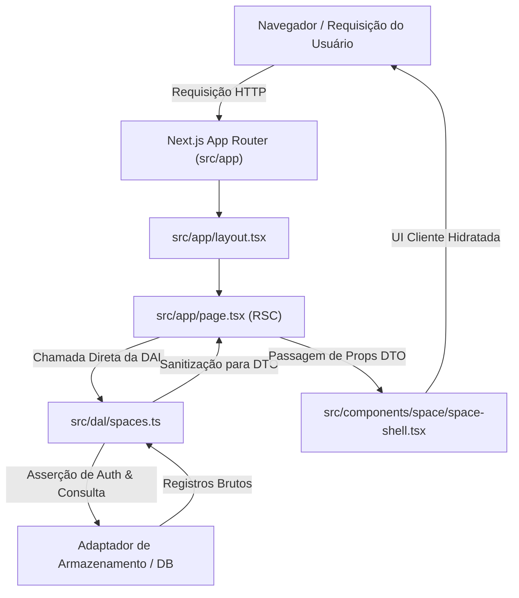
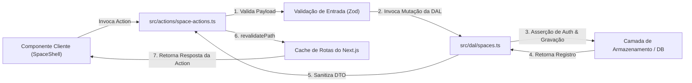

# Visão Geral da Arquitetura (Padrão Matklad)

Este documento fornece uma visão geral de alto nível da arquitetura do **Notes App**, da estrutura de diretórios, das abstrações centrais e dos invariantes de engenharia. Ele foi escrito seguindo o padrão **Matklad ARCHITECTURE.md** para ajudar novos colaboradores e agentes automatizados a se orientarem rapidamente na base de código.

---

## 1. Visão Geral (Bird's Eye View)

O **Notes App** é uma aplicação web unificada de gestão de conhecimento e estudo, local-first e de custo operacional zero. Ele unifica três domínios principais:
1. **Arquitetura de Objetos (estilo Capacities)**: Notas interconectadas, tipos de objetos flexíveis, coleções, links bidirecionais e transclusões de blocos.
2. **Ingestão de Documentos (estilo Readwise)**: Destaques (highlighting), parsing de documentos e importações de leituras externas.
3. **Sistema de Repetição Espaçada (estilo Anki/FSRS)**: Flashcards, gerenciamento de fila de revisão e algoritmos de retenção de memória.

A aplicação é construída sobre **Next.js 16 (App Router)**, **React 19**, **TypeScript** e **shadcn/ui** (estilizado com Tailwind CSS), otimizada para velocidade, armazenamento local-first (Dexie / IndexedDB), edição de texto rico com Plate e isolamento seguro via Data Access Layer (DAL).

---

## 2. Mapa de Código & Estrutura Oficial de Pastas

O projeto segue estritamente as **convenções oficiais do Next.js 16 App Router** com um diretório `src/` de nível superior, combinado com o layout de componentes padrão do **shadcn/ui**, uma Camada de Acesso a Dados (DAL) dedicada e infraestrutura de banco de dados local-first com Dexie. Para obter detalhes sobre hierarquia de URLs, taxonomia de consultas e parâmetros de rota, consulte a [`Especificação de Arquitetura de URLs e Roteamento`](routing.md). Para detalhes sobre gerenciamento multi-tenant de espaços, consulte a [`Especificação de Arquitetura de Espaços`](spaces.md).

```text
.
├── src/                          # Código-fonte da aplicação
│   ├── actions/                  # Next.js Server Actions (mutações & invocações da DAL)
│   │   └── space-actions.ts      # Ações de CRUD e ativação de espaços com validação de fronteira
│   ├── app/                      # Next.js 16 App Router (layout raiz, shell de página, estilos globais)
│   │   ├── favicon.ico           # Favicon da aplicação
│   │   ├── globals.css           # Diretivas Tailwind CSS, tokens de tema, escala tipográfica
│   │   ├── globals-appearance.test.ts # Suíte de testes de tokens de aparência
│   │   ├── layout.tsx            # Layout Raiz com provedor next-intl e configuração de fontes
│   │   └── page.tsx              # Ponto de entrada do dashboard principal hospedando o SpaceShell
│   ├── components/               # Componentes React de UI (Server & Client)
│   │   ├── editor/               # Editor de texto rico estilo Capacities construído sobre Plate v53
│   │   │   ├── plugins/          # Plugins customizados do Plate (código/mermaid, multicoluna, destaques, matemática, objetos, tabelas)
│   │   │   ├── ui/               # Elementos de interface do editor (alça de bloco, barra flutuante, combobox de sugestões)
│   │   │   ├── editor-capacities.tsx # Componente principal de integração do editor Plate
│   │   │   └── editor.stories.tsx # Bancada de stories Ladle para o editor
│   │   ├── ladle/                # Utilitários da bancada de stories Ladle
│   │   │   ├── doc-viewer.tsx    # Componente visualizador de documentação Markdown
│   │   │   └── doc-viewer.test.tsx # Testes para o doc-viewer
│   │   ├── objects/              # Sistema polimórfico de tipos de objetos estilo Capacities
│   │   │   ├── icons/            # 23+ ícones de objetos, registro de ícones, stories e testes
│   │   │   └── split-buttons/    # 23+ split-buttons de objetos, registro de split-buttons, stories e testes
│   │   ├── space/                # UI de workspace e gerenciamento de espaços
│   │   │   ├── space-shell.tsx   # Shell do workspace (barra lateral recolhível, seletor de espaços, cabeçalho de espaço ativo)
│   │   │   ├── space-shell.stories.tsx # Stories Ladle para o SpaceShell
│   │   │   └── space-shell.test.tsx # Testes unitários para o SpaceShell
│   │   └── ui/                   # Componentes primitivos e de apresentação do shadcn/ui & stories Ladle
│   ├── dal/                      # Camada de Acesso a Dados Server-Only (segurança, autenticação, projeções DTO)
│   │   ├── auth.ts               # Resolução de sessão, asserções de acesso a espaços, defesa contra IDOR
│   │   ├── dtos.ts               # Funções de sanitização e projeção DTO (toSpaceDTO, toEntityDTO)
│   │   ├── entities.ts           # Consultas de entidades do lado do servidor
│   │   ├── errors.ts             # Classes de erro de domínio (NotFoundError, ForbiddenError, ValidationError)
│   │   ├── index.ts              # Exportações barril da DAL
│   │   ├── spaces.ts             # Operações de CRUD de espaços e consultas do servidor
│   │   ├── storage-adapter.ts    # Abstração de adaptador de armazenamento para persistência da DAL
│   │   └── dal.test.ts           # Suíte de testes unitários colocada da DAL
│   ├── hooks/                    # Hooks React reutilizáveis
│   │   └── use-mobile.ts         # Hook de detecção de breakpoint de tela móvel (< 768px)
│   ├── lib/                      # Modelos de domínio centrais, banco de dados local e lógica pura
│   │   ├── db/                   # Camada de banco de dados IndexedDB local-first (Dexie)
│   │   │   ├── hooks/            # Hooks de reatividade useLiveQuery
│   │   │   ├── repositories/     # Repositórios de domínio (espaço, entidade, coleção, tag, lixeira, sincronização)
│   │   │   │   ├── index.ts      # Fábrica de repositórios e contratos
│   │   │   │   └── repositories.test.ts # Suíte de testes de repositórios
│   │   │   ├── index.ts          # Inicialização da instância de banco de dados Dexie
│   │   │   ├── provider.tsx      # Contexto DatabaseProvider para componentes cliente
│   │   │   ├── schema.ts         # Definições de esquema Dexie e índices de tabelas
│   │   │   └── types.ts          # Interfaces internas de registros de banco de dados
│   │   ├── editor/               # AST puro do editor de blocos, modelo matricial de tabela e gatilhos
│   │   │   ├── document-schema.ts # Esquema de documento Capacities v3 AST & conversão Slate
│   │   │   ├── document-schema.test.ts # Testes do esquema de documentos
│   │   │   ├── table-model.ts    # Modelo de bloco de tabela matricial & exportação CSV/Markdown
│   │   │   ├── table-model.test.ts # Testes do modelo de tabela
│   │   │   ├── trigger-controller.ts # Parser de gatilhos de barra (`/`) e objetos (`@`, `[[`)
│   │   │   └── trigger-controller.test.ts # Testes do controlador de gatilhos
│   │   ├── i18n-locale.ts        # Resolução de localidade e utilitários next-intl
│   │   ├── i18n-locale.test.ts   # Testes de resolução de localidade
│   │   ├── space-object-types.ts # Tipos centrais de domínio (ObjectTypeName, StructureLifecycleKind, etc.)
│   │   └── utils.ts              # Utilitário de mesclagem de classes Tailwind (`cn`)
│   ├── messages/                 # Catálogos de tradução i18n (next-intl)
│   │   ├── en.json               # Traduções em inglês
│   │   └── pt-BR.json            # Traduções em português do Brasil
│   └── types/                    # Declarações de ambiente e reexportações de tipos
│       ├── raw.d.ts              # Declarações ambientais para importações de arquivos raw/markdown
│       └── space.ts              # Reexportações de tipos de espaço
│
├── .agents/                      # Instruções para agentes de IA, regras operacionais e skills
├── .ladle/                       # Configuração da bancada de componentes Ladle
├── docs/                         # Arquitetura, decisões (ADRs), design e guias
│   ├── architecture/             # Especificações arquiteturais (roteamento, espaços, entidades)
│   ├── decisions/                # Registro de Decisões de Arquitetura (ADR 0001-0009)
│   ├── design/                   # Documentação do sistema de design
│   ├── guides/                   # Fluxos de trabalho de desenvolvimento e guias de componentes
│   ├── plans/                    # Roteiros e planos de projeto
│   ├── reference/                # Convenções e referência do sistema de design
│   └── translations/pt-BR/       # Traduções da documentação para português do Brasil
├── graphify-out/                 # Grafo de conhecimento e topologia de dependências gerados pelo Graphify
├── public/                       # Ativos públicos estáticos (ícones SVG, favicons)
└── .worktrees/                   # Implementações de referência histórica para paridade de recursos
```

---

## 3. Invariantes Arquiteturais

Todo colaborador (e assistente de IA) deve manter estritamente as seguintes regras de engenharia:

1. **React Server Components (RSC) por Padrão**:
   - Todos os componentes dentro de `src/app/` são Server Components por padrão.
   - Adicione `"use client"` **apenas nos nós folha** da árvore de componentes onde a interatividade do navegador (estado do React, manipuladores de eventos, APIs de cliente, reatividade com Dexie) for necessária.

2. **Camada de Acesso a Dados Server-Only (DAL) em `src/dal/`**:
   - Toda busca de dados no servidor, verificação de sessão e mutação deve passar pela Data Access Layer em `src/dal/`.
   - Nunca exponha registros brutos de banco de dados diretamente ao cliente; todos os registros devem ser sanitizados em DTOs mínimos (`toSpaceDTO`, `toEntityDTO`) para prevenir vulnerabilidades de IDOR e vazamento de credenciais.
   - Aplique verificações de autorização (`assertSpaceAccess`) diretamente dentro das funções da DAL.

3. **Isolamento de Primitivos em `src/components/ui/` (primitivos do shadcn)**:
   - Os arquivos dentro de `src/components/ui/` pertencem exclusivamente ao **shadcn/ui**.
   - **Invariante**: Nunca embuta lógica de domínio, chamadas de API ou estado específico da aplicação em `src/components/ui/`. Eles devem permanecer como primitivos de UI puros e de apresentação.

4. **Tipos de Domínio Centralizados em `src/lib/space-object-types.ts`**:
   - Todas as definições de tipos de objetos do Capacities, definições de espaços, nomes de ícones e tons (`ObjectIconName`, `ObjectIconTone`, `StructureLifecycleKind`, `StructureOwnership`) devem ser definidas em `src/lib/space-object-types.ts`.
   - Nunca isole tipos de domínio dentro de pastas de componentes de UI; camadas de UI e não-UI (DAL, repositórios de banco de dados, registros de comandos) compartilham esta única fonte da verdade.

5. **Arquivos de Teste Colocados (Colocated Test Files)**:
   - Os arquivos de teste devem ser colocados junto à implementação que exercitam no mesmo nível de diretório (ex: `dal.test.ts` ao lado de `dal.ts`, `table-model.test.ts` ao lado de `table-model.ts`).
   - Não crie diretórios `__tests__` aninhados.

6. **Arquitetura Isolada do Editor Plate (`src/components/editor/`)**:
   - O editor integra o Plate v53 (`@platejs/basic-nodes`, Slate AST) com plugins de domínio customizados sob `src/components/editor/plugins/`.
   - Conversões puras de AST, matemática matricial de tabelas e controladores de gatilhos residem em `src/lib/editor/`, totalmente desacoplados do React.

7. **Banco de Dados Local-First & Repositórios (`src/lib/db/`)**:
   - A persistência no cliente é fornecida pelo Dexie (IndexedDB) com repositórios estruturados (`src/lib/db/repositories/`) oferecendo assinaturas reativas com `useLiveQuery`, exclusões em cascata e filas de sincronização offline.

8. **Bancada de Componentes Ladle & Colocação de Stories**:
   - Componentes visuais possuem stories Ladle correspondentes (`*.stories.tsx`) para verificar estados e tokens de tema sem necessidade de iniciar o servidor de desenvolvimento do Next.js.

---

## 4. Fluxos de Dados Principais

### A. Busca de Dados (Acesso Direto via RSC através da DAL)


### B. Mutação de Dados (Fluxo de Server Actions)


---

## 5. Preocupações Transversais (Cross-Cutting Concerns)

### Estilização & Temas
- Estilizado usando **Tailwind CSS** com **Variáveis CSS** definidas em `src/app/globals.css`.
- Cores e tokens de design mapeiam diretamente para as variáveis CSS do shadcn (`--background`, `--foreground`, `--primary`, etc.) e para o sistema de tons do Capacities (`blue`, `emerald`, `amber`, etc.).
- Use o utilitário `cn(...)` de `src/lib/utils.ts` para junção condicional de classes.

### Internacionalização (i18n)
- Construído sobre o **next-intl** com arquivos de mensagens de tradução em `src/messages/en.json` e `src/messages/pt-BR.json`.
- Coordenado via `src/lib/i18n-locale.ts` e encapsulado pelo `NextIntlClientProvider` em `src/app/layout.tsx`.

### Bancada de Componentes & Visualizador de Documentação
- O **Ladle** (`.ladle/`) está configurado como bancada de desenvolvimento visual de componentes com carregamento instantâneo.
- `src/components/ladle/doc-viewer.tsx` analisa e renderiza especificações arquiteturais, ADRs e guias diretamente em stories visuais do Ladle.

---

## 6. Worktrees de Referência & Topologia da Base de Código

- **Bases de Código Históricas & Síntese**: Inspecione `.worktrees/` (`old`, `old-2`, `old-3`, `old-4`, `old-5`) para implementações de referência baseline. Consulte [`HISTORICAL_REFERENCE_SYNTHESIS.md`](../../../architecture/HISTORICAL_REFERENCE_SYNTHESIS.md), [`spaces.md`](spaces.md), [`routing.md`](routing.md) e [`ADR-0006`](../decisions/0006-historical-reference-architecture-synthesis.md) para especificações sintetizadas sobre evolução de entidades, paridade de modelo de objetos Capacities, matemática de revisão FSRS e protocolos de sincronização.
- **Arquitetura do Editor & Isolamento de Componentes**: Consulte [`ADR-0008`](../decisions/0008-plate-rich-text-editor-framework-migration.md) e [`ADR-0009`](../decisions/0009-capacities-block-editor-domain-and-plate-v53-plugin-architecture.md) para a migração do editor de texto rico Plate (`platejs` v53, `@platejs/basic-nodes`, Slate e plugins customizados de blocos), renderização SSR estática headless (`EditorStatic`) e verificação visual no Ladle (`src/components/editor/editor.stories.tsx`).
- **Topologia de Dependências**: Consulte `graphify-out/GRAPH_REPORT.md` e `graphify-out/graph.json` para consultas de relacionamentos arquiteturais.

---

## 7. Governança do Projeto & Matriz do Framework de Decisão

Para manter a integridade da base de código, a ergonomia dos desenvolvedores e o alinhamento dos agentes, os artefatos de governança são divididos em quatro camadas distintas:

| Camada de Governança | Arquivo Principal / Localização | Propósito Central | Quando Usar / Atualizar |
| --- | --- | --- | --- |
| **Diretrizes de Agentes** | [`AGENTS.md`](../../../../AGENTS.md) | Ponto de entrada para assistentes de código de IA | Visão geral das regras do repositório, mapa do site, referências de worktree e gatilhos de comando. |
| **Regras Operacionais** | [`.agents/rules/*.md`](../../../../.agents/rules/) | Políticas de código estritas e de responsabilidade única | Restrições granulares (*"Como escrever código/configurações"*), ex: `domain-types-location.md`, `test-file-colocation.md`, `nextjs-server-architecture.md`. |
| **Decisões Arquiteturais** | [`docs/decisions/`](../decisions/README.md) | Registro de Decisões MADR (ADRs) | Documentação do **PORQUÊ** uma escolha técnica foi feita, prós/contras e opções rejeitadas. |
| **Políticas de Segurança** | [`SECURITY.md`](../../../../SECURITY.md) | Modelo de ameaças, fronteiras de confiança e regras de segurança | Documentação de **COMO** credenciais, dados do usuário, rotas do servidor e permissões em nuvem são isolados. |
