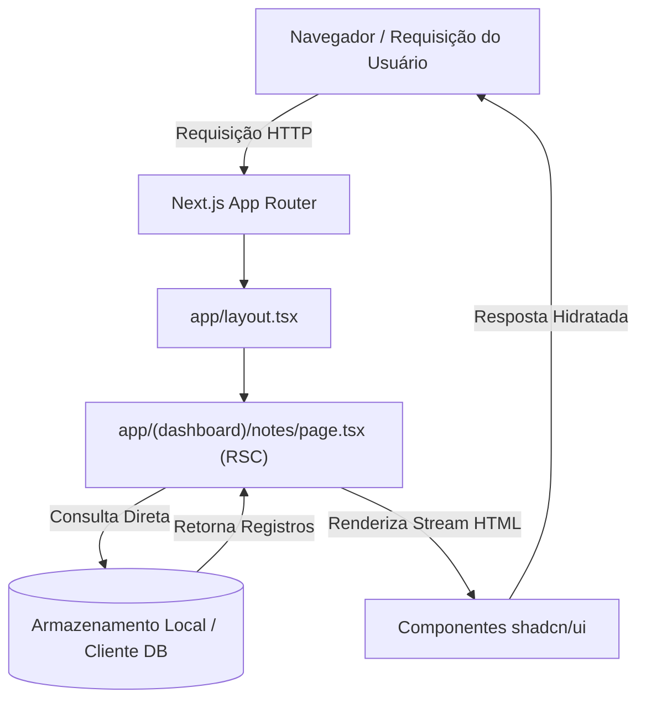
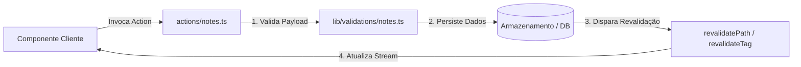

# Visão Geral da Arquitetura (Padrão Matklad)

Este documento fornece uma visão geral de alto nível da arquitetura do **Notes App**, da estrutura de diretórios, das abstrações centrais e dos invariantes de engenharia. Ele foi escrito seguindo o padrão **Matklad ARCHITECTURE.md** para ajudar novos colaboradores e agentes automatizados a se orientarem rapidamente na base de código.

---

## 1. Visão Geral (Bird's Eye View)

O **Notes App** é uma aplicação web unificada de gestão de conhecimento e estudo, local-first e de custo operacional zero. Ele unifica três domínios principais:
1. **Arquitetura de Objetos (estilo Capacities)**: Notas interconectadas, tipos de objetos flexíveis e links bidirecionais.
2. **Ingestão de Documentos (estilo Readwise)**: Destaques (highlighting), parsing de documentos e importações de leituras externas.
3. **Sistema de Repetição Espaçada (estilo Anki/FSRS)**: Flashcards, gerenciamento de fila de revisão e algoritmos de retenção de memória.

A aplicação é construída sobre **Next.js (App Router)**, **React 19**, **TypeScript** e **shadcn/ui** (estilizado com Tailwind CSS), otimizada para velocidade, armazenamento local e desempenho de Server Components.

---

## 2. Mapa de Código & Estrutura Oficial de Pastas

O projeto segue estritamente as **convenções oficiais do Next.js App Router** combinadas com a estrutura padrão de diretórios de componentes do **shadcn/ui**.

```text
.
├── app/                      # Next.js App Router (Rotas, Layouts, Páginas, Server Actions)
│   ├── (auth)/               # Grupo de Rotas para autenticação (login, registro)
│   │   ├── login/
│   │   └── layout.tsx
│   ├── (dashboard)/          # Grupo de Rotas para a interface principal da aplicação
│   │   ├── notes/            # Página /notes e rotas dinâmicas de detalhes
│   │   │   ├── [id]/
│   │   │   └── page.tsx
│   │   ├── srs/              # Interface de estudo por repetição espaçada em /srs
│   │   ├── layout.tsx        # Shell do Dashboard (Layout de Barra Lateral + Cabeçalho)
│   │   └── page.tsx          # Página inicial principal do dashboard
│   ├── api/                  # Route Handlers para endpoints REST externos / webhooks
│   │   └── route.ts
│   ├── globals.css           # CSS Global do Tailwind & definições de variáveis CSS do shadcn/ui
│   ├── layout.tsx            # Layout Raiz (Provedores de tema, configuração de fontes, metadados)
│   ├── loading.tsx           # UI global de carregamento de fallback (fronteira do React Suspense)
│   ├── error.tsx             # Global Error Boundary para erros de rota não capturados
│   └── not-found.tsx         # Página 404 personalizada
│
├── components/               # Componentes React de UI (Server & Client)
│   ├── ui/                   # Componentes primitivos e sem estilo do shadcn/ui (Gerados via CLI)
│   │   ├── button.tsx
│   │   ├── dialog.tsx
│   │   └── input.tsx
│   ├── common/               # Componentes compartilhados de layout e compostos (Navbar, Sidebar, Footer)
│   │   ├── navbar.tsx
│   │   └── sidebar.tsx
│   └── features/             # Componentes de domínio baseados em funcionalidades (Encapsulados por domínio)
│       ├── notes/            # Editor de notas, cartões de notas, listas de tags
│       ├── srs/              # Visualizador de flashcards, botões de classificação, gráficos de progresso de SRS
│       └── ingestion/        # Importador de documentos, parser de destaques
│
├── lib/                      # Utilitários puros, clientes de banco de dados e motores de lógica de domínio
│   ├── utils.ts              # Utilitário de mesclagem de classes `cn()` (clsx + tailwind-merge)
│   ├── db/                   # Cliente de banco de dados (Instância de SQLite/IndexedDB/ORM)
│   ├── srs/                  # Matemática pura do algoritmo FSRS & motor de agendamento de cartões
│   └── validations/          # Esquemas de validação Zod para formulários e server actions
│
├── actions/                  # Next.js Server Actions (Mutações de backend & escrita de dados)
│   ├── notes.ts              # Server Actions de CRUD para notas e objetos
│   └── srs.ts                # Server Actions para envio de revisões de cartões de SRS
│
├── hooks/                    # Hooks React reutilizáveis no lado do cliente (Client-side)
│   ├── use-debounce.ts
│   └── use-local-storage.ts
│
├── types/                    # Interfaces globais TypeScript e definições de tipos
│   ├── note.ts               # DTOs e modelos de banco de dados para Notas & Objetos
│   └── srs.ts                # Tipos de estado para Flashcards e FSRS
│
├── public/                   # Ativos estáticos públicos (imagens, ícones, SVGs)
├── .agents/                  # Configuração, regras e skills para agentes de IA
├── graphify-out/             # Grafo de conhecimento & topologia de dependências gerados pelo Graphify
└── .worktrees/               # Implementações de referência histórica para paridade de recursos
```

---

## 3. Invariantes Arquiteturais

Todo colaborador (e assistente de IA) deve manter estritamente as seguintes regras de engenharia:

1. **React Server Components (RSC) por Padrão**:
   - Todos os componentes dentro de `app/` e `components/` são Server Components por padrão.
   - Adicione `"use client"` **apenas nos nós folha** da árvore de componentes onde a interatividade do navegador (estado do React, manipuladores de eventos, APIs de cliente) for necessária.

2. **Isolamento de Primitivos em `components/ui/` (primitivos do shadcn)**:
   - Os arquivos dentro de `components/ui/` pertencem exclusivamente ao **shadcn/ui**.
   - **Invariante**: Nunca embuta lógica de domínio, chamadas de API ou estado específico da aplicação em `components/ui/`. Eles devem permanecer como primitivos de UI puros e de apresentação.

3. **Encapsulamento de Domínio em `components/features/`**:
   - A lógica de UI específica de um domínio deve ser organizada sob `components/features/<nome-da-funcionalidade>/`.
   - Nunca vaze componentes de domínio para o `components/common/` global ou `components/ui/`.

4. **Validação Estrita de Fronteiras (Zod)**:
   - Todo payload de entrada que chegar via Server Actions ou Route Handlers deve ser validado usando esquemas Zod localizados em `lib/validations/`.

5. **Lógica de Negócios Desacoplada em `lib/`**:
   - A lógica computacional central (por exemplo, algoritmos de repetição espaçada FSRS) deve ser implementada como funções TypeScript puras e agnósticas de framework em `lib/`. Isso permite execução local-first e testes unitários sem overhead.

---

## 4. Fluxos de Dados Principais

### A. Busca de Dados (Acesso Direto via RSC)


### B. Mutação de Dados (Fluxo de Server Actions)


---

## 5. Preocupações Transversais (Cross-Cutting Concerns)

### Estilização & Temas
- Estilizado usando **Tailwind CSS** com **Variáveis CSS** definidas em `app/globals.css`.
- Cores e tokens de design mapeiam diretamente para as variáveis CSS do shadcn (`--background`, `--foreground`, `--primary`, etc.).
- Use o utilitário `cn(...)` de `lib/utils.ts` para junção condicional de classes.

### Tratamento de Erros & Estados de Carregamento
- **`loading.tsx`**: Utiliza primitivos `Skeleton` do shadcn para fallbacks de carregamento instantâneo via React Suspense.
- **`error.tsx`**: Captura exceções não tratadas em tempo de execução no nível do segmento de rota sem interromper a aplicação.

### Gerenciamento de Estado
- **Estado do Servidor**: Gerenciado nativamente por Next.js RSC, Server Actions e revalidação de cache.
- **Estado do Cliente**: Mantido localmente nos componentes de UI interativos (`useState`, `useReducer`) ou em Contexto React mínimo para flags de UI.

---

## 6. Worktrees de Referência & Topologia da Base de Código

- **Bases de Código Históricas**: Inspecione `.worktrees/` (`old`, `old-2`, `old-3`, `old-4`, `old-5`) para implementações de referência baseline ao portar algoritmos ou paridade de funcionalidades do Capacities.
- **Topologia de Dependências**: Consulte `graphify-out/GRAPH_REPORT.md` e `graphify-out/graph.json` para consultas de relacionamentos arquiteturais.

---

## 7. Governança do Projeto & Matriz do Framework de Decisão

Para manter a integridade da base de código, a ergonomia dos desenvolvedores e o alinhamento dos agentes, os artefatos de governança são divididos em quatro camadas distintas:

| Camada de Governança | Arquivo Principal / Localização | Propósito Central | Quando Usar / Atualizar |
| --- | --- | --- | --- |
| **Diretrizes de Agentes** | [`AGENTS.md`](../../AGENTS.md) | Ponto de entrada para assistentes de código de IA | Visão geral das regras do repositório, mapa do site, referências de worktree e gatilhos de comando. |
| **Regras Operacionais** | [`.agents/rules/*.md`](../../.agents/rules/) | Políticas de código estritas e de responsabilidade única | Restrições granulares (*"Como escrever código/configurações"*), ex: `portable-paths.md`, `language.md`. |
| **Decisões Arquiteturais** | [`docs/decisions/`](../decisions/README.md) | Registro de Decisões MADR (ADRs) | Documentação do **PORQUÊ** uma escolha técnica foi feita, prós/contras e opções rejeitadas. |
| **Políticas de Segurança** | [`SECURITY.md`](../../SECURITY.md) | Modelo de ameaças, fronteiras de confiança e regras de segurança | Documentação de **COMO** credenciais, dados do usuário, rotas do servidor e permissões em nuvem são isolados. |
