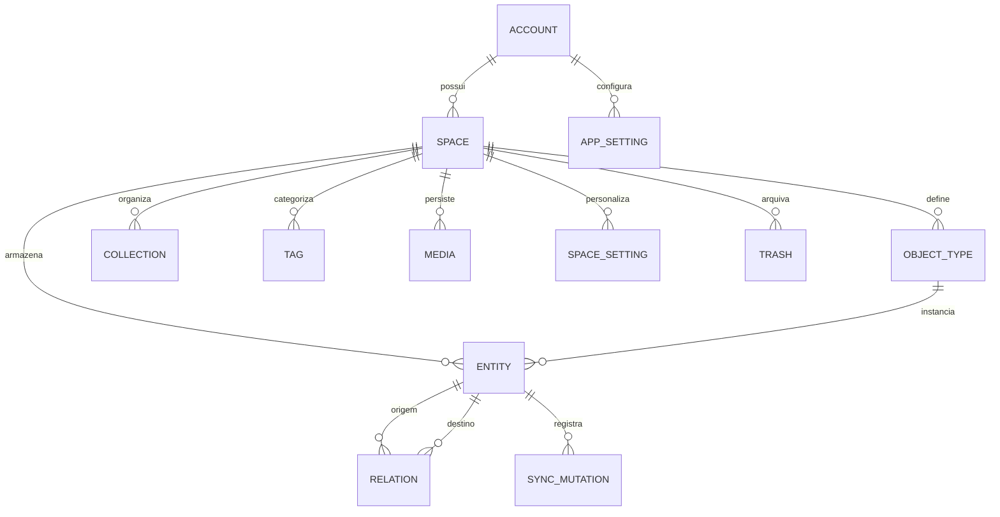
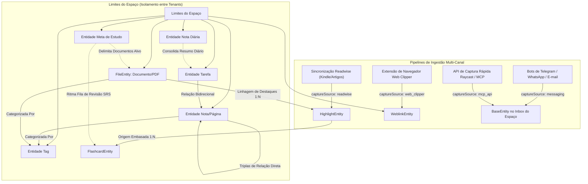
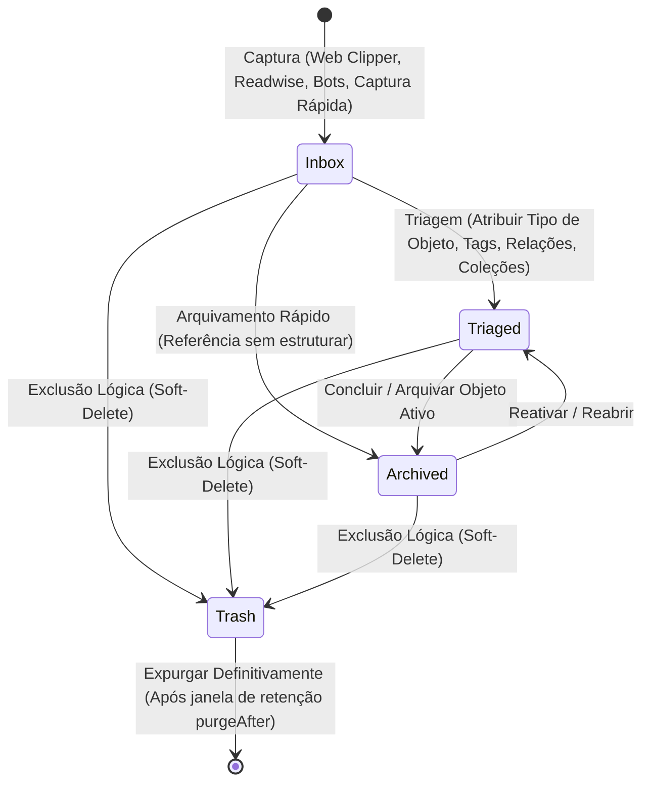
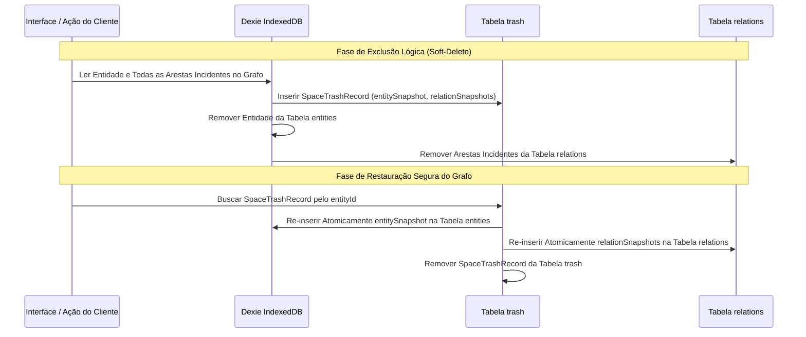
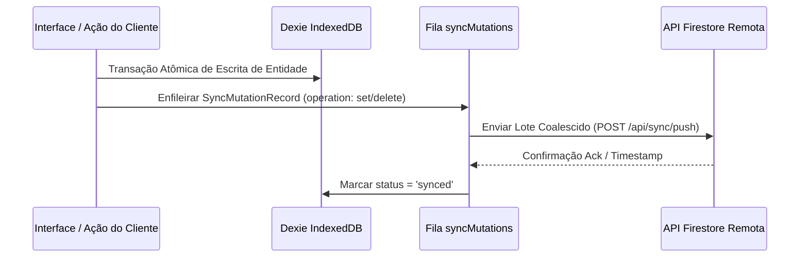
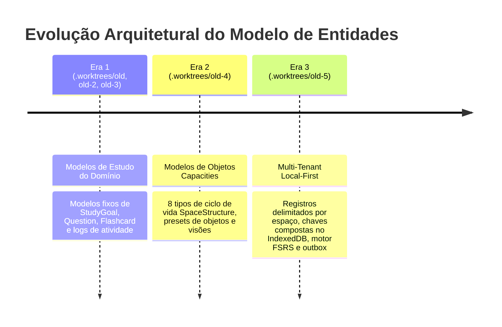
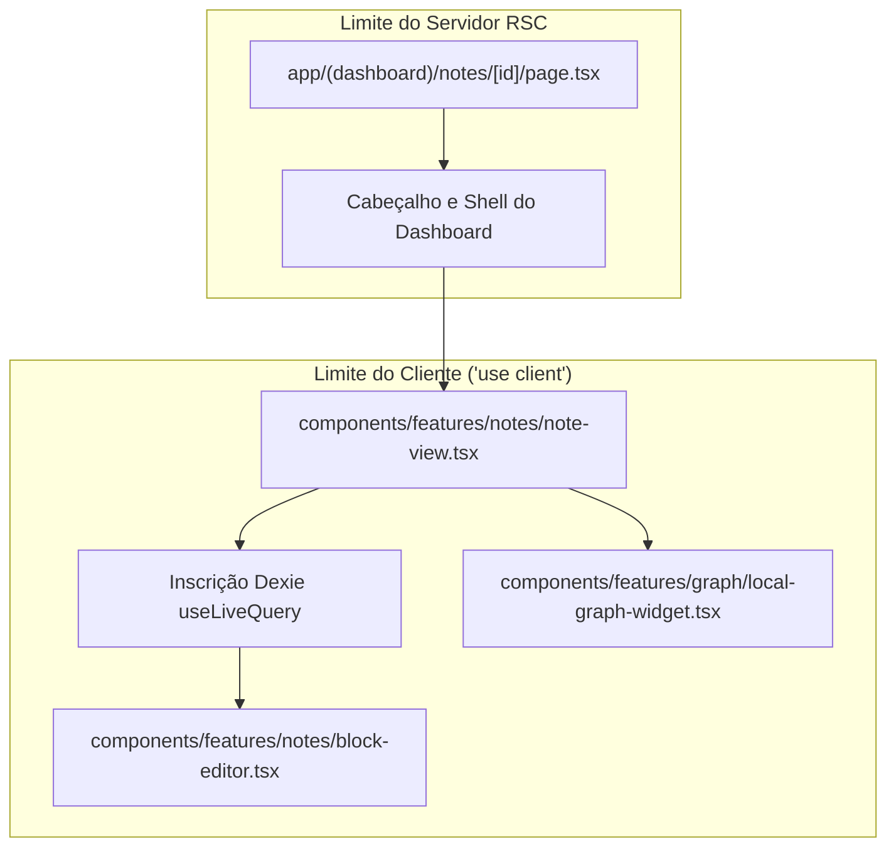

# Especificação da Arquitetura de Conhecimento e Entidades do Domínio

Este documento fornece uma especificação arquitetural abrangente de todas as entidades do domínio, esquemas de banco de dados, modelos de objetos, relacionamentos entre entidades, ciclos de vida, limites de segurança e evolução histórica nos worktrees para o repositório do Notes App.

---

## 1. Visão Geral da Arquitetura do Sistema e Modelagem de Entidades

A aplicação utiliza uma **Arquitetura de Grafo de Conhecimento Local-First** combinando persistência reativa local no armazenamento do navegador com capacidades de sincronização remota na nuvem e processamento no lado do servidor.



### Princípios Chave da Arquitetura
1. **Foco em Objetos em Vez de Pastas (Object-First over Folder-First)**: Os itens de informação existem como objetos semânticos tipados (Páginas, Notas Diárias, Tarefas, Weblinks, Arquivos, Destaques, Flashcards, Metas de Estudo, Consultas, AI Chats) delimitados dentro de Espaços multi-tenant, em vez de hierarquias de pastas rígidas.
2. **Topografia de Grafo de Primeira Classe**: Arestas explícitas em triplas (`sourceId`, `targetId`, `propertyId`) permitem backlinks bidirecionais rápidos e extração de sub-grafos locais sem necessidade de análise do conteúdo de texto completo.
3. **Particionamento de Espaços por Chaves Compostas**: Todas as tabelas de entidades do IndexedDB utilizam chaves compostas (`[spaceId+id]`), garantindo o isolamento entre tenants e espaços.
4. **Outbox de Sincronização Offline Coalescido com LWW**: Transações locais atômicas registram mutações na fila `syncMutations`, utilizando resolução de conflitos por Última Escrita Vence (LWW - Last-Write-Wins) e coalescimento de mutações antes da sincronização remota.
5. **Tombstones Seguros para o Grafo**: A exclusão lógica (*soft-delete*) preserva snapshots da entidade e dos seus relacionamentos, permitindo restauração atômica sem criar arestas órfãs no grafo.

---

## 2. Camada de Armazenamento e Esquema do Banco Dexie IndexedDB

O estado local persistente reside no IndexedDB do navegador, gerenciado pelo **Dexie.js** (`KnowledgeDatabase`). O esquema do banco de dados consiste em **11 tabelas principais**:

| Nome da Tabela | Chave Primária | Campos Indexados / Compostos | Descrição |
| :--- | :--- | :--- | :--- |
| `spaces` | `id` | `accountId`, `sortOrder`, `[accountId+sortOrder]`, `name`, `createdAt`, `updatedAt` | Limites de tenant de nível superior e definições de espaço. |
| `appSettings` | `id` | `id`, `value` | Configurações globais da aplicação no cliente, ponteiro do espaço ativo e configurações BYOK. |
| `objectTypes` | `[spaceId+id]` | `spaceId`, `id`, `ownership`, `lifecycleKind` | Estruturas de objetos dinâmicos e do sistema no estilo Capacities. |
| `entities` | `[spaceId+id]` | `spaceId`, `id`, `[spaceId+objectTypeId]`, `objectTypeId`, `type`, `updatedAt`, `*tags` | Armazenamento primário para todos os objetos de domínio do espaço. |
| `collections` | `[spaceId+id]` | `spaceId`, `id`, `[spaceId+structureId]`, `structureId`, `name` | Coleções virtuais e visões salvas do banco de dados. |
| `tags` | `[spaceId+id]` | `spaceId`, `id`, `[spaceId+name]`, `name` | Classificações taxonômicas aplicadas entre entidades do espaço. |
| `relations` | `[spaceId+id]` | `spaceId`, `id`, `[spaceId+sourceId]`, `[spaceId+targetId]`, `sourceId`, `targetId`, `propertyId` | Triplas de relação do grafo que suportam backlinks bidirecionais. |
| `media` | `[spaceId+id]` | `spaceId`, `id`, `[spaceId+mimeType]`, `mimeType`, `updatedAt` | Armazenamento de ativos binários, PDFs, áudio e blobs de imagem. |
| `spaceSettings` | `[spaceId+id]` | `spaceId`, `id`, `[spaceId+key]`, `key`, `updatedAt` | Preferências específicas do espaço e configurações de layout. |
| `trash` | `[spaceId+id]` | `spaceId`, `id`, `[spaceId+entityId]`, `entityId`, `purgeAfter`, `trashedAt` | Tombstones de exclusão lógica que preservam `entitySnapshot: SpaceEntityRecord` e `relationSnapshots: SpaceRelationRecord[]` para restauração segura do grafo. |
| `syncMutations` | `id` | `status`, `[status+updatedAt]`, `spaceId`, `entityId`, `entityType`, `operation`, `updatedAt` | Fila de mutações (outbox) para sincronização remota local-first. |

### Contrato da Classe Dexie
```typescript
export class KnowledgeDatabase extends Dexie {
  spaces!: EntityTable<SpaceRecord, "id">;
  appSettings!: EntityTable<AppSettingRecord, "id">;
  objectTypes!: Table<SpaceObjectTypeRecord, [string, string]>;
  entities!: Table<SpaceEntityRecord, [string, string]>;
  collections!: Table<SpaceCollectionRecord, [string, string]>;
  tags!: Table<SpaceTagRecord, [string, string]>;
  relations!: Table<SpaceRelationRecord, [string, string]>;
  media!: Table<SpaceMediaRecord, [string, string]>;
  spaceSettings!: Table<SpaceSettingRecord, [string, string]>;
  trash!: Table<SpaceTrashRecord, [string, string]>;
  syncMutations!: EntityTable<SyncMutationRecord, "id">;
}
```

---

## 3. Especificações de Entidades & Definições de Tipos

### A. Entidade Base (`BaseEntity` / `SpaceEntityRecord`)
A fundação polimórfica estendida por todas as entidades do domínio do espaço.

```typescript
export type SystemEntityType =
  | 'page'
  | 'daily_note'
  | 'task'
  | 'weblink'
  | 'file'
  | 'image'
  | 'audio'
  | 'pdf'
  | 'highlight'
  | 'flashcard'
  | 'study_goal'
  | 'query'
  | 'ai-chat'
  | 'tag'
  | (string & {});

export type InboxStatus = 'inbox' | 'triaged' | 'archived';

export type CaptureSource =
  | 'manual'
  | 'web_clipper'
  | 'readwise'
  | 'telegram'
  | 'whatsapp'
  | 'email'
  | 'raycast'
  | 'mcp_api';

export interface CaptureMetadata {
  sourceUrl?: string;
  sourceTitle?: string;
  capturedAt?: string;
  sender?: string;
  externalId?: string;
  rawPayload?: Record<string, unknown>;
}

export interface BaseEntity {
  id: string;
  type: SystemEntityType;
  title: string;
  createdAt: string;
  updatedAt: string;
  icon?: string;
  coverImage?: string;
  blocks: ContentBlock[];
  tags: string[];
  relations: EntityRelation[];
  backlinks?: EntityBacklink[];
  properties: Record<string, unknown>;
  srs?: SRSItemState;
  inboxStatus: InboxStatus;
  captureSource: CaptureSource;
  captureMetadata?: CaptureMetadata;
  _syncStatus?: 'synced' | 'pending' | 'conflict';
}

export type SpaceEntityRecord = BaseEntity & {
  spaceId: string;
  objectTypeId: string;
  collections?: string[];
};
```

#### Especificação da União ContentBlock
Documentos do editor consistem em uma lista ordenada de elementos `ContentBlock` que suportam a composição rica de documentos:

```typescript
export type ContentBlockType =
  | 'paragraph'
  | 'heading_1'
  | 'heading_2'
  | 'heading_3'
  | 'bullet_list'
  | 'numbered_list'
  | 'task_item'
  | 'code'
  | 'math'
  | 'callout'
  | 'quote'
  | 'divider'
  | 'embed'
  | 'media_block'
  | 'table_block'
  | 'transclusion';

export interface ContentBlock {
  id: string;
  type: ContentBlockType;
  content: string;
  annotations?: {
    bold?: boolean;
    italic?: boolean;
    strikethrough?: boolean;
    code?: boolean;
    highlightColor?: string;
    linkUrl?: string;
  };
  metadata?: {
    // task_item
    checked?: boolean;
    dueDate?: string;
    // code & math
    language?: string;
    mathExpression?: string;
    // callout & embed
    calloutTone?: string;
    embedUrl?: string;
    embedProvider?: 'youtube' | 'twitter' | 'github' | 'generic';
    // media_block
    mediaId?: string;
    caption?: string;
    // table_block
    rows?: string[][];
    hasHeaderRow?: boolean;
    // transclusion
    transcludedEntityId?: string;
    transcludedBlockId?: string;
  };
}
```

---

### B. Entidade Nota Diária (`DailyNoteEntity`, `type: "daily_note"`)
* **Propósito**: Entrada de diário ancorada ao tempo para reflexões diárias, registros de reuniões, vínculos de calendário e consolidação automática de tarefas.
* **Campos**:
  * `date`: string (Chave de data ISO 8601 no formato `YYYY-MM-DD`)
  * `linkedEventIds`?: string[] (referências a eventos de calendários externos)
  * `calendarEvents`?: Array<{
      id: string;
      title: string;
      startTime: string;
      endTime: string;
      sourceCalendar?: string;
    }>
  * `taskRollup`: {
      scheduledTaskIds: string[];
      completedTaskIds: string[];
      carriedOverTaskIds: string[];
    }
  * `metrics`?: Record<string, number | string> (ex: humor, energia, pontuação de foco)

---

### C. Entidade Tarefa (`TaskEntity`, `type: "task"`)
* **Propósito**: Unidade acionável no estilo GTD com rastreamento de ciclo de vida, agendamento de prioridade e associações bidirecionais com projetos e notas.
* **Campos**:
  * `status`: `'todo' | 'in_progress' | 'done' | 'cancelled'`
  * `dueDate`?: string (String de data e hora no formato ISO 8601)
  * `completedAt`?: string (Timestamp ISO 8601)
  * `priority`: `'low' | 'medium' | 'high' | 'urgent'`
  * `parentTaskId`?: string
  * `assignedEntityId`?: string (entidade vinculada de Projeto, Área ou Reunião)
  * `subtaskIds`?: string[]

---

### D. Entidade Weblink (`WeblinkEntity`, `type: "weblink"`)
* **Propósito**: Marcador web enriquecido, item da fila de leitura e repositório de referências.
* **Campos**:
  * `url`: string (URL alvo canônica)
  * `domain`: string (ex: `github.com`, `arxiv.org`)
  * `favicon`?: string (URL do favicon ou URI de dados base64)
  * `ogImage`?: string (URL da imagem de pré-visualização Open Graph)
  * `excerpt`?: string (resumo extraído ou descrição meta)
  * `author`?: string
  * `siteName`?: string
  * `readStatus`?: `'unread' | 'reading' | 'read'`
  * `readerContent`?: string (conteúdo destilado no modo leitura em markdown)

---

### E. Entidade Consulta (`QueryEntity`, `type: "query"`)
* **Propósito**: Visão de banco de dados dinâmica estilo Capacities que filtra e projeta reativamente entidades do espaço.
* **Campos**:
  * `targetObjectTypes`: string[] (IDs de tipos de objetos a consultar)
  * `conjunction`: `'and' | 'or'`
  * `rules`: Array<{
      propertyId: string;
      operator: 'equals' | 'not_equals' | 'contains' | 'not_contains' | 'greater_than' | 'less_than' | 'is_empty' | 'is_not_empty';
      value: unknown;
    }>
  * `sort`: {
      propertyId: string;
      direction: 'asc' | 'desc';
    }
  * `groupByPropertyId`?: string
  * `presentationView`: `'gallery' | 'list' | 'table' | 'wall'`

---

### F. Entidade AI Chat (`AIChatEntity`, `type: "ai-chat"`)
* **Propósito**: Sessão de agente conversacional contextual embasada em entidades do espaço.
* **Campos**:
  * `modelId`: string (ex: `gpt-4o`, `claude-3-5-sonnet`, `gemini-1.5-pro`)
  * `pinnedContextEntityIds`: string[] (entidades injetadas explicitamente na janela de contexto)
  * `systemPromptOverride`?: string
  * `temperature`?: number
  * `messages`: Array<{
      id: string;
      role: 'user' | 'assistant' | 'system';
      content: string;
      createdAt: string;
      tokensUsed?: number;
      citedEntityIds?: string[];
    }>

---

### G. Entidades Multimídia (`ImageEntity`, `AudioEntity`, `PdfEntity`)
Representações especializadas de ativos binários armazenados na tabela `media`:

#### 1. Entidade Imagem (`ImageEntity`, `type: "image"`)
* `mediaId`: string (chave estrangeira para a tabela `media`)
* `mimeType`: `'image/jpeg' | 'image/png' | 'image/webp' | 'image/gif' | 'image/svg+xml'`
* `resolution`: `{ width: number; height: number }`
* `aspectRatio`: number
* `ocrText`?: string (texto indexado para busca)
* `altText`?: string
* `cameraMetadata`?: Record<string, unknown>

#### 2. Entidade Áudio (`AudioEntity`, `type: "audio"`)
* `mediaId`: string (chave estrangeira para a tabela `media`)
* `mimeType`: `'audio/mpeg' | 'audio/wav' | 'audio/ogg' | 'audio/webm' | 'audio/mp4'`
* `duration`: number (duração da reprodução em segundos)
* `transcript`?: string (transcrição completa via Whisper / STT)
* `transcriptTimestamps`?: Array<{ start: number; end: number; text: string }>
* `waveform`?: number[] (picos de amplitude normalizados)

#### 3. Entidade PDF (`PdfEntity`, `type: "pdf"`)
* `mediaId`: string (chave estrangeira para a tabela `media`)
* `mimeType`: `'application/pdf'`
* `pageCount`: number
* `tableOfContents`?: Array<{ title: string; pageNumber: number; level: number }>
* `extractedText`?: string
* `ocrApplied`: boolean
* `fileSizeBytes`: number

---

### H. Entidade Nota / Página (`type: "page"`)
* **Propósito**: Entrada de conhecimento livre, síntese de documentos e anotações estruturadas.
* **Campos**: Estende `BaseEntity` com `blocks` ricos, mapa de propriedades personalizadas (`properties`), associações de tags (`tags`) e arestas do grafo (`relations`).

---

### I. Entidade Arquivo / Documento (`FileEntity`, `type: "file"`)
* **Propósito**: Ativos de leitura externos ingeridos (PDF, EPUB, Markdown, Artigos da Web).
* **Campos**:
  * `fileType`: `'pdf' | 'epub' | 'markdown' | 'web_article'`
  * `originalName`: string
  * `sourceUrl`?: string
  * `localBlobKey`?: string (referência para a tabela `media`)
  * `sizeBytes`: number
  * `fileHash`: string (hash de integridade SHA-256)
  * `extractedText`?: string
  * `parsingStatus`: `'pending' | 'processing' | 'completed' | 'error'`
  * `pageCount`?: number

---

### J. Entidade Destaque (`HighlightEntity`, `type: "highlight"`)
* **Propósito**: Excerto imutável ancorado a uma entidade pai `FileEntity` ou `WeblinkEntity`.
* **Campos**:
  * `fileId`: string (chave estrangeira para a entidade de origem)
  * `exactText`: string (excerto literal)
  * `prefix`?: string, `suffix`?: string (âncoras de contexto de texto)
  * `color`: `'yellow' | 'blue' | 'green' | 'pink' | 'purple'`
  * `location`: `{ pageNumber?: number; startOffset?: number; endOffset?: number; cfi?: string; domSelector?: string; }`
  * `userNote`?: string
  * `cardCount`?: number (contador de flashcards gerados)

---

### K. Entidade Flashcard & Repetição Espaçada (`FlashcardEntity`, `SRSItemState`, `type: "flashcard"`)
* **Propósito**: Item de estudo para repetição espaçada operado pelo motor FSRS (*Free Spaced Repetition Scheduler*).
* **Campos**:
  * `cardType`: `'basic' | 'cloze' | 'reversed'`
  * `front`: string
  * `back`: string
  * `fileId`: string (proveniência do documento fonte)
  * `sourceHighlightId`: string (proveniência do destaque fonte)
  * `sourceQuoteSnippet`: string (trecho de citação fonte)
  * `clozeContent`?: string
  * `targetGoalId`?: string
  * `aiGenerated`: boolean
  * `srs`: `SRSItemState`
* **Estrutura de `SRSItemState`**:
  * `state`: `'new' | 'learning' | 'review' | 'relearning'`
  * `dueDate`: String de Data ISO 8601
  * `lastReviewedAt`?: String de Data ISO 8601
  * `interval`: number (dias)
  * `easeFactor`: number (padrão 2500)
  * `repetitionCount`: number
  * `lapses`: number
  * `stability`: number (parâmetro de estabilidade de memória do FSRS)
  * `difficulty`: number (parâmetro de dificuldade do cartão no FSRS)

---

### L. Entidade Meta de Estudo (`StudyGoalEntity`, `type: "study_goal"`)
* **Propósito**: Acompanhamento de ritmo e datas de exame para conjuntos de estudo.
* **Campos**:
  * `targetExamDate`: String de Data ISO
  * `targetRetentionRate`: number (ex: 0.90 para 90%)
  * `totalCards`: number
  * `dailyNewCardsQuota`: number
  * `expectedDailyReviews`: number
  * `targetFileIds`: string[]

---

### M. Modelo de Tipo de Objeto (`SpaceObjectTypeRecord` / `SpaceStructure`)
Esquema de definição de tipos de objeto no estilo Capacities que orienta validações dinâmicas de propriedades, renderização de UI e relações no grafo:

```typescript
export type StructureOwnership = "built-in" | "custom" | "legacy" | "reserved";

export type StructureLifecycleKind =
  | "document"
  | "file"
  | "query"
  | "quote"
  | "table"
  | "tag"
  | "task"
  | "url";

export type PropertyValueType =
  | "title"
  | "text"
  | "number"
  | "boolean"
  | "date"
  | "entity"
  | "label"
  | "richText"
  | "url"
  | "media"
  | "createdAt"
  | "lastUpdatedAt";

export type NumberPresentationColor =
  | "blue"
  | "gray"
  | "green"
  | "orange"
  | "purple"
  | "red";

export type NumberPresentation =
  | { readonly type: "number"; readonly fixedDecimals?: number }
  | { readonly type: "percent"; readonly fixedDecimals?: number }
  | { readonly type: "currency"; readonly currency: string; readonly fixedDecimals?: number }
  | {
      readonly type: "progress";
      readonly color: NumberPresentationColor;
      readonly fixedDecimals?: number;
      readonly steps: number;
    };

export type PropertyLabelOption = {
  readonly id: string;
  readonly name: string;
  readonly color?: string;
};

export type ObjectIconTone =
  | "amber"
  | "blue"
  | "cyan"
  | "emerald"
  | "fuchsia"
  | "gray"
  | "green"
  | "indigo"
  | "lime"
  | "neutral"
  | "orange"
  | "pink"
  | "purple"
  | "red"
  | "rose"
  | "sky"
  | "slate"
  | "teal"
  | "violet"
  | "yellow";

export type StructurePresentationView = "gallery" | "list" | "table" | "wall";

export type StructurePresentation = {
  readonly defaultView: StructurePresentationView;
  readonly availableViews: readonly StructurePresentationView[];
  readonly smallCardVisiblePropertyIds?: readonly string[];
};

export type PropertyDefinition = {
  readonly id: string;
  readonly name: string;
  readonly ownership: "default" | "normal" | "system";
  readonly valueType: PropertyValueType;
  readonly writable: boolean;
  readonly multiple: boolean;
  readonly description?: string;
  readonly iconName?: string;
  readonly fixedTargetObjectIds?: readonly string[];
  readonly inversePropertyDefinitionId?: string;
  readonly numberPresentation?: NumberPresentation;
  readonly options?: readonly PropertyLabelOption[];
  readonly targetStructureIds?: readonly string[];
};

export type SpaceStructure = {
  readonly id: string;
  readonly ownership: StructureOwnership;
  readonly singularName: string;
  readonly pluralName: string;
  readonly iconName: string;
  readonly tone: ObjectIconTone;
  readonly lifecycleKind: StructureLifecycleKind;
  readonly propertyDefinitions: readonly PropertyDefinition[];
  readonly collectionIds: readonly string[];
  readonly presentation: StructurePresentation;
};

export type SpaceObjectTypeRecord = SpaceStructure & {
  spaceId: string;
};
```

#### Os 8 Tipos de Ciclo de Vida da Estrutura
1. `document`: Documentos narrativos, notas atômicas, reuniões e páginas com edição em nível de bloco.
2. `file`: Ativos de arquivo carregados, documentos e anexos armazenados localmente ou na nuvem.
3. `query`: Consultas ativas calculadas que filtram entidades reativamente por propriedades e relacionamentos.
4. `quote`: Excertos ancorados, citações e destaques embasados em um artefato de origem.
5. `table`: Linhas de dados tabulares com definições rígidas de propriedades de coluna.
6. `tag`: Classificações categóricas aplicadas transversalmente entre entidades.
7. `task`: Tarefas acionáveis com rastreamento de conclusão, datas de vencimento e prioridade.
8. `url`: URLs web marcadas com pré-visualização OpenGraph e enriquecimento de metadados.

#### Os 12 Tipos de Valor de Propriedade
1. `title`: Nome de exibição primário canônico.
2. `text`: String de texto simples ou array de textos.
3. `number`: Quantidade numérica formatada de acordo com `NumberPresentation`.
4. `boolean`: Flag binária (`true` | `false`).
5. `date`: Data ISO, data e hora, ou objeto de intervalo de datas.
6. `entity`: Ponteiro no grafo para uma ou mais entidades do espaço (`targetStructureIds`).
7. `label`: Opção de vocabulário controlado selecionada de `PropertyLabelOption[]`.
8. `richText`: Sub-árvore de documento completa do editor de blocos.
9. `url`: URL web validada.
10. `media`: Referência de chave estrangeira para um blob na tabela `media`.
11. `createdAt`: Timestamp de criação do sistema somente leitura.
12. `lastUpdatedAt`: Timestamp de mutação do sistema somente leitura.

#### Os 20 Tokens de Tom
Os badges de ícone de objeto e chips de tipo utilizam uma paleta semântica rígida de 20 tons mapeados para variáveis CSS (`--type-label-*` e `--token-*`):
`amber`, `blue`, `cyan`, `emerald`, `fuchsia`, `gray`, `green`, `indigo`, `lime`, `neutral`, `orange`, `pink`, `purple`, `red`, `rose`, `sky`, `slate`, `teal`, `violet`, `yellow`.

#### Propriedades Bidirecionais via `inversePropertyDefinitionId`
Quando uma propriedade representa um relacionamento (ex: `Autor` em um `Livro`), especificar `inversePropertyDefinitionId` (apontando para `Livros` no `Autor`) garante que as mutações mantenham automaticamente triplas de relação recíprocas na tabela `relations`.

---

### N. Registros de Coleção do Espaço e Lixeira do Espaço

```typescript
export type SpaceCollectionRecord = {
  id: string;
  spaceId: string;
  structureId: string;
  name: string;
};

export type SpaceTrashRecord = {
  id: string;
  spaceId: string;
  entityId: string;
  label: string;
  typeLabel: string;
  trashedAt: string;
  purgeAfter: string;
  entitySnapshot?: SpaceEntityRecord;
  relationSnapshots?: SpaceRelationRecord[];
};
```

---

### O. Mutação de Sincronização Outbox (`SyncMutationRecord`)
* **Propósito**: Fila de transações locais para replicação idempotente na nuvem.
* **Campos**:
  * `id`: string (chave de idempotência)
  * `spaceId`: string
  * `entityId`: string
  * `entityType`: `SystemEntityType`
  * `operation`: `'set' | 'delete'`
  * `status`: `'pending' | 'syncing' | 'synced' | 'conflict' | 'failed'`
  * `payload`?: Record<string, unknown>
  * `error`?: string
  * `retryCount`: number
  * `updatedAt`: string

---

## 4. Proveniência de Entidades & Topologia do Grafo



### Invariantes de Proveniência em Ingestão Multi-Canal
1. **Proveniência de Ingestão Multi-Canal**: Cada entidade que entra no grafo de conhecimento registra sua origem via `captureSource` (`'manual' | 'web_clipper' | 'readwise' | 'telegram' | 'whatsapp' | 'email' | 'raycast' | 'mcp_api'`) e `captureMetadata` estruturado que preserva URLs de origem, identificadores externos, detalhes do autor/remetente e timestamps:
   - **Sincronização Readwise**: Fluxo contínuo trazendo destaques do Kindle, iBooks, artigos web e Twitter/X em registros `HighlightEntity` vinculados a documentos `FileEntity` ou `WeblinkEntity` pai.
   - **Extensão Web Clipper**: Extensão de navegador capturando metadados DOM da página, cartões OpenGraph, markdown do modo leitura e trechos diretamente em registros `WeblinkEntity` ou `PageEntity`.
   - **Gateways de Bot de Mensagens (Telegram / WhatsApp / E-mail)**: Endpoints de webhook recebendo capturas conversacionais (notas de voz transcritas via Whisper para `AudioEntity`, fotos convertidas por OCR para `ImageEntity`, notas de texto para `PageEntity`) direcionadas para o Inbox do Espaço.
   - **Captura Rápida Raycast / MCP**: Ações de lançador do sistema e ferramentas do Protocolo de Contexto de Modelo (MCP) injetando pensamentos rápidos, tarefas e trechos da área de transferência diretamente no IndexedDB local.
2. **Embasamento de Documentos**: `FileEntity` / `WeblinkEntity` $\rightarrow$ `HighlightEntity` $\rightarrow$ `FlashcardEntity`. Todos os flashcards derivam sua proveniência de origem através de `sourceHighlightId` e `sourceQuoteSnippet`, prevenindo alucinações de IA durante os exercícios de estudo.
3. **Grafo em Triplas**: Arestas armazenadas em `relations` (`[spaceId, sourceId, targetId, propertyId]`) suportam consultas bidirecionais rápidas (`buildEntityBacklinks`) e extração de vizinhança local do grafo (`buildLocalEntityGraph`).

---

## 5. Ciclos de Vida das Entidades

### A. Ciclo de Vida de Triagem do Inbox


1. **Captura (`inboxStatus: 'inbox'`)**: A informação bruta entra no espaço do usuário sem sobrecarga cognitiva ou categorização obrigatória. A entidade é imediatamente persistida localmente e enfileirada para replicação em segundo plano na nuvem.
2. **Triagem (`inboxStatus: 'triaged'`)**: Na interface dedicada de Triagem do Inbox, o usuário atribui uma estrutura de tipo de objeto (ex: Página, Tarefa, Weblink, Reunião, Projeto), enriquece propriedades personalizadas, vincula entidades relacionadas via relações bidirecionais e aplica tags de taxonomia.
3. **Arquivamento (`inboxStatus: 'archived'`)**: Quando o ciclo ativo de um item termina, ele move-se para `archived`. Relacionamentos no grafo, índices de busca e backlinks permanecem totalmente operacionais, mas a entidade é filtrada dos fluxos de trabalho diários ativos.

### B. Ciclo de Vida de Exclusão Lógica na Lixeira & Restauração Segura do Grafo


1. **Exclusão Lógica Baseada em Snapshot**: Excluir uma entidade remove-a de `entities` enquanto captura um `entitySnapshot: SpaceEntityRecord` imutável e um array com todas as arestas de relação associadas `relationSnapshots: SpaceRelationRecord[]` dentro da tabela `trash` (`SpaceTrashRecord`).
2. **Restauração Atômica Segura para o Grafo**: Restaurar uma entidade da lixeira re-insere atomicamente a entidade e seus relacionamentos históricos em uma única transação Dexie. Isso garante zero backlinks quebrados, zero arestas órfãs no grafo e restauração completa das referências bidirecionais.
3. **Período de Graça de Retenção & Expurgo Definitivo**: Os registros na lixeira mantêm um timestamp `purgeAfter` (padrão de 30 dias). Uma tarefa em segundo plano expurga tombstones expirados e limpa blobs binários órfãos na tabela `media`.

### C. Ciclo de Vida de Persistência e Sincronização Outbox


### D. Ciclo de Vida de Ingestão de Documentos
`pending` (upload) $\rightarrow$ `processing` (`/api/documents/parse`) $\rightarrow$ `completed` (texto extraído, hash SHA-256 calculado) OU `error`.

### E. Ciclo de Vida de Revisão por Repetição Espaçada (FSRS)
- **Classificação 1 (De Novo / Again)**: O cartão transiciona para `relearning`, `lapses` é incrementado e a `stability` é reduzida pelo fator de lapso.
- **Classificação 2-4 (Difícil / Bom / Fácil)**: Recalcula a `stability` e a `difficulty`, calcula o novo `interval` em dias, define `dueDate = agora + interval` e incrementa `repetitionCount`.

---

## 6. Síntese dos Worktrees Históricos de Referência (`.worktrees/`)

A inspeção dos worktrees históricos (`.worktrees/old` até `.worktrees/old-5`) demonstra a evolução arquitetural do modelo de entidades:



### Principais Modelos de Referência nos Worktrees
- **Paridade com Capacities (`old-4` & `old-5`)**: Implementa 13 presets de objetos nativos (`atomic-note`, `book`, `person`, `area`, `meeting`, `definition`, `idea`, `place`, `project`, `organization`, `media`, `travel`, `quote`) e 4 visões de exibição (`gallery`, `list`, `table`, `wall`).
- **Cálculo de Ritmo e Burndown de Metas no SRS (`old-3` & `old-5`)**:
  $$\text{DailyNewCardQuota} = \left\lceil \frac{\text{UnlearnedCardCount}}{\max(1, \text{DaysRemaining} - \text{BufferDays})} \right\rceil$$
  onde `BufferDays` assume o valor padrão de 20% dos dias restantes (limitado a 7). A capacidade de retenção segue a fórmula:
  $$R(t, S) = \left(1 + \frac{19}{81} \cdot \frac{t}{S}\right)^{-0.5}$$

---

## 7. Gerenciamento de Estado e Limites de Componentes no Next.js 16 / React 19

### Arquitetura de Limites de Componentes
- **React Server Components (RSC)**: Layouts estruturais, wrappers de rota (`app/(dashboard)/notes/page.tsx`) e geração de metadados.
- **Componentes Cliente em Folhas (`"use client"`)**: Editores de bloco, visualizadores de grafo (`graph-canvas.tsx`) e controles do reprodutor de estudo SRS.



---

## 8. Atributos de Segurança e Matriz de Autorização

| Nome da Entidade | Local de Armazenamento | Sensibilidade | Controle de Acesso & Auth | Criptografia (Trânsito / Repouso) | Invariantes e Mitigação de Risco |
| :--- | :--- | :--- | :--- | :--- | :--- |
| **Chaves de API / Credenciais** | `.env` do Servidor | **Crítica** | Somente servidor. Nunca exportadas via `NEXT_PUBLIC_*` ou importadas no cliente. | TLS 1.3 / Secret Manager | Separação estrita de segredos do servidor. |
| **Tokens de Autenticação / Sessão** | Cookies / Memória | **Crítica** | Verificados no lado do servidor via Firebase Admin SDK em Server Actions e Route Handlers. | TLS 1.3 / Cookies Secure e HttpOnly | Validação obrigatória de token em rotas de escrita. |
| **Notas & Entidades do Usuário** | IndexedDB / Firestore | **Alta** | Delimitadas por `users/{uid}/spaces/{spaceId}/...`. Forçado por Regras de Segurança do Firestore. | TLS 1.3 / AES-256 (Firestore) | O isolamento entre tenants previne leituras não autorizadas. |
| **Arquivos de Documentos (PDF/EPUB)**| IndexedDB / GCS | **Alta** | Leitura/escrita restrita ao proprietário (`request.auth.uid`). | TLS 1.3 / AES-256 (Storage) | Validação de tipo MIME e limites de tamanho. |
| **Flashcards (FSRS)** | IndexedDB / Firestore | **Média-Alta**| Delimitados ao namespace do usuário. | TLS 1.3 / AES-256 (Firestore) | Metadados de embasamento do cartão (`sourceQuoteSnippet`). |
| **Mutações Outbox de Sincronização**| IndexedDB / API | **Alta** | Validadas via guardas TypeScript / esquemas Zod antes da aplicação. | TLS 1.3 em Trânsito | A validação de esquema previne estados corrompidos. |

---

## 9. Verificação & Invariantes de Qualidade

- **Verificação de Tipos TypeScript**: Verificado zero erros de tipo via `pnpm typecheck`.
- **Suíte de Testes Unitários Vitest**: Verificado estado passando para testes unitários via `pnpm test`.
- **Qualidade de Código Biome**: Verificado zero erros de linting ou formatação via `pnpm check`.
