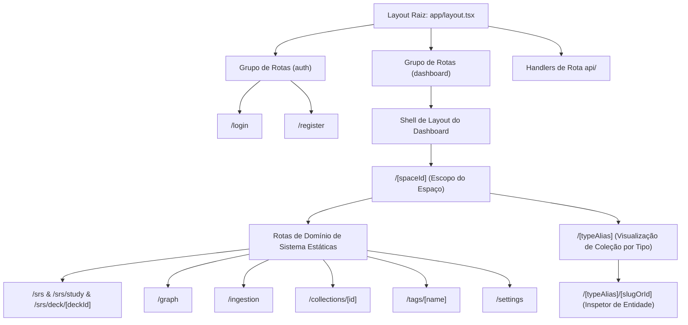
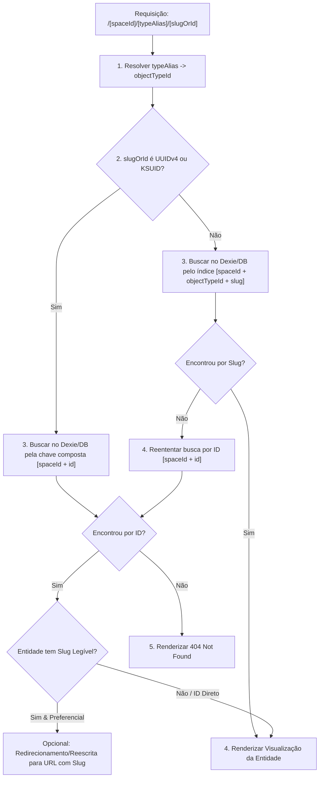

# Arquitetura de URLs & Especificação da Taxonomia de Roteamento

Este documento fornece uma especificação arquitetural abrangente da taxonomia de URLs, estrutura de rotas, hierarquias de páginas, paradigmas de navegação, esquemas de parâmetros e limites de layout para o repositório do **Notes App**.

---

## 1. Visão Geral do Sistema de Roteamento

O **Notes App** utiliza a arquitetura do **Next.js 16 App Router**, aproveitando React Server Components (RSC), grupos de rotas (route groups), segmentos de rotas dinâmicas, rotas paralelas e rotas interceptadas para modais.



### Princípios Fundamentais de Roteamento
1. **Hierarquia de URLs no Escopo do Espaço**: As visualizações principais do aplicativo são organizadas no escopo `/[spaceId]/` para garantir o isolamento multitenant de cada Espaço e permitir links diretos compartilháveis.
2. **Roteamento Limpo por Alias de Tipo**: As visualizações de entidade descartam prefixos artificiais (como `/objects/`) em favor de rotas limpas e legíveis `/[spaceId]/[typeAlias]/` (galeria/coleção) e `/[spaceId]/[typeAlias]/[slugOrId]` (editor/inspetor de entidade).
3. **Resolução de Slug Legível com Fallback para ID Canônico**: Os parâmetros de rota de entidade aceitam slugs legíveis (`/[spaceId]/book/clean-code`) com fallback determinístico para IDs únicos UUIDv4/KSUID (`/[spaceId]/book/9b1deb4d-3b7d-4bad-9bdd-2b0d7b3dcb6d`).
4. **Precedência de Rotas Estáticas do Sistema e Desambiguação**: Domínios de sistema (`settings`, `srs`, `graph`, `ingestion`, `collections`, `tags`) residem junto dos aliases de tipo no nível do espaço. Rotas estáticas no sistema de arquivos têm precedência nativa sobre segmentos dinâmicos `[typeAlias]` no Next.js App Router, complementadas por validações de esquema que impedem colisões.
5. **Estado de Query Linkável**: Controles de UI (modo de exibição, buscas, filtros, abas do inspetor) são refletidos em parâmetros de URL para permitir compartilhamento de estado reprodutível.
6. **Intercepção de Modais Não Bloqueantes**: Modais contextuais e formulários rápidos usam rotas interceptadas no Next.js (`@modal/(.)[typeAlias]/[slugOrId]`) para permitir sobreposições sem perder o contexto da página de fundo.

---

## 2. Taxonomia de Diretórios e Mapa do App Router

As rotas do aplicativo estão estruturadas no diretório `app/` do Next.js da seguinte forma:

```text
app/
├── (auth)/                       # Grupo de Rotas de Autenticação (layout não autenticado)
│   ├── layout.tsx                # Shell de layout para cartões de autenticação
│   ├── login/
│   │   └── page.tsx              # Página de login
│   └── register/
│       └── page.tsx              # Página de registro de usuário
│
├── (dashboard)/                  # Grupo de Rotas do Dashboard Principal (layout autenticado)
│   ├── layout.tsx                # Shell do dashboard principal (Barra Lateral, Cabeçalho, Seletor de Espaço)
│   ├── page.tsx                  # Redirecionamento raiz ou página de lançamento do workspace
│   └── [spaceId]/                # Segmento de rota dinâmica multitenant no escopo do Espaço
│       ├── page.tsx              # Dashboard inicial do espaço e feed de atividades
│       │
│       ├── (system)/             # Rotas Estáticas de Domínio do Sistema (Alta Precedência)
│       │   ├── settings/         # Configurações do Espaço e Inspetor de Sync
│       │   │   └── page.tsx
│       │   ├── srs/              # Sistema de Repetição Espaçada (Domínio FSRS)
│       │   │   ├── page.tsx      # Dashboard de estudo SRS e gráficos de metas
│       │   │   ├── study/
│       │   │   │   └── page.tsx  # Player de sessão ativa de revisão de flashcards
│       │   │   ├── deck/
│       │   │   │   └── [deckId]/
│       │   │   │       └── page.tsx  # Fila de revisão de um deck específico
│       │   │   └── goals/
│       │   │       └── [goalId]/
│       │   │           └── page.tsx  # Visualização de meta de estudo/exame
│       │   ├── graph/            # Domínio do Grafo de Conhecimento
│       │   │   └── page.tsx      # Canvas interativo 2D/3D do grafo de conexões
│       │   ├── ingestion/        # Zona de Ingestão de Documentos e Leituras
│       │   │   └── page.tsx
│       │   ├── collections/      # Coleções Virtuais Salvas do Banco de Dados
│       │   │   └── [id]/
│       │   │       └── page.tsx
│       │   └── tags/             # Visualização de Filtros por Taxonomia de Tags
│       │       └── [name]/
│       │           └── page.tsx
│       │
│       └── [typeAlias]/          # Segmento Dinâmico Unificado de Alias de Tipo (ex: page, book, highlight, task)
│           ├── page.tsx          # Exibição de galeria / lista / tabela / mural do tipo
│           ├── [slugOrId]/       # Página de detalhe da entidade (resolução por slug -> fallback por ID)
│           │   └── page.tsx      # Editor de blocos completo e inspetor de propriedades
│           └── @modal/           # Slot de rota paralela para inspetor em gaveta lateral
│               └── (.)[slugOrId]/
│                   └── page.tsx  # Overlay interceptado de detalhe da entidade
│
├── api/                          # Route Handlers REST & Webhooks
│   ├── health/
│   │   └── route.ts              # Endpoint de verificação de saúde do serviço
│   ├── sync/
│   │   ├── push/
│   │   │   └── route.ts          # Handler de upload em lote de mutações da outbox
│   │   └── pull/
│   │       └── route.ts          # Handler de busca de deltas de sincronização
│   └── documents/
│       └── parse/
│           └── route.ts          # Pipeline de extração de texto de documentos PDF/EPUB
│
├── globals.css                   # Tailwind CSS & design tokens
├── layout.tsx                    # Layout HTML raiz (Providers, Fontes, Metadados)
├── loading.tsx                   # UI de fallback global para Suspense
├── error.tsx                     # Boundary global de erro
└── not-found.tsx                 # Página 404 personalizada
```

---

## 3. Taxonomia de Parâmetros de Rota e Query Parameters

| Padrão de URL de Rota | Tipo de Rota | Esquemas de Parâmetros | Parâmetros de Query | Descrição |
| :--- | :--- | :--- | :--- | :--- |
| `/[spaceId]` | Página (RSC) | `spaceId: string` | `tab?: string` | Dashboard inicial do espaço e visão geral das atividades recentes. |
| `/[spaceId]/[typeAlias]` | Página (RSC/Client) | `spaceId: string`, `typeAlias: string` | `view?: 'gallery' \| 'list' \| 'table' \| 'wall'`, `sort?: string`, `q?: string`, `filter?: string` | Galeria ou visualização de banco de dados para qualquer tipo nativo ou personalizado (ex: `page`, `book`, `highlight`, `task`). |
| `/[spaceId]/[typeAlias]/[slugOrId]` | Página (RSC/Client) | `spaceId: string`, `typeAlias: string`, `slugOrId: string` | `mode?: 'edit' \| 'preview'`, `tab?: 'properties' \| 'backlinks' \| 'graph'`, `highlightId?: string` | Editor de blocos e inspetor completo da entidade. Resolve `slugOrId` via índice de slug primeiro, com fallback para ID canônico. |
| `/[spaceId]/ingestion` | Página (RSC) | `spaceId: string` | `status?: 'pending' \| 'completed'` | Zona de soltar arquivos para importação e lista de status de processamento. |
| `/[spaceId]/srs` | Página (RSC) | `spaceId: string` | `goalId?: string` | Dashboard de estudo de flashcards SRS e métricas de desempenho. |
| `/[spaceId]/srs/study` | Página (Client) | `spaceId: string` | `deckId?: string`, `limit?: number` | Player de sessão interativa de estudo de flashcards FSRS. |
| `/[spaceId]/srs/goals/[goalId]` | Página (RSC/Client) | `spaceId: string`, `goalId: string` | `tab?: 'cards' \| 'burndown'` | Detalhes de metas de estudo/exame e ritmo de progresso. |
| `/[spaceId]/graph` | Página (Client) | `spaceId: string` | `focusedId?: string`, `depth?: number` | Canvas de visualização do grafo de conhecimento. |
| `/[spaceId]/collections/[id]` | Página (RSC/Client) | `spaceId: string`, `id: string` | `view?: string`, `sort?: string` | Visualização de coleção virtual salva no banco de dados. |
| `/[spaceId]/tags/[name]` | Página (RSC/Client) | `spaceId: string`, `name: string` | `type?: SystemEntityType` | Página de taxonomia de tags listando entidades associadas. |
| `/[spaceId]/settings` | Página (RSC/Client) | `spaceId: string` | `section?: 'general' \| 'members' \| 'sync'` | Configurações do espaço e inspetor da fila outbox de sincronização local-first. |

---

## 4. Arquitetura de Resolução de Slugs Legíveis e Desambiguação

### A. Registro de Mapeamento de Aliases de Tipo
Os tipos de objetos (`SpaceObjectTypeRecord` / `WorkspaceStructure`) definem aliases canônicos usados em segmentos de rota:
- **Aliases de Tipos Nativos**:
  - `page` $\rightarrow$ `objectTypeId: 'page'` (Notas / Páginas Padrão)
  - `book` $\rightarrow$ `objectTypeId: 'book'` (Livros e Itens de Leitura)
  - `highlight` $\rightarrow$ `objectTypeId: 'highlight'` (Trechos e Citações)
  - `task` $\rightarrow$ `objectTypeId: 'task'` (Tarefas e Ações)
  - `weblink` $\rightarrow$ `objectTypeId: 'weblink'` (Links Web / Bookmarks)
  - `file` $\rightarrow$ `objectTypeId: 'file'` (Documentos Ingeridos / Anexos)
  - `person` $\rightarrow$ `objectTypeId: 'person'` (Pessoas e Contatos)
  - `project` $\rightarrow$ `objectTypeId: 'project'` (Projetos)
  - `meeting` $\rightarrow$ `objectTypeId: 'meeting'` (Notas de Reunião)
  - `ai-chat` $\rightarrow$ `objectTypeId: 'ai-chat'` (Conversas com IA)
- **Aliases de Tipos Personalizados**: Formatados como strings em kebab-case seguras para URL derivadas do nome do tipo (ex: `paper-summary`, `receita`).

### B. Algoritmo de Resolução entre Slug e ID

Quando uma requisição chega em `/[spaceId]/[typeAlias]/[slugOrId]`:



---

## 5. Invariantes Arquiteturais de Roteamento

1. **Isolamento por Parâmetro de Espaço**: Todas as rotas do dashboard DEVEM aceitar `spaceId` como seu primeiro segmento de parâmetro.
2. **URLs Limpas por Alias de Tipo**: Coleções e registros de entidade DEVEM utilizar rotas `/[spaceId]/[typeAlias]/...`. Prefixos artificiais como `/objects/` são proibidos.
3. **Fallback para Identificador Canônico**: Embora as URLs favoreçam slugs legíveis (`/book/clean-code`), as chaves internas no banco de dados e relacionamentos DEVEM usar IDs imutáveis (UUIDv4/KSUID).
4. **Limite de Palavras Reservadas**: Recursos do sistema (`settings`, `srs`, `graph`, `ingestion`, `collections`, `tags`) são caminhos reservados e NÃO PODEM ser usados como aliases de tipos personalizados.
5. **Sincronização de Query Parameters**: Mudanças interativas de UI (como alternar de `view=gallery` para `view=table`) DEVEM atualizar o estado da URL via `next/navigation` (`useRouter` / `useSearchParams`).
6. **Intercepção de Rotas para Modais**: Inspetores contextuais e modais popover DEVEM usar slots de rotas interceptadas (`@modal/(.)[slugOrId]`) para preservar o contexto da página de fundo.
