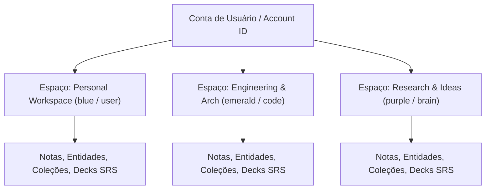
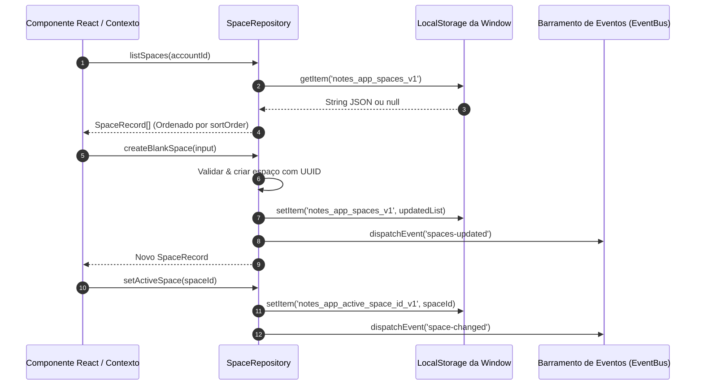

# Arquitetura Multitenant de Espaços & Gestão de Workspaces

Este documento fornece uma especificação arquitetural abrangente para o domínio multitenant de **Espaços** (Spaces) e a suíte de gestão de workspaces no **Notes App**. Ele detalha o protocolo de armazenamento local-first, modelos de entidades de domínio, a suíte de componentes em `src/components/spaces`, o sistema de tonalidades de cores, mapeamento de ícones e integração com React 19 Context.

---

## 1. Visão Geral & Objetivos Arquiteturais

O **Notes App** implementa uma arquitetura de particionamento de workspace multitenant inspirada no **paridade de espaços estilo Capacities**. Um **Espaço** (Space) representa um limite de workspace isolado para o grafo de conhecimento, notas, coleções, cartões de repetição espaçada e documentos do usuário.



### Invariantes Fundamentais da Arquitetura
1. **Isolamento Multitenant de Workspace**: Toda entidade, nota, coleção e item SRS de nível superior pertence estritamente a um `spaceId`. As consultas são delimitadas por `spaceId` para garantir o isolamento entre domínios distintos (ex.: separando notas pessoais de especificações de engenharia).
2. **Paridade de Espaços Estilo Capacities**: Workspaces são customizáveis através de identidades visuais distintas, compostas por nome, descrição, ícone do Lucide e paleta de tonalidades de cor.
3. **Protocolo Local-First & Armazenamento Offline**: Os espaços são gerenciados via `SpaceRepository` usando o `localStorage` do navegador (chaves: `notes_app_spaces_v1` e `notes_app_active_space_id_v1`) com fallback para estado em memória durante SSR ou ambientes sem navegador. Eventos customizados na window (`spaces-updated`, `space-changed`) disparam sincronização instantânea de UI nos consumidores do contexto.

---

## 2. Modelos de Entidades de Domínio & Validação

Os modelos de domínio para o subsistema de Espaços estão definidos em [`src/types/space.ts`](../../../src/types/space.ts).

### Tipos de Dados & Interfaces

```typescript
export type ObjectIconTone =
  | "amber"
  | "blue"
  | "emerald"
  | "indigo"
  | "purple"
  | "rose"
  | "sky"
  | "slate"
  | "orange"
  | "teal";

export type SpaceIconName =
  | "folder"
  | "briefcase"
  | "book-open"
  | "code"
  | "brain"
  | "zap"
  | "user"
  | "sparkles"
  | "layers"
  | "globe"
  | "terminal"
  | "compass";

export interface SpaceRecord {
  id: string;
  name: string;
  description?: string;
  icon: SpaceIconName;
  color: ObjectIconTone;
  accountId: string;
  sortOrder: number;
  createdAt: string;
  updatedAt: string;
}

export interface SpaceStats {
  entityCount: number;
  noteCount: number;
  flashcardCount: number;
  fileCount: number;
}

export interface CreateSpaceInput {
  name: string;
  description?: string;
  icon?: SpaceIconName;
  color?: ObjectIconTone;
}
```

### Protocolo de Validação

Os dados de entrada para criação de espaço são validados no cliente via `validateCreateSpaceInput`:
- **Nome do Espaço**: String obrigatória não vazia, máximo de 50 caracteres.
- **Descrição**: String opcional, máximo de 200 caracteres.

---

## 3. Protocolo de Armazenamento & Padrão Repository

O [`SpaceRepository`](../../../src/lib/db/repositories/space-repository.ts) fornece uma interface de serviço estática para operações CRUD de workspace, ordenação e persistência do espaço ativo.



### Semente de Espaços Padrão
Quando nenhum espaço está presente no armazenamento, o `SpaceRepository` inicializa dois workspaces padrão para `default-user`:
1. **Personal Workspace** (`id: "personal-space"`, ícone: `"user"`, cor: `"blue"`).
2. **Engineering & Arch** (`id: "engineering-space"`, ícone: `"code"`, cor: `"emerald"`).

### Sincronização Reativa Baseada em Eventos
O `SpaceRepository` dispara eventos customizados nativos do navegador durante mutações:
- `spaces-updated`: Disparado quando um espaço é criado, atualizado, excluído ou reordenado.
- `space-changed`: Disparado quando o contexto do workspace ativo é alterado.

---

## 4. Arquitetura da Suíte de Componentes

Os componentes residem em [`src/components/spaces/`](../../../src/components/spaces/).

```text
src/components/spaces/
├── space-card.tsx         # Cartão de pré-visualização do espaço com estatísticas e ações
├── space-nav-item.tsx     # Item de navegação lateral com estado ativo e menu suspenso
├── space-theme-utils.ts   # Utilitários de mapeamento de ícones e tonalidades de cores
└── spaces-provider.tsx    # Provedor React 19 Context & hook customizado (useSpacesContext)
```

### Detalhamento dos Componentes

| Componente | Responsabilidade & Interface | Principais Integrações |
| :--- | :--- | :--- |
| `SpacesProvider` | Gerencia estado da lista de espaços, ID do espaço ativo, estado de carregamento e modais. Inscreve-se em eventos de sincronização. | React 19 Context, `SpaceRepository` |
| `SpaceNavItem` | Renderiza item interativo na barra lateral. Exibe ícone com tonalidade, nome do espaço, destaque de ativo e menu de configurações. | `DropdownMenu`, `Button`, `getSpaceIcon`, `getSpaceToneClasses` |
| `SpaceCard` | Exibe cartão completo do espaço com estatísticas de domínio (`SpaceStats`: contagem de notas/objetos), badge ativo e botões de ação. | `Card`, `Badge`, `Button`, `FileText`, `Layers`, `Settings` |
| `SpaceSwitcher` | Componente de seleção / dropdown que permite alternar o espaço ativo a partir do cabeçalho global ou barra de navegação. | `DropdownMenu` / `Select`, `useSpacesContext` |
| `SpaceList` | Componente de grade ou lista vertical exibindo espaços ativos e inativos com suporte a reordenação. | `SpaceCard`, `SpaceNavItem` |
| `CreateSpaceModal` | Modal de sobreposição para criar novo espaço, contendo campos para nome/descrição, seletor de ícones e tonalidades. | `Dialog`, `Input`, `Textarea`, `validateCreateSpaceInput` |
| `SpaceSettingsModal` | Modal de sobreposição para editar metadados de espaços existentes, alterar tema visual ou realizar exclusão. | `Dialog`, `Button`, `SpaceRepository.deleteSpace` |

---

## 5. Estilização Visual & Arquitetura de Tonalidades de Cores

A estilização visual utiliza ícones do Lucide e integração com variáveis CSS do shadcn via [`src/components/spaces/space-theme-utils.ts`](../../../src/components/spaces/space-theme-utils.ts).

### Mapeamento de Ícones (`ICON_MAP`)
12 ícones do Lucide estão registrados para corresponder a `SpaceIconName`:
- `folder` $\rightarrow$ `Folder`
- `briefcase` $\rightarrow$ `Briefcase`
- `book-open` $\rightarrow$ `BookOpen`
- `code` $\rightarrow$ `Code`
- `brain` $\rightarrow$ `Brain`
- `zap` $\rightarrow$ `Zap`
- `user` $\rightarrow$ `User`
- `sparkles` $\rightarrow$ `Sparkles`
- `layers` $\rightarrow$ `Layers`
- `globe` $\rightarrow$ `Globe`
- `terminal` $\rightarrow$ `Terminal`
- `compass` $\rightarrow$ `Compass`

### Sistema de Tonalidades de Cores (`TONE_CLASSES`)
Cada `ObjectIconTone` mapeia para um conjunto de classes CSS do Tailwind projetado para transparência em modo claro e escuro:

```typescript
export const TONE_CLASSES: Record<
  ObjectIconTone,
  { bg: string; text: string; border: string; badgeBg: string }
> = {
  blue: {
    bg: "bg-blue-500/10",
    text: "text-blue-500 dark:text-blue-400",
    border: "border-blue-500/20",
    badgeBg: "bg-blue-500",
  },
  emerald: {
    bg: "bg-emerald-500/10",
    text: "text-emerald-500 dark:text-emerald-400",
    border: "border-emerald-500/20",
    badgeBg: "bg-emerald-500",
  },
  // ... amber, purple, rose, sky, indigo, slate, orange, teal
};
```

---

## 6. Integração com React 19 Context & API

O `SpacesProvider` expõe o estado e manipuladores através de `useSpacesContext()`.

### Exemplo de Uso do Provedor

```tsx
import { SpacesProvider } from "@/components/spaces/spaces-provider";

export default function DashboardLayout({ children }: { children: React.ReactNode }) {
  return (
    <SpacesProvider>
      <div className="flex h-screen">
        <Sidebar />
        <main className="flex-1 overflow-auto">{children}</main>
      </div>
    </SpacesProvider>
  );
}
```

### Exemplo de Componente Cliente Consumidor

```tsx
"use client";

import { useSpacesContext } from "@/components/spaces/spaces-provider";
import { SpaceNavItem } from "@/components/spaces/space-nav-item";
import { Button } from "@/components/ui/button";

export function SidebarSpacesSection() {
  const { spaces, activeSpaceId, selectSpace, setCreateModalOpen, setSettingsSpace } =
    useSpacesContext();

  return (
    <div className="space-y-1 p-2">
      <div className="flex items-center justify-between px-2 py-1 text-xs font-semibold text-muted-foreground">
        <span>ESPAÇOS</span>
        <Button variant="ghost" size="sm" onClick={() => setCreateModalOpen(true)}>
          + Novo
        </Button>
      </div>

      {spaces.map((space) => (
        <SpaceNavItem
          key={space.id}
          space={space}
          isActive={space.id === activeSpaceId}
          onSelect={selectSpace}
          onOpenSettings={setSettingsSpace}
        />
      ))}
    </div>
  );
}
```
