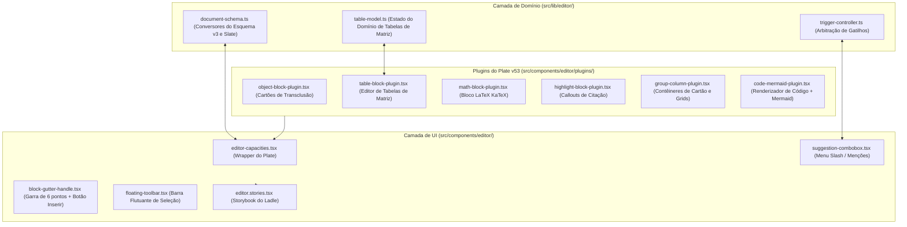

# ADR-0009: Domínio do Editor de Blocos Capacities e Arquitetura de Plugins Plate v53

* **Status**: Aceito
* **Decisores**: Equipe de Engenharia
* **Data**: 14-09-2026
* **Consultados**: Worktrees Históricos de Referência Arquitetural (`.worktrees/old-4`, `.worktrees/old-5`)
* **Informados**: Engenheiros Principais da Aplicação

## Contexto e Declaração do Problema

O `notes-app` requer um editor de blocos de texto rico completo e baseado em objetos que espelhe os recursos do **Capacities** (PKM com entidades tipadas, identificadores granulares de blocos, cartões de transclusão de objetos, fórmulas matemáticas, código com destaque de sintaxe e visualização de diagramas Mermaid, além de tabelas estilo planilha).

Seguindo o [ADR-0008](0008-plate-rich-text-editor-framework-migration.md), o repositório adotou o **Plate JS v53** (alimentado por Slate AST) por sua compatibilidade com o React 19 e pré-renderização estática headless no lado do servidor (`EditorStatic`). Precisávamos projetar e implementar os contratos de domínio, esquemas de serialização AST, plugins customizados do Plate, controlador de arbitração de gatilhos e a interface interativa para alcançar 100% de paridade de recursos com o Capacities.

## Direcionadores da Decisão

* **Paridade com o Esquema de Documentos Capacities v3**: Preservação estrita dos IDs de blocos (`block:<uuid>`) para transclusão profunda, backlinks e restrições de profundidade (`MAX_BLOCK_DOCUMENT_DEPTH = 8`).
* **Separação Clara de Responsabilidades**: Modelos de domínio funcionais puros em `src/lib/editor/` (`document-schema.ts`, `table-model.ts`, `trigger-controller.ts`) desacoplados das camadas de renderização de UI.
* **Compatibilidade com React 19 & Next.js 16**: Suporte para renderização estática headless no lado do servidor (`EditorStatic`) com zero alterações inesperadas de layout.
* **Paridade de UI Interativa**: Alças de arrastar em hover (botão de inserção `+` e garra de 6 pontos), barras de ferramentas flutuantes de seleção e comboboxes de gatilho (`/`, `@`, `[[`, `((`, `#`, `+`).
* **Visibilidade de Histórias no Ladle**: Exportação e verificação obrigatórias de todas as variantes de bloco e histórias em `src/components/editor/editor.stories.tsx`.

## Opções Consideradas

1. **Plate JS v53 com Plugins Customizados de Domínio (Selecionado)**: Implementar conversores funcionais puros de AST (`capacitiesDocToSlate` e `slateToCapacitiesDoc`) em `src/lib/editor/` e plugins customizados do Plate (`ObjectBlockPlugin`, `TableBlockPlugin`, `MathBlockPlugin`, `HighlightBlockPlugin`, `GroupBlockPlugin`, `ColumnLayoutPlugin`, `CodeBlockMermaidPlugin`) em `src/components/editor/plugins/`.
2. **Mecanismo Monolítico ProseMirror / TipTap**: Portar o esquema legado do ProseMirror diretamente de `.worktrees/old-4`.
3. **Clones de Notion Pré-Empacotados de Terceiros (ex: BlockNote, Novel)**: Usar editores de bloco pré-empacotados e prontos para uso.

## Resultado da Decisão

Opção escolhida: **Plate JS v53 com Plugins Customizados de Domínio**, porque:
- Mantém exata compatibilidade de esquema de documentos em JSON (`schemaVersion: 3`) com o Capacities.
- Aproveita o Slate AST para transformações funcionais limpas sem problemas de reconciliação de DOM no React 19.
- Permite pré-renderização SSR headless via `EditorStatic` (`platejs/static`) para First Contentful Paint instantâneo.
- Isola a lógica do domínio (`TableBlockModel`, `SharedSuggestionController`) em módulos TypeScript puros e testados em `src/lib/editor/`.

### Consequências Positivas

* **Suporte a 15+ Tipos de Blocos**: Paridade total entre Parágrafos, Títulos (H1–H4), Listas de Marcadores/Numeradas/Tarefas, Citações, Blocos de Código com diagramas Mermaid, Equações Matemáticas LaTeX, Callouts de Destaque com citações de origem, Grids de 2–4 Colunas, Contêineres de Cartão, Tabelas de Matriz e Cartões de Transclusão de Objetos.
* **Conversão Bidirecional Sem Perdas em AST**: Conversão bidirecional sem perdas entre a árvore Slate AST do Plate e o Esquema de Documentos Capacities v3.
* **Ancoragem Granular de Backlinks**: Todos os blocos recebem identificadores estáveis `block:<uuid>` necessários para referências em nível de bloco (`((`) e transclusões.
* **100% de Cobertura de Testes**: Suítes de testes Vitest completas (`src/lib/editor/document-schema.test.ts` e `table-model.test.ts`) validando limites de profundidade AST, persistência de IDs e operações em tabelas.

### Consequências Negativas

* Requer manter plugins customizados do Plate em vez de confiar apenas em presets de blocos básicos prontos.

## Arquitetura e Limites de Componentes

## Referências

* [ADR-0008: Migração para a Estrutura do Editor de Texto Rico Plate](0008-plate-rich-text-editor-framework-migration.md)
* [ADR-0006: Síntese da Arquitetura Histórica de Referência](0006-historical-reference-architecture-synthesis.md)
* [ADR-0005: Bancada de Componentes Ladle e Visualizador de Documentação](0005-ladle-component-workbench-and-documentation-viewer.md)
* [Documentação do Editor Capacities & Referência de Paridade de Blocos](https://docs.capacities.io/reference/blocks)
